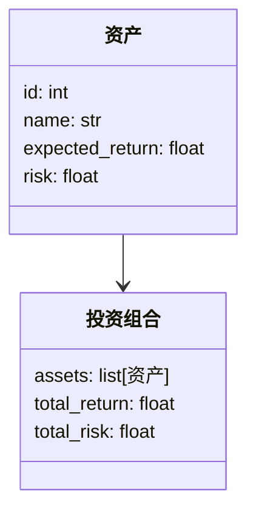
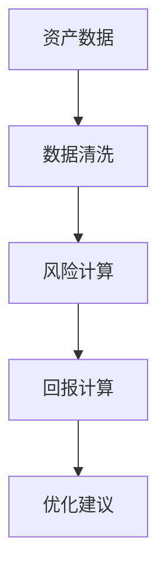

                 


# 《价值投资中的风险与回报权衡》

---

## 关键词：价值投资、风险、回报、权衡、量化分析、投资策略

---

## 摘要：  
本文系统探讨了价值投资中的风险与回报权衡问题。通过分析风险与回报的核心概念、量化方法、数学模型以及系统设计，本文为投资者提供了全面的理论支持和实践指导。文章结合CAPM模型、现代投资组合理论以及实际案例，深入解析了如何在价值投资中实现风险与回报的最佳平衡，帮助投资者做出科学决策。

---

# 第1章: 价值投资与风险回报概述

## 1.1 价值投资的定义与核心理念  
价值投资是一种以内在价值为导向的投资策略，强调以低于内在价值的价格买入优质资产。其核心理念包括：  
1. **安全边际**：买入价格低于内在价值，以降低风险。  
2. **长期视角**：关注企业的长期盈利能力，而非短期市场波动。  
3. **逆向思维**：在市场恐慌时寻找机会，在市场狂热时保持冷静。  

## 1.2 风险与回报的定义与关系  
### 1.2.1 风险的定义与分类  
风险是指投资的实际收益与预期收益之间的偏离。常见的风险类型包括：  
- **系统性风险**：影响整个市场的风险，如经济衰退、通货膨胀。  
- **非系统性风险**：特定于个体资产的风险，如公司经营风险。  

### 1.2.2 回报的定义与类型  
回报是指投资资产在一定时间内的收益，包括资本利得和分红收益。常见的回报类型包括：  
- **名义回报**：未扣除通货膨胀影响的回报。  
- **实际回报**：扣除通货膨胀后的回报。  

### 1.2.3 风险与回报的权衡关系  
风险与回报之间存在正相关关系，即高风险资产通常伴随高潜在回报。投资者需要在两者之间找到平衡点，以实现收益最大化和风险最小化。

---

## 1.3 价值投资中的风险回报模型  
### 1.3.1 风险回报模型的概述  
风险回报模型是量化投资的核心工具，用于评估资产的风险与回报之间的关系。  

### 1.3.2 风险回报模型的核心要素  
1. **预期回报**：基于资产的历史回报和市场预期。  
2. **风险溢价**：投资者因承担额外风险而要求的额外回报。  
3. **无风险利率**：市场中的无风险收益率，如国债收益率。  

### 1.3.3 风险回报模型的应用场景  
- **资产定价**：评估资产的公允价值。  
- **投资组合优化**：通过模型优化投资组合的风险与回报。  

---

# 第2章: 价值投资中的风险分析

## 2.1 风险的分类与特征  
### 2.1.1 系统性风险  
系统性风险是整个市场的风险，无法通过分散投资完全消除。  

### 2.1.2 非系统性风险  
非系统性风险可以通过分散投资降低。  

### 2.1.3 风险的量化方法  
1. **标准差**：衡量资产收益的波动性。  
2. **VaR（在险价值）**：衡量资产在一定置信水平下的最大损失。  

---

## 2.2 风险的评估与测量  
### 2.2.1 风险评估的基本方法  
1. **历史数据分析**：通过历史数据计算资产的风险指标。  
2. **情景分析**：模拟不同市场环境下的风险表现。  

### 2.2.2 风险测量的指标与工具  
- **波动率**：资产收益的标准差。  
- **最大回撤**：资产价格在一定时间内的最大跌幅。  

---

## 2.3 价值投资中的风险控制策略  
### 2.3.1 风险分散策略  
通过投资不同类型资产降低非系统性风险。  

### 2.3.2 风险对冲策略  
利用衍生品对冲特定风险。  

### 2.3.3 风险预警机制  
通过实时监控市场和资产表现，及时发现潜在风险。  

---

# 第3章: 价值投资中的回报分析

## 3.1 投资回报的分类与计算  
### 3.1.1 名义回报与实际回报  
实际回报 = 名义回报 - 通货膨胀率  

### 3.1.2 单利与复利的计算  
- 单利：只计算本金的利息。  
- 复利：将利息加入本金继续计算利息。  

### 3.1.3 投资回报的衡量指标  
- **夏普比率**：衡量单位风险下的超额回报。  
- **特雷诺比率**：衡量投资组合相对于市场组合的风险调整后收益。  

---

## 3.2 投资回报的影响因素  
### 3.2.1 市场环境的影响  
市场环境（如经济周期）会影响资产的回报。  

### 3.2.2 资产配置的影响  
合理的资产配置可以优化回报与风险的关系。  

### 3.2.3 管理者决策的影响  
投资经理的决策能力直接影响投资回报。  

---

## 3.3 价值投资中的回报预测与优化  
### 3.3.1 回报预测的基本方法  
1. **历史数据分析法**：基于历史数据预测未来回报。  
2. **市场情绪分析法**：通过投资者情绪预测市场趋势。  

### 3.3.2 回报优化的策略选择  
1. **资产分配优化**：通过调整资产比例优化回报。  
2. **风险调整优化**：在相同风险下追求最高回报。  

---

# 第4章: 风险回报权衡的数学模型

## 4.1 风险回报权衡的数学基础  
### 4.1.1 风险与回报的线性关系  
CAPM模型是风险与回报关系的经典公式：  
$$ E(r_i) = r_f + \beta_i (r_m - r_f) $$  
其中，\( E(r_i) \) 是资产 \( i \) 的预期回报，\( r_f \) 是无风险利率，\( \beta_i \) 是资产 \( i \) 的贝塔系数，\( r_m \) 是市场预期回报。  

---

## 4.2 风险回报权衡的优化模型  
### 4.2.1 基于均值-方差的优化模型  
现代投资组合理论（MPT）通过优化均值-方差关系，实现风险与回报的最佳平衡。  

### 4.2.2 基于风险中性的优化模型  
在风险中性假设下，优化模型主要关注回报的最大化。  

### 4.2.3 基于情景分析的优化模型  
通过模拟不同市场情景，选择最优的投资组合。  

---

## 4.3 数学模型的实现与应用  
### 4.3.1 数学模型的代码实现  
```python
import numpy as np
import pandas as pd

# 示例：计算CAPM模型
rf = 0.02  # 无风险利率
beta = 1.5  # 贝塔系数
rm = 0.08  # 市场预期回报
expected_return = rf + beta * (rm - rf)
print(f"预期回报: {expected_return}")
```

### 4.3.2 数学模型的应用案例  
通过CAPM模型计算某资产的预期回报，为投资决策提供依据。  

---

## 4.4 本章小结  
本章通过数学模型详细解析了风险与回报的权衡关系，为投资者提供了科学的分析工具。

---

# 第5章: 价值投资中的系统架构与实战分析

## 5.1 系统设计与功能模块  
### 5.1.1 领域模型类图  


### 5.1.2 系统架构图  


---

## 5.2 实战案例分析  
### 5.2.1 环境安装  
安装Python、Pandas、NumPy等工具。  

### 5.2.2 核心实现代码  
```python
import numpy as np

def calculate_portfolio_risk(weights, covariance_matrix):
    return np.sqrt(weights.T @ covariance_matrix @ weights)

# 示例：计算投资组合的风险
weights = np.array([0.5, 0.5])
covariance_matrix = np.array([[0.04, 0.02], [0.02, 0.04]])
portfolio_risk = calculate_portfolio_risk(weights, covariance_matrix)
print(f"投资组合风险: {portfolio_risk}")
```

---

## 5.3 案例分析与小结  
通过实战案例，验证了风险与回报权衡模型的有效性，为投资者提供了实际操作的参考。

---

# 第6章: 最佳实践与总结

## 6.1 投资策略的总结与建议  
1. **长期视角**：坚持价值投资理念，避免短期波动干扰。  
2. **分散投资**：通过多样化降低非系统性风险。  
3. **持续学习**：关注市场变化，优化投资策略。  

## 6.2 风险管理的注意事项  
1. **风险评估**：定期评估投资组合的风险。  
2. **动态调整**：根据市场变化及时调整投资组合。  
3. **风险管理工具**：合理使用衍生品对冲风险。  

## 6.3 拓展阅读与进一步思考  
建议阅读《投资学》、《风险管理与保险》等书籍，深入理解风险与回报的复杂关系。

---

# 作者：AI天才研究院/AI Genius Institute & 禅与计算机程序设计艺术 /Zen And The Art of Computer Programming

---

**本文通过系统分析和实战案例，全面探讨了价值投资中的风险与回报权衡问题，为投资者提供了理论与实践相结合的指导。**

