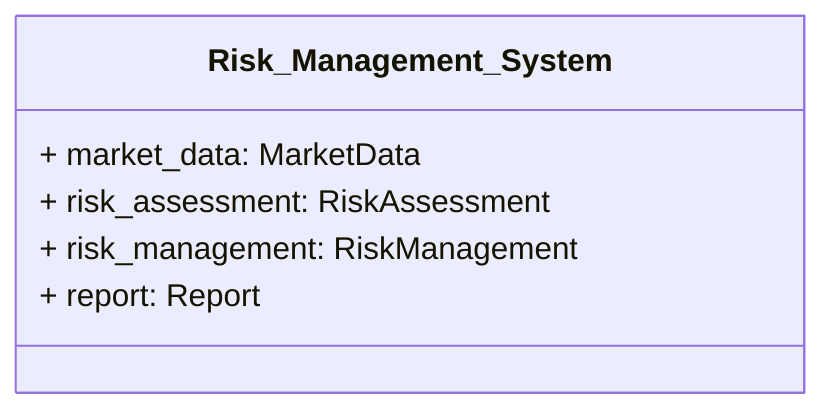

                 


# 价值投资中的风险管理：如何降低损失

## 关键词：风险管理，价值投资，投资损失，风险评估，风险管理策略

## 摘要：  
本文将详细探讨价值投资中的风险管理策略，从核心概念、算法原理到系统架构，全面分析如何有效降低投资损失。通过背景介绍、数学模型、系统设计和项目实战，本文为读者提供一套完整的风险管理解决方案，帮助投资者在复杂多变的市场中实现稳健收益。

---

## 第1章: 风险管理的核心概念

### 1.1 风险的定义与分类

#### 1.1.1 风险的定义  
风险是指在投资活动中，由于不确定性因素的存在，导致实际收益与预期收益之间存在差异的可能性。简单来说，风险是未来收益波动的可能性。

#### 1.1.2 风险的分类与特征  
风险可以分为以下几类：

- **系统性风险**：影响整个市场的风险，如经济衰退、政策变化等。
- **非系统性风险**：特定于某个资产或行业的风险，如公司管理不善、行业竞争加剧等。
- **市场风险**：由于市场波动导致资产价格下跌的风险。
- **流动性风险**：资产难以快速变现而不蒙受损失的风险。
- **信用风险**：债券发行人违约的风险。

#### 1.1.3 风险与收益的关系  
风险与收益是投资中一对不可分割的孪生兄弟。高风险通常意味着高收益，但并不意味着高风险一定会带来高收益。投资者需要在风险与收益之间找到平衡点，以实现长期稳健的投资回报。

---

### 1.2 价值投资中的风险管理框架

#### 1.2.1 风险管理的基本框架  
风险管理的基本框架包括以下步骤：

1. **风险识别**：识别可能影响投资组合的各种风险因素。
2. **风险评估**：量化这些风险对投资组合的影响程度。
3. **风险应对**：制定相应的策略来降低风险敞口。

#### 1.2.2 风险管理的目标与原则  
风险管理的目标是通过降低潜在损失，提高投资组合的稳定性。其原则包括：

- **分散化原则**：通过投资不同资产类别、行业和地区的标的，降低非系统性风险。
- **成本效益原则**：在控制风险的同时，尽量减少管理成本。
- **动态调整原则**：根据市场变化和投资目标的调整，动态优化风险管理策略。

#### 1.2.3 风险管理的边界与外延  
风险管理的边界是指在特定投资组合和时间段内进行的管理活动。其外延则包括市场研究、数据分析、策略制定等多个方面。

---

### 1.3 风险管理的核心要素

#### 1.3.1 风险识别  
风险识别是风险管理的第一步。通过分析市场环境、公司基本面等因素，识别出可能影响投资组合的风险因素。

#### 1.3.2 风险评估  
风险评估是通过量化方法，评估各类风险对投资组合的潜在影响。常用的方法包括VaR（在险价值）和CVaR（条件在险价值）。

#### 1.3.3 风险应对  
风险应对是根据风险评估结果，采取相应的策略来降低风险敞口。常见的策略包括分散投资、调整仓位、使用衍生工具等。

---

## 第2章: 风险与收益的平衡

### 2.1 风险与收益的关系

#### 2.1.1 风险是收益的来源  
投资的本质是通过承担风险来获取收益。没有风险，也就没有收益的可能性。

#### 2.1.2 高风险不一定带来高收益  
高风险并不意味着高收益。许多高风险投资最终可能以亏损收场，尤其是当风险无法得到有效管理时。

#### 2.1.3 风险与收益的非线性关系  
风险与收益之间并非简单的线性关系。在某些情况下，承担一定的风险可能带来更高的收益，但在其他情况下，风险可能完全转化为损失。

---

### 2.2 风险厌恶与风险偏好

#### 2.2.1 风险厌恶的定义  
风险厌恶是指投资者更倾向于选择确定性收益，而不愿意承担不确定性风险的偏好。

#### 2.2.2 风险偏好的类型  
投资者的风险偏好可以分为以下几种类型：

- **保守型**：厌恶风险，追求稳定收益。
- **稳健型**：适度承担风险，追求高于无风险收益率的收益。
- **进取型**：愿意承担较高风险，追求高收益。

#### 2.2.3 风险偏好的影响因素  
投资者的风险偏好受到多种因素的影响，包括年龄、财富水平、投资经验等。

---

### 2.3 风险调整后的收益

#### 2.3.1 风险调整后的收益概念  
风险调整后的收益是指在考虑了风险因素后的收益水平。它可以帮助投资者更好地比较不同投资标的的风险收益比。

#### 2.3.2 风险调整后的收益计算  
风险调整后的收益可以通过以下公式计算：

$$
\text{风险调整后的收益} = \text{预期收益} - \text{风险溢价}
$$

#### 2.3.3 风险调整后的收益应用  
在实际投资中，风险调整后的收益可以帮助投资者制定更合理的投资策略。

---

## 第3章: 风险管理的核心概念与联系

### 3.1 风险管理的核心概念

#### 3.1.1 风险管理的基本原理  
风险管理的基本原理是通过识别、评估和应对风险，降低其对投资组合的负面影响。

#### 3.1.2 风险管理的关键要素  
风险管理的关键要素包括：

- **风险识别**：发现潜在风险。
- **风险评估**：量化风险影响。
- **风险应对**：制定应对策略。

#### 3.1.3 风险管理的系统性  
风险管理是一个系统性的过程，需要综合考虑各种因素。

---

### 3.2 风险与收益的对比分析

#### 3.2.1 风险与收益的属性对比  
以下是风险与收益的属性对比：

| 属性       | 风险         | 收益       |
|------------|--------------|------------|
| 特性       | 不确定性      | 确定性      |
| 影响因素   | 市场环境      | 资产表现    |
| 计量方法   | VaR、CVaR    | 预期收益    |

#### 3.2.2 风险与收益的相互作用  
风险和收益是相互作用的。高风险可能带来高收益，但高收益也可能伴随着高风险。

#### 3.2.3 风险与收益的平衡点  
在实际投资中，投资者需要找到风险与收益的平衡点，以实现长期稳健的收益。

---

### 3.3 风险管理的ER实体关系图

以下是一个简单的ER实体关系图，展示了风险管理的核心要素：

```mermaid
erDiagram
    RISK --|> ASSET
    RISK --|> INVESTOR
    ASSET --|> PORTFOLIO
    INVESTOR --|> PORTFOLIO
```

---

## 第4章: 风险管理的算法原理

### 4.1 风险评估的算法原理

#### 4.1.1 风险评估的基本原理  
风险评估是通过量化方法，评估各类风险对投资组合的影响。

#### 4.1.2 风险评估的数学模型  
以下是一个简单的风险评估数学模型：

$$
\text{VaR} = \text{quantile}(P, \alpha)
$$

其中，$P$ 是收益的分布，$\alpha$ 是置信水平。

#### 4.1.3 风险评估的算法流程  
以下是风险评估的算法流程：

1. 收集历史收益数据。
2. 计算收益的分布。
3. 计算VaR或CVaR。
4. 输出结果。

---

### 4.2 风险管理的算法实现

#### 4.2.1 算法实现的步骤  
以下是风险评估算法的实现步骤：

1. 收集数据。
2. 计算收益分布。
3. 计算VaR或CVaR。
4. 输出结果。

#### 4.2.2 算法实现的代码  
以下是一个简单的Python代码示例：

```python
import numpy as np
import pandas as pd

# 收集数据
data = pd.read_csv('returns.csv')

# 计算收益分布
returns = data['returns'].values
sorted_returns = np.sort(returns)

# 计算VaR
alpha = 0.95
quantile = np.quantile(sorted_returns, alpha)

print(f"VaR at {alpha} confidence level: {quantile}")
```

#### 4.2.3 算法实现的优化  
为了提高算法的效率，可以考虑以下优化措施：

1. 使用更高效的排序算法。
2. 使用并行计算加速。

---

### 4.3 风险管理的数学模型

#### 4.3.1 风险评估的数学公式  
以下是一个简单的风险评估数学公式：

$$
\text{VaR} = \text{quantile}(P, \alpha)
$$

#### 4.3.2 风险调整的数学公式  
以下是一个风险调整后的收益计算公式：

$$
\text{风险调整后的收益} = \text{预期收益} - \text{风险溢价}
$$

---

## 第5章: 风险管理的系统架构

### 5.1 系统功能设计

#### 5.1.1 风险管理系统的功能模块  
以下是风险管理系统的功能模块：

- 数据采集模块：负责采集市场数据。
- 风险评估模块：负责评估风险。
- 风险应对模块：负责制定应对策略。
- 报告生成模块：负责生成风险管理报告。

#### 5.1.2 风险管理系统的领域模型  
以下是一个简单的领域模型：



---

### 5.2 系统架构设计

#### 5.2.1 系统架构图  
以下是一个简单的系统架构图：

```mermaid
containerDiagram
    container Risk_Management_System {
        component Data_Source
        component Risk_Engine
        component UI_Interface
    }
```

---

### 5.3 系统接口设计

#### 5.3.1 系统接口设计  
以下是风险管理系统的接口设计：

- 数据接口：负责与数据源交互。
- 用户接口：负责与用户交互。
- 报告接口：负责生成报告。

---

## 第6章: 项目实战

### 6.1 环境安装

#### 6.1.1 安装Python  
安装Python：  
```bash
python --version
```

#### 6.1.2 安装依赖库  
安装依赖库：  
```bash
pip install numpy pandas matplotlib
```

---

### 6.2 系统核心实现

#### 6.2.1 核心代码  
以下是核心代码：

```python
import numpy as np
import pandas as pd
import matplotlib.pyplot as plt

# 数据处理
data = pd.read_csv('returns.csv')
returns = data['returns'].values

# 风险评估
sorted_returns = np.sort(returns)
quantile = np.quantile(sorted_returns, 0.95)

print(f"VaR at 95% confidence level: {quantile}")

# 图形化展示
plt.hist(sorted_returns, bins=50)
plt.title('Return Distribution')
plt.xlabel('Returns')
plt.ylabel('Frequency')
plt.show()
```

---

### 6.3 案例分析

#### 6.3.1 案例背景  
假设我们有一个股票投资组合，需要评估其风险。

#### 6.3.2 数据分析  
通过对历史收益数据的分析，计算出VaR为-5%。

#### 6.3.3 结果解读  
这意味着在95%的置信水平下，我们预计在最坏的情况下，投资组合的损失不会超过5%。

---

## 第7章: 最佳实践与总结

### 7.1 最佳实践

#### 7.1.1 风险管理的关键点  
- 定期评估投资组合。
- 保持分散投资。
- 使用衍生工具对冲风险。

#### 7.1.2 小结  
风险管理是价值投资中不可或缺的一部分。通过有效的风险管理，投资者可以降低潜在损失，实现长期稳健的收益。

### 7.2 注意事项

#### 7.2.1 模型的局限性  
风险管理模型有一定的局限性，需要结合实际情况进行调整。

#### 7.2.2 模型的未来发展  
随着技术的进步，风险管理模型将更加智能化和精准化。

---

## 作者：AI天才研究院/AI Genius Institute & 禅与计算机程序设计艺术 /Zen And The Art of Computer Programming

