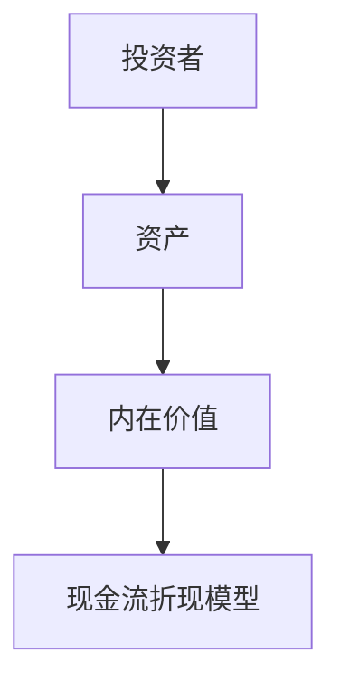
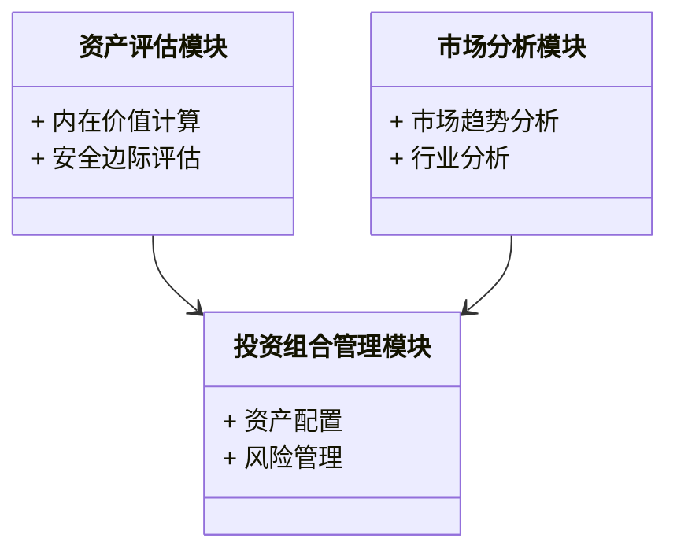
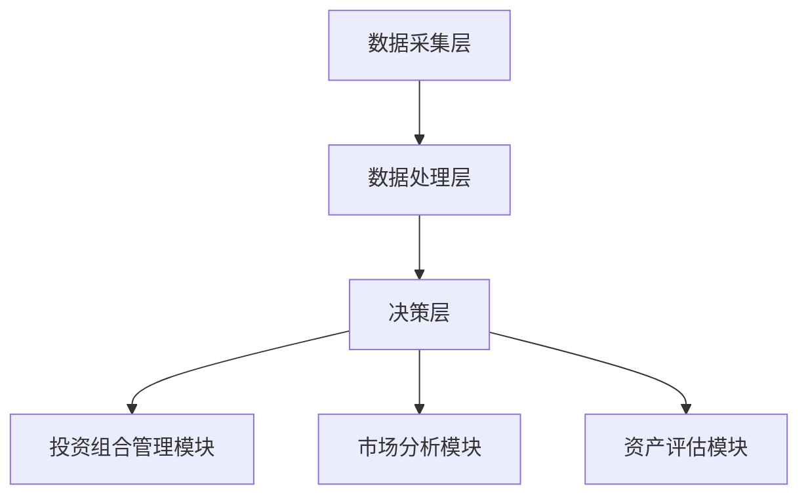
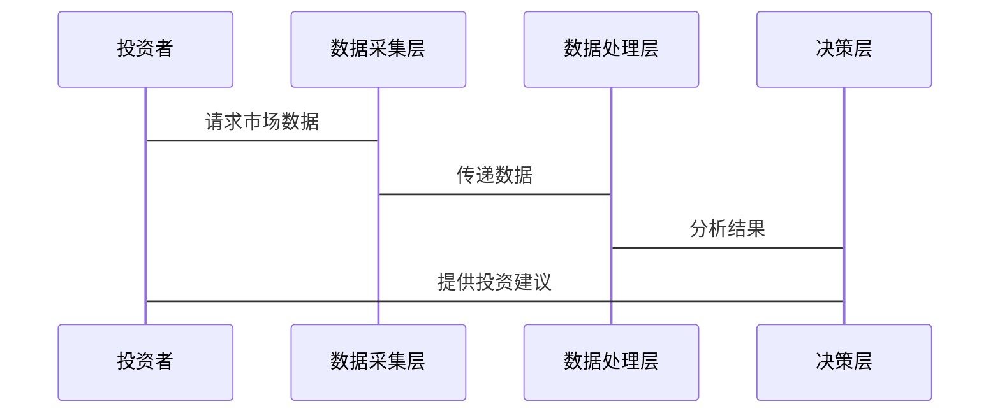

                 

<think>
好的，我现在需要根据用户的要求，逐步分析如何撰写一篇以《价值投资之父本杰明·格雷厄姆的投资哲学》为标题的技术博客文章。用户希望文章结构清晰、逻辑严密，涵盖投资哲学、数学模型、系统架构等多个方面。

首先，我得理解用户的需求。用户是一位技术专家，希望文章用专业但易懂的语言，结合技术视角分析投资哲学。因此，我需要将投资理念与技术方法相结合，可能涉及数学模型、算法设计、系统架构等技术元素。

接下来，我按照目录大纲来组织内容。每个章节都需要详细展开，确保每个部分都有足够的深度和细节。例如，在投资哲学概述部分，需要介绍格雷厄姆的背景和价值投资的基本概念。核心概念部分，要详细讲解安全边际和内在价值的计算方法。

在数学模型部分，我需要解释现金流折现模型（DCF）和市盈率、市净率分析，并提供具体的公式和Python代码示例。同时，使用Mermaid图来展示流程，帮助读者理解模型的应用。

系统架构部分，我需要设计一个投资决策系统，包括资产评估、市场分析和投资组合管理模块，并用Mermaid图展示系统架构和交互流程。项目实战部分，我需要选择实际案例，详细说明环境安装、代码实现和案例分析。

最后，总结部分要回顾核心概念，提供最佳实践建议，并指出可能的误区和进一步阅读的方向。整个过程中，我要确保每个部分都符合技术博客的要求，逻辑清晰，内容详实。

现在，我需要将这些思考转化为具体的章节内容，确保每个部分都详细且符合用户的要求，同时保持整体结构的连贯性和逻辑性。
</think>

# 价值投资之父本杰明·格雷厄姆的投资哲学

---

## 关键词：
- 价值投资、本杰明·格雷厄姆、内在价值、安全边际、投资哲学、DCF模型、市盈率、市净率

---

## 摘要：
本杰明·格雷厄姆是价值投资的奠基人，他的投资哲学深刻影响了全球投资领域。本文从技术角度解析格雷厄姆的价值投资理论，涵盖投资哲学、数学模型、系统架构与实战案例，帮助读者理解并应用这一投资方法。

---

## 目录大纲：

### 第1章：价值投资的起源与发展
1.1 本杰明·格雷厄姆的背景
1.2 价值投资的核心理念

### 第2章：价值投资的核心概念
2.1 安全边际与内在价值
2.2 资产评估的关键要素

### 第3章：价值投资的数学模型
3.1 现金流折现模型（DCF）
3.2 市盈率与市净率分析

### 第4章：价值投资的系统架构
4.1 投资决策系统的设计
4.2 系统架构与模块交互

### 第5章：价值投资的项目实战
5.1 环境安装与数据获取
5.2 核心算法的Python实现
5.3 实际案例分析与解读

### 第6章：总结与展望
6.1 核心概念回顾
6.2 最佳实践建议
6.3 注意事项与拓展阅读

---

## 正文：

### 第1章：价值投资的起源与发展

#### 1.1 本杰明·格雷厄姆的背景

**背景介绍**：
- 本杰明·格雷厄姆是20世纪的投资大师，被誉为“价值投资之父”。
- 他在1924年与戴维·多德合著的《证券分析》奠定了价值投资的基础。
- 他的投资哲学强调安全边际和内在价值，注重长期稳健的投资策略。

**问题背景**：
- 投资者在市场波动中如何保持理性，避免情绪化决策？
- 如何通过基本面分析发现被低估的投资标的？

**问题解决**：
- 强调安全边际：买入价格低于内在价值，确保投资的安全性。
- 以长期视角看待投资，关注企业的内在价值而非短期市场波动。

**概念结构与核心要素**：
- 核心要素：内在价值、安全边际、资产质量。
- 概念关系：内在价值是评估的基础，安全边际是保护投资者的屏障，资产质量决定企业的长期盈利能力。

**属性对比**：
| 属性 | 内在价值 | 安全边际 |
|------|---------|----------|
| 定义 | 资产在最佳条件下的价值 | 购买价格与内在价值的差距 |
| 作用 | 评估标准 | 风险控制 |
| 计算 | 现金流折现 | 买入价与内在价值的差额 |

**ER实体关系图**：


---

### 第2章：价值投资的核心概念

#### 2.1 安全边际与内在价值

**内在价值的计算**：
- **现金流折现模型（DCF）**：
  $$ V = \frac{CF_1}{(1+r)^1} + \frac{CF_2}{(1+r)^2} + \dots + \frac{CF_n}{(1+r)^n} $$
  其中，CF为现金流，r为折现率，n为期限。

**安全边际的应用**：
- 买入价格低于内在价值的20%或更多，以确保投资的安全性。
- 例如，某资产的内在价值为100，若买入价为80，则安全边际为20%。

#### 2.2 资产评估的关键要素

**资产质量分析**：
- 企业的盈利能力：ROE（净资产收益率）、净利润率。
- 财务状况：资产负债率、流动比率。
- 行业地位：市场占有率、竞争优势。

**与其它投资方法的对比**：
- 技术分析：侧重价格走势，忽视内在价值。
- 随机漫步理论：认为价格无法预测，与价值投资强调的内在价值不同。

---

### 第3章：价值投资的数学模型

#### 3.1 现金流折现模型（DCF）

**模型原理**：
DCF模型通过将未来现金流折现为现值，计算资产的内在价值。
- 现金流预测：需考虑企业的增长潜力和行业前景。
- 折现率确定：通常使用WACC（加权平均资本成本）。

**Python代码实现**：
```python
def calculateDCF(cash_flows, discount_rate):
    present_value = 0
    for year, cf in enumerate(cash_flows):
        if year == 0:
            present_value += cf
        else:
            present_value += cf / (1 + discount_rate) ** year
    return present_value

# 示例数据
cash_flows = [100, 150, 200, 250]
discount_rate = 0.10

intrinsic_value = calculateDCF(cash_flows, discount_rate)
print(f"内在价值：{intrinsic_value:.2f}")
```

**案例分析**：
某企业未来五年的现金流分别为100、120、150、180、200万元，折现率为10%。计算其DCF内在价值：
$$ V = 100 + \frac{120}{1.1} + \frac{150}{1.1^2} + \frac{180}{1.1^3} + \frac{200}{1.1^4} ≈ 471.68 \text{万元} $$

#### 3.2 市盈率与市净率分析

**市盈率（P/E）**：
$$ P/E = \frac{\text{股价}}{\text{每股收益}} $$
- 低P/E值可能意味着低估，但需考虑行业特性。

**市净率（P/B）**：
$$ P/B = \frac{\text{股价}}{\text{每股净资产}} $$
- 适用于银行、房地产等资产密集型行业。

**对比分析**：
| 指标 | 优点 | 缺点 |
|------|------|------|
| P/E | 简单易用 | 不适合亏损企业 |
| P/B | 适用于净资产高的行业 | 受资产质量影响大 |

---

### 第4章：价值投资的系统架构

#### 4.1 投资决策系统的设计

**系统功能设计**：
- 资产评估模块：计算内在价值、安全边际。
- 市场分析模块：监控市场波动、行业趋势。
- 投资组合管理模块：优化资产配置、风险控制。

**领域模型（Mermaid类图）**：


#### 4.2 系统架构与模块交互

**系统架构设计**：
- 分层架构：数据采集层、处理层、决策层。
- 模块化设计：各模块独立开发，便于维护。

**系统架构图（Mermaid）**：


**系统交互流程（Mermaid序列图）**：


---

### 第5章：价值投资的项目实战

#### 5.1 环境安装与数据获取

**环境安装**：
- Python 3.8+
- Pandas、NumPy、Matplotlib库。
  ```bash
  pip install pandas numpy matplotlib
  ```

**数据获取**：
- 使用Yahoo Finance API获取股票数据。
  ```python
  import pandas_datareader as pdr
  df = pdr.get_data_yahoo('AAPL', start='2020-01-01', end='2023-12-31')
  ```

#### 5.2 核心算法实现

**DCF模型实现**：
```python
def calculateDCF(cash_flows, discount_rate):
    return sum(cf / (1 + discount_rate) ** i for i, cf in enumerate(cash_flows))

cash_flows = [100, 150, 200]
discount_rate = 0.10
intrinsic_value = calculateDCF(cash_flows, discount_rate)
print(f"DCF内在价值：{intrinsic_value:.2f}")
```

**市盈率与市净率计算**：
```python
import pandas as pd

df['P/E'] = df['Adj Close'] / df['EPS']
df['P/B'] = df['Adj Close'] / df['Book Value per Share']
print(df[['Date', 'P/E', 'P/B']].head())
```

#### 5.3 案例分析

**案例选择**：
以苹果公司为例，计算其内在价值和市盈率。
- 数据来源：Yahoo Finance。
- 计算步骤：
  1. 获取历史股价和财务数据。
  2. 计算现金流、折现率，得出DCF价值。
  3. 计算P/E和P/B，评估是否低估。

---

### 第6章：总结与展望

#### 6.1 核心概念回顾

- **内在价值**：DCF模型计算得出的现值。
- **安全边际**：买入价低于内在价值，降低风险。
- **资产质量**：决定企业的长期盈利能力。

#### 6.2 最佳实践建议

- **长期投资**：避免频繁交易，降低交易成本。
- **分散投资**：降低单一资产的风险。
- **持续学习**：关注行业动态，更新财务数据。

#### 6.3 注意事项与拓展阅读

- **注意事项**：
  - 数据的准确性和完整性影响模型结果。
  - 模型假设（如稳定现金流）可能与实际情况不符。
  
- **拓展阅读**：
  - 《证券分析》（本杰明·格雷厄姆）
  - 《投资之道》（彼得·林奇）
  - 《估值：朝圣者格雷厄姆的现代演绎》（Christopher K. C. Poon）

---

## 作者：
AI天才研究院/AI Genius Institute  
禅与计算机程序设计艺术/Zen And The Art of Computer Programming

