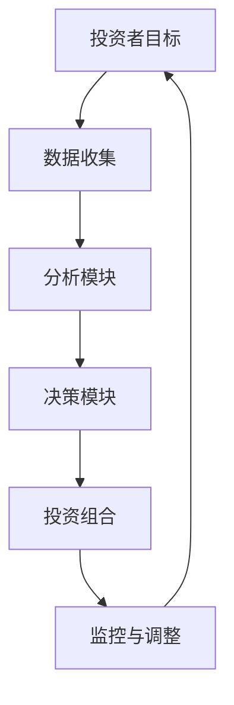
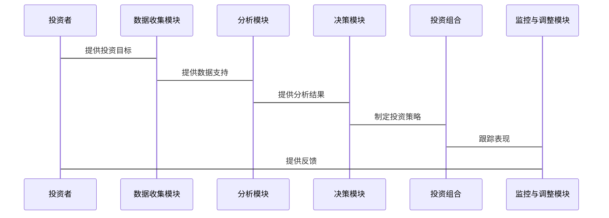

                 


# 价值投资之父格雷厄姆的投资哲学

---

## 关键词：
- 价值投资
- 格雷厄姆
- 安全边际
- 投资心理学
- 投资策略
- 内在价值
- 基本面分析

---

## 摘要：
本文深入探讨了价值投资之父本杰明·格雷厄姆的投资哲学，分析了其核心理念、安全边际概念、防御性投资策略以及投资心理学。通过详细阐述其投资分析方法和成功案例，本文揭示了格雷厄姆投资哲学的现代应用及其对投资决策的深远影响。文章结合理论与实践，为读者提供了全面而深刻的理解。

---

## 第一部分：格雷厄姆的投资哲学概述

### 第1章：格雷厄姆的生平与投资理念的形成

#### 1.1 格雷厄姆的生平简介
- 1.1.1 格雷厄姆的早年经历：从文学到金融的转折
- 1.1.2 投资生涯的起点：早期的投资实践
- 1.1.3 《证券分析》与《聪明的投资者》：思想的传播与影响

#### 1.2 价值投资理念的起源与演变
- 1.2.1 格雷厄姆与巴菲特：价值投资的师徒传承
- 1.2.2 格雷厄姆投资哲学的核心思想：安全边际与防御性投资
- 1.2.3 价值投资的现代发展：从格雷厄姆到现代投资者

#### 1.3 格雷厄姆投资哲学的核心观点
- 1.3.1 价值投资的定义：市场的先生与先生的市场
- 1.3.2 安全边际的哲学意义：价格与价值的差距
- 1.3.3 长期投资的重要性：时间的朋友

### 第2章：安全边际与防御性投资策略

#### 2.1 安全边际的定义与计算
- 2.1.1 安全边际的定义：价格与内在价值的差距
- 2.1.2 安全边际的计算方法：内在价值的估算与市场价比较
- 2.1.3 安全边际的实际应用：如何选择低估资产

#### 2.2 防御性投资策略的核心要素
- 2.2.1 防御性投资的定义：规避风险的投资策略
- 2.2.2 防御性投资的实施步骤：低波动性资产的选择与分散投资
- 2.2.3 防御性投资的优缺点：稳健与收益的平衡

#### 2.3 格雷厄姆的安全边际与防御性投资的关系
- 2.3.1 安全边际在防御性投资中的作用：保护本金的重要性
- 2.3.2 防御性投资如何实现安全边际：低估值与分散投资的结合
- 2.3.3 格雷厄姆安全边际的现代应用：动态调整与风险管理

### 第3章：格雷厄姆的投资分析方法

#### 3.1 基本面分析的核心要素
- 3.1.1 基本面分析的定义：通过财务数据评估企业价值
- 3.1.2 基本面分析的关键指标：市盈率、市净率、股息率等
- 3.1.3 基本面分析的实施步骤：数据收集、分析与估值

#### 3.2 内在价值的计算方法
- 3.2.1 内在价值的定义：企业未来现金流的现值
- 3.2.2 内在价值的计算公式：格雷厄姆的估值模型
- 3.2.3 内在价值计算的注意事项：假设的合理性与数据的准确性

#### 3.3 格雷厄姆的股票筛选标准
- 3.3.1 格雷厄姆的股票筛选标准：低市盈率、低市净率、高股息率等
- 3.3.2 格雷厄姆的股票筛选方法：多因素分析与组合投资
- 3.3.3 格雷厄姆的股票筛选案例：历史案例分析与启示

### 第4章：格雷厄姆的投资心理学

#### 4.1 投资者心理的常见问题
- 4.1.1 投资者常见心理偏差：贪婪与恐惧、过度自信等
- 4.1.2 市场情绪的影响：从乐观到恐慌的心理周期
- 4.1.3 心理因素对投资决策的影响：情绪化决策的危害

#### 4.2 格雷厄姆对投资心理的深刻洞察
- 4.2.1 格雷厄姆的“市场先生”理论：市场波动与理性决策的关系
- 4.2.2 避免情绪化决策的方法：建立投资纪律与长期视角
- 4.2.3 心理账户的管理：如何避免非理性决策

#### 4.3 投资者的心理修炼
- 4.3.1 建立长期投资心态：耐心与纪律的重要性
- 4.3.2 应对市场波动的策略：保持冷静与理性分析
- 4.3.3 心理健康与投资成功：压力管理与自我调节

## 第二部分：格雷厄姆投资哲学的系统分析与架构设计

### 第5章：投资哲学的系统分析

#### 5.1 问题场景介绍
- 5.1.1 投资者面临的挑战：信息过载、市场波动与心理压力
- 5.1.2 格雷厄姆投资哲学的系统性解决方案：从理念到实践
- 5.1.3 系统分析的目标：构建可持续的投资框架

#### 5.2 系统功能设计
- 5.2.1 投资目标的确定：短期与长期目标的平衡
- 5.2.2 数据收集与分析：基本面与技术面分析的结合
- 5.2.3 投资决策的制定：基于安全边际与防御性策略的选择

#### 5.3 系统架构设计
- 5.3.1 系统架构图：模块化设计与功能分配
- 5.3.2 数据流图：从数据输入到决策输出的流程
- 5.3.3 模块交互图：各功能模块之间的协作关系

### 第6章：系统架构设计

#### 6.1 系统功能模块
- 6.1.1 数据收集模块：市场数据、公司财报的获取与整理
- 6.1.2 分析模块：基本面分析、内在价值计算与安全边际评估
- 6.1.3 决策模块：基于分析结果的投资决策制定
- 6.1.4 监控与调整模块：动态跟踪投资组合的表现与市场变化

#### 6.2 系统架构图


#### 6.3 模块交互图


## 第三部分：项目实战与数学模型

### 第7章：项目实战

#### 7.1 环境安装
- 7.1.1 投资分析工具的安装与配置：Excel、Python等
- 7.1.2 数据源的选择与获取：股票数据的获取与处理

#### 7.2 核心实现源代码
- 7.2.1 内在价值计算的Python代码示例：
```python
def calculate_intrinsic_value(eps, growth_rate, required_rate_of_return, moat):
    # 简单的内在价值计算模型（基于未来现金流的现值）
    # eps: 当前每股收益
    # growth_rate: 预期年增长率
    # required_rate_of_return: 必要的回报率
    # moat: 护城河的强度（影响增长的持续性）
    projected_eps = eps * (1 + growth_rate/100)
    intrinsic_value = projected_eps / (required_rate_of_return/100)
    return intrinsic_value * (1 + moat/100)
```

#### 7.3 代码应用解读与分析
- 7.3.1 内在价值计算的代码分析：参数的含义与计算逻辑
- 7.3.2 数据可视化：使用Python绘制股票价格与内在价值的对比图
- 7.3.3 投资组合管理：基于安全边际的股票筛选与组合优化

#### 7.4 实际案例分析
- 7.4.1 案例选择：以某公司为例，计算其内在价值与安全边际
- 7.4.2 投资决策：基于分析结果制定投资策略
- 7.4.3 投资效果评估：回顾投资表现与调整策略

### 第8章：数学模型与公式

#### 8.1 内在价值计算公式
$$
\text{内在价值} = \frac{\text{预期现金流}}{\text{折现率}}
$$

#### 8.2 安全边际计算公式
$$
\text{安全边际} = \text{内在价值} - \text{市场价格}
$$

#### 8.3 市盈率计算公式
$$
\text{市盈率} = \frac{\text{股价}}{\text{每股收益}}
$$

#### 8.4 市净率计算公式
$$
\text{市净率} = \frac{\text{股价}}{\text{每股净资产}}
$$

## 第四部分：最佳实践与小结

### 第9章：最佳实践与小结

#### 9.1 格雷厄姆投资哲学的现代应用
- 9.1.1 现代投资组合理论与价值投资的结合
- 9.1.2 技术分析与基本面分析的互补作用
- 9.1.3 量化投资中的格雷厄姆思想应用

#### 9.2 投资者的注意事项
- 9.2.1 避免追涨杀跌：纪律性与耐心的重要性
- 9.2.2 保持分散投资：降低风险的有效方法
- 9.2.3 定期复盘与调整：动态优化投资组合

#### 9.3 长期投资的重要性
- 9.3.1 时间的复利效应：长期投资的威力
- 9.3.2 避免短期波动干扰：坚持长期投资策略
- 9.3.3 市场周期的应对策略：长期视角下的投资机会

### 第10章：总结与展望

#### 10.1 格雷厄姆投资哲学的核心总结
- 10.1.1 安全边际：保护本金的第一道防线
- 10.1.2 防御性投资：稳健与收益的平衡点
- 10.1.3 长期投资：时间与复利的力量

#### 10.2 未来投资环境的挑战与机遇
- 10.2.1 数字化与全球化：投资领域的变化
- 10.2.2 可持续投资：ESG投资的兴起
- 10.2.3 技术进步：数据驱动的投资分析

#### 10.3 对未来投资者的建议
- 10.3.1 学习与适应：不断更新投资知识与技能
- 10.3.2 保持理性与纪律：避免情绪化决策
- 10.3.3 长期视角：抓住结构性投资机会

---

## 作者：AI天才研究院/AI Genius Institute & 禅与计算机程序设计艺术 /Zen And The Art of Computer Programming

