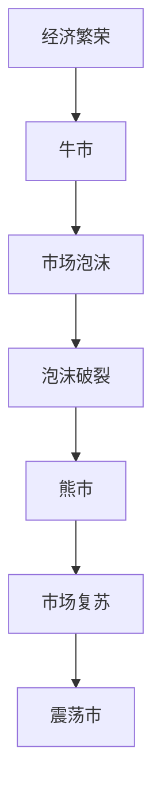
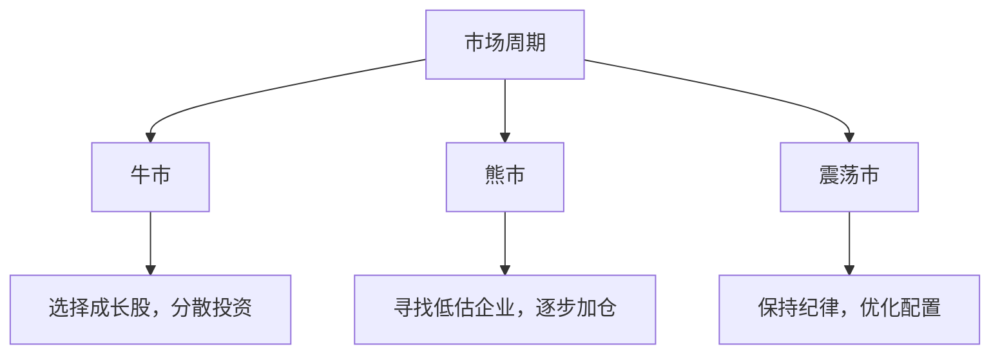

                 

# 价值投资在不同市场周期中的应用策略

> 关键词：价值投资、市场周期、投资策略、风险管理、资产配置、投资组合

> 摘要：本文深入探讨了价值投资在不同市场周期中的应用策略，结合市场周期的特点，分析了牛市、熊市和震荡市中的投资策略，并通过具体案例和数学模型，提出了系统化的投资方法。

---

# 第一部分：价值投资基础与市场周期概述

## 第1章：价值投资的核心理念

### 1.1 价值投资的定义与历史发展

#### 1.1.1 价值投资的起源与核心思想
- 价值投资的概念：通过分析企业的内在价值，寻找市场价格低于内在价值的投资机会。
- 历史发展：从格雷厄姆到巴菲特，价值投资理念的演变。
- 核心思想：安全边际、长期投资、避免情绪化决策。

#### 1.1.2 价值投资的基本原则与理念
- 以合理价格买入优质企业。
- 长期持有，避免频繁交易。
- 通过分散投资降低风险。

#### 1.1.3 价值投资与市场周期的关系
- 市场周期对价值投资策略的影响。
- 在不同周期中，价值投资的实现方式和目标的调整。

### 1.2 市场周期的基本概念

#### 1.2.1 经济周期的定义与特征
- 经济周期的四个阶段：繁荣、衰退、萧条、复苏。
- 每个阶段对股市的影响。

#### 1.2.2 股市周期的划分与阶段
- 牛市、熊市、震荡市的定义和特征。
- 市场周期与企业价值的关系。

#### 1.2.3 不同市场周期对投资策略的影响
- 投资者行为在不同周期中的变化。
- 投资策略需要根据市场周期进行调整。

### 1.3 价值投资与市场周期的关系

#### 1.3.1 价值投资在不同周期中的表现
- 牛市中：容易高估，需要谨慎选择。
- 熊市中：低估机会，适合买入优质资产。
- 震荡市中：需要耐心和纪律。

#### 1.3.2 市场周期对价值投资策略的调整影响
- 如何在牛市中避免过度投机。
- 如何在熊市中识别和利用低估机会。
- 如何在震荡市中保持投资纪律。

#### 1.3.3 价值投资在周期性波动中的优势
- 长期视角下的复利效应。
- 避免短期波动干扰，专注于企业价值。

## 第2章：价值投资的核心指标与分析方法

### 2.1 基本面分析的核心指标

#### 2.1.1 市盈率（P/E）的计算与应用
- 市盈率的公式：P/E = 市场价 / 每股收益。
- 低市盈率可能意味着低估，高市盈率可能意味着高估。
- 示例：假设某公司股价为10元，每股收益为2元，P/E = 5。

#### 2.1.2 市净率（P/B）的计算与应用
- 市净率的公式：P/B = 市场价 / 每股净资产。
- 用于评估银行、房地产等行业的估值。
- 示例：某银行股价为10元，每股净资产为5元，P/B = 2。

#### 2.1.3 股息率的计算与投资价值分析
- 股息率的公式：股息率 = 每股股息 / 市场价。
- 高股息率可能意味着收益稳定，但需警惕高股息率陷阱。
- 示例：某公司股息为1元，股价为10元，股息率 = 10%。

### 2.2 财务报表分析的关键点

#### 2.2.1 利润表分析与企业盈利能力评估
- 收入、成本、利润的关系。
- 净利润是衡量企业盈利能力的核心指标。
- 示例：某公司收入为1000万元，成本为600万元，净利润为200万元。

#### 2.2.2 资产负债表分析与财务健康度评估
- 资产、负债、所有者权益的构成。
- 重点关注流动资产、流动负债和资产负债率。
- 示例：某公司流动资产为500万元，流动负债为300万元，流动比率 = 1.67。

#### 2.2.3 现金流量表分析与企业现金流管理
- 经营活动、投资活动和筹资活动的现金流。
- 企业现金流健康的标准。
- 示例：经营活动现金流为正，投资活动现金流为负，筹资活动现金流为正。

### 2.3 价值投资中的DCF模型

#### 2.3.1 DCF模型的基本原理
- 现金流折现法：将未来现金流按无风险利率折现到当前价值。
- 核心假设：预测企业未来自由现金流。

#### 2.3.2 DCF模型的计算步骤与应用
- 确定折现率。
- 预测未来现金流。
- 计算企业内在价值。
- 示例：假设折现率为10%，未来5年现金流分别为100万、120万、150万、180万、200万，计算其现值。

#### 2.3.3 DCF模型在不同市场周期中的适用性
- 牛市中：避免过度乐观的现金流预测。
- 熊市中：保守估计现金流，寻找低估企业。
- 震荡市中：DCF模型提供稳定的价值评估依据。

---

# 第二部分：不同市场周期中的价值投资策略

## 第3章：牛市中的价值投资策略

### 3.1 牛市的基本特征与投资者行为

#### 3.1.1 牛市的形成机制与市场情绪
- 牛市的驱动因素：经济增长、低利率、市场情绪。
- 投资者情绪：乐观、贪婪、过度自信。

#### 3.1.2 牛市中投资者的常见错误
- 过度乐观，追求高收益。
- 忽视估值，买入高价股票。
- 过度集中投资，忽视分散风险。

#### 3.1.3 牛市中的市场泡沫与风险
- 泡沫的形成：市场情绪推动价格远超基本面。
- 泡沫破裂的风险：市场回归理性，股价回落。

### 3.2 牛市中的价值投资策略

#### 3.2.1 选择具有持续增长潜力的企业
- 寻找基本面强劲、行业龙头的企业。
- 示例：科技行业在牛市中可能具有更高的增长潜力。

#### 3.2.2 估值中枢的上移与投资决策
- 估值中枢：在牛市中，合理的估值范围可能上升。
- 示例：原本合理市盈率15倍的企业，在牛市中可能被市场推高到20倍。

#### 3.2.3 分散投资与风险管理
- 分散投资：避免过度集中，降低风险。
- 使用止损策略：设定止损点，避免重大损失。
- 示例：投资组合中分散配置科技、消费、金融等多个行业。

## 第4章：熊市中的价值投资策略

### 4.1 熊市的基本特征与投资者行为

#### 4.1.1 熊市的形成机制与市场情绪
- 熊市的驱动因素：经济衰退、高利率、市场恐慌。
- 投资者情绪：悲观、恐惧、过度保守。

#### 4.1.2 熊市中投资者的常见错误
- 过度悲观，错过低估机会。
- 盲目跟风抛售，割在最低点。
- 忽视长期价值，仅关注短期价格。

#### 4.1.3 熊市中的市场恐慌与机会
- 市场恐慌导致价格超跌，创造买入机会。
- 示例：某优质企业的股价因市场恐慌下跌30%，内在价值未变。

### 4.2 熊市中的价值投资策略

#### 4.2.1 寻找被市场错杀的优质企业
- 优质企业：基本面稳定，具备长期竞争优势。
- 示例：在熊市中，消费必需品行业可能更具防御性。

#### 4.2.2 估值中枢的下移与投资决策
- 估值中枢：在熊市中，合理的估值范围可能下降。
- 示例：原本合理市盈率20倍的企业，在熊市中可能被市场低估至12倍。

#### 4.2.3 加仓策略与风险管理
- 加仓：逐步买入低估资产，分批建仓。
- 风险管理：设定买入区间，避免一次性投入过多。
- 示例：分批买入，每次下跌5%加仓10%。

## 第5章：震荡市中的价值投资策略

### 5.1 震荡市的基本特征与投资者行为

#### 5.1.1 震荡市的形成机制与市场情绪
- 震荡市的驱动因素：经济不确定性、政策变化、地缘政治风险。
- 投资者情绪：犹豫、观望、频繁交易。

#### 5.1.2 震荡市中投资者的常见错误
- 频繁交易，增加成本。
- 追求短期收益，忽视长期价值。
- 忽视市场波动，缺乏耐心。

#### 5.1.3 震荡市中的市场波动与不确定性
- 市场波动加剧，价格波动频繁。
- 示例：某行业受到政策影响，股价出现大幅波动。

### 5.2 震荡市中的价值投资策略

#### 5.2.1 保持投资纪律与耐心
- 避免情绪化决策，坚持长期投资。
- 示例：在市场波动中，坚持持有优质企业股票。

#### 5.2.2 灵活调整投资组合
- 根据市场变化，动态调整资产配置。
- 示例：增加防御性资产，减少高风险资产。

#### 5.2.3 优化资产配置与风险管理
- 资产配置：平衡股票、债券、现金等资产。
- 风险管理：使用对冲工具，降低市场波动影响。
- 示例：增加债券配置，减少股票头寸。

---

# 第三部分：价值投资策略的系统化与

## 第6章：系统化价值投资策略

### 6.1 投资组合管理

#### 6.1.1 投资组合的构建与调整
- 投资组合构建：根据市场周期和个人风险偏好，选择合适的资产。
- 投资组合调整：定期回顾和调整持仓，确保与市场周期匹配。
- 示例：牛市中增加成长股配置，熊市中增加防御性资产配置。

### 6.2 风险管理

#### 6.2.1 风险的来源与度量
- 风险来源：市场风险、流动性风险、信用风险等。
- 风险度量：使用波动率、VaR（在险价值）等指标。
- 示例：计算投资组合的 VaR，评估潜在损失。

#### 6.2.2 风险对冲策略
- 使用衍生工具：如期货、期权进行对冲。
- 示例：通过卖出看跌期权，对冲下行风险。

#### 6.2.3 风险提示与预警机制
- 设置止损点：当价格跌破关键支撑位，立即卖出。
- 监测市场信号：关注宏观经济指标和行业动态。

---

# 图表与示例

## 图表

### 图表1：市场周期的流程图

### 图表2：投资策略的决策树

### 图表3：资产配置的饼图

---

## 示例

### 示例1：牛市中的投资组合
- 股票：70%
- 债券：20%
- 现金：10%

### 示例2：熊市中的投资组合
- 股票：40%
- 债券：50%
- 现金：10%

---

# 附录

## 附录A：术语表
- 价值投资：以低于内在价值的价格买入并长期持有的投资策略。
- 市场周期：经济和股市的周期性波动，包括牛市、熊市和震荡市。
- 风险管理：通过分散投资、对冲等手段降低投资风险。

## 附录B：常见问题解答
- Q1：如何判断市场处于哪个周期？
- A1：关注宏观经济指标、市场情绪和企业盈利情况。

---

# 作者

作者：AI天才研究院/AI Genius Institute & 禅与计算机程序设计艺术 /Zen And The Art of Computer Programming

