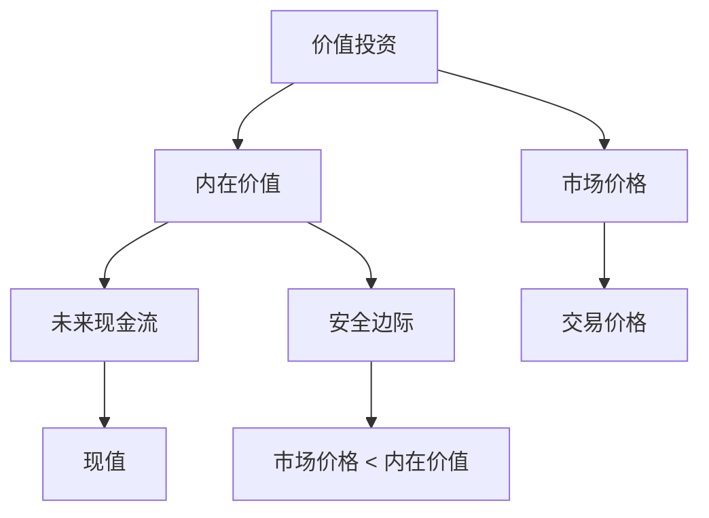
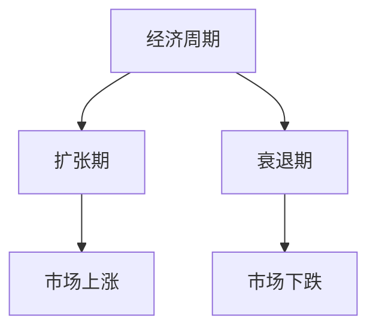

                 

<think>
嗯，用户希望我写一篇关于《价值投资在不同市场环境下的应用》的技术博客文章。看起来这是一个结合了金融和计算机科学的话题，特别是用户提到要使用技术语言和详细分析，所以我得想办法将价值投资的概念和技术分析结合起来。

首先，我需要明确文章的结构。用户已经给出了一个大纲，分为七个主要部分，每个部分下还有子章节。我得确保每个部分都涵盖足够的内容，并且逻辑清晰。比如，第一部分是价值投资的概述，我需要详细解释什么是价值投资，它的核心概念，历史发展，理论基础以及具体的策略和方法。

接下来是市场环境分析。这部分需要讨论宏观经济因素、行业分析、市场周期和市场情绪。我得考虑如何将这些因素与价值投资策略结合起来，比如在牛市和熊市中如何调整策略。这可能涉及到一些图表或模型，比如经济周期模型或者市场情绪指数。

然后是不同市场环境下的投资策略。这部分需要详细分析牛市、熊市、震荡市和通货膨胀环境下的策略调整。我得思考在不同市场条件下，价值投资者应该如何选择股票、评估估值，以及如何管理风险。可能需要引用一些经典的案例，比如在2008年金融危机期间，价值投资的表现如何。

接下来是行业分析与公司估值。这部分需要介绍如何选择行业和评估公司价值，包括基本面分析、财务指标和估值方法。我得考虑使用一些工具或模型，比如PE（市盈率）、PB（市净率）等，并可能结合Python代码来展示如何计算这些指标。

风险管理与投资组合优化也是关键部分。我需要讨论如何在不同的市场环境中管理风险，可能涉及到资产配置、分散投资和止损策略。或许可以引入一些风险管理模型，比如现代投资组合理论（MPT），并使用Python代码来展示如何构建最优投资组合。

实际案例分析部分需要通过具体案例来展示价值投资的应用。我得寻找几个典型的案例，比如在2000年互联网泡沫期间，价值投资者如何选择被低估的股票，或者在2020年疫情冲击下，如何通过价值投资策略找到被低估的机会。

最后是价值投资的未来趋势。我需要探讨技术进步、全球化、ESG投资等因素对价值投资的影响。可能涉及大数据分析在价值投资中的应用，或者人工智能如何帮助识别被低估的股票。

在写作过程中，我需要确保每个章节都有足够的细节，并且逻辑连贯。例如，在讨论价值投资的核心理念时，我需要解释内在价值和市场价格的关系，并给出一些计算内在价值的公式。同时，可能需要使用Mermaid图来展示经济周期模型或市场环境的影响因素。

另外，用户提到要使用技术语言，所以我可能需要结合一些编程元素，比如使用Python代码来计算PE和PB比率，或者展示如何构建投资组合。这可能让文章更具深度和实用性。

最后，我需要确保文章的结构完整，每个部分都有足够的内容，同时保持整体的流畅性。可能需要多次修改和调整，确保每个章节都符合用户的高要求，并且能够吸引读者的兴趣。

总之，我需要系统地分析价值投资在不同市场环境下的应用，结合金融理论和编程技术，为读者提供一个全面且有深度的分析。
</think>

# 价值投资在不同市场环境下的应用

> 关键词：价值投资，市场环境，投资策略，风险管理，经济周期

> 摘要：价值投资是一种基于公司基本面分析的投资策略，强调以低于内在价值的价格购买优质股票。本文将探讨价值投资在不同市场环境下的应用，包括牛市、熊市、震荡市和通货膨胀环境下的策略调整。通过分析宏观经济因素、行业分析、市场周期和市场情绪，本文将提供一套系统的方法来优化价值投资策略，同时结合实际案例分析和风险管理技巧，帮助投资者在复杂多变的市场环境中实现稳健收益。

---

## 第一部分: 价值投资的概述

### 第1章: 价值投资的核心理念

#### 1.1 价值投资的定义与核心概念

价值投资是一种以基本面分析为基础的投资策略，强调以低于公司内在价值的价格购买股票。其核心理念是寻找市场中的“价值洼地”，即市场价格显著低于公司实际价值的股票。

**核心概念：**
- **内在价值**：公司未来现金流的现值，反映了公司的实际价值。
- **市场价格**：股票在二级市场的交易价格。
- **安全边际**：买入价格与内在价值之间的差距，提供了风险缓冲。

公式：
$$
\text{内在价值} = \sum_{t=1}^{n} \frac{\text{现金流}_t}{(1 + r)^t}
$$

其中，\( r \) 为折现率，反映投资者要求的回报率。

**对比表格：**

| 概念         | 描述                                   |
|--------------|--------------------------------------|
| 内在价值     | 公司未来现金流的现值                 |
| 市场价格     | 股票在市场上的交易价格               |
| 安全边际     | 内在价值与市场价格的差距             |

**Mermaid流程图：**

#### 1.2 价值投资的历史与发展

价值投资的起源可以追溯到20世纪初， Benjamin Graham 和 David Dodd 是这一理念的奠基人。他们提出的“安全边际”和“内在价值”概念奠定了价值投资的基础。在现代，价值投资不断发展，涌现出 Warren Buffett、Charlie Munger 等著名的价值投资者。

**主要价值投资者及其投资理念：**
- **Benjamin Graham**：提出“烟蒂投资法”，寻找被市场遗忘的廉价股票。
- **Warren Buffett**：强调企业基本面、管理层质量和长期竞争优势。
- **Peter Lynch**：注重行业分析和公司成长性。

#### 1.3 价值投资的理论基础

价值投资的理论基础包括资本资产定价模型（CAPM）、时间价值和市场有效性假设。

**资本资产定价模型（CAPM）：**
$$
E(r_i) = r_f + \beta_i (E(r_m) - r_f)
$$

其中，\( E(r_i) \) 是资产的预期回报率，\( r_f \) 是无风险利率，\( \beta_i \) 是资产的系统性风险系数，\( E(r_m) \) 是市场预期回报率。

**时间价值与机会成本：**
时间价值是指资金随着时间的推移而增加的价值，机会成本则是指放弃其他投资机会的成本。

**市场有效性：**
价值投资者认为市场并非总是有效的，存在短期价格波动，这为价值投资提供了机会。

#### 1.4 价值投资的策略与方法

价值投资的策略包括基本面分析、估值分析和趋势分析。

**基本面分析：**
- 财务报表分析：收入、利润、资产负债表等。
- 估值指标：PE（市盈率）、PB（市净率）、EV/EBITDA（企业价值与息税折旧及摊销前利润之比）。

**选股标准：**
- 低市盈率、低市净率、高股息率。
- 公司具有竞争优势、稳定的盈利能力。

**长期投资与分散投资：**
- 长期投资：避免短期价格波动的影响。
- 分散投资：通过投资不同行业和公司降低风险。

---

## 第二部分: 不同市场环境下的投资策略

### 第2章: 宏观经济环境对投资策略的影响

#### 2.1 宏观经济因素分析

**经济周期与市场表现的关系：**
经济周期分为扩张期和衰退期，市场表现与经济周期密切相关。

**经济周期模型：**

**利率与通货膨胀的影响：**
- 利率上升：债券收益率上升，股票吸引力下降。
- 通货膨胀：影响企业盈利能力和估值。

#### 2.2 行业分析与市场定位

**行业生命周期的分析框架：**
- 初创期：高增长，高风险。
- 成长期：稳定增长，竞争加剧。
- 成熟期：增长放缓，利润稳定。
- 衰退期：需求下降，利润减少。

**行业竞争结构：**
- 进入壁垒：高进入壁垒的行业更具防御性。
- 竞争程度：竞争激烈行业的估值可能较低。

#### 2.3 市场周期与投资策略

**市场周期的特征：**
- 牛市：市场情绪高涨，估值偏高。
- 熊市：市场情绪低落，估值偏低。
- 震荡市：市场波动大，机会与风险并存。

**投资策略调整：**
- 牛市：选择估值合理、具有成长性的股票。
- 熊市：寻找估值显著低于内在价值的股票。
- 震荡市：注重公司基本面，避免高波动股票。

---

## 第三部分: 价值投资策略的调整与优化

### 第3章: 牛市环境下的价值投资策略

#### 3.1 牛市环境的特点

**市场情绪高涨的原因：**
- 投资者乐观预期市场上涨。
- 资金流入股市增加。

**市场估值的扩张趋势：**
- PE、PB等估值指标上升。

#### 3.2 价值投资策略的调整

**调整策略：**
- 选择估值合理、具有成长性的股票。
- 适当降低仓位，避免过高估值的风险。
- 关注被市场忽视的优质股票。

---

## 第四部分: 行业分析与公司估值

### 第4章: 价值投资的行业分析

#### 4.1 选择行业的标准

**行业生命周期分析：**
- 成熟期行业更具稳定性。
- 初创期行业风险较高。

**行业竞争结构分析：**
- 进入壁垒高、竞争程度低的行业更具投资价值。

#### 4.2 公司估值的方法

**估值指标：**
- PE（市盈率）：$$ \text{PE} = \frac{\text{股价}}{\text{每股收益}} $$
- PB（市净率）：$$ \text{PB} = \frac{\text{股价}}{\text{每股净资产}} $$
- EV/EBITDA：$$ \text{EV/EBITDA} = \frac{\text{企业价值}}{\text{EBITDA}} $$

---

## 第五部分: 风险管理与投资组合优化

### 第5章: 风险管理策略

#### 5.1 风险控制措施

**风险管理工具：**
- 期权：用于对冲价格波动风险。
- 保险策略：购买保险来降低下行风险。

---

## 第六部分: 价值投资的未来趋势

### 第6章: 价值投资的未来发展方向

#### 6.1 技术进步对价值投资的影响

**技术进步：**
- 大数据分析：通过大数据分析寻找被低估的股票。
- 人工智能：利用AI技术预测市场趋势和公司估值。

---

## 第七部分: 实际案例分析

### 第7章: 价值投资的实际案例

#### 7.1 牛市中的价值投资案例

**案例：2000年互联网泡沫**

**背景：**
- 互联网泡沫期间，许多科技股估值过高，但一些优质股票被市场忽视。

**分析：**
- 选择具有稳定盈利和低估值的公司，如IBM。

**结果：**
- IBM股价在泡沫破裂后逐渐回升，为投资者带来稳健回报。

---

## 附录

### 附录A: 术语表

- 内在价值：公司未来现金流的现值。
- 市场价格：股票在二级市场的交易价格。
- 安全边际：买入价格与内在价值之间的差距。

---

## 作者：AI天才研究院/AI Genius Institute & 禅与计算机程序设计艺术 /Zen And The Art of Computer Programming

