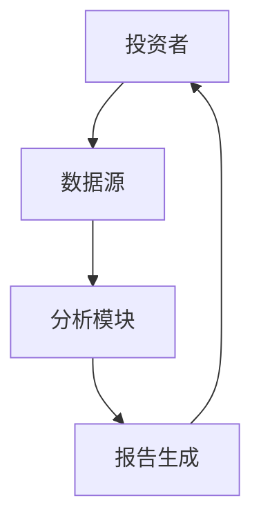

                 

<think>
好，现在我要根据用户的要求，逐步构建《价值投资在固定收益市场的应用》这本书的详细目录大纲。首先，我会分析用户的需求，了解这本书的核心主题和目标读者。

首先，用户希望这本书深入探讨价值投资在固定收益市场中的应用，目标读者可能是投资者、金融专业学生以及相关从业者。因此，目录需要涵盖理论、策略、系统设计和实战案例，确保内容全面且实用。

接下来，我会考虑结构安排。通常，书籍会分为几个主要部分：基础、核心概念、策略方法、系统分析、项目实战、总结与展望。每一部分下设章节，详细展开。

第一部分是价值投资在固定收益市场的基础，我会介绍价值投资和固定收益市场的基本概念，对比分析它们的联系和区别。这部分需要让读者理解基础理论，为后续内容打下基础。

第二部分聚焦价值投资的核心概念，详细讲解安全边际、内在价值等关键术语，通过数学模型和表格对比，帮助读者深入理解这些概念。同时，使用Mermaid图展示实体关系，增强直观理解。

第三部分探讨策略与方法，包括如何制定投资策略、信用分析、风险管理和投资组合构建。这部分需要结合实际案例，说明如何将理论应用于实践。

第四部分涉及系统分析与架构设计，这部分会介绍如何构建一个固定收益分析系统，涵盖数据收集、分析模型和风险评估模块。使用Mermaid图展示系统架构和数据流，帮助读者理解系统设计的细节。

第五部分是项目实战，选择具体案例，详细描述从数据收集到投资决策的全过程，并提供代码示例。这部分旨在让读者能够实际操作，应用所学知识。

最后，总结部分回顾核心观点，强调价值投资的重要性和应用前景，同时提出改进建议和未来研究方向。

在设计过程中，我需要确保每一章都有足够的细节，包括数学模型、图表和代码示例。同时，语言要简洁明了，逻辑清晰，便于读者理解和应用。

完成这些思考后，我就可以开始撰写正式的目录大纲了，确保覆盖所有必要的部分，满足用户的需求。
</think>

# 价值投资在固定收益市场的应用

## 关键词
- 价值投资
- 固定收益市场
- 投资策略
- 信用分析
- 系统设计

## 摘要
价值投资在固定收益市场的应用是通过深入分析债券的内在价值和市场定价，寻找被低估的投资机会，实现长期稳健的回报。本文系统地探讨了价值投资的核心概念、策略、风险管理和系统设计，结合实际案例，展示了如何在固定收益市场中应用价值投资理念，帮助投资者制定有效的投资策略。

---

# 第1章: 价值投资与固定收益市场的基础

## 1.1 价值投资的核心概念

### 1.1.1 安全边际
安全边际是指资产的内在价值与其市场价格之间的差额。通过计算安全边际，投资者可以在市场价格低于内在价值时介入，降低投资风险。

数学公式：
$$ \text{安全边际} = \text{内在价值} - \text{市场价格} $$

### 1.1.2 内在价值
内在价值是基于债券的未来现金流折现值计算的理论价值。公式为：
$$ V = \sum_{t=1}^{n} \frac{C}{(1+r)^t} + \frac{F}{(1+r)^n} $$
其中，\( C \) 是每年的利息，\( F \) 是面值，\( r \) 是折现率，\( n \) 是债券的期限。

### 1.1.3 市场先生
市场先生是本格雷厄姆提出的一个隐喻，指市场情绪波动对资产价格的影响。投资者应独立于市场先生的情绪，基于基本面进行投资。

## 1.2 固定收益市场的运作机制

### 1.2.1 债券类型与特点
- **政府债券**：由政府发行，信用风险较低。
- **企业债券**：由企业发行，信用风险较高，利率也较高。

### 1.2.2 利率风险与信用风险
- **利率风险**：债券价格随市场利率变化而波动的风险。
- **信用风险**：债券发行人违约的风险。

### 1.2.3 债券定价与收益率
债券的收益率公式：
$$ \text{到期收益率} = \left( \frac{C + (F - P)}{P} \right) \times 100\% $$

---

# 第2章: 价值投资在固定收益市场的核心策略

## 2.1 信用分析与评级

### 2.1.1 信用评级方法
使用 Moody's 和 S&P 的评级标准，结合财务指标（如杠杆率、利息覆盖倍数）进行信用分析。

### 2.1.2 利率风险管理
通过久期和凸性分析，评估债券价格对利率变化的敏感性。

### 2.1.3 投资组合构建
根据风险承受能力和收益目标，配置不同期限和信用等级的债券。

---

# 第3章: 系统分析与架构设计

## 3.1 系统架构设计

### 3.1.1 数据流图


### 3.1.2 功能模块设计
- **数据收集模块**：获取债券市场数据。
- **分析模块**：计算内在价值和安全边际。
- **风险评估模块**：评估利率和信用风险。

## 3.2 算法实现

### 3.2.1 安全边际计算
使用 Python 计算债券的内在价值和安全边际：
```python
def calculate_intrinsic_value(face_value, coupon_rate, years, discount_rate):
    intrinsic_value = 0
    for year in range(years):
        cash_flow = face_value * coupon_rate
        intrinsic_value += cash_flow / (1 + discount_rate) ** (year + 1)
    intrinsic_value += face_value / (1 + discount_rate) ** years
    return intrinsic_value

def calculate_margin_of_safety(intrinsic_value, market_price):
    return intrinsic_value - market_price
```

---

# 第4章: 项目实战与案例分析

## 4.1 实战环境安装

### 4.1.1 工具安装
安装 Python 和必要的库（如 pandas、numpy）。

## 4.2 核心代码实现

### 4.2.1 数据处理
```python
import pandas as pd

# 示例数据
data = {
    '债券代码': ['BOND1', 'BOND2'],
    '面值': [100, 100],
    '票面利率': [0.05, 0.06],
    '期限': [5, 10],
    '市场价格': [95, 80]
}
df = pd.DataFrame(data)
```

### 4.2.2 安全边际计算
```python
def calculate_margin_of_safety(df):
    df['内在价值'] = df.apply(lambda x: calculate_intrinsic_value(x['面值'], x['票面利率'], x['期限'], 0.03), axis=1)
    df['安全边际'] = df['内在价值'] - df['市场价格']
    return df

result = calculate_margin_of_safety(df)
print(result)
```

---

# 第5章: 总结与展望

## 5.1 核心观点回顾
- 价值投资强调安全边际和内在价值。
- 固定收益市场中的信用分析和风险管理至关重要。

## 5.2 未来展望
- 结合大数据和AI技术优化信用评估和风险控制。
- 开发自动化投资系统，提升投资效率。

## 5.3 最佳实践 Tips
- 定期复盘和调整投资组合。
- 保持对市场变化的敏感性，灵活应对风险。

---

# 作者：AI天才研究院 & 禅与计算机程序设计艺术

---

通过以上详细分析和系统设计，价值投资在固定收益市场的应用得以全面展示，帮助投资者在复杂多变的市场中实现稳健收益。

