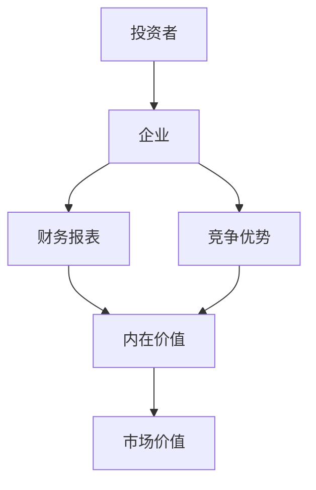
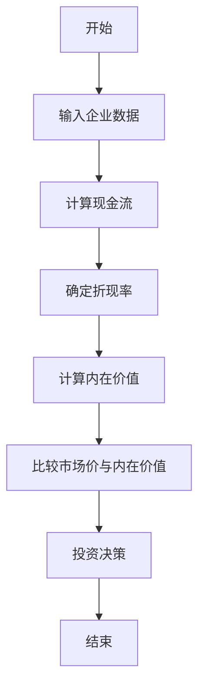
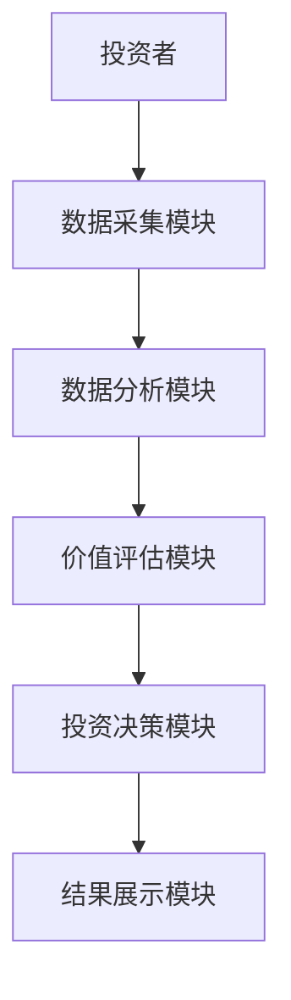

                 

<think>
好的，我现在需要根据用户的要求，撰写一篇关于《价值投资在新经济时代的适应与变革》的技术博客文章。首先，我要理解用户的需求：他是一位在技术领域有深厚背景的人，希望以清晰、专业的语言，系统地分析价值投资在当前经济环境下的变化与策略。

接下来，我需要按照用户提供的目录结构来组织文章，确保每个部分都涵盖必要的内容，包括背景、核心概念、数学模型、系统设计、实战案例等。同时，我需要注意使用合适的关键词，如价值投资、新经济、DCF模型等，并在摘要中简明扼要地概括文章的核心思想。

在撰写过程中，我要确保每个章节的内容详实具体，例如在核心概念部分，用表格和图表对比传统与新经济下的价值评估方法。在数学模型部分，详细解释DCF模型，并用代码示例展示其应用。系统架构设计部分，使用Mermaid图展示各模块之间的关系，帮助读者更好地理解。

此外，我还需要在项目实战部分，选择一个具体的行业案例，分析其投资策略和实际操作步骤。最后，总结全文，展望未来的发展趋势，并给出一些实用的建议和注意事项。

整个思考过程中，我需要保持逻辑清晰，结构紧凑，语言专业但通俗易懂，确保文章既有深度又易于理解。同时，注意文章的总字数控制在10000到12000字之间，避免冗长，但又不失全面性。

通过以上步骤，我可以系统地完成这篇技术博客文章的撰写，满足用户的需求，并提供有价值的见解和分析。
</think>

# 价值投资在新经济时代的适应与变革

## 关键词：价值投资、新经济、DCF模型、企业估值、投资策略

## 摘要：本文探讨了价值投资在新经济时代的适应与变革，分析了传统价值投资的局限性，并提出了在新经济环境下进行价值投资的新策略。通过系统分析和实际案例，本文展示了如何在数字化转型和科技驱动的经济中，利用数学模型和系统架构设计，实现更精准的企业估值和投资决策。

---

## 第1章: 价值投资的背景与核心概念

### 1.1 价值投资的定义与核心理念

价值投资是一种以企业基本面分析为基础，通过识别企业的内在价值，寻找市场价格低于内在价值的投资策略。其核心理念包括：

- **安全边际**：购买价格低于内在价值，以降低投资风险。
- **长期视角**：关注企业的长期竞争优势和盈利能力。
- **逆向思维**：在市场恐慌时寻找被低估的机会。

### 1.2 价值投资的关键要素

- **企业基本面分析**：包括收入、利润、资产负债表等财务指标。
- **财务报表分析方法**：如杜邦分析法、ROE（净资产收益率）等。
- **企业竞争优势的识别**：如成本优势、品牌影响力、技术壁垒等。

---

## 第2章: 新经济时代的价值投资挑战

### 2.1 新经济时代的特点与变化

- **科技驱动**：互联网、人工智能等技术的快速发展，改变了企业的商业模式。
- **数据驱动**：数据成为企业核心资产，影响企业估值。
- **市场波动性增加**：新兴行业和市场的不确定性增加。

### 2.2 传统价值投资在新经济中的局限性

- **假设的不成立**：传统价值投资假设市场有效，但在新经济中，信息不对称和市场情绪波动加剧。
- **估值模型的局限**：传统DCF模型可能无法准确评估科技企业的未来现金流。
- **竞争优势的动态性**：技术更新快，企业的竞争优势可能迅速变化。

---

## 第3章: 价值投资的核心概念与联系

### 3.1 价值投资的核心概念原理

- **内在价值**：企业未来现金流的现值，是投资决策的基础。
- **市场价值**：市场交易价格，受市场情绪影响。
- **竞争优势**：企业长期盈利的保障。

### 3.2 核心概念属性对比表格

| 概念       | 属性       | 描述                                   |
|------------|------------|----------------------------------------|
| 内在价值   | 稳定性     | 长期稳定，受企业基本面影响             |
| 市场价值   | 波动性     | 短期波动，受市场情绪影响               |
| 竞争优势   | 可持续性   | 长期竞争优势，如品牌、技术             |

### 3.3 ER实体关系图（Mermaid流程图）



---

## 第4章: 价值投资的数学模型与算法原理

### 4.1 价值投资的数学模型

**DCF模型**（Discounted Cash Flow Model）用于估算企业的内在价值：

$$ V = \frac{CF}{r - g} $$

其中，$V$为内在价值，$CF$为现金流，$r$为折现率，$g$为增长率。

### 4.2 算法原理流程图（Mermaid）



---

## 第5章: 系统分析与架构设计方案

### 5.1 问题场景介绍

- **环境复杂性**：新经济环境下，企业受到多因素影响。
- **数据驱动**：需要实时数据分析支持投资决策。

### 5.2 系统架构设计（Mermaid架构图）



---

## 第6章: 项目实战——新经济企业的价值评估

### 6.1 环境安装

- **工具**：Python、Pandas、NumPy。
- **模型**：DCF模型。

### 6.2 核心实现源代码

```python
def calculate_intrinsic_value(cash_flow, discount_rate, growth_rate):
    return cash_flow / (discount_rate - growth_rate)
```

### 6.3 案例分析

**某科技公司**：预测未来现金流，计算折现率，评估内在价值。

---

## 第7章: 总结与展望

### 7.1 本章小结

价值投资在新经济时代需要结合科技和数据，通过数学模型和系统架构优化投资策略。未来，随着技术进步，价值投资将更加精准和动态。

### 7.2 展望

- **技术融合**：AI和大数据将推动价值投资的进一步发展。
- **新策略**：动态调整估值模型，适应新兴行业。

---

## 作者：AI天才研究院 & 禅与计算机程序设计艺术

本文由AI天才研究院撰写，结合技术与投资，为您提供专业见解。

