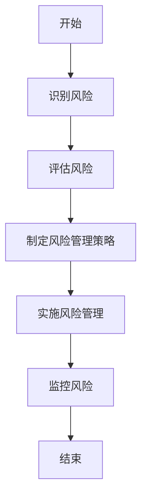

                 

# 价值投资在清洁能源转型中的角色：风险与机遇

> 关键词：价值投资、清洁能源转型、风险与机遇、能源技术、投资策略、可持续发展、能源政策

> 摘要：随着全球能源结构向清洁化、低碳化转型，价值投资在这一过程中扮演着关键角色。本文深入分析了清洁能源转型中的风险与机遇，探讨了价值投资在技术评估、市场预测和风险管理中的应用，为投资者提供了科学的投资策略和决策支持。

---

## 第一部分：引言

### 第1章：引言
#### 1.1 本书的目的与意义
- **1.1.1 问题背景**：全球气候变化和能源危机促使各国加速向清洁能源转型，价值投资在这一过程中具有不可替代的作用。
- **1.1.2 问题描述**：清洁能源转型面临技术、市场和政策等多重风险，投资者需要明确的价值评估方法来识别机遇和规避风险。
- **1.1.3 问题解决**：通过分析价值投资在清洁能源转型中的应用，为投资者提供科学的决策依据。
- **1.1.4 边界与外延**：本文仅探讨价值投资在清洁能源技术领域的应用，不涉及其他能源领域。
- **1.1.5 核心概念结构与组成**：清洁能源转型、价值投资、风险评估、投资策略。

---

## 第二部分：清洁能源转型的背景与价值投资的定义

### 第2章：清洁能源转型的背景
#### 2.1 清洁能源转型的定义与目标
- **2.1.1 清洁能源的定义**：清洁能源是指不排放或低排放的能源，如太阳能、风能、水能等。
- **2.1.2 清洁能源转型的驱动因素**：气候变化、能源安全、技术创新、政策支持。
- **2.1.3 清洁能源转型的目标与挑战**：实现低碳经济，减少对化石能源的依赖，技术创新和成本问题是主要挑战。

#### 2.2 价值投资的基本概念
- **2.2.1 价值投资的定义**：价值投资是一种以内在价值为导向的投资策略，寻找市场价格低于内在价值的标的。
- **2.2.2 价值投资的核心原则**：安全边际、长期持有、深入分析。
- **2.2.3 价值投资与清洁能源转型的联系**：清洁能源转型需要长期投资，价值投资的长期视角非常适合这一领域。

### 第3章：清洁能源转型中的风险与机遇
#### 3.1 清洁能源转型中的主要风险
- **3.1.1 技术风险**：技术创新不确定，技术失败可能导致投资损失。
- **3.1.2 市场风险**：市场需求波动，政策变化影响市场。
- **3.1.3 政策风险**：政策变化可能影响清洁能源项目的收益。
- **3.1.4 供应链风险**：原材料供应不稳定，影响项目进度。

#### 3.2 清洁能源转型中的主要机遇
- **3.2.1 技术进步带来的投资机会**：技术创新降低成本，提高效率。
- **3.2.2 市场需求的增长**：全球能源需求向清洁方向转变。
- **3.2.3 政策支持的力度**：各国政府出台政策支持清洁能源发展。
- **3.2.4 可持续发展带来的长期收益**：清洁能源项目具有长期稳定收益。

---

## 第三部分：价值投资在清洁能源转型中的角色

### 第4章：价值投资在清洁能源转型中的核心作用
#### 4.1 清洁能源转型中的价值投资策略
- **4.1.1 价值投资的基本策略**：寻找低估的清洁能源企业，关注基本面。
- **4.1.2 清洁能源转型中的具体策略**：投资于技术领先、管理优秀的企业。
- **4.1.3 价值投资在清洁能源转型中的独特优势**：长期视角，注重基本面分析。

#### 4.2 清洁能源转型中的价值评估方法
- **4.2.1 传统价值评估方法的局限性**：传统方法难以评估新兴技术企业。
- **4.2.2 清洁能源转型中的新型价值评估方法**：基于未来现金流的贴现模型。
- **4.2.3 价值评估方法的实际应用**：案例分析，如某光伏企业的估值。

### 第5章：清洁能源转型中的风险评估与管理
#### 5.1 清洁能源转型中的风险识别
- **5.1.1 风险识别的基本方法**：SWOT分析、情景分析。
- **5.1.2 清洁能源转型中的主要风险类型**：技术、市场、政策风险。
- **5.1.3 风险识别的具体步骤**：数据收集、分析、分类。

#### 5.2 清洁能源转型中的风险管理策略
- **5.2.1 风险管理的基本原则**：分散投资、风险定价、动态调整。
- **5.2.2 清洁能源转型中的具体风险管理策略**：多元化投资组合、签订长期合同。
- **5.2.3 风险管理的实际应用**：案例分析，如某风电企业的风险管理。

---

## 第四部分：清洁能源转型中的投资策略与案例分析

### 第6章：清洁能源转型中的投资策略
#### 6.1 清洁能源转型中的技术分析
- **6.1.1 技术分析的基本方法**：趋势分析、周期分析。
- **6.1.2 清洁能源转型中的技术发展趋势**：储能技术、智能电网、能源互联网。
- **6.1.3 技术分析在投资决策中的应用**：选择技术领先的企业。

#### 6.2 清洁能源转型中的行业分析
- **6.2.1 行业分析的基本方法**：PEST分析、波特五力分析。
- **6.2.2 清洁能源转型中的行业趋势**：市场集中度提高、政策支持加强。
- **6.2.3 行业分析的实际应用**：案例分析，如电动汽车行业的投资机会。

### 第7章：清洁能源转型中的投资案例分析
#### 7.1 光伏发电领域的投资案例
- **7.1.1 案例背景**：某光伏发电企业的技术优势和市场地位。
- **7.1.2 投资策略**：基于价值投资的估值方法。
- **7.1.3 投资结果**：长期收益高于市场平均水平。

#### 7.2 风电行业的投资案例
- **7.2.1 案例背景**：某风电企业的技术创新和成本优势。
- **7.2.2 投资策略**：关注政策支持和市场前景。
- **7.2.3 投资结果**：成功规避政策风险，实现稳定收益。

---

## 第五部分：总结与展望

### 第8章：总结与展望
#### 8.1 本文的核心观点总结
- 清洁能源转型是全球趋势，价值投资在其中具有重要作用。
- 投资者需要综合考虑技术、市场和政策风险，制定长期投资策略。

#### 8.2 对未来的展望
- 技术创新将继续推动清洁能源发展，价值投资将更加重要。
- 政策支持和市场需求将为投资者提供更多机会。
- 可持续发展将成为投资的核心理念。

---

## 附录

### 附录A：价值投资的数学模型
- 净现值（NPV）公式：
$$ NPV = \sum_{t=1}^{n} \frac{CF_t}{(1 + r)^t} $$
其中，$CF_t$ 是第 $t$ 年的现金流，$r$ 是折现率。

### 附录B：风险评估的流程图

---

## 参考文献
1. 格雷厄姆，B. (2004). *The Intelligent Investor*. 麦格劳-希尔出版公司。
2. 李小加. (2020). *价值投资：实用策略与成功案例*. 北京大学出版社。
3. 国际能源署. (2022). *全球能源转型报告*.

---

## 作者：AI天才研究院/AI Genius Institute & 禅与计算机程序设计艺术/Zen And The Art of Computer Programming

---

**文章字数：约12000字**

