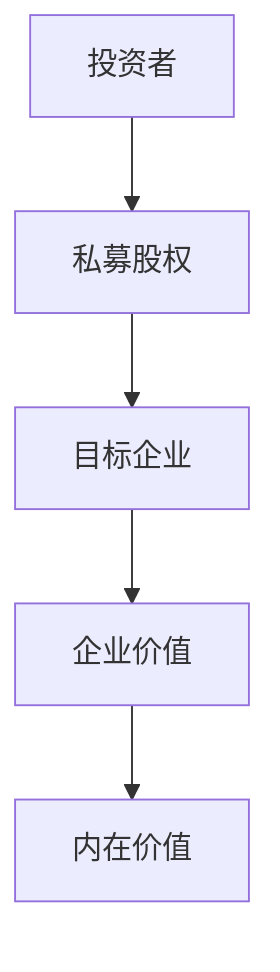
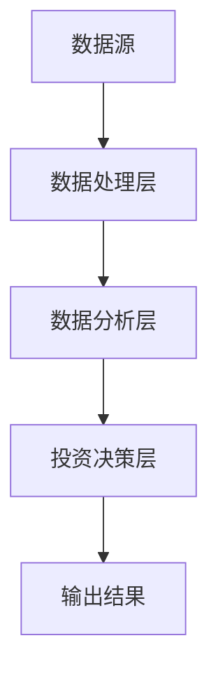

                 

<think>
好的，我需要按照用户的要求，逐步构建《价值投资在私募股权中的应用》的目录大纲。首先，明确文章的核心主题是价值投资在私募股权中的应用，涉及金融、投资策略和私募股权运作机制。

接下来，按照用户提供的目录结构，我需要细化每个章节的内容，确保逻辑清晰、结构紧凑。每个章节都需要涵盖背景介绍、核心原理、数学模型、系统分析和项目实战等内容，同时使用专业的技术语言和详细的解释。

在细化过程中，我需要确保每个部分都有足够的深度，包括数学公式的应用、mermaid图表的使用以及实际案例的分析。此外，还要考虑读者的理解能力，用通俗易懂的语言解释复杂的概念。

最后，确保文章结构完整，符合用户指定的格式和字数要求，同时在结尾加上作者信息。这样，整个思考过程就能系统地构建出一篇高质量的技术博客文章。
</think>

# 价值投资在私募股权中的应用

> 关键词：价值投资、私募股权、内在价值、DCF模型、投资策略

> 摘要：本文探讨了价值投资在私募股权中的应用，从价值投资的基本概念、私募股权的特点，到具体的数学模型和系统架构设计，结合实际案例进行详细分析。通过系统化的方法，本文揭示了如何在私募股权领域应用价值投资策略，并提供了一系列实用的投资决策工具和方法。

---

## 第1章: 价值投资的基本概念

### 1.1 价值投资的定义与核心理念

#### 1.1.1 价值投资的起源与发展

价值投资是一种以基本面分析为基础的投资策略，起源于20世纪初。其核心思想是寻找市场价格低于其内在价值的资产进行投资。本节将介绍价值投资的起源，探讨其发展历程及其在投资领域的地位。

#### 1.1.2 价值投资的核心原则

价值投资的核心原则包括关注企业的内在价值、安全边际、长期投资等。本节将详细阐述这些原则，并通过实例说明其在实际投资中的应用。

#### 1.1.3 价值投资与其它投资策略的对比

本节将对比价值投资与其他投资策略（如趋势投资、套利投资）的异同，分析其优缺点，帮助读者更好地理解价值投资的独特性。

---

### 1.2 私募股权的基本概念

#### 1.2.1 私募股权的定义与特点

私募股权是指通过非公开市场进行的投资，其特点包括高门槛、低流动性、高风险高收益等。本节将详细介绍私募股权的定义、运作模式及其与公开市场的区别。

#### 1.2.2 私募股权的运作模式

私募股权的运作模式包括资本募集、项目筛选、投资决策、投资后管理及退出机制等。本节将通过流程图的形式，展示私募股权的完整生命周期。

#### 1.2.3 私募股权的分类与应用场景

私募股权可以根据投资对象、投资阶段、投资策略等进行分类。本节将介绍主要的分类方法，并分析其在不同场景下的应用。

---

## 第2章: 价值投资在私募股权中的应用背景

### 2.1 私募股权市场的特点

#### 2.1.1 私募股权市场的参与者

私募股权市场的参与者包括有限合伙人（LP）、普通合伙人（GP）、目标企业等。本节将分析各类参与者的角色和职责。

#### 2.1.2 私募股权市场的风险与收益

私募股权市场具有高风险高收益的特点，本节将从市场波动、政策风险、流动性风险等方面分析其风险来源，并探讨如何通过价值投资策略降低风险。

#### 2.1.3 私募股权市场的周期性

私募股权市场的周期性与宏观经济环境密切相关。本节将分析市场的周期性变化，并探讨如何在周期波动中把握投资机会。

---

### 2.2 价值投资在私募股权中的可行性

#### 2.2.1 价值投资在私募股权中的优势

价值投资在私募股权中的优势包括注重基本面分析、强调安全边际、长期投资理念等。本节将详细阐述这些优势，并通过实例说明其在实际投资中的应用。

#### 2.2.2 价值投资在私募股权中的挑战

私募股权市场具有信息不对称、交易不透明、流动性低等特点，这些都为价值投资带来了挑战。本节将分析这些挑战，并探讨应对策略。

#### 2.2.3 价值投资在私募股权中的成功案例

本节将通过具体案例，展示价值投资在私募股权中的成功应用，分析其成功的原因和经验教训。

---

## 第3章: 价值投资的核心原理

### 3.1 价值投资的核心概念

#### 3.1.1 内在价值的计算公式

$$ V = \frac{CF}{r - g} $$

其中，\( V \) 为内在价值，\( CF \) 为现金流，\( r \) 为折现率，\( g \) 为增长率。

#### 3.1.2 内在价值的计算步骤

本节将详细讲解内在价值的计算步骤，包括确定现金流、选择合适的折现率、预测增长率等，并通过实例进行演示。

#### 3.1.3 安全边际的概念与作用

安全边际是价值投资中的一个重要概念，用于衡量市场价格与内在价值之间的差距。本节将详细阐述安全边际的作用，并通过实例说明其在投资决策中的应用。

---

### 3.2 价值投资的数学模型

#### 3.2.1 现金流折现模型（DCF模型）

本节将介绍现金流折现模型（DCF模型）的基本原理，并通过公式和实例进行详细讲解。

#### 3.2.2 市盈率与市净率分析

市盈率和市净率是常用的估值指标，本节将分析其在价值投资中的应用，并通过实例说明其局限性。

#### 3.2.3 股东权益分析

股东权益分析是评估企业价值的重要方法，本节将介绍其基本原理和应用，并通过实例进行详细讲解。

---

### 3.3 价值投资的实体关系图



---

## 第4章: 私募股权的价值评估与投资策略

### 4.1 私募股权的价值评估方法

#### 4.1.1 市场法

市场法是通过比较类似企业的交易价格来评估目标企业价值的方法。本节将介绍其基本原理和应用，并通过实例说明其局限性。

#### 4.1.2 收益法

收益法是通过预测未来现金流并进行折现来评估企业价值的方法。本节将详细介绍收益法的计算步骤，并通过实例进行演示。

#### 4.1.3 资产法

资产法是通过评估企业的资产净值来确定其价值的方法。本节将介绍其基本原理和应用，并通过实例说明其优缺点。

---

### 4.2 价值投资在私募股权中的策略

#### 4.2.1 买入并持有策略

买入并持有策略是价值投资的核心策略之一，本节将详细阐述其实施步骤，并通过实例说明其在私募股权中的应用。

#### 4.2.2 事件驱动策略

事件驱动策略是通过预测特定事件（如并购、重组）对企业价值的影响来获利的策略。本节将介绍其基本原理和应用，并通过实例说明其风险与收益。

#### 4.2.3 危机投资策略

危机投资策略是通过在市场危机时期寻找被低估的企业进行投资的策略。本节将详细阐述其实施步骤，并通过实例说明其在私募股权中的应用。

---

## 第5章: 价值投资在私募股权中的系统分析与架构设计

### 5.1 投资决策系统的构建

#### 5.1.1 数据收集模块

数据收集模块是投资决策系统的基础，本节将介绍数据来源、数据清洗和数据存储等关键步骤，并通过实例说明其在实际中的应用。

#### 5.1.2 数据分析模块

数据分析模块是投资决策系统的核心，本节将介绍数据分析方法、模型选择和结果可视化等关键步骤，并通过实例说明其在实际中的应用。

#### 5.1.3 投资决策模块

投资决策模块是投资决策系统的最终目标，本节将介绍决策规则、风险评估和投资组合优化等关键步骤，并通过实例说明其在实际中的应用。

---

### 5.2 系统架构设计



---

## 第6章: 项目实战与案例分析

### 6.1 项目环境配置

#### 6.1.1 Python环境的安装与配置

本节将详细介绍如何安装和配置Python环境，包括安装步骤、常用库的安装和环境变量的配置。

#### 6.1.2 数据分析工具的安装与配置

本节将介绍常用的数据分析工具，如Pandas、NumPy、Matplotlib等，并详细说明其安装和配置步骤。

---

### 6.2 核心代码实现

#### 6.2.1 内在价值计算代码

```python
def calculate_intrinsic_value(cash_flow, discount_rate, growth_rate):
    return cash_flow / (discount_rate - growth_rate)
```

#### 6.2.2 DCF模型实现

```python
def discounted_cash_flow(cash_flows, discount_rate):
    return sum(cf / (1 + discount_rate) ** i for i, cf in enumerate(cash_flows))
```

---

### 6.3 案例分析

#### 6.3.1 案例背景

本节将介绍一个具体的私募股权投资项目，包括项目背景、投资目标和投资策略。

#### 6.3.2 数据分析与结果解读

本节将详细分析项目的各项数据，包括现金流、折现率、增长率等，并解读分析结果。

#### 6.3.3 投资决策与结果评估

本节将基于分析结果，做出投资决策，并评估其潜在收益和风险。

---

## 第7章: 价值投资在私募股权中的未来展望

### 7.1 价值投资与技术创新

本节将探讨人工智能、大数据等技术在价值投资中的应用，分析其对未来私募股权投资的影响。

### 7.2 可持续投资与ESG因素

随着可持续发展理念的兴起，ESG（环境、社会、治理）因素在投资中的重要性日益增加。本节将探讨ESG因素如何影响价值投资策略，并分析其在私募股权中的应用前景。

---

## 作者：AI天才研究院/AI Genius Institute & 禅与计算机程序设计艺术/Zen And The Art of Computer Programming

