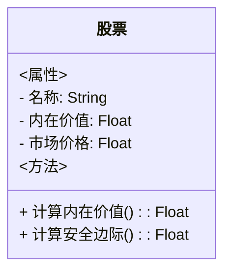
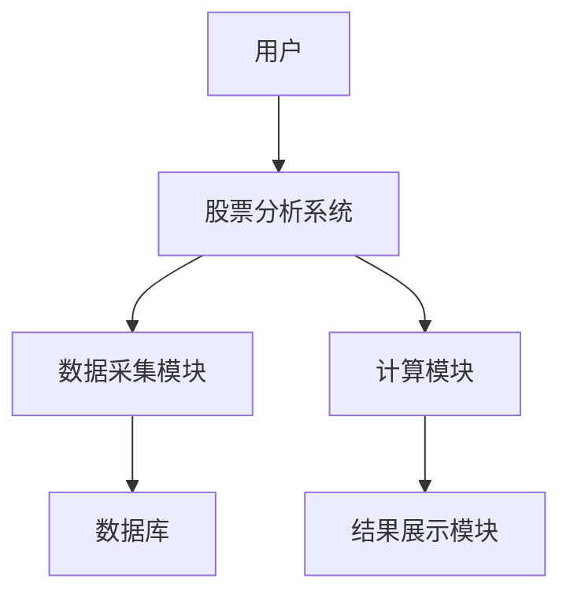
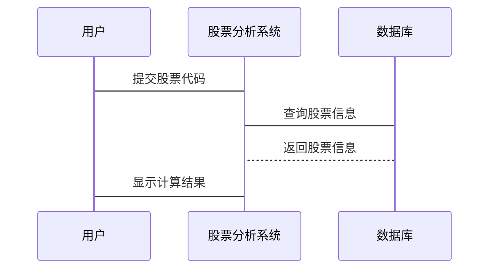

                 


# 价值投资的核心原则：安全边际理论

> **关键词**：价值投资，安全边际，内在价值，投资风险，安全边际量化  
> **摘要**：本文深入探讨了价值投资的核心原则之一——安全边际理论。通过分析其背景、核心概念、数学模型、系统架构设计以及实际案例，本文为读者提供了从理论到实践的全面解读，帮助投资者更好地理解和应用安全边际理论。

---

## 第1章: 价值投资与安全边际理论概述

### 1.1 价值投资的起源与发展

#### 1.1.1 价值投资的定义与核心理念
价值投资是一种以基本面分析为基础的投资策略，强调通过分析企业的财务状况、行业地位和竞争优势，寻找被市场低估的投资标的。其核心理念是“购买便宜的东西”，即以低于内在价值的价格买入优质资产。

#### 1.1.2 安全边际理论的提出与历史背景
安全边际理论由本杰明·格雷厄姆提出，是价值投资的重要组成部分。它强调在投资决策中留有安全空间，确保即使在市场波动或企业基本面变化的情况下，投资仍能实现正收益。这一理论的提出源于20世纪初美国股市的波动性和投资者的非理性行为。

#### 1.1.3 价值投资与安全边际理论的关系
价值投资的核心是寻找具有持续竞争优势的企业，而安全边际理论则为这一过程提供了风险控制的框架。通过在价格与内在价值之间留有安全边际，投资者能够降低市场波动带来的风险，同时提高投资的稳定性。

### 1.2 安全边际理论的核心概念

#### 1.2.1 安全边际的定义与属性
安全边际是指股票的市场价格与其内在价值之间的差额。当市场价格低于内在价值时，差额即为安全边际。安全边际越大，投资的安全性越高。

| 概念         | 定义与属性                                   |
|--------------|--------------------------------------------|
| 内在价值     | 股票的未来现金流的现值，反映企业的实际价值 |
| 市场价格     | 当前市场上的股票交易价格                   |
| 安全边际     | 内在价值与市场价格的差额，提供风险缓冲区   |

#### 1.2.2 安全边际与投资风险的关系
安全边际越大，投资者在面对市场波动时的抗风险能力越强。即使市场出现短期波动，安全边际也能为投资提供保护，避免过度损失。

#### 1.2.3 安全边际在价值投资中的作用
安全边际不仅是风险控制的工具，也是投资决策的重要依据。通过计算安全边际，投资者能够识别出具有长期竞争优势的企业，并以合理的价格买入。

### 1.3 安全边际理论的边界与外延

#### 1.3.1 安全边际的适用范围
安全边际理论主要适用于股票投资，尤其是那些具有稳定现金流和较强竞争优势的企业。对于高波动性资产或周期性较强的行业，安全边际的计算需要更加谨慎。

#### 1.3.2 安全边际与非安全边际投资的区别
非安全边际投资通常基于市场趋势、技术分析或短期消息，而安全边际投资则注重企业的基本面和长期价值。前者风险较高，后者注重稳健收益。

#### 1.3.3 安全边际理论的局限性
尽管安全边际理论提供了风险控制的框架，但它并非万能的。市场波动、企业基本面变化以及投资者情绪都可能影响安全边际的有效性。

### 1.4 价值投资的核心要素组成

#### 1.4.1 股票的内在价值计算
内在价值是基于企业未来现金流的折现值计算得出的。公式如下：
$$ V = \frac{CF}{(1 + r)^n} $$
其中，\( CF \) 是未来现金流，\( r \) 是折现率，\( n \) 是时间跨度。

#### 1.4.2 安全边际的量化方法
安全边际可以通过比较市场价格与内在价值的差额来量化。当市场价格低于内在价值时，差额即为安全边际。

#### 1.4.3 投资者心理与行为的影响
投资者的心理和行为对安全边际的影响不可忽视。非理性行为可能导致市场价格偏离内在价值，从而影响安全边际的计算。

### 1.5 本章小结
本章介绍了价值投资和安全边际理论的起源与发展，强调了安全边际在投资中的重要性。通过定义和属性的对比，读者能够更好地理解安全边际的核心概念及其在投资决策中的应用。

---

## 第2章: 安全边际理论的核心概念与联系

### 2.1 安全边际理论的原理

#### 2.1.1 安全边际的计算公式
安全边际的计算公式如下：
$$ \text{安全边际} = \text{内在价值} - \text{市场价格} $$

#### 2.1.2 内在价值与市场价的比较
通过比较内在价值和市场价格，投资者可以判断是否存在安全边际。如果市场价格低于内在价值，则存在正的安全边际。

#### 2.1.3 安全边际的动态调整
安全边际并非一成不变，需要根据企业基本面和市场变化进行动态调整。例如，当企业盈利增长时，内在价值上升，安全边际也随之变化。

### 2.2 核心概念属性对比表格

| 概念         | 属性1 | 属性2 | 属性3 |
|--------------|-------|-------|-------|
| 内在价值     | 计算方法 | 时间因素 | 风险因素 |
| 市场价格     | 反应速度 | 市场情绪 | 市场波动 |

### 2.3 ER实体关系图

```mermaid
er
actor: 投资者
actor --> entity: 股票
entity --> entity: 内在价值
entity --> entity: 市场价格
```

### 2.4 本章小结
本章通过公式、表格和图表的方式，详细解释了安全边际理论的原理及其核心概念。读者可以通过这些工具更好地理解安全边际的计算和应用。

---

## 第3章: 安全边际理论的数学模型与公式

### 3.1 内在价值的计算公式

$$ V = \frac{CF}{(1 + r)^n} $$

其中，\( CF \) 是未来现金流，\( r \) 是折现率，\( n \) 是时间跨度。

#### 3.1.1 例子说明
假设某企业未来5年的现金流分别为100、120、140、160、180万元，折现率为10%。则内在价值为：
$$ V = \frac{100}{(1 + 0.1)^1} + \frac{120}{(1 + 0.1)^2} + \frac{140}{(1 + 0.1)^3} + \frac{160}{(1 + 0.1)^4} + \frac{180}{(1 + 0.1)^5} $$

计算结果约为500万元。

### 3.2 安全边际的计算公式

$$ \text{安全边际} = V - P $$

其中，\( V \) 是内在价值，\( P \) 是市场价格。

#### 3.2.1 例子说明
假设某股票的内在价值为10元，市场价格为8元，则安全边际为2元。

### 3.3 本章小结
本章通过数学公式和实例分析，详细解释了内在价值和安全边际的计算方法。这些公式为投资者提供了科学的决策依据。

---

## 第4章: 系统分析与架构设计方案

### 4.1 问题场景介绍
本章以一个股票投资分析系统为例，探讨如何通过系统架构设计来实现安全边际理论的应用。

### 4.2 系统功能设计

#### 4.2.1 领域模型类图


#### 4.2.2 系统架构设计


### 4.3 系统接口设计
系统接口包括数据输入、计算和结果展示三个部分。数据输入模块负责获取股票的基本信息，计算模块基于内在价值公式进行计算，结果展示模块以图表形式呈现安全边际。

### 4.4 系统交互序列图


### 4.5 本章小结
本章通过系统架构设计和交互流程图，展示了如何将安全边际理论应用于实际投资分析中。

---

## 第5章: 项目实战

### 5.1 环境安装
需要安装Python编程环境，包括numpy和pandas库。

### 5.2 核心源代码实现

#### 5.2.1 计算内在价值的Python代码
```python
def calculate_intrinsic_value(cash_flows, discount_rate):
    return sum(cf / (1 + discount_rate)**i for i, cf in enumerate(cash_flows))
```

#### 5.2.2 计算安全边际的代码
```python
def calculate_margin_of_safety(intrinsic_value, market_price):
    return intrinsic_value - market_price
```

### 5.3 代码应用解读与分析
通过上述代码，投资者可以计算出股票的内在价值和安全边际，从而做出投资决策。

### 5.4 实际案例分析
以某股票为例，假设其未来现金流为[100, 120, 140, 160, 180]万元，折现率为10%，市场价格为8元。计算得出内在价值为10元，安全边际为2元，建议买入。

### 5.5 本章小结
本章通过实际案例分析，展示了如何将安全边际理论应用于实际投资决策中。

---

## 第6章: 最佳实践、小结与注意事项

### 6.1 本章小结
本文详细探讨了价值投资的核心原则——安全边际理论，从理论到实践，为投资者提供了全面的指导。

### 6.2 投资中的注意事项
- 安全边际不是绝对的保障，需结合市场环境和企业基本面。
- 长期投资比短期投机更有利于安全边际的应用。
- 避免过度依赖数学模型，关注企业的实际运营状况。

### 6.3 拓展阅读
推荐阅读本杰明·格雷厄姆的《证券分析》和《聪明的投资者》，深入理解安全边际理论的精髓。

---

## 作者

作者：AI天才研究院/AI Genius Institute & 禅与计算机程序设计艺术 /Zen And The Art of Computer Programming

