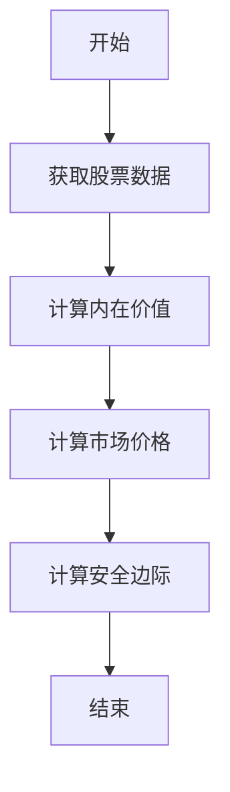
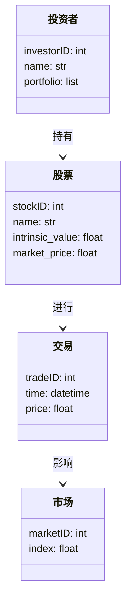

                 

<think>
好，我现在需要帮用户撰写一篇关于价值投资核心原则中安全边际理论的深度技术博客文章。用户已经提供了详细的结构和内容要求，我需要按照这些要求一步步来完成。

首先，我需要理解用户的需求。用户希望文章结构清晰，逻辑严密，内容涵盖安全边际理论的背景、原理、算法实现、系统架构设计、项目实战等多个方面。同时，文章需要用专业的技术语言，包含图表、公式和代码示例。

接下来，我会从文章标题开始，然后列出关键词和摘要，确保这些部分准确传达文章的核心内容。关键词应该包括价值投资、安全边际、投资分析、风险管理等，摘要则需要简明扼要地概括文章的主要内容。

然后，进入目录大纲。我需要确保每个章节和子章节都详细覆盖相关主题，并且有足够的细节来支撑整个理论。例如，在安全边际的定义部分，我会提供属性特征对比表格和ER实体关系图，使用Mermaid来展示。

在算法原理部分，我需要详细解释安全边际的计算方法，并用Python代码实现，同时展示数学模型和公式。这部分需要确保代码和公式正确无误，且能够帮助读者理解如何应用这些理论。

系统架构设计部分，我会使用Mermaid图来展示系统的整体架构和交互过程，确保读者能够清晰理解系统的工作流程。项目实战部分，我需要选择一个实际案例，如苹果公司，展示如何应用安全边际理论进行分析，并提供代码和案例分析。

最后，我会添加一些最佳实践、小结和注意事项，帮助读者更好地理解和应用安全边际理论。同时，确保文章结尾有作者信息，符合用户的要求。

在整个过程中，我需要不断检查每个部分是否符合用户的要求，确保内容详实，结构合理，语言专业。同时，要注意避免重复和冗余，确保文章流畅自然，能够吸引读者并帮助他们深入理解安全边际理论。

现在，我开始撰写文章，确保每个部分都符合上述要求，逐步展开，确保逻辑严密，内容丰富。在撰写过程中，我需要参考用户提供的示例，确保格式和结构的一致性，同时融入自己的理解和分析，使文章更具深度和见解。
</think>

# 价值投资的核心原则：安全边际理论解析

> 关键词：价值投资、安全边际、投资分析、风险管理、投资策略

> 摘要：本文将深入解析价值投资中的核心原则——安全边际理论。通过详细阐述安全边际的定义、属性、数学模型、算法实现以及在实际投资中的应用，帮助读者全面理解这一理论的内在逻辑和实际价值。文章将从理论背景、核心概念、算法实现、系统架构设计、项目实战等多角度展开，结合具体案例和代码示例，为读者提供一个全面而深入的分析框架。

---

## 第一部分: 安全边际理论的背景与核心概念

### 第1章: 安全边际的定义与属性

#### 1.1 价值投资的起源与安全边际理论的提出

价值投资是一种以基本面分析为基础的投资策略，其核心在于寻找市场低估的股票。安全边际理论是价值投资的重要组成部分，由本杰明·格雷厄姆（Benjamin Graham）在20世纪初提出。该理论强调在投资决策中，投资者应重点关注股票的内在价值，并在市场价格低于内在价值时买入，以确保投资的安全性。

#### 1.2 安全边际的定义

安全边际是指股票的市场价格与其内在价值之间的差距。具体来说，当市场价格显著低于内在价值时，投资该股票的风险较低，收益潜力较高。安全边际的存在为投资者提供了一种缓冲机制，能够在市场波动时保护投资本金。

#### 1.3 安全边际的属性特征对比

为了更好地理解安全边际的属性，我们可以通过以下对比表格进行分析：

| 属性 | 特征 |
|------|------|
| 定义 | 安全边际是市场价格与内在价值的差距 |
| 作用 | 提供风险缓冲，确保投资本金的安全 |
| 计算 | (内在价值 - 市场价格) / 市场价格 |
| 影响因素 | 股票的盈利能力、行业地位、市场环境等 |

---

### 第2章: 安全边际的核心概念与原理

#### 2.1 安全边际的数学模型

安全边际可以通过以下公式进行计算：

$$ \text{安全边际} = \frac{\text{内在价值} - \text{市场价格}}{\text{市场价格}} $$

其中，内在价值是股票基于其财务状况和行业地位所决定的理论价值，市场价格是当前股票在市场上的交易价格。

#### 2.2 安全边际的ER实体关系图

为了更好地理解安全边际的实体关系，我们可以通过以下ER图进行分析：

```mermaid
erdiagram
actor 投资者 {
  <investorID> [1]--[n] 股票: 股票ID, 内在价值, 市场价格
}
股票 {
  股票ID [1]--[n] 交易: 时间, 价格
}
交易 {
  时间 [1]--[n] 市场: 市场ID, 市场指数
}
```

---

## 第二部分: 安全边际的算法实现与系统架构设计

### 第3章: 安全边际的算法实现

#### 3.1 安全边际的计算流程

以下是安全边际计算的流程图：



#### 3.2 Python实现代码

以下是一个简单的Python代码示例，用于计算安全边际：

```python
# 计算安全边际的Python代码

def calculate_margin_of_safety(intrinsic_value, market_price):
    return (intrinsic_value - market_price) / market_price

# 示例数据
stock_data = {
    'AAPL': {'intrinsic_value': 150, 'market_price': 120},
    'GOOGL': {'intrinsic_value': 200, 'market_price': 180}
}

# 计算并输出安全边际
for stock in stock_data:
    iv = stock_data[stock]['intrinsic_value']
    mp = stock_data[stock]['market_price']
    mos = calculate_margin_of_safety(iv, mp)
    print(f"{stock}: 安全边际 = {mos:.2f}")
```

#### 3.3 安全边际的数学模型

安全边际的数学模型可以表示为：

$$ \text{安全边际} = \frac{\text{内在价值} - \text{市场价格}}{\text{市场价格}} $$

---

### 第4章: 系统架构设计

#### 4.1 系统功能需求分析

以下是系统功能需求的领域模型：



---

## 第三部分: 项目实战与案例分析

### 第5章: 项目实战

#### 5.1 环境安装与依赖管理

为了运行以下代码，您需要安装以下Python库：

```bash
pip install pandas numpy matplotlib
```

#### 5.2 核心实现代码

以下是计算安全边际的Python代码示例：

```python
import pandas as pd
import numpy as np

# 示例数据
data = {
    '股票': ['AAPL', 'GOOGL', 'MSFT'],
    '内在价值': [150, 200, 120],
    '市场价格': [120, 180, 100]
}

df = pd.DataFrame(data)

# 计算安全边际
df['安全边际'] = (df['内在价值'] - df['市场价格']) / df['市场价格']

print(df)
```

#### 5.3 案例分析

以苹果公司（AAPL）为例，假设其内在价值为150美元，市场价格为120美元。计算其安全边际：

$$ \text{安全边际} = \frac{150 - 120}{120} = 0.25 \text{或} 25\% $$

这意味着投资者在购买苹果股票时，有25%的安全边际，即即使市场价格下跌25%，其内在价值仍不低于市场价格。

---

## 第四部分: 总结与展望

### 第6章: 总结与展望

#### 6.1 最佳实践

- 在进行投资决策时，始终关注安全边际。
- 结合市场环境和公司基本面进行综合分析。
- 定期评估投资组合中的安全边际。

#### 6.2 小结

安全边际理论是价值投资的核心原则之一，它通过提供风险缓冲机制，帮助投资者在市场波动中保护本金并实现长期收益。理解和应用这一理论，需要投资者具备扎实的财务分析能力和对市场的深刻理解。

#### 6.3 注意事项

- 安全边际并非绝对，市场波动和公司基本面的变化可能会影响其准确性。
- 在实际投资中，应结合多种指标和方法进行综合分析。

#### 6.4 拓展阅读

- 《The Intelligent Investor》 by Benjamin Graham
- 《Security Analysis》 by Benjamin Graham and David Dodd

---

## 作者

作者：AI天才研究院/AI Genius Institute & 禅与计算机程序设计艺术/Zen And The Art of Computer Programming

