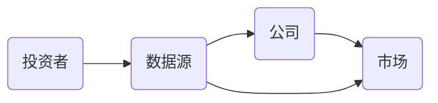
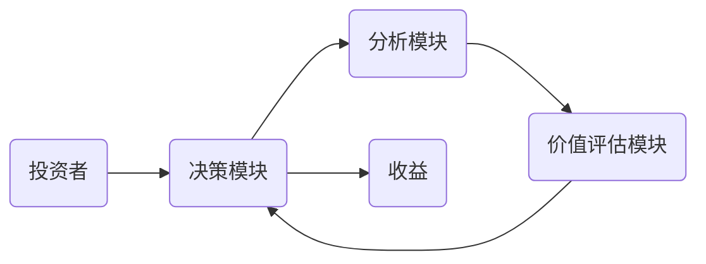

                 

<think>
嗯，用户让我写一篇关于价值投资核心原理的技术博客文章。看起来他想详细地分析价值投资的各个方面，从背景到数学模型，再到系统架构。我需要先理清文章的结构，确保每个部分都涵盖必要的内容。

首先，用户已经给出了一个详细的目录大纲，分为四个主要部分，每个部分下有多个章节和小节。我需要按照这个结构来展开每个部分的内容。从第一部分开始，介绍价值投资的背景和核心概念，接着是数学模型，然后是系统分析，最后是项目实战和总结。

在写背景部分的时候，我需要解释价值投资的起源，比如本杰明·格雷厄姆的贡献，以及它在现代金融中的应用。接着，定义内在价值和市场价值，解释它们之间的关系，以及安全边际的重要性。

接下来是数学模型部分，现金流折现模型和市盈率、市净率分析是关键。我需要给出公式，并用具体的例子来说明如何计算内在价值和安全边际。例如，用现金流折现模型计算某公司的内在价值，并解释结果。

系统分析部分，我需要设计一个投资流程图，展示从投资者到决策的整个过程。同时，用ER图来展示投资者、公司和市场之间的关系。这部分可能需要用mermaid图来表示，确保结构清晰。

项目实战部分，我需要选择一个具体的案例，比如评估某公司是否值得投资。通过分析财务报表和市场数据，计算内在价值和安全边际，最后得出结论。这个案例需要详细，让读者能够理解如何应用理论。

最后，总结部分要回顾整个文章的内容，强调价值投资的核心原则和注意事项。同时，给出一些最佳实践的建议，帮助读者在实际操作中应用这些理论。

整个过程中，我需要确保语言简洁明了，逻辑清晰，每个部分都有足够的细节和例子。特别是数学公式和图表的使用，要准确无误，帮助读者更好地理解价值投资的原理。

总的来说，我需要一步步地按照用户提供的大纲，详细展开每个部分，确保内容全面且易于理解。同时，注意文章的结构和格式，符合用户的要求，让整篇文章既有深度又易于阅读。
</think>

# 价值投资的核心原理解析

> 关键词：价值投资、内在价值、安全边际、财务分析、投资策略、风险管理

> 摘要：价值投资是一种长期有效的投资策略，其核心在于寻找市场价格低于内在价值的优质资产。本文通过系统分析价值投资的核心原理，包括内在价值计算、安全边际分析、投资策略制定、风险管理与监控等方面，结合实际案例，为投资者提供深度的理论支持和实践指导。

---

## 第一部分: 价值投资的核心概念与背景

### 第1章: 价值投资的背景与定义

#### 1.1 价值投资的起源与演变
价值投资理论起源于20世纪初，由本杰明·格雷厄姆和戴维·多德共同提出。格雷厄姆是一位著名的投资家和教育家，他将价值投资的理念系统化，并通过大量实践验证了其有效性。多德则进一步发展了这一理论，强调了长期投资和对公司基本面的深入研究。

#### 1.2 价值投资的核心定义
价值投资是一种以低于内在价值的价格买入优质资产的投资策略。其核心在于识别市场价格与内在价值之间的差异，并通过长期持有优质资产来实现收益。与短期交易策略不同，价值投资强调的是对公司基本面的深入分析和长期持有的理念。

#### 1.3 价值投资的适用场景与边界
价值投资适用于那些市场定价效率较低的资产，尤其是股票和房地产等复杂资产。然而，其也存在一定的边界，例如在市场高度波动或公司基本面恶化的情况下，价值投资可能面临较大的风险。

---

### 第2章: 价值投资的核心概念与联系

#### 2.1 内在价值的定义与计算
内在价值是指一家公司基于其未来现金流的现值。计算内在价值的关键在于对未来现金流的预测和折现率的确定。公式如下：

$$ V = \sum_{t=1}^{n} \frac{CF_t}{(1 + r)^t} $$

其中，$CF_t$ 是第 $t$ 年的现金流，$r$ 是折现率，$n$ 是预测的年数。

#### 2.2 市场价值与内在价值的关系
市场价格与内在价值之间的差异是价值投资的核心机会来源。当市场价格低于内在价值时，投资该资产具有较高的安全边际。

#### 2.3 安全边际的理论与应用
安全边际是市场价格与内在价值之间的差额，用于衡量投资的安全程度。公式如下：

$$ \text{安全边际} = \text{内在价值} - \text{市场价格} $$

安全边际越大，投资风险越小，收益潜力越大。

---

### 第3章: 价值投资的数学模型与公式

#### 3.1 现金流折现模型
现金流折现模型（DCF）是计算内在价值的核心工具。以下是一个简单的DCF模型示例：

$$ V = \frac{CF_1}{(1 + r)^1} + \frac{CF_2}{(1 + r)^2} + \cdots + \frac{CF_n}{(1 + r)^n} $$

#### 3.2 市盈率与市净率分析
市盈率（P/E）和市净率（P/B）是常用的估值指标，公式如下：

$$ P/E = \frac{P}{E} $$
$$ P/B = \frac{P}{B} $$

其中，$P$ 是股价，$E$ 是每股收益，$B$ 是每股净资产。

#### 3.3 举例说明
以某公司为例，假设其未来五年的现金流分别为100、120、140、160、180万元，折现率为5%。计算其内在价值：

$$ V = \frac{100}{1.05^1} + \frac{120}{1.05^2} + \frac{140}{1.05^3} + \frac{160}{1.05^4} + \frac{180}{1.05^5} \approx 469.23 \text{万元} $$

---

## 第4章: 价值投资的系统分析与架构设计

### 4.1 投资流程图
以下是一个典型的价值投资流程图：


### 4.2 系统架构设计
以下是一个价值投资系统的架构图：



### 4.3 系统交互图
以下是一个典型的投资决策流程：



---

## 第5章: 价值投资的项目实战

### 5.1 环境安装与数据准备
在进行价值投资分析之前，需要准备以下环境和数据：
- 数据来源：财务报表、市场数据等。
- 工具：Excel、Python（Pandas、NumPy等）。

### 5.2 核心实现代码
以下是一个简单的内在价值计算代码示例：

```python
import numpy as np

def calculate_intrinsic_value(cash_flows, discount_rate):
    return np.npv(discount_rate, cash_flows)

# 示例数据
cash_flows = [100, 120, 140, 160, 180]
discount_rate = 0.05

intrinsic_value = calculate_intrinsic_value(cash_flows, discount_rate)
print(f"内在价值: {intrinsic_value}")
```

### 5.3 案例分析与解读
以某公司为例，假设其未来五年的现金流分别为100、120、140、160、180万元，折现率为5%。计算其内在价值：

$$ V = \frac{100}{1.05^1} + \frac{120}{1.05^2} + \frac{140}{1.05^3} + \frac{160}{1.05^4} + \frac{180}{1.05^5} \approx 469.23 \text{万元} $$

如果当前市场价格为400万元，则安全边际为：

$$ \text{安全边际} = 469.23 - 400 = 69.23 \text{万元} $$

---

## 第6章: 价值投资的总结与展望

### 6.1 最佳实践
- **深入研究公司基本面**：了解公司的财务状况、行业地位和竞争优势。
- **长期持有优质资产**：避免频繁交易，降低交易成本。
- **保持安全边际**：确保买入价格低于内在价值。

### 6.2 小结
价值投资是一种长期有效的投资策略，其核心在于识别市场价格与内在价值之间的差异，并通过长期持有优质资产实现收益。本文通过系统分析价值投资的核心原理，结合实际案例，为投资者提供了理论支持和实践指导。

### 6.3 注意事项
- **风险控制**：在市场波动较大的情况下，需注意风险管理。
- **持续学习**：市场环境不断变化，需持续学习和调整投资策略。

### 6.4 拓展阅读
- 格雷厄姆的《证券分析》
- 巴菲特的《巴菲特致股东的信》
- 《投资之道》等经典投资著作

---

# 作者：AI天才研究院/AI Genius Institute & 禅与计算机程序设计艺术 /Zen And The Art of Computer Programming

