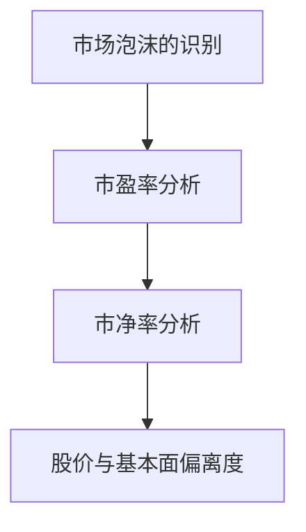
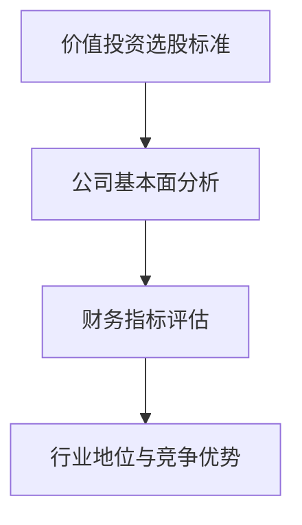

                 

# 价值投资者如何应对市场泡沫

> 关键词：价值投资，市场泡沫，风险管理，安全边际，投资策略，长期投资

> 摘要：本文探讨了价值投资者在市场泡沫中的应对策略，分析了泡沫的形成、识别方法及对投资者的影响，提出了基于基本面分析、安全边际和长期投资的价值投资策略，并结合风险管理措施，帮助投资者在泡沫时期稳健投资。

---

# 第一部分：价值投资与市场泡沫的背景介绍

## 第1章：市场泡沫的定义与特征

### 1.1 市场泡沫的定义

市场泡沫是指资产价格在短时间内迅速上涨，远远超出其内在价值的现象。泡沫的形成通常与市场情绪、资金过度流入和投机行为有关。泡沫的特征包括价格与价值的严重脱节、交易量激增以及市场参与者情绪的极度乐观。

- **1.1.1 什么是市场泡沫**
  - 市场泡沫是一种非理性现象，通常由过度投机引发。
  - 泡沫的本质是价格与价值的严重偏离。

- **1.1.2 市场泡沫的形成机制**
  - 投资者情绪的波动是泡沫形成的关键因素。
  - 资金的快速流入和市场的过度炒作推动了泡沫的形成。

- **1.1.3 市场泡沫的周期性特征**
  - 泡沫的形成通常经历四个阶段：积累、膨胀、破裂和复苏。
  - 每个阶段都有其独特的市场特征和投资者行为。

### 1.2 历史上的市场泡沫案例

- **1.2.1 荷兰郁金香泡沫**
  - 17世纪荷兰郁金香狂热是历史上第一个被记录的市场泡沫。
  - 郁金香球茎的价格在短时间内暴涨，随后迅速下跌，导致投资者的巨大损失。

- **1.2.2 1929年美国股市大崩盘**
  - 1929年的股市崩盘导致全球经济大萧条。
  - 泡沫期间，投资者盲目追涨，忽视了股票的真实价值。

- **1.2.3 2000年互联网泡沫**
  - 互联网泡沫的破裂导致许多科技公司市值蒸发。
  - 泡沫期间，市场过度炒作互联网公司的未来潜力，忽视了公司的实际盈利能力。

- **1.2.4 2008年全球金融危机**
  - 2008年的金融危机源于次级抵押贷款市场的泡沫。
  - 泡沫破裂导致全球经济衰退，投资者损失惨重。

### 1.3 市场泡沫对投资者的影响

- **1.3.1 泡沫时期的市场特征**
  - 股价与基本面脱节，市场情绪极度乐观。
  - 投资者行为趋于投机，风险偏好上升。

- **1.3.2 泡沫对价值投资者的挑战**
  - 价值投资者在泡沫时期面临市场的短期非理性波动。
  - 高估值的资产可能掩盖其真实价值，增加投资风险。

- **1.3.3 泡沫破裂对投资者的冲击**
  - 泡沫破裂通常伴随着资产价格的大幅下跌。
  - 投资者可能面临本金损失，投资组合价值大幅缩水。

### 1.4 价值投资的核心理念

- **1.4.1 价值投资的定义**
  - 价值投资是一种以基本面分析为基础的投资策略。
  - 投资者寻找市场价格低于内在价值的资产进行投资。

- **1.4.2 价值投资的基本原则**
  - 买入被市场低估的资产。
  - 长期持有，等待价值回归。

- **1.4.3 价值投资与市场泡沫的关系**
  - 泡沫时期，价值投资者需要坚持基本面分析，避免被市场情绪误导。
  - 泡沫破裂后，价值投资者能够以更低的价格买入优质资产，实现长期收益。

---

## 第2章：市场泡沫的识别与分析

### 2.1 市场泡沫的识别指标

- **2.1.1 市盈率分析**
  - 市盈率（P/E）是市场价格与每股收益的比率。
  - 高市盈率可能表明市场泡沫，但需结合行业和市场环境分析。

- **2.1.2 市净率分析**
  - 市净率（P/B）是市场价格与每股净资产的比率。
  - 高市净率可能表明资产被高估，但需结合行业特性分析。

- **2.1.3 股价与基本面的偏离度**
  - 通过对比股价与公司收入、利润等基本面指标的变化，判断价格是否偏离。

### 2.2 市场情绪的分析

- **2.2.1 投资者情绪的波动性**
  - 投资者情绪通常呈现周期性波动，影响市场价格。
  - 在泡沫时期，市场情绪极度乐观，可能导致价格虚高。

- **2.2.2 市场情绪与泡沫的关系**
  - 市场情绪是泡沫形成的重要推动力。
  - 投资者情绪的过度乐观可能导致市场泡沫的产生和扩大。

- **2.2.3 如何利用情绪指标判断市场泡沫**
  - 通过投资者情绪指数（如恐慌指数、贪婪指数）判断市场情绪。
  - 结合市场情绪与价格走势，分析泡沫的可能性。

### 2.3 历史案例分析

- **2.3.1 互联网泡沫时期的指标分析**
  - 互联网泡沫期间，市盈率和市净率普遍偏高。
  - 股价与公司收入增长不匹配，表明市场泡沫的存在。

- **2.3.2 2008年金融危机前的市场信号**
  - 房地产市场的高市盈率和市净率预示着泡沫的存在。
  - 投资者情绪的过度乐观和杠杆的过度使用加剧了泡沫的风险。

---

## 第3章：价值投资策略的核心要素

### 3.1 价值投资的选股标准

- **3.1.1 公司基本面分析**
  - 重点分析公司的收入、利润、资产负债表等基本面指标。
  - 寻找具有稳定盈利能力和良好财务状况的公司。

- **3.1.2 财务指标的评估**
  - 评估市盈率、市净率、股息率等指标，判断资产的内在价值。
  - 重点关注ROE（净资产收益率）和ROA（资产回报率）等关键指标。

- **3.1.3 行业地位与竞争优势**
  - 选择行业地位稳固、竞争优势明显的公司。
  - 分析公司的市场占有率、品牌影响力和创新能力。

### 3.2 安全边际的概念

- **3.2.1 安全边际的定义**
  - 安全边际是指市场价格低于资产内在价值的部分。
  - 通过购买价格与内在价值的差额，确保投资的安全性。

- **3.2.2 安全边际的计算方法**
  - 计算资产的内在价值，减去市场价格，得到安全边际。
  - 通常以百分比形式表示，安全边际越大，投资风险越小。

- **3.2.3 安全边际在泡沫时期的运用**
  - 在泡沫时期，寻找具有较大安全边际的资产。
  - 通过安全边际的分析，避免购买高估值的资产。

### 3.3 长期投资与价值回归

- **3.3.1 长期投资的逻辑**
  - 长期投资能够穿越市场的短期波动，实现价值回归。
  - 避免短期市场的非理性波动，专注于企业的长期价值。

- **3.3.2 价值回归的理论基础**
  - 市场价格最终会回归资产的内在价值。
  - 泡沫破裂后，资产价格将重新调整，回归其真实价值。

- **3.3.3 泡沫破裂后的价值修复**
  - 在泡沫破裂后，优质资产的价格可能被低估，为价值投资者提供买入机会。
  - 通过长期持有，投资者能够获得资产价值的回升带来的收益。

---

## 第4章：市场泡沫中的风险管理

### 4.1 风险管理的重要性

- **4.1.1 风险管理的定义**
  - 风险管理是指识别、评估和控制投资风险的过程。
  - 在市场泡沫中，风险管理尤为重要，以保护投资组合的价值。

- **4.1.2 风险管理在投资中的作用**
  - 风险管理能够帮助投资者降低投资组合的波动性。
  - 在市场泡沫中，风险管理能够帮助投资者避免重大损失。

- **4.1.3 泡沫时期的特殊风险管理需求**
  - 在泡沫时期，市场波动剧烈，风险管理需求增加。
  - 投资者需要更加谨慎地评估投资风险，制定有效的风险管理策略。

### 4.2 泡沫时期的风险评估

- **4.2.1 个人风险承受能力评估**
  - 评估自身的风险承受能力，制定适合自己的投资策略。
  - 在泡沫时期，风险承受能力较低的投资者需要更加谨慎。

- **4.2.2 投资组合的风险分析**
  - 分析投资组合的整体风险，包括市场风险、流动性风险等。
  - 在泡沫时期，投资组合的波动性可能增加，需要进行风险评估和调整。

- **4.2.3 市场波动对投资组合的影响**
  - 市场波动可能对投资组合的价值产生重大影响。
  - 需要通过分散投资、调整仓位等方法，降低市场波动的影响。

### 4.3 风险控制的具体措施

- **4.3.1 分散投资策略**
  - 通过分散投资，降低投资组合的整体风险。
  - 在泡沫时期，分散投资能够帮助投资者避免单一资产的大幅波动。

- **4.3.2 仓位控制**
  - 根据市场情况，调整投资仓位。
  - 在泡沫时期，适当降低仓位，减少投资组合的波动性。

- **4.3.3 投资组合再平衡**
  - 定期对投资组合进行再平衡，保持资产配置的合理性。
  - 在泡沫时期，再平衡能够帮助投资者减少风险，抓住价值投资机会。

---

# 小结

价值投资者在面对市场泡沫时，需要坚持基本面分析，寻找被市场低估的优质资产。同时，合理控制投资风险，避免被市场情绪误导。通过长期投资和价值投资策略，能够在市场泡沫中保持稳健的投资回报。投资者需要不断学习和调整策略，以应对不断变化的市场环境。

作者：AI天才研究院/AI Genius Institute & 禅与计算机程序设计艺术 /Zen And The Art of Computer Programming

