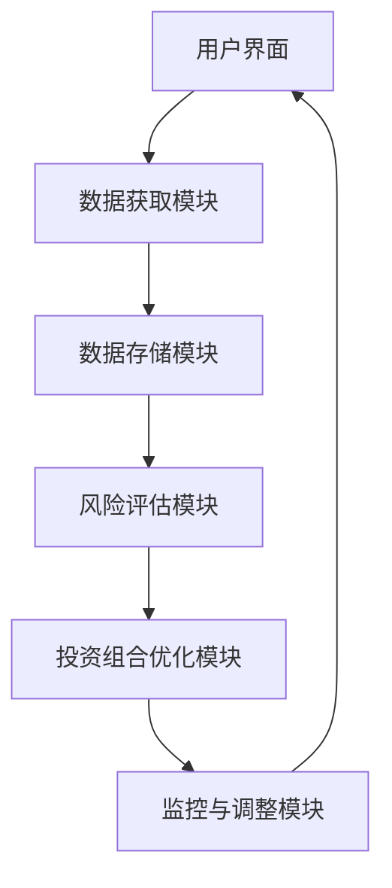

                 

<think>
好的，我需要根据用户的要求，撰写一篇关于《价值投资者的风险管理：如何在追求收益的同时控制风险》的技术博客文章。文章需要结构清晰，内容详实，并且涵盖背景介绍、核心概念、算法原理、系统分析、项目实战和最佳实践等多个方面。

首先，我会先理解用户的需求。用户希望文章能够吸引读者，逻辑清晰，结构紧凑，使用专业的技术语言，同时结合逐步分析和推理的方式。因此，我需要确保文章的每一部分都详细且有条理。

接下来，我会根据目录大纲，逐步填充每个部分的内容。首先是摘要，简明扼要地概括文章的核心内容。然后是关键词，列出文章的核心概念，以便读者快速理解主题。

在正文部分，我会按照目录的结构，逐步展开每个章节的内容。引言部分需要介绍投资的背景、重要性以及风险管理的必要性。接下来，我会详细讲解价值投资的基本概念，包括其定义、历史和核心原则。然后，我会分析风险管理的重要性，涵盖风险的类型及其对投资组合的影响。

在风险管理策略部分，我会讨论分散投资、止损策略、组合优化等具体方法。同时，结合实际案例，如巴菲特的投资策略，来说明这些策略的实际应用。数学模型部分，我会介绍CAPM和马科维茨的有效前沿理论，并通过公式和图表来解释其原理。

系统架构部分，我会设计一个投资管理系统，使用类图和序列图来展示系统的各个模块及其交互。项目实战部分，我会编写Python代码，实现风险评估和投资组合优化，并通过代码注释和分析来说明其实现细节。

最后，在总结与展望部分，我会回顾文章的主要内容，并给出未来的投资趋势和风险管理的建议。同时，我会提醒读者注意心理因素和市场变化的影响，以全面管理投资风险。

在写作过程中，我需要确保每个部分都详细且有条理，使用适当的数学公式和图表来增强内容的理解性。同时，保持语言的专业性和技术性，以满足目标读者的需求。

现在，我将开始按照上述思路撰写文章，确保每一部分都符合用户的要求，并且内容丰富具体，逻辑清晰。
</think>

# 价值投资者的风险管理：如何在追求收益的同时控制风险

---

## 关键词：风险管理, 价值投资, 投资组合, 风险评估, 系统化方法

---

## 摘要：  
本文深入探讨了价值投资者在追求收益的同时如何有效管理风险。文章从价值投资的基本概念出发，分析了风险管理的重要性，并结合实际案例和数学模型，提出了系统化的风险管理策略。通过详细讲解投资组合优化、风险评估算法以及系统架构设计，本文为价值投资者提供了实用的工具和方法，帮助他们在复杂多变的市场环境中实现长期稳健的投资回报。

---

## 第一部分：引言

### 第1章：引言
#### 1.1 投资的背景与重要性
投资在现代经济中扮演着至关重要的角色，它不仅是个人财富增长的重要手段，也是企业和社会经济发展的重要推动力。随着全球经济一体化和金融市场的日益复杂化，投资者面临的风险也在不断增加。价值投资作为一种长期有效的投资策略，强调通过深入分析企业的基本面来寻找被市场低估的投资标的。然而，仅仅关注价值本身是不够的，投资者还需要在追求收益的同时，有效管理风险，以确保投资组合的长期稳健性。

#### 1.2 本书的目的与结构
本文旨在为价值投资者提供一套系统化的风险管理方法，帮助他们在追求收益的同时，有效控制投资风险。文章结构清晰，内容详实，涵盖了从理论到实践的各个方面。首先，我们将介绍价值投资的基本概念和风险管理的重要性；接着，我们将深入探讨风险管理的核心策略和具体实施方法；最后，我们将结合实际案例和数学模型，详细讲解如何将风险管理应用于投资组合优化中。

---

## 第二部分：价值投资概述

### 第2章：价值投资的基本概念
#### 2.1 价值投资的定义与历史
价值投资是由本杰明·格雷厄姆和戴维·多德提出的投资理念，强调以低于内在价值的价格购买优质股票，并长期持有，以获得超额收益。价值投资的核心在于寻找市场中被低估的企业，这些企业的内在价值通常高于市场价。历史上，价值投资取得了显著的成果，尤其是巴菲特、彼得·林奇等投资者的成功案例，证明了价值投资的长期有效性。

#### 2.2 价值投资的核心要素
价值投资的核心要素包括对企业基本面的深入分析、安全边际的概念以及长期投资的策略。以下是具体分析：

1. **企业基本面分析**：价值投资者需要对企业进行深入的财务分析，包括利润表、资产负债表、现金流等，以评估企业的盈利能力、财务健康状况和成长潜力。
2. **安全边际**：安全边际是指股票的内在价值与其市场价格之间的差距。价值投资者通常要求一定的安全边际，以降低投资风险并确保投资的长期稳健性。
3. **长期投资策略**：价值投资强调长期持有优质股票，避免频繁交易和短期波动的干扰。长期投资的核心在于通过复利效应实现财富的稳步增长。

---

## 第三部分：风险管理的重要性

### 第3章：风险的来源与类型
#### 3.1 风险的定义与分类
在投资领域，风险通常指投资者可能遭受损失或未能实现预期收益的可能性。根据其来源和性质，风险可以分为以下几类：

1. **系统性风险**：由市场整体波动、经济周期、政策变化等因素引起的，影响整个市场的风险。
2. **非系统性风险**：由特定企业、行业或投资项目本身特有的因素引起的，只影响个别资产的风险。
3. **流动性风险**：指投资者在需要资金时，无法迅速将资产变现的风险。
4. **信用风险**：指债券发行人或交易对手无法履行其债务的风险。

#### 3.2 风险对投资组合的影响
风险对投资组合的影响是多方面的。首先，系统性风险会影响整个市场的表现，而非系统性风险则主要影响特定资产。其次，风险与收益密切相关，通常风险越高，潜在收益也越大。然而，过高的风险可能导致投资组合的损失，因此，如何在风险与收益之间找到平衡点，是投资者需要解决的核心问题。

---

## 第四部分：风险管理的核心策略

### 第4章：风险管理的基本原则
#### 4.1 风险管理的目标
风险管理的目标是在追求收益的同时，最大限度地降低潜在损失，并确保投资组合的长期稳健性。具体而言，风险管理的目标包括：

1. **风险最小化与收益最大化**：通过科学的资产配置和投资策略，实现风险与收益的最佳平衡。
2. **风险的动态管理**：随着市场环境的变化，及时调整投资策略，以应对新的风险挑战。

#### 4.2 风险管理的框架
价值投资者可以通过以下步骤构建风险管理框架：

1. **风险识别**：通过分析市场、行业和企业的基本面，识别潜在的风险因素。
2. **风险评估**：使用定量和定性方法，评估风险的大小和影响程度。
3. **风险应对**：根据风险评估结果，制定相应的风险管理策略，如分散投资、设定止损点等。

---

## 第五部分：系统化的风险管理方法

### 第5章：数学模型与风险管理
#### 5.1 资本资产定价模型（CAPM）
CAPM是一种广泛应用于金融领域的数学模型，用于估计资产的期望收益率。其公式为：

$$
E(R_i) = R_f + \beta_i (R_m - R_f)
$$

其中，\( E(R_i) \) 是资产i的期望收益率，\( R_f \) 是无风险利率，\( \beta_i \) 是资产i的贝塔系数，\( R_m \) 是市场期望收益率。

#### 5.2 马科维茨的有效前沿理论
马科维茨的有效前沿理论指出，通过科学的资产配置，可以在给定风险水平下实现最大收益，或在给定收益水平下实现最小风险。有效前沿可以用以下公式表示：

$$
\sigma^2 = \lambda^T \Sigma \lambda
$$

其中，\( \sigma^2 \) 是投资组合的方差，\( \lambda \) 是投资组合的权重向量，\( \Sigma \) 是资产之间的协方差矩阵。

---

## 第六部分：系统架构与风险管理

### 第6章：投资管理系统设计
#### 6.1 系统功能设计
投资管理系统需要具备以下核心功能：

1. **数据获取**：从金融市场获取实时或历史数据，包括股票价格、财务报表等。
2. **风险评估**：使用数学模型对投资组合进行风险评估，包括波动率、VaR（在险值）等指标。
3. **投资组合优化**：根据风险评估结果，优化投资组合的配置，以实现风险与收益的最佳平衡。
4. **监控与调整**：实时监控市场变化和投资组合的表现，及时调整投资策略。

#### 6.2 系统架构设计
以下是投资管理系统的架构图：



---

## 第七部分：项目实战与风险管理

### 第7章：项目实战
#### 7.1 环境安装
为了实现投资组合优化，我们需要安装以下工具和库：

1. **Python**：用于编写代码和数据分析。
2. **Pandas**：用于数据处理和分析。
3. **NumPy**：用于数值计算。
4. **Scipy**：用于科学计算和优化。

#### 7.2 核心代码实现
以下是投资组合优化的Python代码示例：

```python
import numpy as np
import pandas as pd

def portfolio_optimization(returns, weights):
    # 计算协方差矩阵
    covariance = pd.DataFrame(returns).cov()
    # 使用马科维茨算法优化投资组合
    n = len(weights)
    m = np.zeros((n, n))
    m[:, :] = weights
    m = m.T
    # 使用Scipy求解优化问题
    from scipy.optimize import minimize
    def objective(weights):
        return (weights.T @ covariance @ weights).item()
    constraints = [{'type': 'eq', 'fun': lambda w: sum(w) - 1}]
    result = minimize(objective, m, method='SLSQP', constraints=constraints)
    return result.x

# 示例数据
returns = [0.1, 0.2, 0.15]
weights = [1/3, 1/3, 1/3]
optimized_weights = portfolio_optimization(returns, weights)
print("优化后的权重为：", optimized_weights)
```

#### 7.3 案例分析
以巴菲特的投资策略为例，我们可以看到他如何通过长期持有优质股票，实现投资组合的稳健增长。通过分析伯克希尔哈撒韦的投资组合，我们可以学习如何选择优质企业，并在市场波动中保持投资的稳定性。

---

## 第八部分：总结与展望

### 第8章：总结与展望
#### 8.1 总结
本文系统地介绍了价值投资者在追求收益的同时如何有效管理风险。通过深入分析价值投资的基本概念、风险的来源与类型，以及系统化的风险管理策略，我们为投资者提供了一套科学的投资方法。通过数学模型和系统架构设计，我们展示了如何将风险管理应用于实际投资组合优化中。

#### 8.2 未来展望
随着人工智能和大数据技术的发展，风险管理将变得更加精准和高效。未来的研究可以进一步探索如何利用机器学习算法，实时监控市场变化，并动态调整投资策略，以应对复杂的市场环境。

---

## 作者：AI天才研究院 & 禅与计算机程序设计艺术

---

通过本文的详细讲解，读者可以全面理解价值投资者的风险管理策略，并将其应用于实际投资中。无论是在理论学习还是在实际操作中，风险管理都是价值投资成功的关键因素。希望本文能为价值投资者提供有益的指导和启示。

