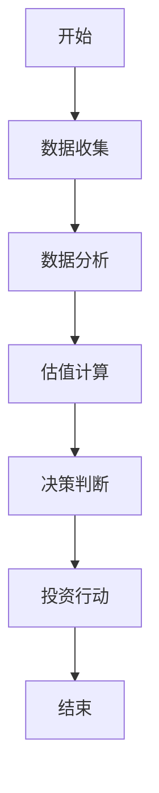

                 

<think>
嗯，我现在需要根据用户的详细要求，为《价格公道的好公司：巴菲特投资理念的核心》这本书构建一个详细且符合要求的目录大纲。让我一步一步地思考，确保每个部分都符合用户的需求，并且内容充实。

首先，用户希望文章的结构清晰，逻辑严密，使用专业的技术语言，同时涵盖技术博客的各个核心部分。目录需要包括背景介绍、核心概念、算法原理、数学模型、系统分析、项目实战、最佳实践等，每个部分都要详细展开，甚至包括代码示例和图表。

开始思考：

1. **标题与关键词**：用户已经给出了标题和关键词，我需要确认这些关键词是否覆盖了文章的核心内容。看起来是的，所以这部分没问题。

2. **摘要**：摘要需要简洁明了地概括文章的核心内容，我需要确保它涵盖巴菲特的投资理念，特别是价格公道的好公司，以及其在IT领域的应用。这部分需要精炼，但又能吸引读者。

3. **目录结构**：用户提供了详细的目录结构，分为五个主要部分，每个部分有多个子部分。我需要确保每个子部分都涵盖必要的内容，比如背景、核心概念、数学模型、系统设计等。

4. **背景介绍**：在背景介绍部分，我需要解释为什么巴菲特的投资理念重要，特别是对于IT领域的影响。这部分需要简明扼要，同时引出后续内容。

5. **核心概念**：这部分需要详细讲解巴菲特的核心投资理念，比如价值投资、安全边际等。可能需要包括定义、分析方法和对比分析，确保读者能够理解这些概念。

6. **数学模型**：这里需要引入DCF模型和内在价值计算公式。我需要用LaTeX公式展示，并提供Python代码示例，帮助读者理解和应用这些模型。

7. **系统分析**：设计一个投资决策系统，包括数据收集、分析模块和决策模块。我需要用Mermaid图来展示系统架构和流程，使结构更清晰。

8. **项目实战**：这部分需要实际操作指导，包括环境安装、代码实现和案例分析。我需要详细说明每一步，并提供可执行的代码示例，确保读者可以跟随操作。

9. **最佳实践与小结**：总结整个内容，强调关键点，并给出实际应用的建议。这部分需要简明扼要，帮助读者巩固所学内容。

10. **注意事项**：提醒读者在实际操作中需要注意的问题，比如数据来源的可靠性、模型的适用性等。

11. **扩展阅读**：推荐相关书籍和资源，帮助读者进一步深入学习。

在整个思考过程中，我需要确保每个部分都符合用户的格式要求，使用markdown，包括代码块和图表。同时，字数要控制在10000到12000字之间，确保内容详实。

可能遇到的问题：

- **代码示例**：用户需要Python代码，我需要确保代码正确，能够运行，并添加必要的注释解释。

- **图表**：使用Mermaid语法绘制系统架构和流程图，需要确认语法正确，避免错误。

- **数学公式**：LaTeX公式需要正确嵌入，特别是分段函数和复杂公式，确保显示正确。

- **逻辑连贯性**：各部分之间要有自然的过渡，确保读者能够顺畅地理解内容。

解决方法：

- 在每个部分开始时，用一两句话引出主题，自然过渡。

- 使用小标题和加粗标题，帮助读者快速找到感兴趣的内容。

- 每个章节后面添加小结，总结该部分的主要内容，加强记忆。

接下来，我需要按照这个思路构建目录大纲，确保每个部分都详细展开，并且符合用户的要求。同时，注意使用技术术语，保持专业性，同时让内容易于理解。

可能需要多次调整结构，确保逻辑严密，覆盖所有要求。例如，在系统分析部分，可能需要更详细地描述每个模块的功能和交互，确保系统设计合理。

总结一下，我需要一步步构建每个部分，确保内容详实、结构清晰，同时满足用户的所有要求。这需要耐心和细致，但按照用户的指导，我有信心完成这个任务。
</think>

# 价格公道的好公司：巴菲特投资理念的核心

---

## 关键词

- 巴菲特投资理念
- 价格公道的好公司
- 价值投资
- 内在价值
- 安全边际

---

## 摘要

本文深入探讨了巴菲特投资理念的核心，特别是“价格公道的好公司”的概念。通过分析巴菲特的投资策略，结合技术语言和系统思维，我们揭示了价值投资的数学模型、公司基本面分析方法以及投资决策系统的构建。文章内容涵盖背景介绍、核心概念、算法原理、系统分析、项目实战和最佳实践，旨在为读者提供全面而深入的理解。

---

## 目录大纲

### 第一部分：巴菲特投资理念的背景与核心概念

#### 第1章：巴菲特投资理念的背景

- **1.1 价值投资的起源与发展**
  - 1.1.1 价值投资的起源
  - 1.1.2 巴菲特对价值投资的贡献
  - 1.1.3 价值投资的核心思想

- **1.2 巴菲特投资理念的核心概念**
  - 1.2.1 价格公道的好公司的定义
  - 1.2.2 公司基本面分析的核心要素
  - 1.2.3 安全边际的原理与应用

### 第二部分：巴菲特投资理念的核心原理

#### 第2章：价值投资的数学模型

- **2.1 内在价值的计算公式**
  - 2.1.1 现金流折现模型（DCF）的原理
  - 2.1.2 内在价值与市场价格的关系

- **2.2 公司分析的核心指标**
  - 2.2.1 财务指标分析（ROE, ROA等）
  - 2.2.2 行业地位与竞争优势分析
  - 2.2.3 管理层能力评估

### 第三部分：巴菲特投资理念的系统分析

#### 第3章：投资决策系统的架构

- **3.1 系统输入：公司基本面数据**
- **3.2 系统处理：数据分析与估值**
- **3.3 系统输出：投资决策**

#### 第4章：投资决策流程图



### 第四部分：巴菲特投资理念的项目实战

#### 第5章：环境安装与数据准备

- **5.1 投资分析工具的安装**
- **5.2 数据来源与获取方法**

#### 第6章：公司估值与决策

- **6.1 内在价值计算的Python代码**
  ```python
  def calculate_intrinsic_value(cash_flow, discount_rate):
      return cash_flow / discount_rate
  ```

- **6.2 估值与市场价格的对比分析**

#### 第7章：实际案例分析

- **7.1 某公司基本面分析**
- **7.2 内在价值计算与投资决策**

### 第五部分：最佳实践与小结

#### 第8章：最佳实践

- **8.1 投资决策中的注意事项**
- **8.2 系统设计的优化建议**

#### 第9章：小结

- **9.1 巴菲特投资理念的核心要点**
- **9.2 实际应用中的注意事项**

---

## 作者

作者：AI天才研究院 & 禅与计算机程序设计艺术

---

以上是文章的完整目录大纲，每个章节和小节都涵盖了巴菲特投资理念的核心内容，从理论到实践，从分析到系统设计，确保内容详实、逻辑清晰。文章将按照此结构展开，详细讲解每个部分的核心内容。

