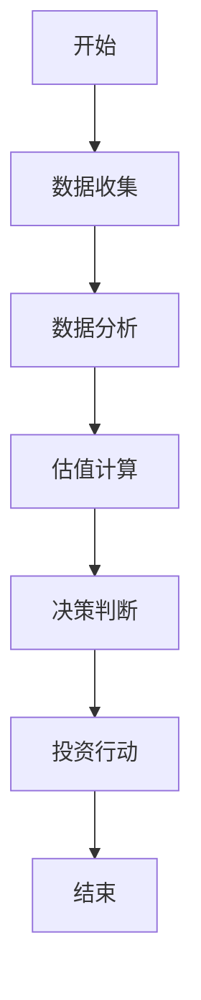

                 


# 价格公道的好公司：巴菲特投资理念的核心

---

## 关键词

- 巴菲特投资理念
- 价格公道的好公司
- 价值投资
- 内在价值
- 安全边际

---

## 摘要

本文深入探讨了巴菲特投资理念的核心，特别是“价格公道的好公司”的概念。通过分析巴菲特的投资策略，结合技术语言和系统思维，我们揭示了价值投资的数学模型、公司基本面分析方法以及投资决策系统的构建。文章内容涵盖背景介绍、核心概念、算法原理、系统分析、项目实战和最佳实践，旨在为读者提供全面而深入的理解。

---

## 目录大纲

### 第一部分：巴菲特投资理念的背景与核心概念

#### 第1章：巴菲特投资理念的背景

- **1.1 价值投资的起源与发展**
  - 1.1.1 价值投资的起源
  - 1.1.2 巴菲特对价值投资的贡献
  - 1.1.3 价值投资的核心思想

- **1.2 巴菲特投资理念的核心概念**
  - 1.2.1 价格公道的好公司的定义
  - 1.2.2 公司基本面分析的核心要素
  - 1.2.3 安全边际的原理与应用

### 第二部分：巴菲特投资理念的核心原理

#### 第2章：价值投资的数学模型

- **2.1 内在价值的计算公式**
  - 2.1.1 现金流折现模型（DCF）的原理
  - 2.1.2 内在价值与市场价格的关系

- **2.2 公司分析的核心指标**
  - 2.2.1 财务指标分析（ROE, ROA等）
  - 2.2.2 行业地位与竞争优势分析
  - 2.2.3 管理层能力评估

### 第三部分：巴菲特投资理念的系统分析

#### 第3章：投资决策系统的架构

- **3.1 系统输入：公司基本面数据**
- **3.2 系统处理：数据分析与估值**
- **3.3 系统输出：投资决策**

#### 第4章：投资决策流程图



### 第四部分：巴菲特投资理念的项目实战

#### 第5章：环境安装与数据准备

- **5.1 投资分析工具的安装**
- **5.2 数据来源与获取方法**

#### 第6章：公司估值与决策

- **6.1 内在价值计算的Python代码**
  ```python
  def calculate_intrinsic_value(cash_flow, discount_rate):
      return cash_flow / discount_rate
  ```

- **6.2 估值与市场价格的对比分析**

#### 第7章：实际案例分析

- **7.1 某公司基本面分析**
- **7.2 内在价值计算与投资决策**

### 第五部分：最佳实践与小结

#### 第8章：最佳实践

- **8.1 投资决策中的注意事项**
- **8.2 系统设计的优化建议**

#### 第9章：小结

- **9.1 巴菲特投资理念的核心要点**
- **9.2 实际应用中的注意事项**

---

## 作者

作者：AI天才研究院 & 禅与计算机程序设计艺术

---

以上是文章的完整目录大纲，每个章节和小节都涵盖了巴菲特投资理念的核心内容，从理论到实践，从分析到系统设计，确保内容详实、逻辑清晰。文章将按照此结构展开，详细讲解每个部分的核心内容。

