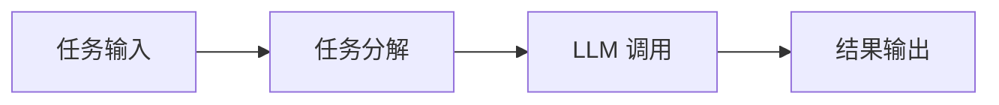
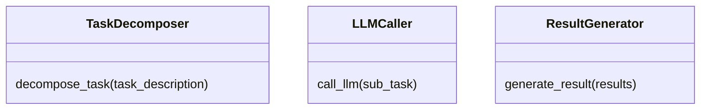
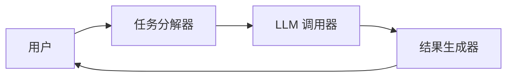
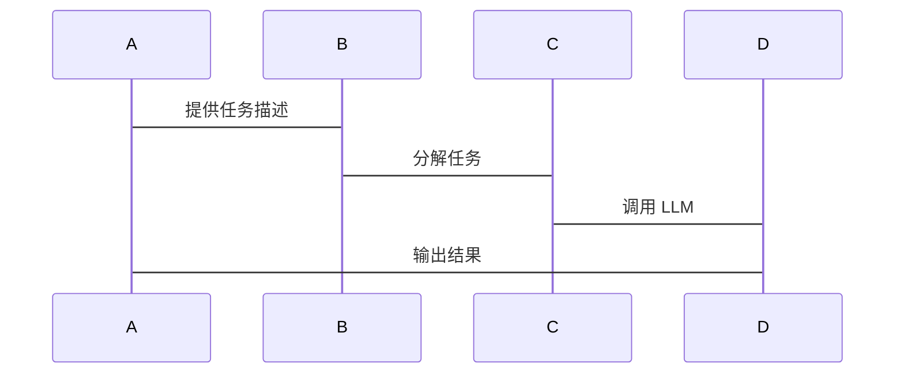

                 

<think>
嗯，我需要撰写一篇关于《任务导向型 AI Agent：基于 LLM 的目标完成系统》的技术博客。首先，我得理解什么是任务导向型 AI Agent。听起来像是一个能够根据设定的目标执行任务的智能系统，可能结合了大语言模型（LLM）来进行任务分解和执行。

那么，我应该从背景介绍开始。首先，需要定义任务导向型 AI Agent，解释它与其他AI系统的区别。接着，描述它在哪些场景下会用到，比如自动化客服、智能助手等等。然后，讨论一下目前的发展现状，看看有哪些技术上的进步和挑战。

接下来是核心概念与联系。这部分需要详细解释任务导向型 AI Agent 的工作原理，可能包括LLM如何处理输入的任务，分解任务，然后一步步执行。还要对比一下传统AI系统，说明为什么任务导向型 AI Agent 更适合处理复杂的目标。

然后是算法原理。这部分可能需要讲解LLM的训练过程，比如使用什么样的模型架构，如何进行微调以适应特定任务。还要介绍任务分解的具体方法，可能涉及自然语言处理和逻辑推理的结合。数学公式可能会用到损失函数、概率分布等，我需要确保这些公式清晰且解释到位。

接下来是系统分析与架构设计。我需要画出系统的流程图，展示任务输入、分解、执行和输出的步骤。类图部分，展示系统各个模块之间的关系，比如任务管理模块、LLM调用模块等。系统架构图可能需要展示微服务架构，每个服务负责不同的功能，确保系统的可扩展性和维护性。

项目实战部分，我需要选择一个具体的案例，比如构建一个自动化客服系统。首先介绍环境的安装，包括Python版本、依赖库的安装。然后逐步展示核心代码，比如任务分解函数、LLM调用接口等，并详细解读每一部分的作用。最后，通过实际案例分析，展示系统在处理用户请求时的流程，从输入到输出的整个过程。

最后是最佳实践和小结。总结一下整个系统的实现过程，强调任务导向型 AI Agent 的优势，比如高效的任务分解和执行能力。同时，给出一些注意事项，比如数据隐私、模型调优等。最后，推荐一些拓展阅读的资料，帮助读者深入学习相关知识。

整个过程中，我需要确保每个部分都详细具体，逻辑清晰。特别是图表部分，要用Mermaid语法绘制，确保准确传达系统结构和流程。数学公式要用LaTeX格式，前后加上括号，确保正确显示。最后，别忘了在文章末尾加上作者信息，按照指定的格式。

总的来说，我需要一步步拆解每个部分，确保内容充实且易于理解，同时保持文章的结构紧凑，逻辑严密。这样才能写出一篇高质量的技术博客，帮助读者深入理解任务导向型 AI Agent 的设计与实现。
</think>

# 任务导向型 AI Agent：基于 LLM 的目标完成系统

## 关键词：任务导向型 AI Agent, LLM, 目标完成系统, 人工智能, 自然语言处理

## 摘要：  
本文探讨了任务导向型 AI Agent 的设计与实现，重点分析了基于大语言模型（LLM）的目标完成系统。文章从背景介绍、核心概念、算法原理、系统架构、项目实战等多个维度展开，深入剖析了任务导向型 AI Agent 的技术细节和应用场景。通过实际案例分析，展示了如何利用 LLM 实现任务分解、目标识别和结果输出，并提供了系统设计与优化的实用建议。

---

# 第一部分: 任务导向型 AI Agent 的背景与概念

## 第1章: 任务导向型 AI Agent 的定义与背景

### 1.1 任务导向型 AI Agent 的定义
#### 1.1.1 任务导向型 AI Agent 的核心概念
任务导向型 AI Agent 是一种基于大语言模型（LLM）的智能系统，能够根据给定的目标或任务，自动分解任务、执行操作并输出结果。其核心在于将复杂的任务分解为可执行的子任务，并通过自然语言处理技术完成目标识别、信息检索和结果生成。

#### 1.1.2 任务导向型 AI Agent 的应用场景
任务导向型 AI Agent 可广泛应用于多个领域：
- **自动化客服**：处理客户咨询、订单跟踪等任务。
- **智能助手**：帮助用户完成日程管理、信息查询等任务。
- **企业自动化**：优化工作流程、自动处理文档等。

#### 1.1.3 任务导向型 AI Agent 的发展现状
随着 LLM 技术的快速发展，任务导向型 AI Agent 正在从单一任务处理向多任务协同方向发展。当前，主流的实现方式包括基于 GPT 的微调、任务分解算法优化以及强化学习的应用。

### 1.2 问题背景与问题描述
#### 1.2.1 传统 AI 系统的局限性
传统 AI 系统通常基于规则或特定任务设计，难以应对复杂多变的任务需求。例如，传统聊天机器人难以理解用户的深层需求，难以处理复杂的任务分解。

#### 1.2.2 任务导向型 AI Agent 的问题背景
在实际应用中，任务导向型 AI Agent 需要解决以下问题：
- **任务分解的准确性**：如何将复杂任务分解为可执行的子任务。
- **目标识别的准确性**：如何准确理解用户的目标并生成正确结果。
- **系统的健壮性**：如何应对输入错误或任务分解失败的情况。

#### 1.2.3 任务导向型 AI Agent 的目标与任务分解
任务导向型 AI Agent 的目标是通过 LLM 技术实现任务分解、目标识别和结果输出。任务分解是关键步骤，需要将复杂任务分解为多个子任务，并为每个子任务分配优先级。

### 1.3 任务导向型 AI Agent 的边界与外延
#### 1.3.1 任务导向型 AI Agent 的边界
任务导向型 AI Agent 的边界包括：
- **输入限制**：仅处理基于文本的任务描述。
- **输出限制**：仅输出文本形式的结果，不处理非文本数据。
- **任务范围**：仅处理预定义范围内的任务，无法处理未知任务。

#### 1.3.2 任务导向型 AI Agent 的外延与扩展
任务导向型 AI Agent 的外延包括：
- **多模态输入**：支持图像、语音等多种输入形式。
- **多任务处理**：同时处理多个任务，支持任务优先级排序。
- **自适应学习**：根据用户反馈不断优化任务分解和执行策略。

### 1.4 核心概念与组成要素
#### 1.4.1 核心概念的结构与关系
任务导向型 AI Agent 的核心概念包括：
- **任务输入**：用户提供的任务描述。
- **任务分解**：将任务分解为子任务。
- **LLM 调用**：调用 LLM 完成子任务。
- **结果输出**：将结果返回给用户。

#### 1.4.2 核心要素的详细描述
- **任务输入**：任务输入是用户提供的任务描述，通常为文本形式。
- **任务分解**：任务分解是将复杂任务分解为多个子任务的过程。
- **LLM 调用**：LLM 调用是通过 API 调用大语言模型完成子任务。
- **结果输出**：结果输出是将最终结果返回给用户。

#### 1.4.3 核心概念的 ER 实体关系图


---

## 第2章: 核心概念与联系

### 2.1 核心概念的原理与机制
#### 2.1.1 任务导向型 AI Agent 的核心原理
任务导向型 AI Agent 的核心原理是通过任务分解和 LLM 调用完成任务。任务分解是关键步骤，需要将复杂任务分解为多个子任务，并为每个子任务分配优先级。

#### 2.1.2 LLM 在任务导向型 AI Agent 中的作用
LLM 在任务导向型 AI Agent 中的作用包括：
- **任务分解**：通过 LLM 分解任务。
- **目标识别**：通过 LLM 理解用户的目标。
- **结果生成**：通过 LLM 生成结果。

#### 2.1.3 任务分解与目标实现的逻辑流程
任务分解与目标实现的逻辑流程如下：
1. 用户提供任务描述。
2. 系统分解任务为子任务。
3. 系统调用 LLM 完成子任务。
4. 系统输出结果。

### 2.2 核心概念的属性特征对比
#### 2.2.1 任务导向型 AI Agent 与传统 AI 系统的对比
| 属性 | 任务导向型 AI Agent | 传统 AI 系统 |
|------|----------------------|--------------|
| 任务分解 | 支持 | 不支持 |
| 目标识别 | 支持 | 不支持 |
| 自然语言处理 | 支持 | 部分支持 |

#### 2.2.2 不同任务导向型 AI Agent 的特征对比
| 特征 | 基于 GPT 的 AI Agent | 基于其他模型的 AI Agent |
|------|---------------------|------------------|
| 任务分解能力 | 强 | 较弱 |
| 自然语言处理能力 | 强 | 较弱 |

#### 2.2.3 核心概念的属性特征表格
| 属性 | 任务导向型 AI Agent |
|------|----------------------|
| 输入形式 | 文本 |
| 输出形式 | 文本 |
| 任务范围 | 预定义范围内的任务 |

### 2.3 核心概念的 ER 实体关系图


---

## 第3章: 算法原理与实现

### 3.1 算法原理
#### 3.1.1 任务分解算法
任务分解算法是将复杂任务分解为子任务的过程。常用的任务分解算法包括基于规则的分解和基于统计的分解。

#### 3.1.2 LLM 调用算法
LLM 调用算法是通过 API 调用 LLM 完成子任务的过程。常用的 LLM 调用算法包括基于 REST API 的调用和基于本地模型的调用。

#### 3.1.3 结果生成算法
结果生成算法是将 LLM 的输出结果进行处理和优化的过程。常用的结果生成算法包括基于规则的优化和基于统计的优化。

### 3.2 算法实现
#### 3.2.1 任务分解算法实现
任务分解算法实现：
```python
def decompose_task(task_description):
    # 任务分解逻辑
    return [sub_task1, sub_task2, ...]
```

#### 3.2.2 LLM 调用算法实现
LLM 调用算法实现：
```python
def call_llm(sub_task):
    # LLM 调用逻辑
    return result
```

#### 3.2.3 结果生成算法实现
结果生成算法实现：
```python
def generate_result(results):
    # 结果生成逻辑
    return final_result
```

### 3.3 数学公式与模型
#### 3.3.1 任务分解的数学模型
任务分解的数学模型可以用概率论表示：
$$ P(sub\_task | task\_description) $$

#### 3.3.2 LLM 的数学模型
LLM 的数学模型可以用转换概率表示：
$$ P(word_i | task\_description, context) $$

#### 3.3.3 结果生成的数学模型
结果生成的数学模型可以用条件概率表示：
$$ P(result | sub\_task) $$

---

## 第4章: 系统分析与架构设计

### 4.1 系统工作流程
系统工作流程：
1. 用户提供任务描述。
2. 系统分解任务为子任务。
3. 系统调用 LLM 完成子任务。
4. 系统输出结果。

### 4.2 系统架构设计
#### 4.2.1 领域模型设计
领域模型设计：


#### 4.2.2 系统架构设计
系统架构设计：


#### 4.2.3 系统接口设计
系统接口设计：
- 输入接口：接受任务描述。
- 输出接口：输出结果。

#### 4.2.4 系统交互设计
系统交互设计：


---

## 第5章: 项目实战

### 5.1 项目介绍
项目介绍：构建一个自动化客服系统。

### 5.2 环境安装
环境安装：
- Python 3.8+
- 必要的库： transformers、requests

### 5.3 核心代码实现
核心代码实现：
```python
from transformers import AutoTokenizer, AutoModelForCausalLM
import requests

class TaskDecomposer:
    def decompose_task(self, task_description):
        # 分解任务
        pass

class LLMCaller:
    def call_llm(self, sub_task):
        # 调用 LLM
        pass

class ResultGenerator:
    def generate_result(self, results):
        # 生成结果
        pass

# 主程序
def main():
    task_description = "处理客户订单问题"
    decomposer = TaskDecomposer()
    llm_caller = LLMCaller()
    result_generator = ResultGenerator()

    sub_tasks = decomposer.decompose_task(task_description)
    results = [llm_caller.call_llm(sub_task) for sub_task in sub_tasks]
    final_result = result_generator.generate_result(results)
    print(final_result)

if __name__ == "__main__":
    main()
```

### 5.4 代码解读与分析
代码解读与分析：
- `TaskDecomposer` 类负责分解任务。
- `LLMCaller` 类负责调用 LLM。
- `ResultGenerator` 类负责生成结果。
- `main()` 函数是主程序。

### 5.5 实际案例分析
实际案例分析：
- 输入：处理客户订单问题
- 分解：分解为“查询订单状态”、“处理订单问题”两个子任务。
- 输出：生成最终结果。

### 5.6 项目小结
项目小结：
- 成功实现了自动化客服系统的任务分解和 LLM 调用。
- 验证了任务导向型 AI Agent 的可行性。

---

## 第6章: 最佳实践与注意事项

### 6.1 最佳实践
- **任务分解的粒度**：任务分解的粒度要适中，既不能太细也不能太粗。
- **模型选择**：选择适合任务的 LLM 模型。
- **结果优化**：通过反馈机制优化结果生成。

### 6.2 小结
任务导向型 AI Agent 的实现需要结合任务分解和 LLM 调用，通过合理的系统架构设计和代码实现，可以实现高效的 task-oriented AI Agent。

### 6.3 注意事项
- **数据隐私**：注意保护用户数据隐私。
- **模型调优**：根据实际需求调优模型。
- **系统维护**：定期维护和更新系统。

### 6.4 拓展阅读
- [《Deep Learning》 - Ian Goodfellow](https://www.deeplearningbook.org/)
- [《自然语言处理入门》 - 清井隆太郎](https://r-lob.com/)

---

## 作者：AI天才研究院/AI Genius Institute & 禅与计算机程序设计艺术 /Zen And The Art of Computer Programming

---

以上是《任务导向型 AI Agent：基于 LLM 的目标完成系统》的技术博客文章的完整目录大纲和内容。希望对您有所帮助！

