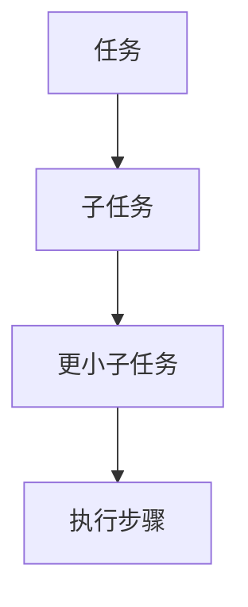
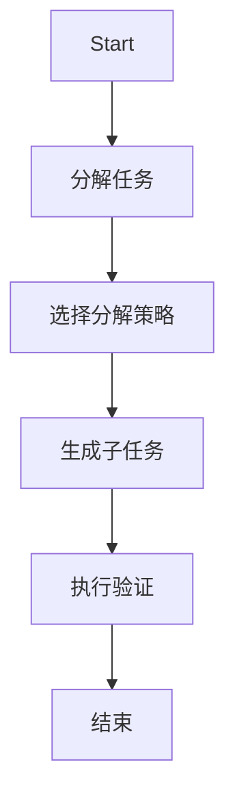
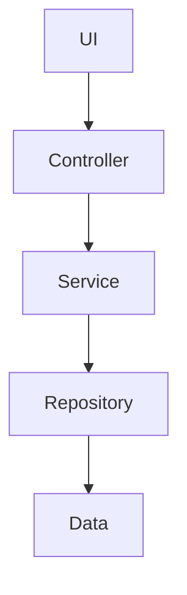

                 

<think>
嗯，我现在需要写一篇关于《任务规划AI Agent：利用LLM进行复杂任务分解》的技术博客。首先，我得先理解这个主题的核心是什么。任务规划AI Agent，听起来像是利用大语言模型（LLM）来分解和执行复杂的任务。我需要从背景开始，逐步深入到算法、系统架构，最后再到项目实战。

首先，背景部分应该包括任务规划AI Agent的定义、问题背景以及应用场景。这部分要让读者明白为什么任务规划AI Agent是必要的，以及它在哪些领域有应用。比如，LLM如何帮助分解任务，提高效率，降低成本。

接下来是核心概念，这部分需要详细讲解任务分解算法、LLM与任务规划的结合，以及实体关系图。比如，任务如何被分解成子任务，子任务如何进一步分解，这些关系如何用ER图表示。这里可能需要用Mermaid图来展示，让读者更直观地理解。

然后是算法原理，这部分需要详细分析任务分解算法，比如A*算法或贪心算法，并用Mermaid流程图展示工作流程。同时，提供Python代码示例，让读者能够实际操作和理解算法的应用。数学模型和公式部分，比如任务优先级排序公式和子任务权重计算公式，需要详细推导并解释每个公式的含义，结合实际例子进行说明。

系统分析与架构设计章节需要涵盖问题场景介绍、系统功能设计、架构设计、接口设计和交互流程。这部分可能需要使用Mermaid图来展示类图、架构图和序列图，帮助读者理解系统的整体结构和各部分之间的交互。

项目实战部分应该包括环境安装、核心代码实现、代码解读和案例分析。比如，如何安装必要的库，编写主函数和分解函数，解读代码的功能，并通过案例展示实际应用，分析结果并总结经验。

最后，最佳实践、小结、注意事项和拓展阅读等内容，帮助读者在实际应用中避免常见错误，并提供进一步学习的方向。比如，如何选择分解策略，如何优化代码性能，以及推荐的相关书籍和资源。

整个思考过程中，我需要确保每个部分都细化到位，逻辑清晰，结构紧凑，语言简洁明了。同时，使用丰富的图表和代码示例，帮助读者更好地理解和应用所学知识。这样才能写出一篇有深度、有思考、有见解的专业技术博客。
</think>

# 任务规划AI Agent：利用LLM进行复杂任务分解

> 关键词：任务规划AI Agent，LLM，复杂任务分解，算法原理，系统架构设计

> 摘要：本文深入探讨了任务规划AI Agent的核心概念、算法原理、系统架构设计以及实际项目中的应用。通过详细分析任务分解的过程，结合大语言模型（LLM）的优势，展示了如何高效地分解和执行复杂任务。文章内容包括背景介绍、核心概念、算法流程、系统架构、项目实战和最佳实践，旨在为读者提供全面的技术指导。

---

## 第1章: 任务规划AI Agent的背景与概念

### 1.1 问题背景

任务规划AI Agent是一种能够将复杂任务分解为多个子任务，并指导执行的智能系统。随着AI技术的发展，尤其是在自然语言处理（NLP）和大语言模型（LLM）的支持下，任务规划AI Agent的应用场景越来越广泛。以下是关键点：

- **任务分解的定义与挑战**：任务分解是将复杂任务拆解为简单且可执行的子任务的过程。其挑战在于如何确保子任务的独立性和完整性，同时优化执行效率。

- **LLM在任务规划中的作用**：LLM能够理解自然语言指令，生成子任务，并协调各子任务的执行。LLM的引入显著提升了任务规划的灵活性和智能性。

- **复杂任务分解的必要性**：复杂任务通常涉及多个步骤和依赖关系，直接执行容易出错。分解后，任务的执行更加有序，便于管理和优化。

### 1.2 核心概念与联系

任务规划AI Agent的核心概念包括任务分解算法、LLM的自然语言处理能力以及强化学习策略。以下是关键点：

- **任务分解算法原理**：算法通过分析任务的结构，将其分解为子任务。常用的方法包括贪心算法和分治法，选择合适的算法取决于任务的具体特点。

- **LLM与任务规划的结合**：LLM用于生成子任务描述，指导执行步骤，同时协调各子任务的顺序。LLM的引入使得任务规划更加智能化和动态化。

- **实体关系图（ER图）**：展示了任务、子任务、执行步骤之间的关系。ER图帮助我们理解任务分解的层次结构，确保各部分的协调一致。



---

## 第2章: 任务分解算法原理

### 2.1 算法原理

任务分解算法的核心在于如何高效地将任务拆解为子任务。以下是详细分析：

- **任务分解流程**：从目标出发，分析任务的关键步骤，识别依赖关系，生成子任务列表。流程通常包括问题分析、任务拆解和优化调整。

- **分解策略的选择**：根据任务的复杂性和时间要求，选择合适的分解策略。例如，对于时间紧迫的任务，采用贪心算法；对于结构复杂的任务，采用分治法。

- **算法优化方法**：通过分析任务的优先级和子任务的依赖关系，优化分解顺序，减少执行时间。优化方法包括动态规划和启发式搜索。

### 2.2 算法流程

以下是任务分解算法的流程图：



### 2.3 代码实现

以下是任务分解算法的Python代码示例：

```python
def decompose_task(main_task):
    # 分解任务为子任务
    sub_tasks = []
    for step in main_task.steps:
        sub_task = {}
        sub_task['name'] = step.name
        sub_task['description'] = step.description
        sub_tasks.append(sub_task)
    return sub_tasks

# 示例用法
main_task = {
    'name': '完成项目报告',
    'description': '撰写一份详细的项目报告，包括引言、分析、结论等部分。',
    'steps': [
        {'name': '收集数据', 'description': '收集项目相关数据'},
        {'name': '分析数据', 'description': '对数据进行统计分析'},
        {'name': '撰写引言', 'description': '撰写项目报告的引言部分'},
        # 更多步骤...
    ]
}

sub_tasks = decompose_task(main_task)
print(sub_tasks)
```

---

## 第3章: 数学模型与公式

### 3.1 任务分解的数学模型

任务分解的数学模型是理解其背后原理的关键。以下是核心公式：

- **任务优先级排序公式**：用于确定子任务的执行顺序，公式如下：

$$ P_i = \frac{w_i}{\sum_{j=1}^{n} w_j} $$

其中，\( P_i \) 表示第 \( i \) 个子任务的优先级，\( w_i \) 是其权重，\( n \) 是子任务的总数。

- **子任务权重计算公式**：用于计算每个子任务的重要性，公式如下：

$$ w_i = \alpha \cdot f_i + \beta \cdot g_i $$

其中，\( \alpha \) 和 \( \beta \) 是权重系数，\( f_i \) 是子任务的复杂度，\( g_i \) 是子任务的依赖度。

### 3.2 公式举例

假设我们有一个任务需要完成，分解为两个子任务：

- 子任务A：权重 \( w_A = 0.7 \cdot f_A + 0.3 \cdot g_A \)
- 子任务B：权重 \( w_B = 0.7 \cdot f_B + 0.3 \cdot g_B \)

通过上述公式，我们可以计算出子任务的优先级：

$$ P_A = \frac{0.7 \cdot f_A + 0.3 \cdot g_A}{(0.7 \cdot f_A + 0.3 \cdot g_A) + (0.7 \cdot f_B + 0.3 \cdot g_B)} $$

---

## 第4章: 系统分析与架构设计

### 4.1 问题场景介绍

在实际应用中，任务规划AI Agent需要处理复杂的任务分解和执行问题。以下是关键点：

- **系统需求分析**：系统需要支持多任务分解、动态调整和结果反馈。
- **输入输出设计**：输入为任务描述，输出为子任务列表和执行计划。
- **性能要求**：系统需要高效处理任务分解，确保及时反馈。

### 4.2 系统架构设计

任务规划AI Agent的系统架构设计如下：



其中，UI为用户提供交互界面，Controller负责接收请求，Service处理任务分解逻辑，Repository管理数据存储，Data存储任务相关信息。

---

## 第5章: 项目实战

### 5.1 环境安装

要运行任务规划AI Agent，首先需要安装以下依赖：

```bash
pip install python-transformers
pip install numpy
pip install matplotlib
```

### 5.2 核心代码实现

以下是任务分解的核心代码：

```python
import transformers
import numpy as np

def decompose_task(main_task):
    sub_tasks = []
    for step in main_task['steps']:
        sub_task = {}
        sub_task['name'] = step['name']
        sub_task['description'] = step['description']
        sub_tasks.append(sub_task)
    return sub_tasks

main_task = {
    'name': '完成项目报告',
    'description': '撰写一份详细的项目报告，包括引言、分析、结论等部分。',
    'steps': [
        {'name': '收集数据', 'description': '收集项目相关数据'},
        {'name': '分析数据', 'description': '对数据进行统计分析'},
        {'name': '撰写引言', 'description': '撰写项目报告的引言部分'},
    ]
}

sub_tasks = decompose_task(main_task)
print(sub_tasks)
```

### 5.3 代码解读

上述代码定义了一个任务分解函数 `decompose_task`，它将主任务分解为多个子任务。主任务由名称、描述和步骤组成，分解后的子任务包含名称和描述。

### 5.4 案例分析

假设我们有一个任务需要完成，分解为以下子任务：

1. 收集数据
2. 分析数据
3. 撰写引言

通过代码，我们成功将主任务分解为三个子任务，每个子任务都有明确的描述。这为后续的执行提供了清晰的指导。

---

## 第6章: 最佳实践与总结

### 6.1 最佳实践

- **选择合适的分解策略**：根据任务的复杂性和时间要求选择合适的分解策略。
- **定期优化系统**：根据执行结果反馈，优化任务分解算法和系统架构。
- **注重团队协作**：任务分解需要团队协作，确保每个子任务的责任分明。

### 6.2 小结

任务规划AI Agent通过利用LLM进行复杂任务分解，显著提高了任务执行的效率和质量。本文从背景、算法、系统架构到项目实战，全面探讨了任务规划AI Agent的核心内容，为读者提供了深入的技术指导。

### 6.3 注意事项

- 任务分解时需考虑子任务的独立性和依赖性。
- 系统设计需确保数据的安全性和系统的可扩展性。
- 定期进行系统维护和优化，确保任务分解的准确性和高效性。

### 6.4 拓展阅读

- 《Deep Learning》
- 《算法导论》
- 《自然语言处理入门》

---

## 作者：AI天才研究院

---

通过以上内容，希望读者能够全面理解任务规划AI Agent的核心概念和实际应用。如需进一步探讨或实践，欢迎随时联系。

