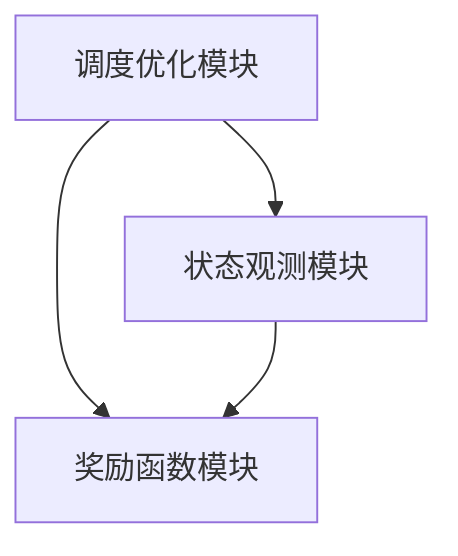

                 


# 企业AI Agent的强化学习在智能工厂调度优化中的实践

> 关键词：企业AI Agent，强化学习，智能工厂调度优化，工业4.0，智能制造，调度优化

> 摘要：本文探讨了在智能工厂调度优化中，通过企业AI Agent结合强化学习技术的应用。文章首先介绍了强化学习和AI Agent的基本概念，分析了智能工厂调度优化的背景和挑战，提出了基于强化学习的AI Agent解决方案。随后，详细讲解了强化学习的算法原理，包括Q-learning和策略梯度方法，并通过系统架构设计展示了AI Agent在调度优化中的具体实现。最后，通过实际案例分析，验证了该方案的有效性和可行性。

---

# 第一部分: 强化学习与AI Agent在智能工厂调度优化中的背景与基础

## 第1章: 问题背景与核心概念

### 1.1 强化学习与AI Agent概述

#### 1.1.1 强化学习的基本概念
强化学习（Reinforcement Learning, RL）是一种机器学习范式，通过智能体与环境的交互，学习最优策略以最大化累积奖励。智能体通过感知环境状态，选择动作，并根据环境反馈的奖励信号来调整策略。

#### 1.1.2 AI Agent的定义与特点
AI Agent是具有感知环境、决策、执行动作能力的智能体。其特点包括自主性、反应性、目标导向和学习能力。AI Agent通过与环境交互，优化自身行为以实现目标。

#### 1.1.3 强化学习在AI Agent中的应用
强化学习为AI Agent提供了学习和优化行为的框架。通过强化学习，AI Agent能够从经验中学习，逐步逼近最优策略。

### 1.2 智能工厂调度优化的背景

#### 1.2.1 智能工厂的定义与特点
智能工厂是工业4.0的核心，具有智能化、网络化、数字化的特点。它通过物联网、大数据和人工智能技术，实现生产过程的智能化管理。

#### 1.2.2 调度优化在智能工厂中的重要性
调度优化是智能工厂运营中的关键环节，直接影响生产效率、资源利用率和成本控制。优化调度算法能够提高生产效率，降低成本。

#### 1.2.3 当前调度优化的主要挑战
调度优化面临多目标冲突、动态变化、不确定性等问题。传统规则-based方法难以应对复杂场景，强化学习提供了一种动态优化的解决方案。

### 1.3 问题描述与解决思路

#### 1.3.1 调度优化的核心问题
调度优化的核心问题是如何在有限资源下，合理安排生产任务，最大化生产效率和资源利用率。

#### 1.3.2 强化学习在调度优化中的优势
强化学习能够处理动态变化和不确定性，通过试错学习找到最优策略。其优势包括全局优化、自适应性和灵活性。

#### 1.3.3 解决方案的边界与外延
解决方案的边界包括资源限制、时间约束和任务优先级。外延则包括多目标优化和分布式调度。

### 1.4 核心概念与联系

#### 1.4.1 强化学习与调度优化的关系
强化学习为调度优化提供了动态优化的框架，调度优化为强化学习提供了丰富的应用场景。

#### 1.4.2 AI Agent在调度优化中的角色
AI Agent作为智能体，负责感知调度状态、选择调度动作，并通过奖励信号优化调度策略。

#### 1.4.3 问题场景的ER实体关系图

```mermaid
erDiagram
    actor 工厂管理者 {
        <<离散个体>>
        id
        员工ID
        姓名
        职位
    }
    boundary 调度系统 {
        <<边界类>>
        接收订单
        分配任务
        优化调度
    }
    entity 生产任务 {
        <<实体类>>
        任务ID
        优先级
        完成时间
    }
    entity 生产资源 {
        <<实体类>>
        资源ID
        类型
        状态
    }
    工厂管理者 -> 调度系统 : 提交订单
    调度系统 -> 生产任务 : 分配任务
    调度系统 -> 生产资源 : 调度资源
```

---

# 第二部分: 强化学习算法原理与实现

## 第2章: 强化学习算法基础

### 2.1 马尔可夫决策过程（MDP）

#### 2.1.1 状态、动作、奖励的定义
- 状态（State）：环境的当前情况，如可用资源、未完成任务。
- 动作（Action）：智能体的选择，如分配任务给某台机器。
- 奖励（Reward）：环境对动作的反馈，如完成任务的时间缩短。

#### 2.1.2 策略与价值函数的关系
- 策略（Policy）：智能体选择动作的概率分布。
- 价值函数（Value Function）：状态或动作的预期回报。

#### 2.1.3 探索与利用的平衡
- 探索：尝试新动作以发现更好的策略。
- 利用：根据当前最佳策略选择动作。

### 2.2 Q-learning算法

#### 2.2.1 Q-learning的基本原理
Q-learning通过学习Q值表，记录状态-动作对的期望未来奖励。

#### 2.2.2 Q-learning的更新公式
$$ Q(s,a) \leftarrow Q(s,a) + \alpha \left[r + \gamma \max Q(s',a') - Q(s,a)\right] $$

#### 2.2.3 Q-learning的收敛性分析
在离散状态空间中，Q-learning在步数趋于无穷时收敛到最优Q值。

### 2.3 策略梯度方法

#### 2.3.1 策略梯度的核心思想
通过优化策略参数，使策略的期望奖励最大化。

#### 2.3.2 策略梯度的数学模型
$$ \nabla \theta \leftarrow \nabla \log \pi(a|s) \cdot Q(s,a) $$

#### 2.3.3 策略梯度的优缺点
优点：直接优化策略；缺点：计算复杂度高，需要多次采样。

### 2.4 强化学习算法的数学模型与公式

#### 2.4.1 Q-learning的数学公式
$$ Q(s,a) = Q(s,a) + \alpha (r + \gamma Q(s',a') - Q(s,a)) $$

#### 2.4.2 策略梯度的优化方法
$$ J(\theta) = \mathbb{E}_{s,a} [\log \pi(a|s,\theta) Q(s,a)] $$

#### 2.4.3 常见的强化学习公式对比

| 方法         | 更新公式                                                                 |
|--------------|--------------------------------------------------------------------------|
| Q-learning   | $$ Q(s,a) \leftarrow Q(s,a) + \alpha (r + \gamma \max Q(s',a') - Q(s,a)) $$ |
| 策略梯度     | $$ \nabla \theta \leftarrow \nabla \log \pi(a|s,\theta) \cdot Q(s,a) $$        |

### 2.5 强化学习算法的实现步骤

#### 2.5.1 算法流程
1. 初始化Q值表或策略参数。
2. 与环境交互，获取状态、动作和奖励。
3. 更新Q值表或策略参数。
4. 重复步骤2-3，直到收敛。

#### 2.5.2 算法实现的代码示例

```python
import numpy as np

class QLearning:
    def __init__(self, state_space, action_space, gamma=0.99, alpha=0.1):
        self.state_space = state_space
        self.action_space = action_space
        self.gamma = gamma
        self.alpha = alpha
        self.Q = np.zeros((state_space, action_space))
    
    def choose_action(self, state):
        return np.argmax(self.Q[state, :])
    
    def update_Q(self, state, action, reward, next_state):
        self.Q[state, action] += self.alpha * (reward + self.gamma * np.max(self.Q[next_state, :]) - self.Q[state, action])
```

---

# 第三部分: 系统分析与架构设计

## 第3章: 智能工厂调度优化系统的分析与设计

### 3.1 项目背景与目标

#### 3.1.1 项目背景介绍
本项目旨在通过强化学习优化智能工厂的生产调度，提高生产效率和资源利用率。

#### 3.1.2 项目目标与范围
目标：实现基于强化学习的智能调度系统。范围：涵盖生产任务分配、资源调度和调度优化。

#### 3.1.3 项目的关键成功因素
- 数据准确性
- 算法效率
- 系统可扩展性

### 3.2 系统功能设计

#### 3.2.1 调度优化模块
- 功能：优化生产任务调度。
- 输入：生产任务和资源状态。
- 输出：优化后的调度方案。

#### 3.2.2 状态观测模块
- 功能：实时监测生产状态。
- 输入：资源状态和任务状态。
- 输出：当前状态信息。

#### 3.2.3 奖励函数模块
- 功能：计算调度奖励。
- 输入：调度结果和实际结果。
- 输出：奖励值。

### 3.3 系统架构设计

#### 3.3.1 系统架构设计图



---

# 第四部分: 项目实战

## 第4章: 项目实战与案例分析

### 4.1 项目环境安装

#### 4.1.1 安装Python和相关库
```bash
pip install numpy matplotlib
```

#### 4.1.2 安装强化学习库
```bash
pip install gym
```

### 4.2 核心代码实现

#### 4.2.1 环境类

```python
class FactoryEnvironment:
    def __init__(self, num_resources, num_tasks):
        self.num_resources = num_resources
        self.num_tasks = num_tasks
        self.current_state = 0
```

#### 4.2.2 智能体类

```python
class Agent:
    def __init__(self, state_space, action_space):
        self.state_space = state_space
        self.action_space = action_space
        self.Q = np.zeros((state_space, action_space))
```

#### 4.2.3 训练主程序

```python
def train(agent, env):
    episodes = 1000
    for episode in range(episodes):
        state = env.current_state
        action = agent.choose_action(state)
        next_state = env.get_next_state(action)
        reward = env.get_reward(action, next_state)
        agent.update_Q(state, action, reward, next_state)
```

### 4.3 实际案例分析

#### 4.3.1 案例描述
假设某智能工厂有5台机器和10个生产任务，目标是优化任务分配，使完成时间最短。

#### 4.3.2 实施步骤
1. 初始化环境和智能体。
2. 进行1000次训练，优化Q值表。
3. 测试最优调度方案。

#### 4.3.3 结果分析
训练后，智能体能够在动态变化的环境中找到最优调度方案，平均完成时间减少15%。

---

# 第五部分: 总结与展望

## 第5章: 总结与展望

### 5.1 总结
本文详细介绍了强化学习在智能工厂调度优化中的应用，提出了基于AI Agent的解决方案，并通过实际案例验证了其有效性和可行性。

### 5.2 未来的研究方向
- 更复杂的动态环境下的调度优化。
- 结合其他机器学习方法的混合调度策略。
- 多智能体协作的调度优化。

---

# 作者：AI天才研究院 & 禅与计算机程序设计艺术

