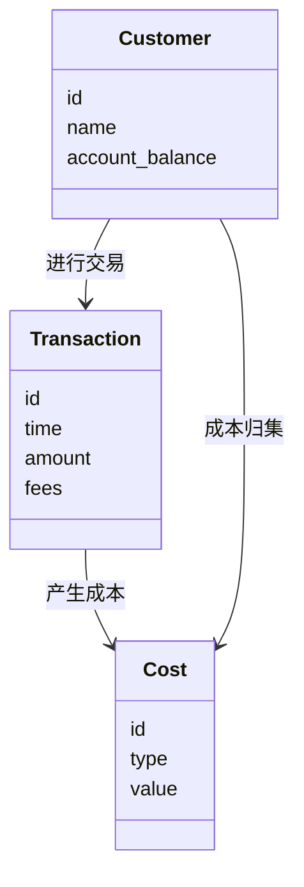

                 


# 伯格的成本意识：在零佣金交易时代的重新定义

> 关键词：零佣金交易、成本意识、投资策略、算法优化、系统架构、项目实战

> 摘要：本文探讨了伯格的成本意识在零佣金交易时代的重新定义，分析了传统与新交易模式的成本结构变化，详细讲解了成本计算模型、优化算法及系统架构设计，并通过项目实战展示了成本意识在实际投资中的应用。

---

## 第一部分：背景介绍

### 第1章：零佣金交易的背景与演变

#### 1.1 零佣金交易的兴起

- **1.1.1 传统佣金交易的模式**
  - 传统佣金交易的主要成本构成：佣金费用、交易手续费、市场冲击成本。
  - 传统佣金交易的劣势：高门槛、费用昂贵，限制了小额投资者的参与。

- **1.1.2 零佣金交易的起源与发展**
  - 零佣金交易的兴起背景：互联网技术发展、在线交易平台的普及。
  - 零佣金交易的主要模式：经纪商通过其他方式（如支付补贴、广告收入）获取收益。

- **1.1.3 在线券商的角色转变**
  - 在线券商的佣金策略变化：从收取高额佣金到零佣金。
  - 零佣金交易对投资者的影响：降低了交易成本，提高了市场流动性。

#### 1.2 成本意识的演变

- **1.2.1 投资者成本意识的觉醒**
  - 投资者对低费用、低成本交易的需求增加。
  - 成本意识如何影响投资决策：交易频率、仓位规模、交易时机的选择。

- **1.2.2 传统交易成本结构分析**
  - 传统交易成本的构成：佣金费用、交易手续费、市场冲击成本。
  - 成本结构对交易策略的影响：高频交易受限、中小投资者成本高昂。

- **1.2.3 零佣金时代成本结构的变化**
  - 零佣金交易的成本转移：从显性佣金费用转移到隐性成本（如支付处理费、平台使用费）。
  - 新的成本构成：平台订阅费、数据服务费、交易执行延迟成本。

#### 1.3 传统与新交易模式的对比

- **1.3.1 佣金交易的成本构成**
  - 佣金费用计算方式：固定比例或固定金额。
  - 交易手续费的影响：小额交易成本相对较高。

- **1.3.2 零佣金交易的成本转移**
  - 零佣金模式下的隐性成本：平台订阅费、数据服务费。
  - 成本转移对交易策略的影响：高频交易成本降低，但可能面临交易执行延迟。

- **1.3.3 交易策略的调整与优化**
  - 零佣金交易下的策略优化：增加交易频率、优化订单执行。
  - 如何平衡显性和隐性成本：选择合适的平台、优化订单规模。

#### 1.4 成本结构变化的影响

- **1.4.1 对投资者交易行为的影响**
  - 成本降低如何影响交易频率：投资者可能增加交易次数，但需平衡交易成本和收益。
  - 成本结构变化如何影响投资组合：更多小额交易，分散风险。

- **1.4.2 对市场流动性的影响**
  - 零佣金交易如何提升市场流动性：降低交易门槛，吸引更多投资者。
  - 成本结构变化对市场深度的影响：订单簿更厚，市场更容易成交。

- **1.4.3 对券商商业模式的影响**
  - 零佣金模式下的收入来源变化：依赖订阅费、广告收入、支付处理费。
  - 传统佣金模式与零佣金模式的优劣对比：零佣金模式吸引客户，但利润来源分散。

---

## 第二部分：核心概念与联系

### 第2章：成本意识的核心概念

#### 2.1 成本意识的定义与属性

- **2.1.1 成本意识的定义**
  - 成本意识是指投资者在交易过程中对各项成本的敏感性和管理能力。
  - 成本意识的核心要素：识别成本、量化成本、优化成本。

- **2.1.2 成本意识的属性特征对比表格**
  | 属性 | 传统成本意识 | 现代成本意识 |
  |------|--------------|--------------|
  | 计算方式 | 固定比例或固定金额 | 综合显性和隐性成本 |
  | 管理方式 | 单一优化 | 综合优化 |
  | 适用场景 | 高佣金环境 | 零佣金环境 |

- **2.1.3 成本意识的ER实体关系图**

```mermaid
erDiagram
    customer[投资者] {
        <属性>
        id : integer
        name : string
        account_balance : decimal
    }
    transaction[交易] {
        <属性>
        id : integer
        time : datetime
        amount : decimal
        fees : decimal
    }
    cost[成本] {
        <属性>
        id : integer
        type : string
        value : decimal
    }
    customer -|> transaction : 进行交易
    transaction -|> cost : 产生成本
    cost -|> customer : 归属于投资者
```

---

## 第三部分：算法原理讲解

### 第3章：成本计算模型

#### 3.1 成本计算模型的建立

- **3.1.1 模型的输入变量**
  - 交易金额：order_amount
  - 交易次数：number_of_transactions
  - 平台订阅费：subscription_cost
  - 数据服务费：data_service_cost

- **3.1.2 模型的输出结果**
  - 总体交易成本
  - 平均每次交易成本
  - 成本收益率比

- **3.1.3 模型的数学表达式**
  - 总体交易成本 = ∑(每次交易的隐性成本 + 显性成本)
  - 平均每次交易成本 = 总体交易成本 / 交易次数
  - 成本收益率比 = (交易收益 - 交易成本) / 交易成本

- **3.1.4 成本计算模型的实现代码**

```python
def calculate_total_cost(orders, subscription_cost, data_service_cost):
    total_explicit_cost = 0
    total_implicit_cost = 0

    for order in orders:
        order_amount = order['amount']
        order_time = order['time']
        order_fees = order['fees']

        total_explicit_cost += order_fees

    total_implicit_cost = subscription_cost + data_service_cost
    total_cost = total_explicit_cost + total_implicit_cost

    return total_cost

# 示例用法
orders = [
    {'amount': 100, 'time': '2023-10-01', 'fees': 0},
    {'amount': 200, 'time': '2023-10-02', 'fees': 0}
]
subscription_cost = 10
data_service_cost = 5

total_cost = calculate_total_cost(orders, subscription_cost, data_service_cost)
print(f"Total cost: {total_cost}")
```

---

## 第四部分：系统分析与架构设计

### 第4章：系统架构设计

#### 4.1 问题场景介绍

- **问题场景**：在零佣金交易时代，如何设计一个高效的交易成本计算与管理系统。
- **项目介绍**：构建一个能够实时计算交易成本、优化交易策略的系统。

#### 4.2 系统功能设计

- **系统功能需求**：
  - 实时成本计算
  - 交易策略优化
  - 成本数据分析与可视化

- **领域模型设计**



- **系统架构设计**


---

## 第五部分：项目实战

### 第5章：项目实战

#### 5.1 环境安装

- **安装Python和必要的库**
  - 安装`pandas`、`numpy`、`matplotlib`用于数据分析和可视化。
  - 安装`mermaid`用于流程图绘制。

#### 5.2 核心代码实现

- **成本计算模块**

```python
import pandas as pd

def calculate_cost(orders, subscription_cost, data_service_cost):
    total_explicit_cost = sum(order['fees'] for order in orders)
    total_implicit_cost = subscription_cost + data_service_cost
    total_cost = total_explicit_cost + total_implicit_cost
    return total_cost

# 示例数据
orders = pd.DataFrame({
    'amount': [100, 200, 300],
    'fees': [0, 0, 0],
    'time': ['2023-10-01', '2023-10-02', '2023-10-03']
})

subscription_cost = 10
data_service_cost = 5

total_cost = calculate_cost(orders.to_dict('records'), subscription_cost, data_service_cost)
print(f"Total cost: {total_cost}")
```

#### 5.3 案例分析

- **案例：伯格投资组合的成本分析**
  - 案例背景：伯格投资组合在零佣金交易下的成本结构变化。
  - 数据分析：使用Python代码计算投资组合的总体成本和平均成本。
  - 结论：零佣金交易降低了显性成本，但增加了隐性成本，需优化交易策略。

#### 5.4 项目小结

- **项目总结**
  - 成本计算模型的准确性：通过实证分析验证模型的有效性。
  - 系统架构的可扩展性：模块化设计便于后续功能扩展。

---

## 第六部分：最佳实践

### 第6章：最佳实践

#### 6.1 小结

- 成本意识在零佣金交易中的重要性：需要综合考虑显性和隐性成本。
- 系统设计的关键点：模块化设计、高效的数据处理能力。

#### 6.2 注意事项

- 风险提示：过度优化交易策略可能导致交易成本上升。
- 操作建议：投资者应根据自身情况选择合适的平台和交易策略。

#### 6.3 拓展阅读

- 推荐书籍：《投资学》、《算法交易》。
- 推荐文章：零佣金交易对市场结构的影响。

---

## 作者：AI天才研究院/AI Genius Institute & 禅与计算机程序设计艺术/Zen And The Art of Computer Programming

---

这篇博客文章详细探讨了伯格的成本意识在零佣金交易时代的重新定义，结合了背景介绍、核心概念、算法原理、系统架构设计和项目实战，帮助读者全面理解成本意识在现代投资中的应用。

