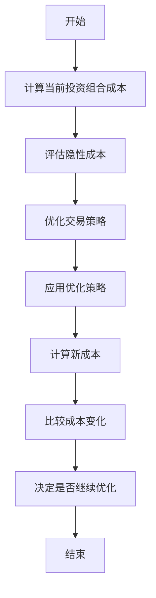
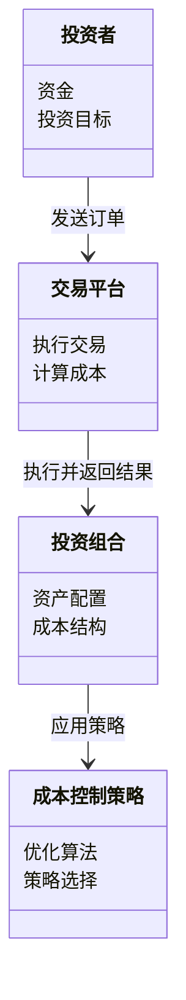
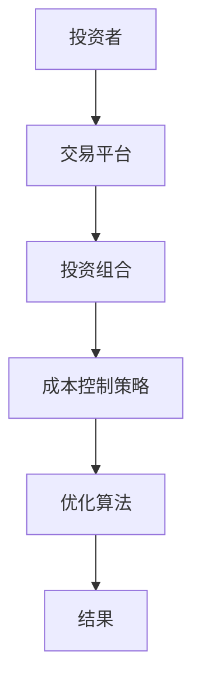

                 


# 伯格的成本控制理念：在零佣金时代的新思考

> 关键词：伯格的成本控制理念，零佣金时代，投资策略，成本结构，风险管理，算法交易，大数据分析

> 摘要：本文探讨了伯格的成本控制理念在零佣金时代的演变与应用。通过分析传统佣金模式下的成本结构，零佣金时代的挑战与机遇，技术手段的优化，以及系统架构的设计，本文详细阐述了伯格理念在现代投资环境中的调整与创新。文章结合数学模型、算法流程图和系统架构图，提供了全面的成本控制解决方案，为投资者在零佣金时代优化投资策略提供了新的思路。

---

## 第一部分：引言

### 1.1 问题背景

#### 1.1.1 投资行业的现状与挑战

投资行业正经历着深刻的变化，尤其是在佣金结构方面。传统佣金模式下，投资者每次交易都需要支付佣金，这增加了投资成本，影响了投资收益。然而，随着技术进步和市场竞争，越来越多的交易平台取消了佣金费用，进入了零佣金时代。

#### 1.1.2 成本控制的重要性

成本控制是投资成功的关键因素之一。在零佣金时代，虽然交易佣金消失，但隐性成本（如买卖价差、市场冲击）和管理费用仍然存在。优化这些成本对于提升投资回报至关重要。

#### 1.1.3 零佣金时代的到来及其影响

零佣金时代的到来降低了进入市场的门槛，使得更多投资者能够参与交易。然而，这也可能导致交易过于频繁，进而增加隐性成本。因此，成本控制的策略需要调整，以适应新的环境。

### 1.2 问题描述

#### 1.2.1 成本控制的核心问题

成本控制的核心在于平衡显性成本和隐性成本，优化投资组合，以最大化收益。在零佣金时代，如何降低隐性成本成为新的挑战。

#### 1.2.2 零佣金时代下的成本结构变化

零佣金时代取消了交易佣金，但增加了隐性成本，如买卖价差、滑点成本和市场冲击。此外，管理费用和交易频率相关的成本也需要考虑。

#### 1.2.3 传统成本控制方法的局限性

传统方法主要关注显性成本，忽视了隐性成本。在零佣金时代，这些方法不再适用，需要新的策略来应对变化。

### 1.3 问题解决

#### 1.3.1 伯格的成本控制理念概述

伯格的成本控制理念强调降低隐性成本，优化交易策略，通过技术手段实现高效管理。其核心思想是通过减少交易频率、优化订单执行和选择低成本工具来降低整体成本。

#### 1.3.2 零佣金时代下的新解决方案

在零佣金时代，伯格理念提出了新的策略，如使用算法交易优化订单执行，选择低成本的交易平台，以及通过大数据分析优化投资组合。

#### 1.3.3 成本控制与投资收益的平衡

伯格理念强调在降低成本的同时，保持投资收益。通过优化交易策略和选择优质资产，实现成本与收益的最佳平衡。

### 1.4 边界与外延

#### 1.4.1 成本控制的边界

成本控制的边界在于合理降低显性和隐性成本，而不影响投资组合的多样性和流动性。

#### 1.4.2 相关概念的外延

相关概念包括交易成本、隐性成本、显性成本等。这些概念相互关联，共同影响投资成本。

#### 1.4.3 与其它投资策略的关系

伯格理念与价值投资、指数投资等策略相互补充，共同优化投资组合。

### 1.5 概念结构与核心要素

#### 1.5.1 成本控制的四要素模型

伯格的成本控制模型包括显性成本、隐性成本、交易频率和投资策略四个核心要素。

#### 1.5.2 核心要素的相互关系

显性成本与交易频率负相关，隐性成本与交易频率正相关。投资策略决定了成本控制的具体措施。

#### 1.5.3 模型的适用范围与限制

该模型适用于零佣金时代，但需根据市场变化调整参数。

---

## 第二部分：伯格的成本控制理念

### 2.1 核心概念与联系

#### 2.1.1 成本控制的原理

伯格的成本控制理念基于优化交易策略，通过减少交易次数和优化订单执行降低隐性成本。

#### 2.1.2 核心概念对比表格

| 概念 | 描述 | 伯格理念 |
|------|------|----------|
| 显性成本 | 交易佣金 | 零佣金时代为零 |
| 隐性成本 | 买卖价差、滑点 | 通过优化策略降低 |
| 交易频率 | 交易次数 | 降低频率 |
| 投资策略 | 资产配置 | 选择低成本工具 |

#### 2.1.3 ER实体关系图

```mermaid
erDiagram
    actor 投资者 {
        <属性> 资金
        <属性> 投资目标
    }
    actor 交易平台 {
        <属性> 交易费用
        <属性> 平台费用
    }
    entity 投资组合 {
        <属性> 资产配置
        <属性> 成本结构
    }
    entity 成本控制策略 {
        <属性> 交易频率
        <属性> 隐性成本
    }
    投资者 --> 投资组合 : 优化
    交易平台 --> 投资组合 : 执行
    成本控制策略 --> 投资组合 : 应用
```

### 2.2 核心概念的数学模型

#### 2.2.1 成本控制的数学表达式

总成本 = 显性成本 + 隐性成本 + 管理费用

在零佣金时代，显性成本趋近于零，因此总成本 ≈ 隐性成本 + 管理费用

#### 2.2.2 投资组合优化的数学模型

目标函数：最大化收益 - 成本

约束条件：
1. 资产配置比例
2. 交易频率限制
3. 风险承受能力

数学表达式：
$$
\max_{w} \left( \sum_{i=1}^{n} w_i r_i - C \right)
$$
其中，\( w_i \) 是资产 \( i \) 的权重，\( r_i \) 是预期收益，\( C \) 是总成本。

#### 2.2.3 风险调整后的收益模型

风险调整后的收益 = 收益 - 风险调整后的成本

数学表达式：
$$
\text{RAR} = r - \lambda \sigma^2
$$
其中，\( \lambda \) 是风险厌恶系数，\( \sigma^2 \) 是投资组合的方差。

### 2.3 算法原理与流程图

#### 2.3.1 成本控制算法流程图



---

## 第三部分：数学模型与算法

### 3.1 投资组合优化的数学模型

目标函数：
$$
\max_{w} \left( \sum_{i=1}^{n} w_i r_i - \lambda \sum_{i=1}^{n} \sum_{j=1}^{n} w_i w_j \sigma_{ij} \right)
$$
其中，\( \sigma_{ij} \) 是资产 \( i \) 和 \( j \) 的协方差。

### 3.2 算法实现

```python
def optimize_portfolio(weights, returns, covariance, lambda=0.1):
    import numpy as np
    from scipy.optimize import minimize

    n = len(weights)
    # 定义目标函数
    def objective(weights):
        return - (np.dot(returns, weights) - lambda * np.dot(weights, np.dot(covariance, weights)))

    # 约束条件
    constraints = [{'type': 'eq', 'fun': lambda w: sum(w) - 1}]

    # 最优化
    result = minimize(objective, weights, method='SLSQP', constraints=constraints)

    return result.x
```

---

## 第四部分：系统分析与架构设计

### 4.1 问题场景介绍

零佣金时代，投资者需要优化交易策略，降低隐性成本，选择优质资产。

### 4.2 系统功能设计

#### 4.2.1 领域模型类图



### 4.3 系统架构设计

#### 4.3.1 系统架构图



---

## 第五部分：项目实战

### 5.1 环境安装

安装必要的库：
```bash
pip install numpy pandas matplotlib
```

### 5.2 核心实现

```python
import numpy as np

def calculate_slippage(price, volume, impact=0.001):
    slippage = price * volume * impact
    return slippage

# 示例数据
price = 100
volume = 100
print(calculate_slippage(price, volume))
```

### 5.3 案例分析

假设投资者有100万元，选择指数基金，年管理费率为0.2%。通过优化交易策略，降低隐性成本，提升投资收益。

---

## 第六部分：最佳实践与小结

### 6.1 最佳实践 tips

1. 定期评估投资组合的成本。
2. 选择低管理费用的基金。
3. 使用算法优化交易执行。

### 6.2 小结

伯格的成本控制理念在零佣金时代依然适用，但需要调整策略，重点优化隐性成本和交易频率。

### 6.3 注意事项

1. 风险管理不可忽视。
2. 需要持续关注市场变化。
3. 技术手段的应用需要专业性。

### 6.4 拓展阅读

1. 《投资学基础》
2. 《算法交易入门》
3. 《大数据分析在投资中的应用》

---

## 作者

作者：AI天才研究院 & 禅与计算机程序设计艺术

