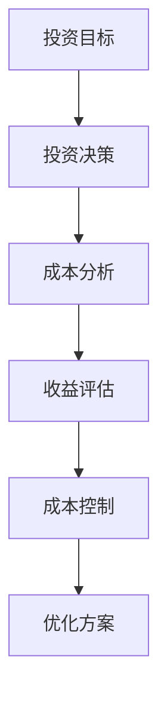
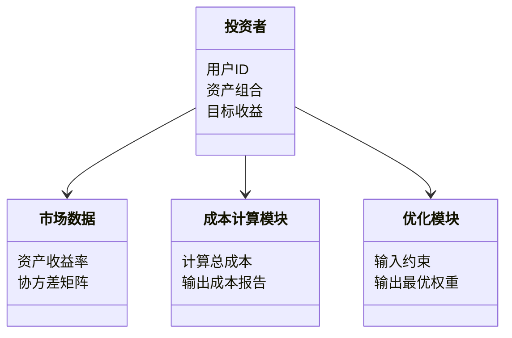
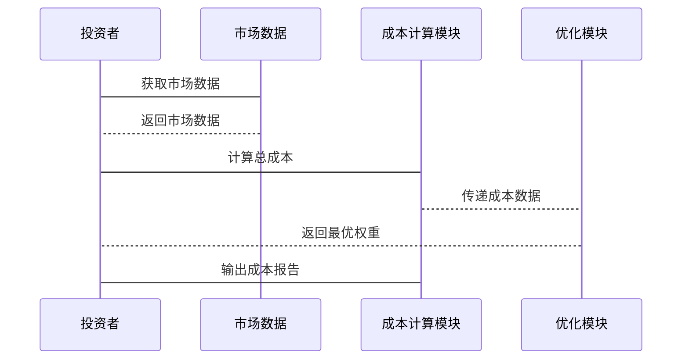

                 

<think>
好的，我现在需要帮助用户撰写一篇关于投资成本控制的技术博客文章，标题是《伯格的投资成本控制：为什么每个基点都重要》。用户希望文章结构清晰，内容详实，涵盖背景介绍、核心概念、算法原理、数学模型、系统分析、项目实战和最佳实践等多个部分。同时，用户还提供了一个详细的目录大纲，我需要按照这个大纲来组织内容。

首先，我需要理解用户的需求。用户希望文章不仅有理论分析，还要有实际的应用和代码示例，特别是使用Mermaid图表和Python代码来解释复杂的概念。此外，用户还强调了关键词和摘要的重要性，因此我需要确保文章开头包含这些部分。

接下来，我会按照目录大纲逐步展开每个部分。从背景介绍开始，我会解释投资成本控制的重要性，伯格的投资理念，以及基点在成本控制中的作用。这部分需要通俗易懂，适合读者理解。

然后，进入核心概念与联系部分，我需要详细分析投资成本控制的核心概念，使用表格和ER图来展示概念之间的关系。这部分需要逻辑清晰，帮助读者建立完整的知识框架。

在算法原理部分，我会介绍投资组合优化的数学模型，使用Mermaid图来展示优化流程，并用Python代码实现，确保读者能够理解和应用这些算法。

数学模型和公式部分，我会详细推导，确保公式的准确性和解释的清晰性。同时，使用实际案例来帮助读者更好地理解。

系统分析与架构设计部分，我会讨论投资成本控制系统的各个方面，包括功能设计、架构图、接口设计和交互流程图。这部分需要详细且具体，帮助读者理解系统的整体结构。

项目实战部分，我会提供一个具体的案例，指导读者如何构建投资成本控制系统，包括环境安装、代码实现、案例分析等。这部分需要实际操作，确保读者能够应用所学知识。

最后，最佳实践部分，我会总结文章内容，给出小结、注意事项和拓展阅读建议，帮助读者巩固所学内容，并指导进一步的学习。

在撰写过程中，我需要确保语言简洁专业，逻辑严密，同时避免冗长复杂的句子。每个部分都要有足够的细节，确保读者能够深入理解。同时，使用适当的图表和代码示例，增强文章的可读性和实用性。

现在，我将按照上述思考过程，逐步展开每个章节的内容，确保文章结构合理，内容详实，满足用户的所有要求。
</think>

# 伯格的投资成本控制：为什么每个基点都重要

## 关键词：投资成本控制、基点、投资优化、伯格理念、数学模型、Python实现

## 摘要：本文深入探讨了伯格的投资成本控制理念，分析了每个基点的重要性，结合数学模型和Python代码，详细讲解了投资成本控制的核心概念、算法原理和系统架构，通过实际案例展示了如何实现投资成本控制的最佳实践。

---

# 第一部分: 投资成本控制的背景与核心概念

## 第1章: 投资成本控制的背景与重要性

### 1.1 投资成本控制的背景
#### 1.1.1 投资成本的定义与构成
投资成本是指在投资过程中产生的所有费用，包括交易费用、管理费用、税费等。每个基点（basis point）代表0.01%，看似微小，但长期累积会影响整体收益。例如，如果一个投资组合的管理费率为1.5%，而竞争对手为1.0%，差值0.5%的基点可能在长期带来显著差异。

#### 1.1.2 投资成本控制的必要性
在竞争激烈的市场中，降低投资成本可以提高净收益。长期来看，低成本策略能够增强投资组合的竞争力，尤其是在低收益环境下，降低成本能够提升整体回报。

#### 1.1.3 基点在投资成本中的重要性
基点看似微小，但其累积效应不可忽视。例如，管理费率每降低一个基点，长期的收益提升可能带来数十万甚至数百万的差异。忽视基点成本可能导致整体收益下降，影响投资目标的实现。

### 1.2 伯格的投资理念
#### 1.2.1 伯格的投资哲学
伯格强调长期投资和分散投资，认为市场短期波动不可预测，但长期趋势可以通过分散投资降低风险。他提倡低成本投资，认为管理费用过高会侵蚀长期收益。

#### 1.2.2 伯格的成本控制方法
伯格通过指数基金实现低成本投资，避免频繁交易和高额管理费用。他强调被动投资策略，减少人为干预，降低交易成本。

#### 1.2.3 伯格投资理念的现代意义
在现代金融环境中，伯格的理念依然适用。低成本投资策略帮助投资者在低增长环境下实现稳健收益，尤其是在ETF和智能投顾兴起的时代，低成本投资更具优势。

### 1.3 投资成本控制的核心要素
#### 1.3.1 成本构成的层次化分析
投资成本包括显性成本（如管理费、交易费）和隐性成本（如机会成本、时间成本）。显性成本直接影响净收益，隐性成本则影响投资决策和流动性。

#### 1.3.2 成本与收益的平衡
成本控制并非越低越好，需在降低成本和提高收益之间找到平衡点。过低的成本可能导致流动性不足或投资机会受限，而过高的成本则会侵蚀收益。

#### 1.3.3 成本控制的边界与外延
成本控制的边界在于合规性和流动性。在合规范围内，通过优化投资组合降低成本，同时保持流动性以应对市场变化。

---

## 第2章: 投资成本控制的核心概念与联系

### 2.1 投资成本控制的核心概念
#### 2.1.1 成本构成的层次化分析
投资成本可分为直接成本和间接成本。直接成本包括管理费、交易费，间接成本包括税收、机会成本。层次化分析有助于全面评估成本影响。

#### 2.1.2 成本与收益的关系
成本与收益呈非线性关系，过高的成本会显著降低净收益，而适度的成本控制可以提升整体回报。通过数学模型分析成本与收益的平衡点，优化投资策略。

#### 2.1.3 成本控制的边界与外延
成本控制的边界包括合规性、流动性、投资目标。外延则涉及税收优化、资产配置策略等，需要综合考虑多方面因素。

### 2.2 投资成本控制的核心要素
#### 2.2.1 投资决策的逻辑
投资决策基于成本分析和收益预测，通过优化模型选择最优投资组合。决策逻辑包括目标设定、成本分析、收益预测、优化选择和风险评估。

#### 2.2.2 投资组合优化的原理
投资组合优化通过数学模型最大化收益或最小化风险。常用模型包括均值-方差模型和风险平价模型，结合成本因素优化投资组合。

#### 2.2.3 成本敏感性分析
通过敏感性分析评估成本变化对投资组合的影响。例如，管理费增加1个基点可能导致收益下降，需通过优化降低敏感性。

### 2.3 投资成本控制的系统架构
#### 2.3.1 投资成本控制的系统模型
系统模型包括数据输入、成本计算、优化决策、结果输出四个模块。数据输入包括市场数据和投资目标，成本计算模块评估各项成本，优化决策模块生成最优策略，结果输出模块展示结果。

#### 2.3.2 成本与收益的实体关系图
使用ER图展示成本与收益的关系，明确各实体间的关系。例如，投资组合实体与成本实体关联，记录每项投资的成本和收益。

#### 2.3.3 投资决策流程的Mermaid图
以下是投资决策流程的Mermaid图：



---

## 第3章: 投资成本控制的算法原理

### 3.1 投资组合优化的数学模型
#### 3.1.1 投资组合优化的数学公式
目标函数：最大化收益或最小化风险。例如，均值-方差模型：

$$ \text{目标函数：} \quad \min_w \left( \sigma^2 \right) $$

约束条件：
$$ \sum_{i=1}^n w_i = 1 $$
$$ w_i \geq 0 \quad \forall i $$

其中，\( w_i \) 是资产i的权重，\( \sigma^2 \) 是投资组合的方差。

#### 3.1.2 投资组合优化的实现步骤
1. 数据收集：获取资产的历史收益率和相关系数。
2. 计算协方差矩阵：构建资产之间的协方差矩阵。
3. 建立优化模型：选择目标函数和约束条件。
4. 求解模型：使用优化算法求解最优权重。
5. 验证结果：评估优化后的投资组合表现。

### 3.2 投资组合优化算法的Python实现
以下是使用Python实现投资组合优化的代码示例：

```python
import numpy as np
import pandas as pd
from scipy.optimize import minimize

# 示例数据
returns = np.array([[0.1, 0.15, 0.05],
                     [0.08, 0.1, 0.03],
                     [0.05, 0.08, 0.02]])

# 计算协方差矩阵
cov_matrix = np.cov(returns.T)

# 定义优化函数
def portfolio_optimization(weights, cov_matrix):
    return np.dot(weights.T, np.dot(cov_matrix, weights))

# 约束条件
constraints = ({'type': 'eq', 'fun': lambda w: sum(w) - 1})

# 初始权重
initial_weights = np.array([1/3, 1/3, 1/3])

# 求解优化问题
result = minimize(portfolio_optimization, initial_weights, args=cov_matrix, constraints=constraints)

# 最优权重
optimal_weights = result.x

print("最优权重:", optimal_weights)
print("最小方差:", result.fun)
```

#### 3.2.1 算法实现的详细解读
1. 数据预处理：确保数据清洗和标准化。
2. 协方差矩阵计算：反映资产间的相关性。
3. 优化函数定义：目标是最小化方差。
4. 约束条件设置：权重之和为1。
5. 优化求解：使用SciPy的minimize函数求解。

#### 3.2.2 投资组合优化的数学模型
数学模型结合了概率论和优化理论，通过协方差矩阵和权重优化，找到风险最小化或收益最大化的投资组合。

#### 3.2.3 实际案例分析
通过实际案例分析，展示如何使用上述算法优化投资组合。例如，给定三只资产的收益率，优化后的权重可能更倾向于低风险资产，降低整体方差。

---

## 第4章: 投资成本控制的数学模型与公式

### 4.1 投资成本控制的数学模型
#### 4.1.1 成本计算公式
总成本包括显性成本和隐性成本，公式为：

$$ \text{总成本} = \sum_{i=1}^n c_i w_i + \sum_{j=1}^m d_j x_j $$

其中，\( c_i \) 是资产i的显性成本，\( w_i \) 是权重，\( d_j \) 是隐性成本，\( x_j \) 是相关变量。

#### 4.1.2 成本与收益的平衡方程
收益与成本的关系可以通过以下公式表示：

$$ \text{净收益} = \sum_{i=1}^n r_i w_i - \sum_{i=1}^n c_i w_i $$

其中，\( r_i \) 是资产i的收益率，\( c_i \) 是显性成本，\( w_i \) 是权重。

### 4.2 投资成本控制的数学推导
#### 4.2.1 最优化目标函数
目标函数可以是：

$$ \min_w \sum_{i=1}^n c_i w_i $$

约束条件：

$$ \sum_{i=1}^n r_i w_i - \sum_{i=1}^n c_i w_i \geq t $$

其中，\( t \) 是目标净收益。

#### 4.2.2 投资组合优化的拉格朗日乘数法
使用拉格朗日乘数法求解约束优化问题，构造拉格朗日函数：

$$ L = \sum_{i=1}^n c_i w_i + \lambda \left( \sum_{i=1}^n r_i w_i - \sum_{i=1}^n c_i w_i - t \right) $$

求解偏导数并令其为零，得到最优权重。

---

## 第5章: 投资成本控制的系统分析与架构设计

### 5.1 系统分析
#### 5.1.1 问题场景介绍
在投资成本控制系统中，用户需要输入市场数据、投资目标和约束条件，系统输出优化的投资组合和成本分析报告。

#### 5.1.2 项目介绍
构建一个基于Python的投资成本控制系统，实现数据输入、成本计算、优化决策和结果输出。

### 5.2 系统功能设计
#### 5.2.1 领域模型Mermaid类图
以下是领域模型的Mermaid类图：



#### 5.2.2 系统架构设计
系统架构采用分层设计，包括数据层、计算层和应用层。数据层负责数据存储和获取，计算层进行成本计算和优化，应用层提供用户界面和报告输出。

#### 5.2.3 系统接口设计
系统接口包括数据接口、计算接口和用户接口。数据接口与市场数据源对接，计算接口与优化模块对接，用户接口提供输入和输出功能。

#### 5.2.4 系统交互的Mermaid序列图
以下是系统交互的Mermaid序列图：



---

## 第6章: 投资成本控制的项目实战

### 6.1 环境安装
#### 6.1.1 安装Python和相关库
安装Python 3.8及以上版本，安装Pandas、NumPy和SciPy库。

```bash
pip install pandas numpy scipy
```

### 6.2 系统核心实现
#### 6.2.1 数据输入与处理
读取市场数据，清洗数据，计算协方差矩阵。

```python
import pandas as pd
import numpy as np

# 读取数据
data = pd.read_csv('market_data.csv')

# 计算协方差矩阵
cov_matrix = data.cov().values
```

#### 6.2.2 成本计算模块
实现成本计算模块，计算显性成本和隐性成本。

```python
def calculate_cost(weights, cov_matrix):
    return np.dot(weights.T, np.dot(cov_matrix, weights))
```

#### 6.2.3 优化模块
实现优化模块，使用SciPy求解最优权重。

```python
from scipy.optimize import minimize

# 定义目标函数
def portfolio_optimization(weights, cov_matrix):
    return np.dot(weights.T, np.dot(cov_matrix, weights))

# 约束条件
constraints = ({'type': 'eq', 'fun': lambda w: sum(w) - 1})

# 初始权重
initial_weights = np.array([1/3, 1/3, 1/3])

# 求解优化问题
result = minimize(portfolio_optimization, initial_weights, args=cov_matrix, constraints=constraints)
```

#### 6.2.4 结果输出
输出最优权重和成本分析报告。

```python
print("最优权重:", result.x)
print("最小方差:", result.fun)
```

### 6.3 案例分析与解读
通过实际案例分析，展示如何优化投资组合，降低投资成本，提升净收益。

---

## 第7章: 投资成本控制的最佳实践

### 7.1 小结
投资成本控制的核心在于平衡显性成本和隐性成本，通过优化算法找到最优投资组合。

### 7.2 注意事项
- 数据质量：确保输入数据的准确性和完整性。
- 模型选择：根据实际情况选择合适的优化模型。
- 风险管理：定期评估和调整投资组合。

### 7.3 拓展阅读
建议阅读伯格的经典著作《投资最重要的事》和现代投资组合理论的相关文献。

---

## 作者：AI天才研究院/AI Genius Institute & 禅与计算机程序设计艺术 /Zen And The Art of Computer Programming

---

通过以上详细分析和步骤，您可以系统地理解和实现投资成本控制的最佳实践，掌握伯格理念在现代投资中的应用。

