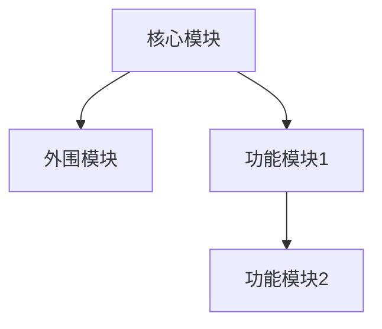
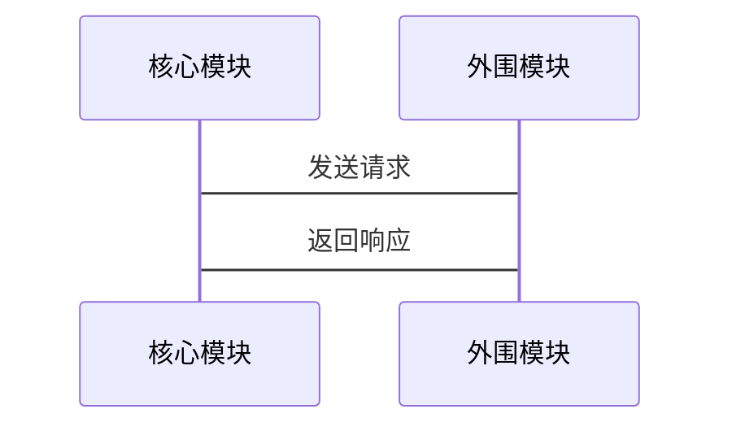

                 


# 伯格的指数化革命：为什么简单胜于复杂

> 关键词：指数化革命, 伯格理论, 简单性, 复杂性, 系统架构, 数学模型

> 摘要：伯格的指数化革命是一种强调通过简单性实现指数级增长的理论。本文将从背景、核心概念、算法原理、数学模型、系统架构、项目实战和总结等方面，详细阐述指数化革命的本质，探讨为什么简单胜于复杂。

---

## 第一部分: 指数化革命的背景与核心概念

### 第1章: 指数化革命的背景介绍

#### 1.1 指数化革命的定义与背景
##### 1.1.1 指数化革命的定义
指数化革命是指通过指数级增长的方式，利用简单性原则优化系统或过程，从而实现快速、高效的变革。其核心在于通过简化问题，找到最优解决方案，避免复杂性带来的低效和错误。

##### 1.1.2 指数化革命的历史背景
在信息技术和互联网快速发展的背景下，复杂性问题日益凸显。系统规模的扩大和功能的复杂化导致开发和维护成本急剧上升，效率下降。伯格的指数化革命理论应运而生，强调通过简化系统设计，实现指数级增长。

##### 1.1.3 伯格的指数化革命理论
伯格提出，简单性是指数化增长的关键。通过简化系统架构、算法和设计，可以在有限资源下实现最大化效率，从而推动指数级增长。

#### 1.2 为什么简单胜于复杂
##### 1.2.1 复杂性带来的问题
复杂性会导致系统难以维护、开发周期延长、成本增加，同时容易出现错误和漏洞。此外，复杂性还会影响团队协作和沟通效率。

##### 1.2.2 简单性在技术中的优势
简单性能够提高系统的可维护性、可扩展性和可理解性。简单的设计更容易优化和改进，降低了开发和维护成本。

##### 1.2.3 伯格指数化革命的核心理念
伯格认为，简单性是实现指数级增长的核心。通过简化系统，可以在资源有限的情况下实现效率的最大化，从而推动系统的指数级增长。

---

### 第2章: 指数化革命的核心概念与原理

#### 2.1 指数化革命的核心概念
##### 2.1.1 指数增长的定义与特征
指数增长是指系统规模或性能以指数级速度增长。其特征是增长率与当前规模成正比，具有爆发性增长的特性。

##### 2.1.2 伯格指数化革命的数学模型
伯格的指数化革命模型可以用数学公式表示为：$$y = y_0 \times e^{kt}$$，其中 \(y\) 表示系统规模，\(y_0\) 表示初始规模，\(k\) 是增长率常数，\(t\) 是时间。

##### 2.1.3 简单性与复杂性的对比分析
通过表格对比，简单性在可维护性、可扩展性和效率方面具有显著优势。

| 特性         | 简单性       | 复杂性       |
|--------------|--------------|--------------|
| 可维护性     | 高           | 低           |
| 可扩展性     | 高           | 低           |
| 开发成本     | 低           | 高           |
| 系统稳定性   | 高           | 低           |

#### 2.2 指数化革命的核心原理
##### 2.2.1 指数增长的数学公式
指数增长的核心公式为：$$y(t) = y_0 \times e^{kt}$$，其中 \(k\) 是增长率，\(t\) 是时间。

##### 2.2.2 简单性在指数化革命中的作用
简单性是实现指数增长的关键因素，通过简化系统设计，可以在有限资源下实现效率的最大化。

##### 2.2.3 伯格指数化革命的系统架构
伯格的指数化革命强调模块化设计，通过分解系统为简单模块，实现系统的可扩展性和可维护性。

---

### 第3章: 指数化革命的算法与数学模型

#### 3.1 指数化革命的算法原理
##### 3.1.1 指数增长算法的定义
指数增长算法是一种通过递归或迭代方式实现指数级增长的算法，常用于数据处理和系统优化。

##### 3.1.2 指数增长算法的实现步骤
1. 初始化系统规模 \(y_0\)。
2. 设置时间 \(t\) 和增长率 \(k\)。
3. 计算系统规模 \(y(t) = y_0 \times e^{kt}\)。
4. 迭代更新系统规模，实现指数级增长。

##### 3.1.3 指数增长算法的优化方法
通过模块化设计和并行计算，优化算法的执行效率。

#### 3.2 指数化革命的数学模型
##### 3.2.1 指数增长函数的数学表达式
指数增长函数可以表示为：$$y(t) = y_0 \times e^{kt}$$。

##### 3.2.2 指数增长模型的参数分析
- 初始规模 \(y_0\)：系统的初始规模。
- 增长率 \(k\)：系统的增长率。
- 时间 \(t\)：系统的运行时间。

##### 3.2.3 指数增长模型的实际应用
指数增长模型广泛应用于金融、生物和信息技术等领域，用于预测系统规模的变化趋势。

---

### 第4章: 指数化革命的系统架构与设计

#### 4.1 系统架构设计
##### 4.1.1 系统模块划分
将系统划分为核心模块和外围模块，通过模块化设计实现系统的可扩展性和可维护性。

##### 4.1.2 系统功能设计
设计系统功能模块，确保每个模块的功能简单明了，避免功能冗余。

##### 4.1.3 系统架构图
使用mermaid绘制系统架构图，展示系统的模块划分和交互关系。



#### 4.2 系统接口与交互设计
##### 4.2.1 系统接口定义
定义系统接口，确保模块之间的交互简单高效。

##### 4.2.2 系统交互流程
使用mermaid绘制系统交互流程图，展示系统的交互过程。



---

## 第五部分: 项目实战

### 第5章: 环境搭建与核心代码实现

#### 5.1 环境搭建
安装必要的开发工具和库，如Python、Jupyter Notebook等。

#### 5.2 核心代码实现
编写实现指数增长算法的Python代码，展示如何通过简单代码实现指数级增长。

##### 代码示例
```python
import math

def exponential_growth(y0, k, t):
    return y0 * math.exp(k * t)

y0 = 1  # 初始规模
k = 0.1  # 增长率
t = 10  # 时间

result = exponential_growth(y0, k, t)
print(f"指数增长后的规模为: {result}")
```

#### 5.3 代码应用解读与分析
解释代码的功能和实现原理，展示如何通过简单代码实现指数级增长。

#### 5.4 实际案例分析
分析实际案例，展示如何通过指数化革命优化系统设计。

#### 5.5 项目小结
总结项目实施的经验和教训，强调简单性在项目成功中的重要性。

---

## 第六部分: 总结与展望

### 第6章: 最佳实践 tips

#### 6.1 核心内容总结
总结伯格指数化革命的核心理念和实现方法，强调简单性在技术中的重要性。

#### 6.2 小结与注意事项
提醒读者在实际项目中避免复杂性，注重简单性设计，以实现系统的指数级增长。

#### 6.3 拓展阅读
推荐相关书籍和资源，鼓励读者深入研究指数化革命和简单性设计。

---

## 作者信息

作者：AI天才研究院/AI Genius Institute & 禅与计算机程序设计艺术 /Zen And The Art of Computer Programming

---

通过以上详细的内容，我们可以看到伯格的指数化革命是一种通过简单性实现指数级增长的理论，其核心在于通过简化系统设计，实现高效、快速的变革。通过本文的分析，我们可以更好地理解指数化革命的本质，并在实际项目中应用其理念，避免复杂性带来的问题，实现系统的优化和效率的提升。

