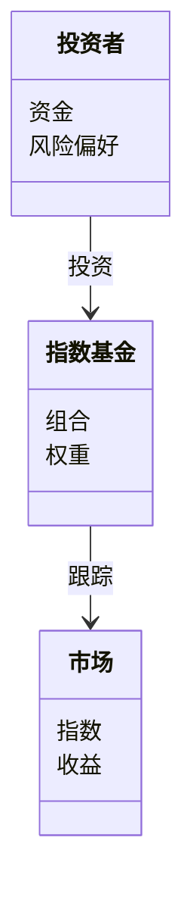
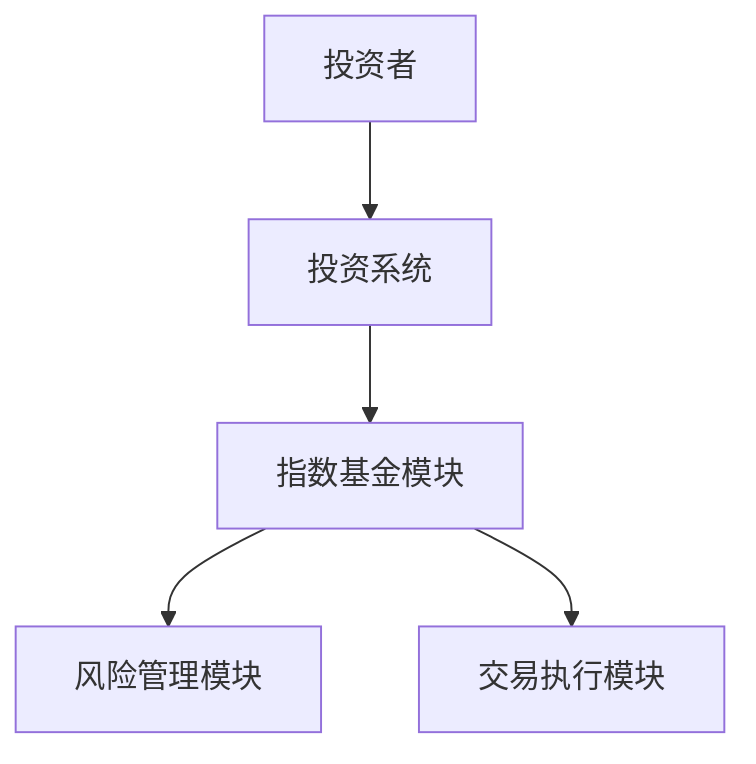
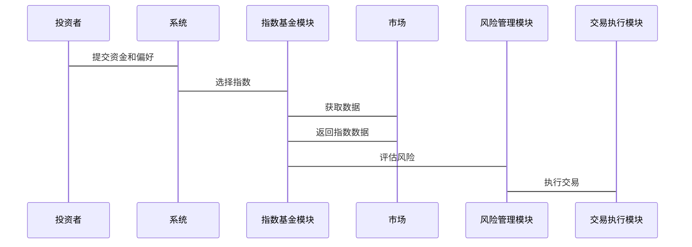

                 

<think>
好，我现在需要根据用户的要求，撰写一篇关于伯格指数基金革命的技术博客文章。首先，我需要明确文章的核心主题和结构。

首先，文章的标题是《伯格的指数基金革命：民主化的投资方式》，所以我要围绕指数基金的革命性影响展开。关键词需要包括指数基金、投资民主化、被动投资、现代投资组合理论、风险管理等。

接下来，摘要部分要简明扼要地概括文章的核心内容，强调指数基金如何改变了投资格局，使普通人也能进行高效投资。

正文部分分为六个章节。第一章介绍指数基金革命的背景，包括指数基金的起源、特点、运作机制以及对投资民主化的影响。第二章详细讲解指数基金的基本原理，涉及分类、选择标准以及数学模型。第三章分析投资策略与风险管理，结合现代投资组合理论和数学模型。第四章探讨指数基金的系统分析与架构设计，包括投资组合构建、风险管理策略以及交易执行方案。第五章通过项目实战，展示如何利用技术优化指数基金投资。最后，第六章总结指数基金的优势，并提出风险管理、投资者教育和技术创新等未来发展的建议。

在撰写过程中，我需要确保每一章都涵盖必要的内容，并且使用技术术语和数学模型来支持论点。例如，在第二章的指数基金分类中，使用表格对比不同指数基金的类型；在数学模型部分，使用LaTeX公式详细解释夏普比率和跟踪误差。

此外，系统架构部分需要用Mermaid图来展示投资系统的功能模块和交互流程，帮助读者更好地理解。项目实战部分则通过Python代码示例，展示如何构建和优化指数基金投资组合。

最后，在结论部分，我需要总结指数基金的重要性，并强调风险管理、投资者教育和技术创新在未来的投资中的关键作用。

整体来看，我需要确保文章结构清晰，逻辑严密，同时语言简洁明了，便于读者理解和应用这些投资策略。

现在，我需要按照这些思路来撰写每一章节的具体内容，确保满足用户的所有要求，包括使用Markdown格式、嵌入数学公式、使用图表和代码示例等。这样，整篇文章才能既专业又实用，帮助读者深入理解指数基金的投资革命。
</think>

# 伯格的指数基金革命：民主化的投资方式

> 关键词：指数基金、投资民主化、被动投资、现代投资组合理论、风险管理

> 摘要：伯格的指数基金革命彻底改变了投资领域，使普通人也能通过被动投资实现财富增长。本文将详细探讨指数基金的核心概念、数学模型、系统架构、投资策略以及风险管理，结合项目实战案例，全面剖析指数基金的投资价值与实际应用。

---

## 第一章：指数基金革命的背景与核心概念

### 1.1 指数基金革命的背景

#### 1.1.1 传统投资方式的局限性
传统的投资方式依赖于主动管理，依赖于基金经理的市场预测能力。这种模式不仅门槛高，而且费用昂贵，普通投资者难以负担。

#### 1.1.2 机构化投资的高门槛
机构投资者凭借资金、信息和专业能力占据优势，而普通投资者难以参与，导致投资资源分配不均。

#### 1.1.3 投资民主化的时代需求
随着金融市场的开放和互联网技术的发展，投资者渴望一种低成本、低门槛的投资方式，指数基金应运而生。

### 1.2 指数基金的定义与特点

#### 1.2.1 指数基金的定义
指数基金是跟踪特定市场指数的基金，通过复制指数的表现来实现投资收益。

#### 1.2.2 指数基金的核心特点
- **被动管理**：无需频繁交易，费用低。
- **分散风险**：投资于整个市场，降低单一股票风险。
- **透明性**：投资组合公开透明。

### 1.3 指数基金的运作机制

#### 1.3.1 指数基金的构建原理
通过复制指数成分股的权重，构建投资组合，实现与市场同步增长。

#### 1.3.2 指数基金的跟踪误差
跟踪误差是指数基金实际收益与跟踪指数收益的差异，反映了管理效率。

#### 1.3.3 指数基金的费用结构
管理费用和交易费用较低，适合长期投资。

### 1.4 指数基金革命对投资民主化的影响

#### 1.4.1 投资门槛的降低
指数基金让普通投资者也能分享市场收益。

#### 1.4.2 投资者的权利与责任
投资者不再依赖专业机构，但需承担选择和管理的责任。

---

## 第二章：指数基金的基本原理

### 2.1 指数基金的核心概念

#### 2.1.1 指数基金的投资目标
通过跟踪指数，实现长期稳定收益。

#### 2.1.2 指数基金的风险分散机制
广泛投资于市场，降低单一资产风险。

#### 2.1.3 指数基金的长期收益特性
长期来看，指数基金通常跑赢主动管理型基金。

### 2.2 指数基金的分类与选择

#### 2.2.1 市场指数与行业指数的区别
- **市场指数**：如标普500，代表整体市场表现。
- **行业指数**：如科技股指数，聚焦特定行业。

#### 2.2.2 指数基金的跟踪标的
选择与个人投资目标匹配的指数。

#### 2.2.3 指数基金的流动性与交易成本
高流动性的指数基金交易成本更低。

### 2.3 指数基金的数学模型与公式

#### 2.3.1 指数基金的收益计算公式
指数基金的收益可以表示为：
$$ R_f = \sum_{i=1}^{n} w_i R_i $$
其中，$w_i$ 是成分股的权重，$R_i$ 是成分股的收益。

#### 2.3.2 指数基金的风险衡量指标
夏普比率衡量风险调整后的收益：
$$ S = \frac{E[R - R_f]}{\sigma} $$
其中，$E[R - R_f]$ 是超额收益，$\sigma$ 是收益的标准差。

---

## 第三章：指数基金的投资策略与风险管理

### 3.1 现代投资组合理论与指数基金

#### 3.1.1 现代投资组合理论的核心思想
通过分散投资降低风险，实现收益最大化。

#### 3.1.2 指数基金在投资组合中的应用
作为核心持仓，提供稳定收益。

#### 3.1.3 风险与收益的平衡
通过调整指数基金的权重，优化整体投资组合的风险收益比。

### 3.2 指数基金的风险管理策略

#### 3.2.1 指数基金的波动性分析
分析指数基金的波动性，选择适合风险承受能力的投资策略。

#### 3.2.2 指数基金的再平衡策略
定期调整投资组合，保持与指数一致。

#### 3.2.3 指数基金的长期持有与定投策略
定投策略分散风险，适合长期投资。

### 3.3 指数基金的数学模型与风险管理

#### 3.3.1 风险调整后的收益模型
使用夏普比率评估风险调整后的收益。

#### 3.3.2 风险管理的数学公式
$$ \text{风险调整后收益} = E[R] - \lambda \sigma^2 $$
其中，$\lambda$ 是风险厌恶系数，$\sigma^2$ 是风险。

---

## 第四章：指数基金的系统分析与架构设计

### 4.1 投资系统功能设计

#### 4.1.1 领域模型


#### 4.1.2 系统架构设计


### 4.2 系统接口设计

#### 4.2.1 投资者与系统的交互
- 投资者输入资金和风险偏好。
- 系统根据输入选择指数基金。

#### 4.2.2 系统与市场的交互
- 实时获取市场指数数据。
- 调整投资组合。

### 4.3 系统交互流程

#### 4.3.1 投资决策流程


---

## 第五章：指数基金的项目实战

### 5.1 环境安装

#### 5.1.1 Python环境配置
安装Python和必要的库，如`pandas`、`numpy`、`scipy`。

### 5.2 系统核心实现源代码

#### 5.2.1 数据获取与处理
```python
import pandas as pd
import numpy as np

# 获取指数数据
data = pd.read_csv('index.csv')

# 计算收益
returns = data.pct_change().dropna()

# 计算夏普比率
def sharpe_ratio(returns, risk_free_rate=0):
    excess_returns = returns - risk_free_rate
    return excess_returns.mean() / excess_returns.std()

sharpe_ratio(returns)
```

### 5.3 代码应用解读与分析

#### 5.3.1 数据获取
从CSV文件读取指数数据，计算每日收益率。

#### 5.3.2 夏普比率计算
评估指数基金的风险调整后收益。

### 5.4 实际案例分析

#### 5.4.1 案例背景
以标普500指数为例，分析指数基金的收益和风险。

#### 5.4.2 数据分析结果
展示计算的夏普比率和跟踪误差。

### 5.5 项目小结

指数基金通过技术优化投资策略，降低门槛，实现高效投资。

---

## 第六章：指数基金的未来展望与投资建议

### 6.1 指数基金的优势与局限

#### 6.1.1 优势
- 成本低
- 风险分散
- 透明性高

#### 6.1.2 局限
- 跟踪误差
- 无法超越市场

### 6.2 风险管理建议

#### 6.2.1 风险管理的重要性
通过定投和多样化降低风险。

#### 6.2.2 风险管理的数学模型
使用VaR和CVaR评估潜在损失。

### 6.3 投资者教育与市场推广

#### 6.3.1 教育的重要性
帮助投资者理解指数基金的优势。

#### 6.3.2 市场推广策略
通过案例和教育降低投资者顾虑。

### 6.4 技术创新与优化

#### 6.4.1 技术创新的潜力
利用AI优化投资组合。

#### 6.4.2 创新带来的优势
提高投资效率，降低费用。

### 6.5 未来投资趋势

#### 6.5.1 长期投资的重要性
强调长期持有，避免短期波动影响。

---

## 结论

伯格的指数基金革命通过民主化投资方式，使普通投资者也能分享市场收益。通过系统化的投资策略和风险管理，指数基金成为现代投资的重要工具。未来，随着技术进步和投资者教育的普及，指数基金将继续引领投资革命，为更多人带来财富增长。

作者：AI天才研究院/AI Genius Institute & 禅与计算机程序设计艺术/Zen And The Art of Computer Programming

