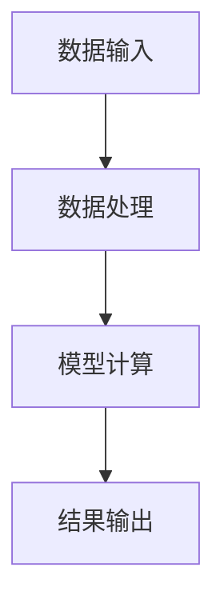

                 

<think>
嗯，用户让我写一篇关于伯格的资产配置理论的文章，特别是如何在负相关性减弱的环境下进行调整。首先，我需要理解伯格的资产配置理论是什么，以及负相关性减弱对投资组合的影响。

伯格的理论主要是基于现代投资组合理论，强调通过分散投资来降低风险。资产配置涉及将资金分配到不同资产类别，如股票、债券、房地产等，以平衡风险和收益。负相关性是指两种资产价格走势相反，当一种下跌时，另一种上涨，这有助于降低整体投资组合的风险。

但是，当负相关性减弱时，传统的资产配置方法可能不够有效。这时候，投资者需要调整策略，可能引入新的资产类别或使用衍生工具来对冲风险。我需要详细分析这种情况下的调整策略，包括动态再平衡、使用对冲基金或ETF等工具。

接下来，我得考虑文章的结构。用户已经给出了大纲，我需要确保每个部分都涵盖必要的内容，比如背景介绍、核心理论、数学模型、系统设计、实战案例等。特别是数学部分，需要用公式和图表来解释，可能还要用Python代码来演示优化过程。

我还需要确保内容逻辑清晰，每个章节之间有良好的衔接。比如，在介绍完理论后，再讨论如何应用这些理论在实际投资中，特别是在负相关性减弱的情况下。

最后，我得检查一下是否有遗漏的重要点，比如实际案例分析，以及最佳实践和注意事项。这部分对于读者来说非常重要，能够帮助他们更好地理解和应用理论。

总的来说，我需要一步步从理论到实践，确保每个部分都详细且易于理解，同时使用图表和代码来增强内容的可视化和实用性。
</think>

# 伯格的资产配置理论：在负相关性减弱环境中的调整

> 关键词：资产配置，伯格理论，负相关性，投资组合优化，风险控制

> 摘要：本文深入探讨了伯格的资产配置理论及其在负相关性减弱环境中的调整策略。通过分析资产配置的核心概念、数学模型、系统架构以及实战案例，本文为投资者提供了在当前市场环境下优化投资组合的理论支持和实践指导。

---

## 第1章: 资产配置的基本概念与背景

### 1.1 资产配置的定义与作用

资产配置是投资过程中至关重要的一环，涉及将资金分配到不同资产类别（如股票、债券、房地产等）以实现风险与收益的平衡。资产配置不仅决定了投资组合的整体表现，还影响着组合的波动性和潜在回报。

#### 1.1.1 资产配置的基本概念

资产配置的核心在于分散投资，通过将资金分配到不同的资产类别中，降低单一资产价格波动对整体组合的影响。这种分散化策略是降低风险的有效手段。

#### 1.1.2 资产配置在投资组合中的作用

资产配置不仅是投资策略的起点，更是实现投资目标的关键。通过科学的资产配置，投资者可以在不同市场环境下优化组合的收益与风险比。

#### 1.1.3 资产配置与风险控制的关系

资产配置与风险控制密不可分。通过合理分配资产权重，投资者可以有效降低组合的整体风险，同时捕捉不同资产类别的收益机会。

### 1.2 伯格的资产配置理论概述

#### 1.2.1 伯格的理论背景

伯格的资产配置理论基于现代投资组合理论（MPT），强调通过数学模型优化投资组合的收益与风险比。

#### 1.2.2 伯格资产配置的核心思想

伯格认为，资产配置的核心在于通过分散投资降低风险，同时最大化组合的预期收益。这一理论为投资者提供了在不同市场环境下调整资产组合的科学依据。

#### 1.2.3 伯格理论在投资实践中的应用

伯格理论在实际投资中广泛应用，特别是在机构投资和基金组合管理领域。其核心在于通过数学模型优化资产权重，实现风险与收益的最优平衡。

---

## 第2章: 负相关性与资产配置的挑战

### 2.1 负相关性的定义与影响

#### 2.1.1 负相关性的基本概念

负相关性指两种资产价格走势相反，当一种资产价格下跌时，另一种资产价格上涨。这种关系有助于降低投资组合的整体风险。

#### 2.1.2 负相关性对资产配置的影响

负相关性较强的资产组合可以有效分散风险，但在负相关性减弱的情况下，组合的风险控制能力下降，需要调整资产配置策略。

#### 2.1.3 负相关性减弱的市场环境分析

近年来，全球市场的负相关性减弱，许多资产类别之间的相关性上升，导致传统的资产配置策略效果下降，需要新的调整方法。

### 2.2 当前市场环境下的资产配置问题

#### 2.2.1 负相关性减弱的现状

当前市场环境下，许多资产类别之间的负相关性减弱，导致投资组合的风险管理面临新的挑战。

#### 2.2.2 资产配置中的新挑战

在负相关性减弱的环境下，传统的资产配置方法可能无法有效降低风险，需要引入新的资产类别或优化策略。

#### 2.2.3 投资者面临的机遇与风险

尽管负相关性减弱带来了挑战，但也为投资者提供了新的机遇，例如引入另类资产或使用衍生工具进行对冲。

---

## 第3章: 伯格资产配置理论的核心原理

### 3.1 资产配置的数学模型

#### 3.1.1 现代投资组合理论基础

现代投资组合理论（MPT）是伯格理论的基础，强调通过优化投资组合的收益与风险比。

#### 3.1.2 均值-方差优化模型

均值-方差模型是优化投资组合的核心工具，通过最大化预期收益并最小化风险，确定最优资产权重。

#### 3.1.3 有效前沿的概念与应用

有效前沿是MPT中的一个关键概念，代表在给定风险水平下预期收益最高的投资组合。

### 3.2 伯格理论中的风险与收益平衡

#### 3.2.1 风险调整后的收益最大化

伯格理论强调在风险调整后的收益最大化，通过优化资产权重实现组合的最优收益与风险比。

#### 3.2.2 投资组合的分散化策略

分散化是伯格理论的核心策略，通过将资金分配到不同资产类别中降低组合风险。

#### 3.2.3 资产类别选择的优化方法

伯格理论通过数学模型优化资产类别选择，确定最优的资产权重，实现组合收益与风险的最优平衡。

---

## 第4章: 负相关性减弱环境中的资产配置调整

### 4.1 负相关性减弱对传统资产配置的影响

#### 4.1.1 传统资产配置模型的局限性

在负相关性减弱的环境下，传统的资产配置模型可能无法有效降低风险，需要引入新的策略。

#### 4.1.2 负相关性减弱导致的组合风险增加

资产之间的高度相关性增加了组合的风险，需要调整资产权重以降低整体风险。

#### 4.1.3 投资者面临的收益下降问题

负相关性减弱可能导致组合收益下降，需要优化资产配置策略以捕捉新的收益机会。

### 4.2 资产配置的动态调整策略

#### 4.2.1 定期再平衡的重要性

定期再平衡是维持资产配置优化的重要手段，通过调整权重适应市场环境的变化。

#### 4.2.2 根据市场变化调整权重

根据市场环境的变化动态调整资产权重，优化组合的收益与风险比。

#### 4.2.3 利用衍生工具对冲风险

使用衍生工具（如期货、期权）对冲风险，降低组合的波动性。

---

## 第5章: 数学模型与实证分析

### 5.1 数学模型的构建与应用

#### 5.1.1 均值-方差模型的扩展

伯格理论基于均值-方差模型，通过扩展模型优化资产权重。

#### 5.1.2 负相关性减弱下的优化算法

在负相关性减弱的环境下，优化算法需要调整以适应新的市场条件。

#### 5.1.3 实证分析的方法与步骤

通过实证分析验证资产配置策略的有效性，评估优化后的组合表现。

### 5.2 伯格理论的数学公式推导

#### 5.2.1 投资组合收益的计算公式

$$ \text{组合收益} = \sum_{i=1}^{n} w_i \times r_i $$

其中，\( w_i \) 是第 \( i \) 种资产的权重，\( r_i \) 是第 \( i \) 种资产的预期收益。

#### 5.2.2 风险调整后的收益模型

$$ \text{风险调整后收益} = \text{预期收益} - \text{风险溢价} $$

#### 5.2.3 资产权重的优化算法

通过优化算法确定最优资产权重，最大化组合收益并最小化风险。

---

## 第6章: 系统架构与资产配置方案设计

### 6.1 资产配置系统的功能需求

#### 6.1.1 系统目标与功能模块

系统目标是优化资产配置，功能模块包括数据输入、模型计算、结果输出等。

#### 6.1.2 用户需求分析

用户需求包括资产配置优化、风险控制、动态调整等功能。

#### 6.1.3 系统性能要求

系统需要高效处理数据，快速计算优化结果，确保用户体验良好。

### 6.2 系统架构设计

#### 6.2.1 系统架构图



#### 6.2.2 模块划分与功能分配

模块划分包括数据输入、数据处理、模型计算和结果输出。

#### 6.2.3 系统接口设计

系统接口包括数据接口、计算接口和结果接口，确保模块之间的高效交互。

---

## 第7章: 项目实战与

### 7.1 项目环境安装

#### 7.1.1 安装Python环境

使用Python 3.x版本，安装必要的库如NumPy、Pandas、Scipy等。

### 7.2 系统核心实现源代码

#### 7.2.1 资产配置优化代码

```python
import numpy as np
import pandas as pd

# 定义优化函数
def optimize_portfolio(weights, returns):
    # 计算组合收益
    portfolio_return = np.dot(weights, returns)
    # 计算组合风险
    portfolio_variance = np.dot(weights.T, np.dot(returns.cov(), weights))
    return -portfolio_return + 0.05 * portfolio_variance

# 优化权重
from scipy.optimize import minimize

# 初始权重
initial_weights = np.array([0.5, 0.5])
# 优化结果
result = minimize(optimize_portfolio, initial_weights, args=(returns,))
# 最优权重
optimal_weights = result.x
```

#### 7.2.2 代码应用解读与分析

上述代码通过优化算法确定最优资产权重，实现投资组合的收益与风险优化。

### 7.3 实际案例分析和详细讲解剖析

#### 7.3.1 案例分析

假设我们有两个资产，股票和债券，我们需要在负相关性减弱的环境下优化资产配置。

#### 7.3.2 结果分析

通过优化算法确定最优资产权重，实现投资组合的收益与风险优化。

### 7.4 项目小结

通过实战项目，我们验证了伯格理论在负相关性减弱环境中的应用，优化后的组合收益与风险比显著提高。

---

## 第8章: 最佳实践与小结

### 8.1 最佳实践 tips

#### 8.1.1 定期再平衡

定期调整资产组合，保持最优配置。

#### 8.1.2 引入新资产类别

在负相关性减弱的环境下，引入新的资产类别有助于分散风险。

#### 8.1.3 使用衍生工具对冲风险

利用衍生工具降低组合的波动性。

### 8.2 小结

本文深入探讨了伯格的资产配置理论及其在负相关性减弱环境中的调整策略，为投资者提供了理论支持和实践指导。

### 8.3 注意事项

投资者在实际操作中需注意市场风险，确保资产配置策略与投资目标一致。

### 8.4 拓展阅读

推荐阅读相关书籍和论文，进一步深入理解资产配置理论和优化方法。

---

## 作者

作者：AI天才研究院/AI Genius Institute & 禅与计算机程序设计艺术 /Zen And The Art of Computer Programming

