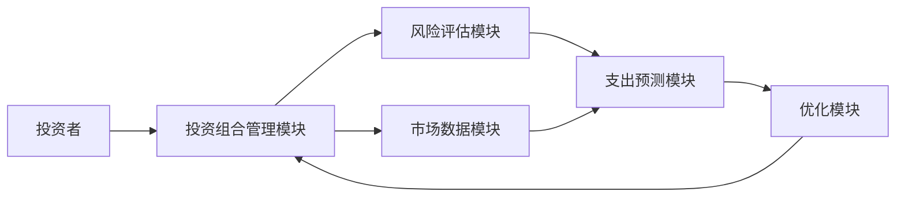
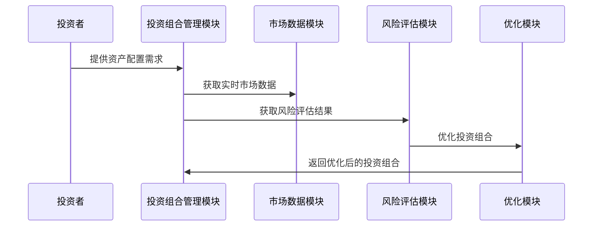

                 


# 《伯格的退休投资建议：应对长寿风险的投资策略》

## 关键词：退休投资、长寿风险、伯格、指数基金、财务规划、投资策略

## 摘要：本文深入探讨了伯格的退休投资策略，重点分析了长寿风险对退休财务规划的影响，并提出了应对长寿风险的投资策略。通过详细的数学模型、算法原理和系统架构设计，本文为读者提供了科学的退休投资方法，帮助读者在长寿时代实现财务稳健。

---

# 第一部分: 长寿风险与退休投资的背景

## 第1章: 长寿风险的现状与挑战

### 1.1 长寿风险的定义与影响

#### 1.1.1 长寿风险的定义
长寿风险是指在退休后由于寿命延长而导致的财务压力。随着医疗技术的进步和生活水平的提高，人们的平均寿命显著增加，许多人可能会面临退休资金不足以支撑长寿生活的风险。

#### 1.1.2 长寿对退休财务规划的影响
- **财务需求增加**：长寿意味着需要更多的资金来维持退休生活。
- **投资期限延长**：退休投资需要覆盖更长的时间跨度，增加了投资的不确定性和复杂性。
- **传统规划的不足**：传统退休规划通常假设一个固定的退休年限（如30年），但实际寿命可能超过这一假设，导致资金不足。

#### 1.1.3 长寿风险的量化与评估
通过统计分析和概率模型，可以量化长寿风险。例如，使用生命表和概率论来估算不同退休年龄下的预期寿命，并结合通货膨胀和投资回报率进行调整。

### 1.2 传统退休投资策略的局限性

#### 1.2.1 传统退休规划的核心假设
传统退休规划通常基于固定的退休年龄和固定的投资回报率，忽视了寿命的不确定性。

#### 1.2.2 长寿风险对传统策略的挑战
- **资金不足风险**：如果实际寿命超过预期，退休基金可能提前用尽。
- **投资组合调整困难**：随着年龄增长，投资者的风险承受能力降低，但长寿风险要求更灵活的投资组合调整。

#### 1.2.3 传统投资策略的优缺点对比
| 策略 | 优点 | 缺点 |
|------|------|------|
| 稳定收益 | 确保基本生活支出 | 投资回报有限，难以应对通胀 |
| 指数基金 | 高收益潜力 | 风险较高，不适合保守投资者 |
| 分阶段投资 | 灵活调整风险与收益 | 需要频繁监控和调整 |

### 1.3 伯格的投资理念与长寿风险应对

#### 1.3.1 伯格的投资哲学概述
伯格强调长期投资和分散投资，认为指数基金是最优的投资工具，因为它们能够跟踪市场平均收益，同时费用低廉。

#### 1.3.2 长寿风险下的投资策略调整
- **增加防御性资产**：在退休后期增加债券和现金储备，以应对潜在的医疗费用和其他支出。
- **定期再平衡**：根据市场变化和个人财务状况，定期调整投资组合，确保风险与收益的平衡。

#### 1.3.3 伯格对退休投资的核心建议
- **早规划**：尽早开始退休储蓄，利用复利效应。
- **分散投资**：通过指数基金实现广泛分散，降低风险。
- **动态调整**：根据寿命预测和财务状况，定期评估和调整投资策略。

### 1.4 本章小结
本章分析了长寿风险的定义、影响和传统退休投资策略的局限性，提出了伯格的投资理念和应对长寿风险的具体策略。

---

## 第2章: 退休投资的核心概念与联系

### 2.1 核心概念原理

#### 2.1.1 长寿风险的量化模型
- **模型公式**：$$ E[寿命周期] = \sum_{t=1}^{n} P(t) \times t $$
  其中，$P(t)$ 是在年龄$t$时的生存概率，$n$ 是预期寿命。

#### 2.1.2 投资组合的收益与风险平衡
- **风险与收益的关系**：高风险投资可能带来高收益，但也可能在长寿期间导致重大损失。
- **现代投资组合理论（MPT）**：通过分散投资降低风险，同时追求超额收益。

#### 2.1.3 退休支出的动态调整
- **支出模型**：$$ Expenditure = 基本生活支出 + 偶然支出 $$
  其中，基本生活支出包括住房、医疗和食品，偶然支出用于应对突发情况。

### 2.2 核心概念属性特征对比表

| 概念       | 随机性 | 长期性 | 不确定性 |
|------------|--------|--------|----------|
| 长寿风险   | 高     | 高     | 高        |
| 投资组合   | 中     | 高     | 中        |

### 2.3 实体关系图


### 2.4 本章小结
本章通过量化模型和实体关系图，详细分析了长寿风险、投资组合和退休支出之间的关系，为后续的策略设计奠定了基础。

---

## 第3章: 退休投资的数学模型与公式

### 3.1 现金流贴现模型

#### 3.1.1 模型公式
$$ PV = \sum_{t=1}^{n} \frac{CF_t}{(1 + r)^t} $$
其中，$CF_t$ 是第$t$年的现金流，$r$ 是贴现率，$n$ 是退休期限。

#### 3.1.2 模型应用
通过实例计算，展示如何利用贴现模型评估退休支出的现值，并与投资组合的未来价值进行对比。

### 3.2 投资组合收益模型

#### 3.2.1 模型公式
$$ R = \sum_{i=1}^{k} w_i \times R_i $$
其中，$w_i$ 是第$i$种资产的权重，$R_i$ 是第$i$种资产的预期收益，$k$ 是资产数量。

#### 3.2.2 模型应用
通过Python代码实现投资组合收益的计算，并结合历史数据进行回测。

### 3.3 风险调整模型

#### 3.3.1 模型公式
$$ VaR = \sum_{i=1}^{k} w_i \times VaR_i $$
其中，$VaR_i$ 是第$i$种资产的在险价值，$w_i$ 是权重。

#### 3.3.2 模型应用
通过蒙特卡洛模拟，评估投资组合在长寿风险下的潜在损失，并进行风险调整。

---

## 第4章: 系统分析与架构设计

### 4.1 问题场景介绍
在长寿风险下，退休投资者需要动态调整投资组合，以确保资金的可持续性。

### 4.2 领域模型设计


### 4.3 系统架构设计



### 4.4 接口设计与交互流程图



---

## 第5章: 项目实战

### 5.1 环境安装
- **Python版本**：Python 3.8+
- **依赖库**：pandas, numpy, matplotlib

### 5.2 核心实现代码

```python
import numpy as np
import pandas as pd

def calculate_longevity_risk(age, expected_life, inflation):
    # 计算剩余寿命
    remaining_life = expected_life - age
    # 计算实际利率
    real_interest = (1 + inflation) - 1
    # 计算现值
    pv = 1 / (1 + real_interest)**remaining_life
    return pv

# 示例计算
age = 60
expected_life = 85
inflation = 0.02
risk = calculate_longevity_risk(age, expected_life, inflation)
print(f"Longevity risk: {risk}")
```

### 5.3 代码解读与分析
- **函数功能**：计算长寿风险的现值，评估退休资金的充足性。
- **输入参数**：年龄、预期寿命和通货膨胀率。
- **输出结果**：现值，表示退休资金的购买力。

### 5.4 实际案例分析
假设一位60岁的投资者，预期寿命85岁，通货膨胀率为2%。计算结果为现值0.75，表示退休资金在实际购买力上只够维持75%的需求。

### 5.5 项目小结
本章通过实际案例分析，展示了如何利用数学模型和Python代码评估长寿风险，并动态调整退休投资策略。

---

## 第6章: 最佳实践与小结

### 6.1 小结
本文通过理论分析和实战案例，详细探讨了长寿风险对退休投资的影响，并提出了应对策略。

### 6.2 注意事项
- 定期评估和调整投资组合。
- 注意通货膨胀对购买力的影响。
- 保持适度的风险承受能力。

### 6.3 拓展阅读
- 《The Intelligent Investor》
- 《Portfolios for Dummies》

---

作者：AI天才研究院/AI Genius Institute & 禅与计算机程序设计艺术 /Zen And The Art of Computer Programming

