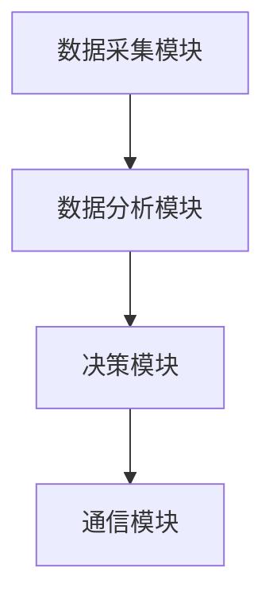
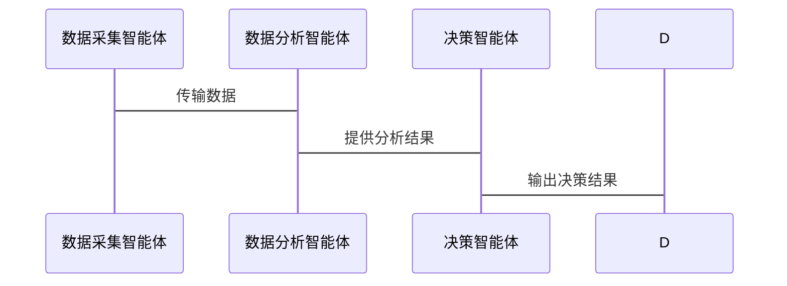

                 


---

# 使用多智能体系统识别市场异常和投资机会

> 关键词：多智能体系统，市场异常，投资机会，金融数据分析，人工智能，强化学习

> 摘要：本文探讨了如何利用多智能体系统在金融市场中识别异常行为和挖掘投资机会。通过分析多智能体系统的原理、算法、架构设计以及实际案例，本文详细介绍了如何结合强化学习和分布式决策机制，构建高效的投资决策系统。

---

# 第一部分: 多智能体系统与金融市场概述

## 第1章: 多智能体系统的基本概念

### 1.1 多智能体系统的定义与特点

多智能体系统（Multi-Agent System, 简称MAS）是由多个智能体（Agent）组成的分布式系统，这些智能体能够通过自主决策和协作完成复杂任务。与单智能体系统相比，多智能体系统具有以下特点：

- **分布式性**：智能体之间通过分布式通信和协作完成任务。
- **自主性**：每个智能体都有一定的自主决策能力，能够独立执行任务。
- **反应性**：智能体能够根据环境的变化动态调整行为。
- **社会性**：智能体之间需要通过交互和协作完成复杂的任务。

### 1.2 金融市场中的异常与投资机会

金融市场是一个高度动态和复杂的系统，充满了不确定性。市场异常和投资机会是两个看似对立却又相互关联的概念。市场异常通常指市场价格的剧烈波动、短期偏离正常趋势等情况，而投资机会则指在市场中发现的潜在收益点。

#### 1.2.1 市场异常的定义与类型

市场异常可以分为以下几种类型：
1. **短期异常**：如短时间内价格的剧烈波动。
2. **长期异常**：如长期趋势的偏离。
3. **结构性异常**：如市场结构的变化导致的价格异常。

#### 1.2.2 投资机会的定义与分类

投资机会通常分为以下几种：
1. **短期投资机会**：如基于技术分析的短期交易机会。
2. **长期投资机会**：如基于基本面分析的长期价值投资。
3. **事件驱动型机会**：如并购、重组等事件引发的投资机会。

---

## 第2章: 多智能体系统在金融市场的应用背景

### 2.1 金融市场中的复杂性与挑战

金融市场的复杂性主要体现在以下几个方面：
1. **信息不对称**：市场参与者之间的信息不均衡。
2. **高波动性**：市场价格的频繁波动。
3. **不确定性**：市场行为受到多种因素影响，难以预测。

### 2.2 多智能体系统的优势与适用场景

多智能体系统在金融市场中的优势主要体现在以下几个方面：
1. **分布式决策能力**：能够处理复杂、动态的市场环境。
2. **协作能力**：多个智能体可以协作完成复杂的任务。
3. **适应性**：能够根据市场变化动态调整策略。

---

# 第二部分: 多智能体系统的原理与算法

## 第3章: 多智能体系统的原理

### 3.1 多智能体系统的组成与交互

#### 3.1.1 智能体的定义与角色

智能体是多智能体系统的核心单元，可以分为以下几种角色：
1. **数据采集智能体**：负责收集市场数据。
2. **数据分析智能体**：负责对数据进行分析和处理。
3. **决策智能体**：负责基于分析结果做出投资决策。

#### 3.1.2 智能体之间的通信与协作

智能体之间的通信可以通过以下方式进行：
1. **直接通信**：智能体之间通过消息传递进行直接通信。
2. **间接通信**：通过共享数据库或中间件进行间接通信。

### 3.2 多智能体系统的决策机制

#### 3.2.1 分布式决策的基本原理

分布式决策是指多个智能体在没有集中控制的情况下，通过协作完成决策任务。其基本原理包括：
1. **信息共享**：智能体之间共享信息。
2. **决策协商**：智能体之间通过协商达成一致的决策。
3. **动态调整**：根据环境变化动态调整决策。

---

## 第4章: 用于识别市场异常的算法

### 4.1 异常检测的基本原理

异常检测算法通常分为以下几种：
1. **基于统计学的方法**：如Z-score、孤立林等。
2. **基于机器学习的方法**：如支持向量机（SVM）、随机森林等。
3. **基于时间序列分析的方法**：如ARIMA、GARCH等。

#### 4.1.1 基于时间序列分析的异常检测

基于时间序列分析的异常检测算法可以通过以下步骤实现：
1. **数据预处理**：对数据进行标准化、平滑等处理。
2. **模型训练**：训练时间序列模型，如ARIMA。
3. **异常检测**：根据模型预测结果与实际数据的差异判断是否存在异常。

### 4.2 基于多智能体的异常检测算法

基于多智能体的异常检测算法可以通过以下步骤实现：
1. **数据分发**：将数据分发给多个智能体。
2. **局部异常检测**：每个智能体独立检测局部异常。
3. **全局异常检测**：通过智能体之间的协作，综合判断全局异常。

---

# 第三部分: 系统架构与设计

## 第5章: 系统架构设计

### 5.1 系统功能设计

#### 5.1.1 系统功能模块

系统功能模块包括：
1. **数据采集模块**：负责采集市场数据。
2. **数据分析模块**：负责对数据进行分析和处理。
3. **决策模块**：负责基于分析结果做出投资决策。
4. **通信模块**：负责智能体之间的通信和协作。

#### 5.1.2 系统架构图



---

## 第6章: 系统交互设计

### 6.1 系统交互流程

#### 6.1.1 异常检测流程



---

# 第四部分: 项目实战

## 第7章: 项目实战

### 7.1 环境搭建

#### 7.1.1 环境配置

- **操作系统**：Linux/Windows/MacOS
- **编程语言**：Python 3.8+
- **依赖库**：numpy、pandas、scikit-learn、tensorflow

### 7.2 核心代码实现

#### 7.2.1 数据预处理代码

```python
import numpy as np
import pandas as pd

# 数据预处理函数
def preprocess_data(data):
    # 数据标准化
    data = (data - data.mean()) / data.std()
    # 数据平滑
    data = data.rolling(window=5).mean()
    return data
```

#### 7.2.2 基于强化学习的异常检测代码

```python
import tensorflow as tf
from tensorflow.keras import layers

# 强化学习模型
class DQNModel(tf.keras.Model):
    def __init__(self, input_dim):
        super(DQNModel, self).__init__()
        self.dense1 = layers.Dense(64, activation='relu', input_dim=input_dim)
        self.dense2 = layers.Dense(32, activation='relu')
        self.dense3 = layers.Dense(1, activation='linear')

    def call(self, x):
        x = self.dense1(x)
        x = self.dense2(x)
        return self.dense3(x)

# 异常检测函数
def detect_anomaly(data, model):
    # 数据输入
    input_data = data.reshape((1, -1))
    # 预测结果
    prediction = model.predict(input_data)
    # 判断异常
    if prediction[0][0] > 0.95:
        return True
    else:
        return False
```

---

## 第8章: 实际案例分析

### 8.1 案例介绍

以股票市场为例，我们使用多智能体系统来识别市场异常和投资机会。

### 8.2 案例分析

#### 8.2.1 数据采集与预处理

使用Yahoo Finance API获取股票数据，并进行预处理。

#### 8.2.2 模型训练与测试

使用强化学习模型训练异常检测算法，并在测试数据上验证模型的性能。

#### 8.2.3 结果分析

通过分析模型的输出，识别市场异常并挖掘投资机会。

---

# 第五部分: 最佳实践、小结与展望

## 第9章: 最佳实践

### 9.1 注意事项

- 数据质量：确保数据的准确性和完整性。
- 模型更新：定期更新模型，以适应市场的变化。
- 系统优化：优化系统架构，提高系统的运行效率。

## 第10章: 小结与展望

### 10.1 小结

本文详细介绍了如何利用多智能体系统在金融市场中识别异常行为和挖掘投资机会。通过理论分析和实际案例，展示了多智能体系统的强大能力和广泛的应用前景。

### 10.2 未来展望

未来的研究方向可以包括：
1. **更复杂的情感分析模型**：引入自然语言处理技术，进一步提高市场情绪分析的准确性。
2. **多模态数据融合**：结合文本、图像等多种数据源，提高市场的预测能力。
3. **更高效的算法优化**：通过算法优化，进一步提高系统的运行效率和预测精度。

---

# 作者

作者：AI天才研究院/AI Genius Institute & 禅与计算机程序设计艺术/Zen And The Art of Computer Programming

