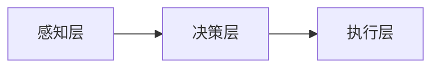
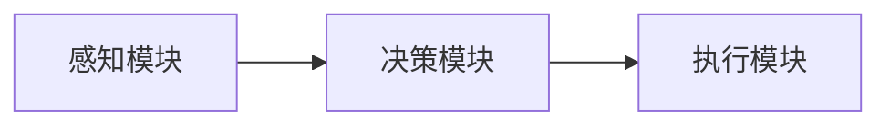
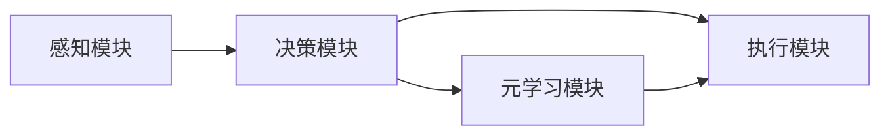

                 

<think>
好的，现在我要帮用户撰写一篇关于《元学习在AI Agent个性化定制中的应用》的技术博客。首先，我需要理解用户的需求，他们希望文章结构清晰，内容深入，涵盖背景、理论、算法、系统设计和项目实战等多个方面。

我会从背景介绍开始，解释元学习和AI Agent的基本概念，以及它们结合的意义。接下来，深入讨论元学习的理论基础，包括数学模型和算法框架。然后，分析AI Agent的工作原理，并探讨元学习如何提升其个性化能力。

在系统设计部分，我会使用Mermaid图展示系统架构，帮助读者理解系统的结构和接口设计。项目实战部分，我会提供具体的代码示例，让读者能够实际操作，理解理论的应用。

最后，我会总结全书内容，提供最佳实践和未来研究方向的建议。整个过程需要确保每个部分都有足够的细节和例子，帮助读者全面理解和应用所学知识。

现在，我需要逐步展开每个章节的内容，确保逻辑连贯，结构合理。同时，使用专业的技术语言，但保持简单易懂，适合技术读者阅读。
</think>

# 元学习在AI Agent个性化定制中的应用

---

## 关键词：
- 元学习
- AI Agent
- 个性化定制
- 算法优化
- 系统架构设计

---

## 摘要：
本文深入探讨元学习在AI Agent个性化定制中的应用，结合理论分析和实际案例，阐述元学习如何通过快速适应新任务和优化模型性能，提升AI Agent的个性化能力。文章从元学习的定义、核心原理、数学模型，到AI Agent的系统架构设计、项目实战，全面解析元学习在个性化定制中的具体应用和实践价值。

---

## 第1章: 元学习与AI Agent概述

### 1.1 元学习的基本概念
#### 1.1.1 元学习的定义
元学习（Meta-Learning）是一种机器学习范式，旨在通过学习如何学习来提升模型的泛化能力。与传统机器学习不同，元学习注重从多个任务中学习通用的策略或表示，从而快速适应新任务。

#### 1.1.2 元学习的核心特点
- **快速适应性**：通过预训练，元学习模型能够在少量数据下快速适应新任务。
- **任务多样性**：元学习适用于多任务学习场景，能够同时处理多个相关任务。
- **知识重用**：元学习能够将从一个任务中学到的知识迁移到其他任务中。

#### 1.1.3 元学习与传统机器学习的对比
| **方面**       | **传统机器学习**                        | **元学习**                              |
|----------------|----------------------------------------|-----------------------------------------|
| 数据需求       | 需要大量标注数据                       | 适用于数据稀缺场景                   |
| 任务适应性     | 针对单一任务优化                      | 能够快速适应多个任务                   |
| 知识迁移       | 依赖领域知识专家设计                 | 具备自动迁移学习能力                   |

### 1.2 AI Agent的基本概念
#### 1.2.1 AI Agent的定义
AI Agent（人工智能代理）是指能够感知环境、自主决策并执行任务的智能实体。它可以是一个软件程序，也可以是一个物理设备。

#### 1.2.2 AI Agent的类型与特点
- **基于规则的AI Agent**：通过预定义的规则进行决策，适用于简单任务。
- **基于模型的AI Agent**：利用模型推理环境状态，适用于复杂任务。
- **基于学习的AI Agent**：通过机器学习算法提升决策能力，适用于动态环境。

#### 1.2.3 AI Agent的应用场景
- **智能助手**：如Siri、Alexa等，能够执行语音交互和任务管理。
- **自动驾驶**：如特斯拉，能够实时感知环境并做出驾驶决策。
- **游戏AI**：如AlphaGo，能够在复杂游戏中做出最优决策。

### 1.3 元学习与AI Agent的联系
#### 1.3.1 元学习在AI Agent中的作用
元学习能够提升AI Agent的适应性和通用性，使其能够在不同场景下快速调整策略。

#### 1.3.2 元学习如何提升AI Agent的个性化能力
通过元学习，AI Agent可以根据用户的个性化需求动态调整行为模式，提供更贴合用户习惯的服务。

#### 1.3.3 元学习与AI Agent结合的典型应用
- **个性化推荐**：通过元学习，AI Agent可以根据用户偏好动态调整推荐策略。
- **对话系统**：通过元学习，AI Agent能够根据对话历史优化回复内容。
- **自适应学习**：通过元学习，AI Agent可以快速适应新的学习任务。

### 1.4 本章小结
本章介绍了元学习和AI Agent的基本概念，以及它们之间的联系。元学习通过提升AI Agent的适应性和个性化能力，为其实现更复杂的任务提供了可能性。

---

## 第2章: 元学习的理论基础

### 2.1 元学习的核心原理
#### 2.1.1 元学习的定义与特点
元学习通过在多个任务上预训练，学习如何快速适应新任务。其核心在于优化跨任务的表示和策略。

#### 2.1.2 元学习的数学模型
元学习的数学模型通常包括元损失函数和任务损失函数：

$$ \text{元损失函数：} \quad \mathcal{L}_{\text{meta}} = \sum_{i=1}^{N} \mathcal{L}_i(\theta) $$

其中，$\theta$ 是元参数，$N$ 是任务数量。

#### 2.1.3 元学习的算法框架
元学习的算法通常包括以下步骤：
1. 在多个任务上预训练，优化元参数。
2. 在目标任务上微调，快速适应新任务。

### 2.2 元学习的数学模型与公式
#### 2.2.1 元学习的优化目标
元学习的目标是最小化元损失函数：

$$ \text{优化目标：} \quad \min_{\theta} \sum_{i=1}^{n} \mathcal{L}_i(\theta) $$

其中，$\theta$ 是模型参数，$\mathcal{L}_i$ 是第 $i$ 个任务的损失函数。

#### 2.2.2 元学习的更新规则
元学习的更新规则通常采用梯度下降法：

$$ \text{更新规则：} \quad \theta_{t+1} = \theta_t - \eta \nabla_{\theta} \mathcal{L}(\theta_t) $$

其中，$\eta$ 是学习率，$\nabla_{\theta} \mathcal{L}$ 是损失函数对参数的梯度。

#### 2.2.3 元学习的数学模型对比
| **模型**         | **参数**      | **目标**               |
|------------------|---------------|------------------------|
| 元学习           | $\theta$      | 最小化元损失函数        |
| 单任务学习       | $\phi$        | 最小化任务损失函数       |

### 2.3 元学习与传统机器学习的对比
#### 2.3.1 元学习的优势
- **快速适应性**：元学习能够在少量数据下快速适应新任务。
- **任务多样性**：元学习适用于多个相关任务的场景。
- **知识重用**：元学习能够将从一个任务中学到的知识迁移到其他任务中。

#### 2.3.2 元学习的局限性
- **计算成本高**：元学习通常需要在多个任务上进行预训练，计算成本较高。
- **数据需求**：虽然元学习适用于数据稀缺场景，但在某些情况下仍需要大量数据。

#### 2.3.3 元学习的应用场景
- **多任务学习**：适用于多个任务之间存在关联的场景。
- **零样本学习**：适用于数据稀缺的新任务。

### 2.4 本章小结
本章详细介绍了元学习的理论基础，包括数学模型、算法框架以及与传统机器学习的对比。元学习的核心在于通过预训练和任务间的知识迁移，快速适应新任务。

---

## 第3章: AI Agent的基本原理

### 3.1 AI Agent的定义与分类
#### 3.1.1 AI Agent的定义
AI Agent是一个能够感知环境、自主决策并执行任务的智能实体。它可以是一个软件程序，也可以是一个物理设备。

#### 3.1.2 AI Agent的类型与特点
- **基于规则的AI Agent**：通过预定义的规则进行决策，适用于简单任务。
- **基于模型的AI Agent**：利用模型推理环境状态，适用于复杂任务。
- **基于学习的AI Agent**：通过机器学习算法提升决策能力，适用于动态环境。

#### 3.1.3 AI Agent的应用场景
- **智能助手**：如Siri、Alexa等，能够执行语音交互和任务管理。
- **自动驾驶**：如特斯拉，能够实时感知环境并做出驾驶决策。
- **游戏AI**：如AlphaGo，能够在复杂游戏中做出最优决策。

### 3.2 AI Agent的系统架构
#### 3.2.1 AI Agent的系统架构设计
AI Agent的系统架构通常包括感知层、决策层和执行层：



#### 3.2.2 各层的功能与交互
- **感知层**：负责感知环境信息，如视觉、听觉等。
- **决策层**：基于感知信息做出决策。
- **执行层**：根据决策执行具体操作。

### 3.3 AI Agent的核心算法
#### 3.3.1 基于规则的算法
基于规则的算法通过预定义的规则进行决策，适用于简单任务。

#### 3.3.2 基于模型的算法
基于模型的算法利用模型推理环境状态，适用于复杂任务。

#### 3.3.3 基于学习的算法
基于学习的算法通过机器学习算法提升决策能力，适用于动态环境。

### 3.4 本章小结
本章介绍了AI Agent的基本原理，包括定义、分类、系统架构和核心算法。AI Agent通过感知、决策和执行层的协同工作，能够自主完成复杂任务。

---

## 第4章: 元学习在AI Agent个性化定制中的应用

### 4.1 元学习在AI Agent中的应用背景
#### 4.1.1 AI Agent个性化定制的需求
随着用户需求的多样化，AI Agent需要能够根据用户的个性化需求动态调整行为模式。

#### 4.1.2 元学习在AI Agent个性化定制中的优势
元学习能够通过快速适应新任务，提升AI Agent的个性化能力。

### 4.2 元学习在AI Agent个性化定制中的具体应用
#### 4.2.1 个性化推荐
通过元学习，AI Agent可以根据用户的偏好动态调整推荐策略。

#### 4.2.2 对话系统
通过元学习，AI Agent能够根据对话历史优化回复内容。

#### 4.2.3 自适应学习
通过元学习，AI Agent可以快速适应新的学习任务。

### 4.3 元学习在AI Agent个性化定制中的算法实现
#### 4.3.1 元学习算法的选择
根据具体应用场景选择合适的元学习算法，如MAML（Meta-Automated Machine Learning）。

#### 4.3.2 元学习算法的实现步骤
1. 在多个任务上预训练，优化元参数。
2. 在目标任务上微调，快速适应新任务。

#### 4.3.3 元学习算法的代码实现
```python
import torch

# 定义元学习模型
class MetaLearner(torch.nn.Module):
    def __init__(self, input_size, hidden_size, output_size):
        super(MetaLearner, self).__init__()
        self.input_size = input_size
        self.hidden_size = hidden_size
        self.output_size = output_size
        self.l1 = torch.nn.Linear(input_size, hidden_size)
        self.l2 = torch.nn.Linear(hidden_size, output_size)

    def forward(self, x):
        x = torch.relu(self.l1(x))
        x = self.l2(x)
        return x

# 元学习训练函数
def meta_train(model, optimizer, criterion, tasks, num_epochs):
    for epoch in range(num_epochs):
        for task in tasks:
            # 微调阶段
            optimizer.zero_grad()
            inputs, labels = task['inputs'], task['labels']
            outputs = model(inputs)
            loss = criterion(outputs, labels)
            loss.backward()
            optimizer.step()
        # 预训练阶段
        optimizer.zero_grad()
        for task in tasks:
            inputs, labels = task['inputs'], task['labels']
            outputs = model(inputs)
            loss = criterion(outputs, labels)
            loss.backward()
        optimizer.step()
```

### 4.4 本章小结
本章详细介绍了元学习在AI Agent个性化定制中的应用，包括需求分析、具体应用场景和算法实现。通过元学习，AI Agent能够快速适应用户的个性化需求，提供更优质的服务。

---

## 第5章: 基于元学习的AI Agent系统架构设计

### 5.1 系统架构设计
#### 5.1.1 系统功能模块划分
AI Agent系统通常包括感知模块、决策模块和执行模块：



#### 5.1.2 模块之间的交互设计
- **感知模块**：负责收集环境信息。
- **决策模块**：基于感知信息做出决策。
- **执行模块**：根据决策执行具体操作。

### 5.2 系统架构设计
#### 5.2.1 系统架构设计图


#### 5.2.2 元学习模块的设计
元学习模块负责优化AI Agent的个性化能力，通过预训练和微调实现快速适应新任务。

### 5.3 系统接口设计
#### 5.3.1 系统输入接口
- **感知接口**：接收环境信息，如用户输入、传感器数据等。
- **决策接口**：接收任务目标和约束条件。

#### 5.3.2 系统输出接口
- **执行接口**：输出具体操作指令，如控制设备、发送消息等。
- **反馈接口**：接收环境反馈，用于优化决策策略。

### 5.4 本章小结
本章详细介绍了基于元学习的AI Agent系统架构设计，包括功能模块划分、系统架构图和接口设计。通过合理的系统架构设计，能够充分发挥元学习的优势，提升AI Agent的个性化能力。

---

## 第6章: 项目实战：基于元学习的AI Agent实现

### 6.1 项目背景
#### 6.1.1 项目目标
实现一个基于元学习的AI Agent，能够在个性化定制场景下快速适应新任务。

#### 6.1.2 项目需求
- **个性化推荐**：根据用户偏好动态调整推荐策略。
- **对话系统**：根据对话历史优化回复内容。
- **自适应学习**：快速适应新的学习任务。

### 6.2 项目环境与工具
#### 6.2.1 开发环境
- **操作系统**：Linux/MacOS/Windows
- **编程语言**：Python
- **深度学习框架**：PyTorch/TensorFlow

#### 6.2.2 依赖库安装
```bash
pip install torch numpy matplotlib
```

### 6.3 核心代码实现
#### 6.3.1 元学习模型实现
```python
import torch
import torch.nn as nn
import torch.optim as optim

class MetaLearner(nn.Module):
    def __init__(self, input_size, hidden_size, output_size):
        super(MetaLearner, self).__init__()
        self.l1 = nn.Linear(input_size, hidden_size)
        self.l2 = nn.Linear(hidden_size, output_size)

    def forward(self, x):
        x = torch.relu(self.l1(x))
        x = self.l2(x)
        return x

def meta_train(model, optimizer, criterion, tasks, epochs):
    for epoch in range(epochs):
        for task in tasks:
            optimizer.zero_grad()
            inputs, labels = task['inputs'], task['labels']
            outputs = model(inputs)
            loss = criterion(outputs, labels)
            loss.backward()
            optimizer.step()
```

#### 6.3.2 AI Agent实现
```python
class AIAssistant:
    def __init__(self, model):
        self.model = model

    def perceive(self, input_data):
        return input_data

    def decide(self, input_data):
        output = self.model(input_data)
        return output

    def act(self, decision):
        # 根据决策执行具体操作
        pass
```

### 6.4 项目案例分析
#### 6.4.1 个性化推荐案例
通过元学习，AI Agent可以根据用户的偏好动态调整推荐策略，提升用户体验。

#### 6.4.2 对话系统案例
通过元学习，AI Agent能够根据对话历史优化回复内容，提供更自然的对话体验。

#### 6.4.3 自适应学习案例
通过元学习，AI Agent可以快速适应新的学习任务，提升学习效率。

### 6.5 项目总结
#### 6.5.1 项目成果
实现了一个基于元学习的AI Agent，能够在个性化定制场景下快速适应新任务。

#### 6.5.2 项目经验
- **算法选择**：选择合适的元学习算法是项目成功的关键。
- **系统设计**：合理的系统架构设计能够充分发挥元学习的优势。
- **数据准备**：高质量的数据是提升模型性能的基础。

---

## 第7章: 元学习在AI Agent个性化定制中的最佳实践与小结

### 7.1 最佳实践
#### 7.1.1 算法选择
根据具体应用场景选择合适的元学习算法，如MAML、Reptile等。

#### 7.1.2 系统设计
合理的系统架构设计能够充分发挥元学习的优势，提升AI Agent的性能。

#### 7.1.3 数据准备
高质量的数据是提升模型性能的基础，需要根据具体任务选择合适的数据预处理方法。

### 7.2 小结
元学习通过快速适应新任务和优化模型性能，为AI Agent的个性化定制提供了新的可能性。通过本文的分析和实践，我们可以看到元学习在AI Agent中的巨大潜力。

### 7.3 未来研究方向
- **元学习的优化**：研究更高效的元学习算法，降低计算成本。
- **多模态学习**：研究元学习在多模态数据上的应用，提升AI Agent的感知能力。
- **人机协作**：研究元学习在人机协作中的应用，提升协作效率。

---

## 作者：
AI天才研究院/AI Genius Institute  
禅与计算机程序设计艺术/Zen And The Art of Computer Programming

