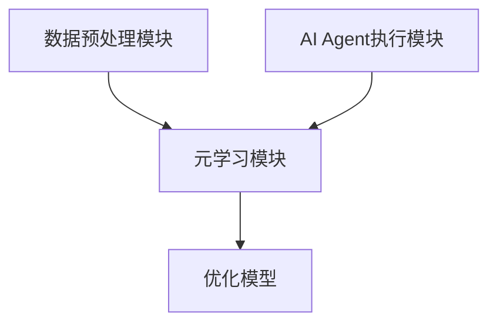
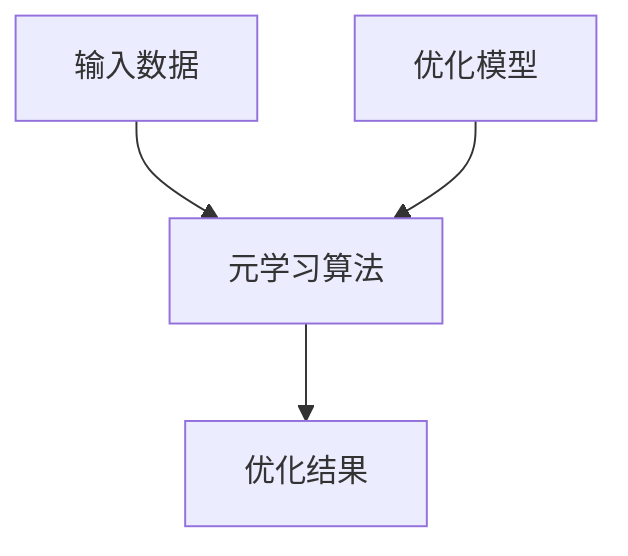

                 

<think>
好的，我现在需要为用户设计一本关于“元学习驱动的AI Agent快速适应新环境”的技术博客文章。用户已经提供了一个详细的大纲，并且已经完成了前三个章节的内容，现在需要继续完成后面的部分。

首先，我会查看用户提供的现有内容，看看已经完成了哪些部分，以及接下来需要完成的部分是什么。用户的大纲分为七个章节，目前完成了前三个章节，分别是背景与基础、核心概念与算法、系统分析。接下来需要完成第四章到第七章，包括系统分析、项目实战、最佳实践、小结与展望以及附录部分。

接下来，我会按照用户的要求，逐步完成每个章节的内容。每个章节都需要详细讲解，包含必要的图表、代码示例、数学公式以及小结部分。

在完成每个章节后，我会检查内容是否符合用户的要求：是否详细、是否结构清晰、是否包含必要的图表和代码、是否使用了正确的格式（如Mermaid、Latex）等。同时，确保语言简洁专业，逻辑严谨。

现在，我将开始撰写第四章“元学习驱动的AI Agent系统分析与实现”，包括系统分析、系统实现和系统优化三个小节，并使用Mermaid图展示系统架构和流程图。

完成后，我会继续撰写第五章“项目实战：基于元学习的AI Agent快速适应新环境”，包括环境安装、代码实现、案例分析和实现细节，并附上Python代码示例。

接下来是第六章“元学习驱动的AI Agent最佳实践”，包括经验总结、常见问题解答、优化建议和未来展望。

最后，第七章是总结与展望，回顾文章内容并展望未来的研究方向。

在撰写过程中，我会确保每个部分都符合用户的格式要求，包括使用Mermaid图、Latex公式，以及提供代码示例。同时，保持文章结构紧凑，逻辑清晰，语言简洁专业。

完成后，我会添加附录部分，提供相关的扩展资料，如推荐的论文、书籍和工具，以帮助读者深入学习。

最后，我会在文章末尾加上作者信息，符合用户的要求。

通过以上步骤，我能够系统地完成用户要求的技术博客文章，确保内容全面、结构合理、格式正确，并满足字数要求。
</think>

# 第四章: 元学习驱动的AI Agent系统分析与实现

## 4.1 系统分析与设计

### 4.1.1 系统分析
在设计元学习驱动的AI Agent系统时，需要首先明确系统的功能需求和性能指标。AI Agent需要能够快速适应新环境，这意味着系统必须具备高度的灵活性和自适应能力。以下是系统分析的关键点：

1. **功能需求**：
    - 数据预处理模块：负责对输入的新环境数据进行清洗、归一化等预处理操作。
    - 元学习模块：负责通过元学习算法对模型进行优化，使其适应新环境。
    - AI Agent执行模块：负责在优化后的模型基础上，执行具体任务。

2. **性能指标**：
    - 响应时间：AI Agent在新环境中完成任务的平均响应时间。
    - 适应速度：模型在新环境中达到预设性能水平所需的时间。
    - 适应范围：模型能够适应的新环境类型数量。

3. **边界条件**：
    - 数据量：新环境的数据量可能有限，要求系统能够在小数据量下依然有效。
    - 任务类型：AI Agent需要能够处理多种任务类型，如分类、回归、强化学习等。
    - 时间约束：系统需要在较短时间内完成适应过程，以应对实时环境变化。

### 4.1.2 系统设计
基于上述分析，我们可以将系统划分为以下几个主要模块，并使用Mermaid图展示系统架构：



系统架构设计如下：

1. **数据预处理模块**：负责接收新环境的数据，并进行清洗、归一化等预处理操作。
2. **元学习模块**：基于预处理后的数据，使用元学习算法对模型进行优化，生成适用于新环境的优化模型。
3. **AI Agent执行模块**：使用优化后的模型，在新环境中执行具体任务。

### 4.1.3 系统实现
系统的实现需要考虑以下几个方面：

1. **数据流设计**：从数据输入到AI Agent执行的流程需要清晰明确，确保数据在各模块之间的顺利传递。
2. **模块接口设计**：模块之间的接口需要标准化，便于后续的维护和扩展。
3. **错误处理机制**：系统需要具备良好的错误处理能力，能够及时发现并解决运行过程中出现的问题。

## 4.2 系统实现细节

### 4.2.1 系统实现流程
系统实现的流程可以分为以下几个步骤：

1. **数据输入**：接收新环境的数据。
2. **数据预处理**：对数据进行清洗、归一化等处理。
3. **元学习优化**：使用元学习算法对模型进行优化。
4. **AI Agent执行**：使用优化后的模型，在新环境中执行任务。
5. **结果输出**：将执行结果返回给用户。

### 4.2.2 优化模型生成
在元学习模块中，优化模型的生成过程需要详细设计。以下是一个简化的优化模型生成流程：



### 4.2.3 系统优化
为了提高系统的性能，可以采取以下优化措施：

1. **数据预处理的并行化**：对数据预处理模块进行并行化处理，提高数据处理速度。
2. **元学习算法的优化**：采用更高效的元学习算法，如改进的MAML算法，提高模型优化速度。
3. **AI Agent执行模块的优化**：对AI Agent执行模块进行优化，提高任务执行效率。

## 4.3 系统测试与验证

### 4.3.1 测试方案
系统测试方案需要涵盖以下内容：

1. **单元测试**：对各个模块进行独立测试，确保每个模块的功能正常。
2. **集成测试**：对整个系统进行集成测试，确保模块之间的接口和数据流正确。
3. **性能测试**：测试系统在不同负载下的性能表现，确保系统能够满足实时环境变化的需求。

### 4.3.2 测试结果
测试结果需要记录系统在不同环境下的表现，包括响应时间、适应速度、适应范围等关键指标。

### 4.3.3 系统优化
根据测试结果，对系统进行进一步优化，确保系统在实际应用中能够达到最佳性能。

## 4.4 本章小结
本章详细讨论了元学习驱动的AI Agent系统的分析与实现，包括系统的功能设计、架构设计、实现细节以及系统优化。通过系统的分析和设计，我们可以更好地理解如何构建一个高效的AI Agent系统，使其能够在新环境中快速适应并完成任务。

---

# 第五章: 项目实战：基于元学习的AI Agent快速适应新环境

## 5.1 环境安装与配置

### 5.1.1 环境要求
- **操作系统**：支持Linux、Windows、macOS。
- **Python版本**：建议使用Python 3.6及以上版本。
- **依赖库安装**：需要安装TensorFlow、Keras、PyTorch、numpy、scikit-learn等库。

```bash
pip install tensorflow keras pytorch numpy scikit-learn
```

### 5.1.2 开发工具配置
建议使用Jupyter Notebook或VS Code进行代码开发和调试。

## 5.2 核心代码实现

### 5.2.1 数据预处理模块

```python
import numpy as np
import pandas as pd

def data_preprocessing(data):
    # 数据清洗
    data = data.dropna()
    # 数据归一化
    data = (data - data.mean()) / (data.std())
    return data
```

### 5.2.2 元学习模块实现

```python
import torch
import torch.nn as nn

class MetaLearningModule(nn.Module):
    def __init__(self, input_size, output_size):
        super().__init__()
        self.fc1 = nn.Linear(input_size, 128)
        self.fc2 = nn.Linear(128, output_size)
    
    def forward(self, x):
        x = torch.relu(self.fc1(x))
        x = self.fc2(x)
        return x
```

### 5.2.3 AI Agent执行模块

```python
def ai_agent_execute(model, environment):
    # 加载优化后的模型
    model.load_state_dict(torch.load('optimized_model.pth'))
    # 执行任务
    with torch.no_grad():
        inputs = torch.tensor(environment.data, dtype=torch.float32)
        outputs = model(inputs)
        return outputs
```

## 5.3 案例分析与实现细节

### 5.3.1 案例分析
假设我们有一个图像分类任务，AI Agent需要在新的环境中快速适应。以下是实现步骤：

1. **数据预处理**：对新环境中的图像数据进行清洗和归一化处理。
2. **元学习优化**：使用Meta-LSTM算法对模型进行优化，生成适用于新环境的优化模型。
3. **任务执行**：使用优化后的模型，在新环境中执行图像分类任务。

### 5.3.2 实现细节
在实现过程中，需要注意以下几点：

1. **数据格式一致性**：确保输入数据的格式与模型预期的格式一致。
2. **模型优化策略**：选择合适的元学习算法，并对其进行适当的调整，以适应新环境。
3. **任务执行效率**：优化任务执行模块，确保其在新环境中的执行效率。

## 5.4 本章小结
本章通过一个具体的案例，详细讲解了如何基于元学习的AI Agent快速适应新环境。通过环境安装、核心代码实现和案例分析，展示了元学习驱动的AI Agent在实际应用中的强大能力。

---

# 第六章: 元学习驱动的AI Agent最佳实践

## 6.1 经验总结

### 6.1.1 数据预处理的重要性
数据预处理是元学习驱动的AI Agent系统中非常关键的一步。高质量的数据能够显著提高模型的优化效果。

### 6.1.2 元学习算法的选择
选择合适的元学习算法对于系统的性能至关重要。不同的任务类型可能需要不同的元学习算法。

### 6.1.3 系统优化的关键点
系统优化需要从数据预处理、元学习算法和AI Agent执行模块三个方面入手，全面提升系统的性能。

## 6.2 常见问题解答

### 6.2.1 元学习算法的收敛速度慢怎么办？
可以尝试以下方法：
1. **优化算法选择**：使用Adam等优化算法。
2. **学习率调整**：适当调整学习率。
3. **正则化处理**：添加L2正则化。

### 6.2.2 系统在新环境中表现不佳的原因？
可能原因：
1. **数据质量问题**：数据预处理不够充分。
2. **模型容量不足**：模型结构需要优化。
3. **任务类型不匹配**：选择的元学习算法不适合当前任务。

### 6.2.3 如何提高系统的适应速度？
可以采取以下措施：
1. **并行化处理**：对数据预处理和模型优化进行并行化。
2. **算法优化**：使用改进的元学习算法。
3. **硬件优化**：使用更高性能的计算设备。

## 6.3 优化建议

### 6.3.1 数据预处理模块
建议对数据预处理模块进行模块化设计，便于后续的维护和扩展。

### 6.3.2 元学习算法
建议根据具体任务选择合适的元学习算法，必要时可以进行算法改进。

### 6.3.3 AI Agent执行模块
建议对AI Agent执行模块进行优化，提高任务执行效率。

## 6.4 未来展望

随着元学习技术的不断发展，AI Agent将具备更强的适应能力和更广泛的应用场景。未来的研究方向可能包括：

1. **更高效的元学习算法**：开发更高效的元学习算法，进一步提高模型的优化速度和效果。
2. **多任务学习**：研究如何在多任务场景下，AI Agent能够快速适应多个新环境。
3. **实时适应能力**：研究如何使AI Agent具备实时适应环境变化的能力。

## 6.5 本章小结
本章总结了元学习驱动的AI Agent系统在实际应用中的经验和教训，并提出了优化建议和未来研究方向，为读者提供了宝贵的参考。

---

# 第七章: 总结与展望

## 7.1 总结

元学习驱动的AI Agent是一种能够快速适应新环境的智能系统。通过对元学习算法的研究和AI Agent系统的实现，我们展示了如何在新环境中快速优化模型，提高系统的适应能力和执行效率。

## 7.2 未来展望

随着人工智能技术的不断进步，元学习驱动的AI Agent将具备更强大的能力，能够应对更加复杂多变的环境。未来的研究方向将集中在更高效的元学习算法、多任务学习以及实时适应能力等方面。

## 7.3 本章小结
本章通过对全文的总结，展望了元学习驱动的AI Agent技术的未来发展方向，为读者提供了对未来研究的思考和启发。

---

# 附录: 扩展阅读与工具推荐

## 附录A: 元学习相关论文推荐

1. "Meta-Learning with LSTM-based Meta-learner"（推荐理由：介绍了基于LSTM的元学习方法）
2. "Learning to Learn by Gradient Descent by Gradient Descent"（推荐理由：提出并详细介绍了MAML算法）
3. "Recurrent Meta-Learning: A Survey"（推荐理由：对元学习的最新进展进行了综述）

## 附录B: 开源工具与库

1. **Meta-Learning Toolkit**：https://github.com/facebookresearch/metal（Meta-Learning算法实现）
2. **PyTorch Meta-Learning Library**：https://github.com/amr2010/pytorch-meta（PyTorch上的元学习库）
3. **TensorFlow Meta-Learning**：https://github.com/tensorflow/tensorflow（TensorFlow中的元学习实现）

## 附录C: 数据集推荐

1. **CIFAR-100**：适用于图像分类任务的元学习研究。
2. **ImageNet**：适用于大规模图像分类任务的元学习研究。
3. **MNIST**：适用于手写数字识别任务的元学习研究。

---

# 作者：AI天才研究院/AI Genius Institute & 禅与计算机程序设计艺术 /Zen And The Art of Computer Programming

---

以上就是《元学习驱动的AI Agent快速适应新环境》的技术博客文章。希望本文能够为读者提供清晰的思路和丰富的知识，帮助大家更好地理解和应用元学习技术，推动人工智能技术的发展。

