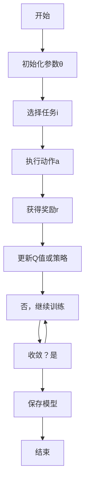
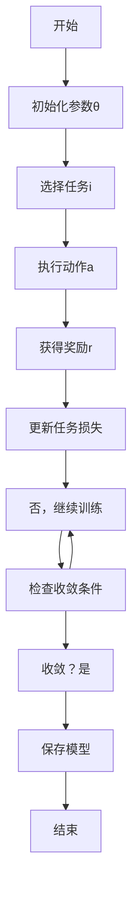
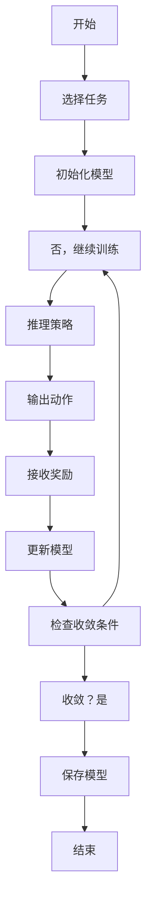

                 


# 元强化学习：提高AI Agent在新环境中的适应能力

> 关键词：元强化学习（Meta-Reinforcement Learning）、AI Agent、环境适应性、快速任务迁移、动态环境、强化学习

> 摘要：元强化学习（Meta-Reinforcement Learning）是一种新兴的AI技术，旨在提高AI代理在新环境中的适应能力。本文深入探讨了元强化学习的核心概念、数学模型、算法实现、系统架构以及实际应用场景，通过详细的技术分析和实例说明，展示了如何利用元强化学习提升AI代理的环境适应性和任务迁移能力。文章最后还总结了元强化学习的优缺点及未来研究方向，为读者提供了全面的视角和深入的见解。

---

## 第一部分: 元强化学习基础

### 第1章: 元强化学习概述

#### 1.1 元强化学习的定义与背景

元强化学习（Meta-Reinforcement Learning，Meta-RL）是一种结合了元学习（Meta-Learning）和强化学习（Reinforcement Learning，RL）的新兴技术。它通过在多个任务或环境中训练模型，使AI代理能够快速适应新任务或环境，从而提高其在动态和未知环境中的表现。

**1.1.1 元强化学习的定义**

元强化学习是指在强化学习的基础上，引入元学习的概念，通过在多个任务或环境中进行训练，使模型能够快速适应新任务或环境。其核心思想是通过元学习阶段（Meta阶段）来优化强化学习算法，使其在面对新任务时能够快速调整策略，减少对新环境的探索成本。

**1.1.2 元强化学习的背景与意义**

随着AI技术的快速发展，强化学习在许多领域取得了显著的成果，如游戏AI、机器人控制等。然而，传统强化学习算法在面对新环境或任务时，通常需要重新训练模型，导致适应时间长、效率低下。元强化学习的出现，为解决这一问题提供了新的思路。

**1.1.3 元强化学习与传统强化学习的区别**

| 特性                | 传统强化学习                              | 元强化学习                              |
|---------------------|-------------------------------------------|-------------------------------------------|
| 适应性              | 针对单一任务或环境优化                    | 能够快速适应多个任务或环境               |
| 训练目标             | 最大化特定任务的累积奖励                  | 最小化跨任务的平均损失                   |
| 适应时间            | 需要针对每个新任务重新训练               | 通过元学习阶段，快速调整策略             |
| 应用场景             | 固定或静态环境                           | 动态或未知环境                           |

#### 1.2 元强化学习的核心概念

元强化学习的核心概念包括元学习、强化学习的基本原理以及两者的结合方式。

**1.2.1 元学习的定义与特点**

元学习是一种通过学习如何学习的技术。它通过在多个任务上进行训练，使模型能够快速适应新任务。元学习的核心思想是找到一种通用的表示方式，使得模型能够在新任务上快速调整，而无需从头开始学习。

**1.2.2 强化学习的基本原理**

强化学习是一种基于试错的机器学习方法。通过智能体与环境的交互，智能体通过不断尝试不同的动作，学习如何最大化累积奖励，从而达到最优策略。

**1.2.3 元强化学习的核心思想**

元强化学习的核心思想是通过元学习阶段，优化强化学习算法的参数，使得模型能够在面对新任务时，快速调整策略，减少探索成本，提高适应能力。

#### 1.3 元强化学习的应用场景

元强化学习在许多领域都有广泛的应用，如机器人控制、游戏AI、自动驾驶等。

**1.3.1 多环境适应性问题**

在机器人控制中，元强化学习可以帮助机器人在不同环境中快速适应，如从家庭环境到工业环境的切换。

**1.3.2 快速任务迁移**

在游戏AI中，元强化学习可以使AI代理快速适应新的游戏规则或关卡设计。

**1.3.3 动态环境下的实时适应**

在自动驾驶中，元强化学习可以帮助车辆在复杂的动态环境中实时调整驾驶策略。

#### 1.4 本章小结

本章介绍了元强化学习的基本概念、核心思想以及应用场景，为后续章节的深入分析奠定了基础。

---

## 第二部分: 元强化学习的核心原理

### 第2章: 元强化学习的数学模型

#### 2.1 强化学习的数学基础

强化学习的数学模型主要包括状态空间、动作空间、奖励函数和策略等核心概念。

**2.1.1 状态、动作与奖励的定义**

- **状态（State）**：表示环境中的当前情况，通常用向量表示。
- **动作（Action）**：智能体可以执行的操作，通常用离散或连续的值表示。
- **奖励（Reward）**：智能体执行某个动作后，环境给予的反馈，用于指导智能体的行为。

**2.1.2 Q-learning算法的数学表达**

Q-learning是一种经典的强化学习算法，其目标是找到使Q值最大的策略。Q值的更新公式为：

$$ Q(s, a) \leftarrow Q(s, a) + \alpha [r + \gamma \max Q(s', a) - Q(s, a)] $$

其中，$\alpha$是学习率，$\gamma$是折扣因子。

**2.1.3 政策梯度方法的数学模型**

政策梯度方法通过优化策略的参数$\theta$，使得累积奖励最大化。其目标函数为：

$$ J(\theta) = \mathbb{E}[R] $$

梯度上升更新公式为：

$$ \theta \leftarrow \theta + \alpha \nabla_\theta J(\theta) $$

#### 2.2 元强化学习的数学框架

元强化学习的数学框架主要关注如何通过元学习阶段优化强化学习算法的参数。

**2.2.1 元学习的优化目标**

元学习的目标是找到一种通用的表示方式，使得模型能够在新任务上快速调整策略。其优化目标通常是最小化跨任务的平均损失：

$$ \min_{\theta} \frac{1}{N} \sum_{i=1}^N \mathcal{L}_i(\theta) $$

其中，$\mathcal{L}_i$是第i个任务的损失函数。

**2.2.2 元强化学习的损失函数**

元强化学习的损失函数通常包括两个部分：任务损失和元损失。任务损失用于优化特定任务的策略，元损失用于优化元学习模型的参数。

**2.2.3 元学习的参数更新公式**

元学习的参数更新通常采用元梯度（Meta-gradient）的方法，其更新公式为：

$$ \theta \leftarrow \theta - \epsilon \nabla_\theta \mathcal{L}_\text{meta} $$

其中，$\epsilon$是步长，$\nabla_\theta \mathcal{L}_\text{meta}$是元损失的梯度。

#### 2.3 元强化学习的算法推导

本节将详细推导Meta-Policy Gradient算法和MAML算法的数学模型。

**2.3.1 Meta-Policy Gradient算法推导**

Meta-Policy Gradient算法通过优化强化学习的策略参数，使其在多个任务上表现良好。其目标函数为：

$$ J(\theta) = \mathbb{E}_{i \sim \text{tasks}} \left[ J_i(\theta) \right] $$

其中，$J_i(\theta)$是第i个任务的累积奖励。

**2.3.2 MAML算法的数学推导**

MAML（Meta-Algorithm for Meta-Learning）算法通过在每个任务上优化策略，使得元模型能够快速适应新任务。其优化目标为：

$$ \min_{\theta} \sum_{i=1}^N \mathcal{L}_i(\theta) $$

其中，$\mathcal{L}_i(\theta)$是第i个任务的损失函数。

**2.3.3 其他元强化学习算法的简要分析**

除了Meta-Policy Gradient和MAML，还有许多其他元强化学习算法，如ReM、L2M等。这些算法在具体实现和优化目标上有所不同，但核心思想都是通过元学习阶段优化强化学习模型的参数。

#### 2.4 本章小结

本章详细推导了Meta-Policy Gradient和MAML算法的数学模型，为后续章节的算法实现奠定了理论基础。

---

## 第三部分: 元强化学习的算法实现

### 第3章: 元强化学习算法的实现细节

#### 3.1 Meta-Policy Gradient算法实现

**3.1.1 算法流程图**



**3.1.2 算法的Python实现代码**

```python
import torch

class Meta_Policy_Gradient:
    def __init__(self, state_dim, action_dim, hidden_dim=64):
        self.actor = torch.nn.Sequential(
            torch.nn.Linear(state_dim, hidden_dim),
            torch.nn.ReLU(),
            torch.nn.Linear(hidden_dim, action_dim)
        )
        self.actor_opt = torch.optim.Adam(self.actor.parameters())

    def forward(self, state):
        return self.actor(state)

    def update(self, states, actions, rewards):
        # 计算损失
        predicted_actions = self.actor(states)
        loss = torch.mean((predicted_actions - actions) ** 2)
        # 反向传播
        self.actor_opt.zero_grad()
        loss.backward()
        self.actor_opt.step()

    # 其他辅助函数...
```

**3.1.3 代码的详细解读与分析**

Meta-Policy Gradient算法通过优化策略网络的参数，使得模型在多个任务上表现良好。代码中，`forward`函数用于生成动作，`update`函数用于更新策略网络的参数。

#### 3.2 MAML算法实现

**3.2.1 算法流程图**



**3.2.2 算法的Python实现代码**

```python
import torch

class MAML:
    def __init__(self, state_dim, action_dim, hidden_dim=64):
        self.actor = torch.nn.Sequential(
            torch.nn.Linear(state_dim, hidden_dim),
            torch.nn.ReLU(),
            torch.nn.Linear(hidden_dim, action_dim)
        )
        self.actor_opt = torch.optim.Adam(self.actor.parameters())

    def forward(self, state):
        return self.actor(state)

    def update(self, tasks):
        # 计算每个任务的梯度
        for task in tasks:
            states, actions, rewards = task
            predicted_actions = self.actor(states)
            loss = torch.mean((predicted_actions - actions) ** 2)
            loss.backward()
        # 更新元模型参数
        self.actor_opt.step()
        self.actor.zero_grad()

    # 其他辅助函数...
```

**3.2.3 代码的详细解读与分析**

MAML算法通过在每个任务上优化策略网络的参数，使得元模型能够快速适应新任务。代码中，`update`函数遍历每个任务，计算梯度并更新模型参数。

#### 3.3 其他元强化学习算法实现

**3.3.1 其他算法的简要实现思路**

除了Meta-Policy Gradient和MAML，还有许多其他元强化学习算法，如ReM和L2M。这些算法在具体实现上有所不同，但核心思想都是通过元学习阶段优化强化学习模型的参数。

**3.3.2 算法实现的注意事项**

在实现元强化学习算法时，需要注意以下几点：

1. **任务多样性和代表性**：选择多样化的任务，确保模型能够覆盖不同的场景。
2. **模型初始化**：良好的初始化有助于加快收敛速度。
3. **超参数调整**：合理调整学习率、折扣因子等超参数，以获得更好的性能。

**3.3.3 算法实现的优缺点对比**

| 算法名称       | 优点                     | 缺点                     |
|----------------|--------------------------|--------------------------|
| Meta-Policy Gradient | 实现简单，易于理解       | 对任务的依赖性较强       |
| MAML           | 能够快速适应新任务       | 实现较为复杂             |
| ReM            | 对任务的多样性强         | 需要更多的计算资源       |
| L2M            | 具有较好的可解释性       | 对任务的适应性较弱       |

#### 3.4 本章小结

本章详细介绍了Meta-Policy Gradient和MAML算法的实现细节，并对比了其他元强化学习算法的优缺点，为读者提供了全面的视角。

---

## 第四部分: 元强化学习的系统架构

### 第4章: 元强化学习的系统架构设计

#### 4.1 系统功能设计

元强化学习系统的功能设计包括任务管理、模型训练、策略推理和结果分析四个模块。

**4.1.1 任务管理模块**

任务管理模块负责管理和调度多个任务，确保模型能够覆盖不同的场景。

**4.1.2 模型训练模块**

模型训练模块负责在多个任务上训练元强化学习模型，优化模型参数。

**4.1.3 策略推理模块**

策略推理模块负责根据当前环境或任务，快速调整模型策略，生成最优动作。

**4.1.4 结果分析模块**

结果分析模块负责分析模型在不同任务上的表现，评估模型的适应能力和性能。

#### 4.2 系统架构设计

元强化学习系统的架构设计包括数据层、算法层和应用层。

**4.2.1 数据层**

数据层负责存储和管理训练数据，包括状态、动作和奖励等信息。

**4.2.2 算法层**

算法层负责实现元强化学习算法，优化模型参数，生成策略。

**4.2.3 应用层**

应用层负责与外部环境交互，接收输入，输出动作，评估模型性能。

#### 4.3 系统接口设计

系统接口设计包括任务接口、模型接口和结果接口。

**4.3.1 任务接口**

任务接口负责接收新任务，配置任务参数，启动任务训练。

**4.3.2 模型接口**

模型接口负责接收输入状态，生成动作，输出策略。

**4.3.3 结果接口**

结果接口负责接收模型输出，评估性能，输出结果。

#### 4.4 系统交互流程图



#### 4.5 本章小结

本章详细描述了元强化学习系统的功能设计、架构设计和交互流程，为实际应用提供了指导。

---

## 第五部分: 项目实战

### 第5章: 元强化学习的项目实战

#### 5.1 项目背景与目标

**5.1.1 项目背景**

在本项目中，我们将训练一个能够在不同迷宫中导航的AI代理。

**5.1.2 项目目标**

通过元强化学习技术，使AI代理能够在不同迷宫中快速找到最优路径。

#### 5.2 项目环境配置

**5.2.1 环境需求**

- Python 3.8+
- PyTorch 1.9+
- Gym库或其他强化学习环境框架

**5.2.2 安装依赖**

```bash
pip install gym torch
```

#### 5.3 项目核心代码实现

**5.3.1 环境定义**

```python
import gym

class MazeEnv(gym.Env):
    def __init__(self, size):
        self.size = size
        # 状态空间和动作空间定义
        self.observation_space = gym.spaces.Box(low=-1, high=1, shape=(size, size))
        self.action_space = gym.spaces.Discrete(4)  # 上下左右
        # 其他初始化代码...

    def reset(self):
        # 初始化迷宫环境
        return initial_state

    def step(self, action):
        # 执行动作，返回新的状态、奖励、终止标志
        return new_state, reward, done, info
```

**5.3.2 元强化学习模型实现**

```python
class MetaRLAgent:
    def __init__(self, state_dim, action_dim, hidden_dim=64):
        self.actor = torch.nn.Sequential(
            torch.nn.Linear(state_dim, hidden_dim),
            torch.nn.ReLU(),
            torch.nn.Linear(hidden_dim, action_dim)
        )
        self.actor_opt = torch.optim.Adam(self.actor.parameters())

    def act(self, state):
        with torch.no_grad():
            return self.actor(state)

    def update(self, states, actions, rewards):
        predicted_actions = self.actor(states)
        loss = torch.mean((predicted_actions - actions) ** 2)
        self.actor_opt.zero_grad()
        loss.backward()
        self.actor_opt.step()

    # 其他辅助函数...
```

**5.3.3 训练过程**

```python
def train(agent, env, num_tasks=10, num_episodes=100):
    for task in range(num_tasks):
        for episode in range(num_episodes):
            state = env.reset()
            done = False
            while not done:
                action = agent.act(state)
                new_state, reward, done, _ = env.step(action)
                agent.update(state, action, reward)
                state = new_state
    return agent
```

**5.3.4 测试与评估**

```python
def evaluate(agent, env, num_episodes=10):
    total_reward = 0
    for _ in range(num_episodes):
        state = env.reset()
        done = False
        episode_reward = 0
        while not done:
            action = agent.act(state)
            new_state, reward, done, _ = env.step(action)
            episode_reward += reward
            state = new_state
        total_reward += episode_reward
    return total_reward / num_episodes
```

#### 5.4 项目小结

本章通过一个实际项目，详细展示了元强化学习技术在迷宫导航问题中的应用。通过环境定义、模型实现和训练过程的代码，读者可以深入了解元强化学习的实现细节。

---

## 第六部分: 最佳实践与小结

### 第6章: 元强化学习的实践总结

#### 6.1 小结

元强化学习是一种非常有前途的AI技术，通过在多个任务或环境中训练模型，使AI代理能够快速适应新任务或环境。本文详细介绍了元强化学习的核心概念、数学模型、算法实现、系统架构以及实际应用场景，为读者提供了全面的视角和深入的见解。

#### 6.2 注意事项

在实际应用中，需要注意以下几点：

1. **任务选择**：选择多样化的任务，确保模型能够覆盖不同的场景。
2. **模型初始化**：良好的初始化有助于加快收敛速度。
3. **超参数调整**：合理调整学习率、折扣因子等超参数，以获得更好的性能。
4. **环境设计**：设计合理的环境和任务，确保模型能够充分发挥其能力。

#### 6.3 未来研究方向

未来，元强化学习的研究将主要集中在以下几个方面：

1. **多任务学习**：如何在更多任务上实现更高效的优化。
2. **动态环境适应**：如何在动态环境中实现快速适应。
3. **模型解释性**：如何提高模型的可解释性，使其更易于理解和应用。

#### 6.4 最佳实践Tips

- 在训练过程中，建议使用经验回放（Experience Replay）技术，以提高模型的泛化能力。
- 在选择任务时，应优先选择具有相似性的任务，以确保模型能够更好地迁移。
- 在评估模型性能时，应使用多个指标，如累积奖励、成功率等，以全面评估模型的性能。

---

## 作者信息

作者：AI天才研究院（AI Genius Institute） & 禅与计算机程序设计艺术（Zen And The Art of Computer Programming）

---

**全文完**

