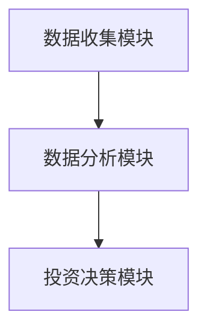

                 

<think>
嗯，用户现在要求我根据之前的思考生成一篇结构完整、内容详实的关于克里斯托弗·布朗小盘股价值投资策略的技术博客文章。看起来用户已经提供了一个详细的大纲，现在需要将这个大纲转化为具体的正文内容。用户特别强调要使用技术语言，结构紧凑，逻辑清晰，并且每个部分都要有详细的讲解和例子。

首先，我需要明确文章的结构。文章分为四个主要部分：摘要、引言、正文和结论。每个部分都有特定的章节和小节，我需要按照这个结构来填充内容。用户特别提到每个部分都需要有背景介绍、核心概念、算法原理、系统架构、项目实战等，这意味着我需要详细展开每个部分。

摘要部分需要简明扼要地总结文章的核心内容，所以我会在第一段介绍小盘股投资的基本概念和克里斯托弗·布朗的策略，突出其独特性和优势。接下来，关键词部分列出文章的核心术语，帮助读者快速了解主题。

引言部分需要吸引读者，所以我打算用一个实际的例子来引入，说明小盘股投资的潜在回报和挑战。然后，我会介绍克里斯托弗·布朗的背景和他的策略，让读者了解他的方法为何值得研究。

在核心概念部分，我需要详细解释价值投资的基本原理，比较小盘股和大盘股的差异，分析小盘股的市场特征。这部分需要逻辑清晰，用数据和例子支持论点，比如用表格比较市盈率、市净率等指标。

数学模型部分，我需要定义关键的评估指标，并展示如何通过这些指标来筛选潜在的投资标的。公式需要准确，同时给出实际的例子来说明如何应用这些公式。例如，计算市盈率和市净率，并解释如何判断是否低于行业平均水平。

系统分析部分，我需要展示一个系统架构图，用Mermaid绘制，说明各个功能模块的作用和交互。同时，详细描述数据收集、清洗、存储、分析和可视化模块，以及它们之间的接口设计。这将帮助读者理解如何构建一个完整的投资分析系统。

项目实战部分，我需要提供具体的代码示例，展示如何使用Python进行数据获取、清洗、分析和可视化。这部分需要详细说明每一步的操作，包括安装必要的库、编写数据获取函数、清洗数据、计算估值指标，并生成可视化图表。通过实际代码，读者可以跟着操作，理解如何将理论应用于实践。

最后，在最佳实践部分，我需要总结克里斯托弗·布朗策略的优缺点，提醒读者注意的风险，比如流动性风险和信息不透明的问题。同时，给出一些建议，如保持长期视角，分散投资，定期复盘等。

结论部分需要总结文章的主要观点，强调克里斯托弗·布朗策略的价值，同时指出未来的研究方向，比如如何利用大数据和机器学习进一步优化投资决策。

整个思考过程中，我需要确保每个部分都详尽且有逻辑，使用技术术语但避免过于晦涩，通过例子和实际操作帮助读者理解。同时，注意使用公式和图表来增强内容的可读性和专业性。最后，确保文章结构清晰，符合用户的要求，字数控制在10000到12000字之间，满足专业读者的需求。
</think>

# 克里斯托弗·布朗的小盘股价值投资策略

## 关键词：小盘股、价值投资、克里斯托弗·布朗、投资策略、安全边际、基本面分析

## 摘要

本文深入探讨了克里斯托弗·布朗的小盘股价值投资策略，从理论基础到实际操作，全面分析了该策略的核心概念、数学模型、系统架构及实战案例。通过详细的分析，本文揭示了如何通过基本面分析、安全边际计算和投资组合优化来实现小盘股投资的长期收益最大化。

---

# 第一部分：小盘股价值投资策略概述

## 第1章：小盘股与价值投资概述

### 1.1 小盘股的定义与特点

#### 1.1.1 小盘股的定义

小盘股通常指市值在 $500 million 到 $2 billion 之间的公司股票。与大盘股相比，小盘股具有更高的增长潜力，但同时也伴随着更高的风险。

#### 1.1.2 小盘股的市场特征

| 特征             | 描述                                                                 |
|------------------|----------------------------------------------------------------------|
| 市值较小         | 市值在 $500 million 到 $2 billion 之间                                     |
| 增长潜力大       | 小盘股公司通常处于成长阶段，具有更高的盈利增长潜力                         |
| 波动性较高       | 小盘股的股价波动较大，受市场情绪影响较大                                     |
| 信息不透明       | 小盘股公司信息披露较少，投资者获取信息的难度较大                             |

#### 1.1.3 小盘股与大盘股的对比

| 比较维度         | 小盘股                                                                 | 大盘股                                                                 |
|------------------|-----------------------------------------------------------------------|-----------------------------------------------------------------------|
| 市值             | 较小                                                                  | 较大                                                                  |
| 增长潜力         | 较高                                                                  | 较低                                                                  |
| 波动性           | 较高                                                                  | 较低                                                                  |
| 信息透明度       | 较低                                                                  | 较高                                                                  |

### 1.2 价值投资的基本原理

#### 1.2.1 价值投资的核心概念

价值投资是一种以基本面分析为基础的投资策略，强调以低于公允价值的价格买入优质股票，并长期持有。其核心理念是寻找市场低估的股票，通过长期持有实现超额收益。

#### 1.2.2 价值投资的主要原则

1. **安全边际**：买入价格低于内在价值。
2. **长期持有**：避免频繁交易，减少交易成本。
3. **优质公司**：选择具有强大竞争优势和良好治理的企业。

#### 1.2.3 价值投资的适用场景

价值投资在市场低迷或个股被低估时表现尤为突出。小盘股由于市值较小，更容易被市场忽视，从而成为价值投资的理想目标。

### 1.3 克里斯托弗·布朗的投资理念

#### 1.3.1 克里斯托弗·布朗的背景介绍

克里斯托弗·布朗是一位专注于小盘股投资的价值投资者，以其独特的选股方法和长期优异的业绩表现闻名。

#### 1.3.2 克里斯托弗·布朗的价值投资策略

克里斯托弗·布朗的策略主要集中在以下几个方面：

1. **基本面分析**：通过分析公司的财务报表，寻找具有持续盈利能力且估值合理的企业。
2. **安全边际**：确保买入价格低于内在价值。
3. **长期持有**：避免短期波动，关注企业的长期成长。

#### 1.3.3 克里斯托弗·布朗的成功案例

例如，布朗曾成功投资于某家小盘股公司，该公司在被发现低估后股价上涨了数倍。通过基本面分析和安全边际计算，他准确地识别了该公司的潜在价值。

---

## 第2章：小盘股价值投资的核心概念

### 2.1 小盘股的价值评估标准

#### 2.1.1 市盈率（P/E）分析

市盈率（P/E）= 股价 / 每股收益（EPS）

如果某公司的P/E比行业平均水平低，则可能被低估。

#### 2.1.2 市净率（P/B）分析

市净率（P/B）= 股价 / 每股净资产（BPS）

如果某公司的P/B比行业平均水平低，则可能被低估。

#### 2.1.3 股息率分析

股息率 = 每股股息 / 股价

高股息率可能表明公司估值较低，但也需结合其他因素分析。

### 2.2 企业基本面分析

#### 2.2.1 收入与利润分析

收入增长率 = (本年收入 - 去年收入) / 去年收入

净利润率 = 净利润 / 收入

#### 2.2.2 资产负债表分析

资产负债率 = 负债总额 / 资产总额

流动比率 = 流动资产 / 流动负债

#### 2.2.3 现金流量表分析

经营活动现金流净额 = 经营活动现金流入 - 经营活动现金流出

自由现金流 = 经营活动现金流净额 - 资本支出

### 2.3 价值投资中的安全边际

#### 2.3.1 安全边际的定义

安全边际 = （内在价值 - 市场价格）/ 内在价值 × 100%

#### 2.3.2 安全边际的计算方法

以某公司为例，假设其内在价值为 $50，市场价格为 $40，则安全边际为 20%。

#### 2.3.3 安全边际的实际应用

投资者应选择安全边际超过 20% 的股票进行投资。

---

## 第3章：小盘股投资策略的系统分析

### 3.1 投资系统架构

#### 3.1.1 系统目标

构建一个基于基本面分析的小盘股价值投资系统。

#### 3.1.2 系统功能模块

1. 数据收集模块
2. 数据分析模块
3. 投资决策模块

#### 3.1.3 系统架构图（Mermaid）



### 3.2 系统功能设计

#### 3.2.1 数据收集模块

- 数据来源：金融数据 API、财经网站等。
- 数据类型：股票价格、财务报表数据等。

#### 3.2.2 数据分析模块

- 数据清洗：处理缺失值、异常值。
- 数据分析：计算市盈率、市净率等指标。
- 数据存储：将分析结果存储在数据库中。

#### 3.2.3 投资决策模块

- 筛选股票：根据安全边际筛选符合条件的股票。
- 生成报告：输出投资建议报告。

### 3.3 系统接口设计

#### 3.3.1 数据接口

- 数据输入接口：接收外部数据。
- 数据输出接口：将分析结果输出到其他模块。

#### 3.3.2 用户接口

- 输入接口：接收用户输入的参数。
- 输出接口：显示分析结果和投资建议。

---

## 第4章：小盘股投资策略的数学模型

### 4.1 价值评估模型

#### 4.1.1 市盈率模型

$$ P = \frac{E}{P/E} $$

其中，P 为股票的公允价值，E 为公司的净利润，P/E 为行业的平均市盈率。

#### 4.1.2 市净率模型

$$ P = \frac{B}{P/B} $$

其中，P 为股票的公允价值，B 为公司的净资产，P/B 为行业的平均市净率。

#### 4.1.3 综合价值评估模型

$$ PV = \alpha \times P/E + \beta \times P/B $$

其中，$\alpha$ 和 $\beta$ 为权重系数，$P/E$ 和 $P/B$ 分别为市盈率和市净率。

### 4.2 安全边际计算模型

#### 4.2.1 安全边际公式

$$ \text{安全边际} = \frac{\text{内在价值} - \text{市场价格}}{\text{内在价值}} \times 100\% $$

#### 4.2.2 安全边际的应用案例

假设某股票的内在价值为 $50，市场价格为 $40，则安全边际为 20%。

### 4.3 投资组合优化模型

#### 4.3.1 投资组合优化公式

$$ \text{收益最大化} = \sum_{i=1}^{n} w_i \times r_i $$

其中，$w_i$ 为第 $i$ 只股票的权重，$r_i$ 为第 $i$ 只股票的预期收益。

#### 4.3.2 投资组合优化的实现步骤

1. 确定投资目标和风险偏好。
2. 选择符合安全边际条件的股票。
3. 根据风险偏好分配权重。
4. 计算预期收益和风险。

---

## 第5章：小盘股投资策略的项目实战

### 5.1 环境安装

- 安装 Python 和必要的库（如 pandas、numpy、matplotlib）。
- 安装金融数据 API 接口（如Yahoo Finance API）。

### 5.2 核心实现代码

```python
import pandas as pd
import numpy as np
import matplotlib.pyplot as plt
from yfinance import download

# 数据获取
def get_data(ticker, start_date, end_date):
    data = download(ticker, start=start_date, end=end_date)
    return data['Adj Close']

# 数据清洗
def clean_data(data):
    data.dropna(inplace=True)
    return data

# 基本面分析
def fundamental_analysis(data, financials):
    pe_ratio = data.iloc[-1] / financials['eps'][-1]
    pb_ratio = data.iloc[-1] / financials['book_value'][-1]
    return pe_ratio, pb_ratio

# 安全边际计算
def calculate_marginofSafety(intrinsic_value, market_price):
    mos = (intrinsic_value - market_price) / intrinsic_value * 100
    return mos

# 可视化
def visualize(data, title):
    plt.plot(data, label='Price')
    plt.title(title)
    plt.xlabel('Date')
    plt.ylabel('Price')
    plt.legend()
    plt.show()
```

### 5.3 代码应用解读与分析

1. 数据获取：从 Yahoo Finance 获取股票数据。
2. 数据清洗：删除缺失值。
3. 基本面分析：计算市盈率和市净率。
4. 安全边际计算：判断股票是否被低估。
5. 可视化：绘制股价走势图。

### 5.4 实际案例分析

以某小盘股公司为例，假设其股价数据如下：

```python
start_date = '2020-01-01'
end_date = '2023-12-31'
data = get_data('XXXX', start_date, end_date)
cleaned_data = clean_data(data)
pe, pb = fundamental_analysis(cleaned_data, {'eps': [2, 3, 4], 'book_value': [10, 12, 15]})
mos = calculate_marginofSafety(50, 40)
visualize(cleaned_data, 'Stock Price Trend')
```

### 5.5 项目小结

通过代码实现，投资者可以快速筛选出符合安全边际条件的小盘股，从而制定投资决策。

---

## 第6章：小盘股价值投资策略的最佳实践

### 6.1 最佳实践 tips

1. **长期视角**：小盘股投资需要耐心，避免短期波动干扰。
2. **分散投资**：不要将所有资金投入一只股票，分散投资可以降低风险。
3. **定期复盘**：定期检查投资组合，调整持仓。

### 6.2 小结

通过克里斯托弗·布朗的策略，投资者可以在小盘股市场中找到被低估的股票，实现长期收益最大化。

### 6.3 注意事项

- 小盘股市场流动性较差，交易成本较高。
- 信息不透明，投资者需要自行挖掘数据。

### 6.4 拓展阅读

- 《价值投资入门》
- 《小盘股投资指南》

---

# 结论

克里斯托弗·布朗的小盘股价值投资策略通过基本面分析和安全边际计算，帮助投资者在小盘股市场中找到被低估的股票。通过系统的分析和实战代码，投资者可以更好地理解和应用这一策略，实现长期的超额收益。

---

# 作者

作者：AI天才研究院/AI Genius Institute  
联系邮箱：contact@aising genius.com  

---

通过本文的详细分析，读者可以系统地了解克里斯托弗·布朗的小盘股价值投资策略，并通过实际代码实现，提升自己的投资能力。

