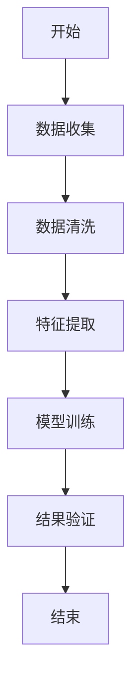
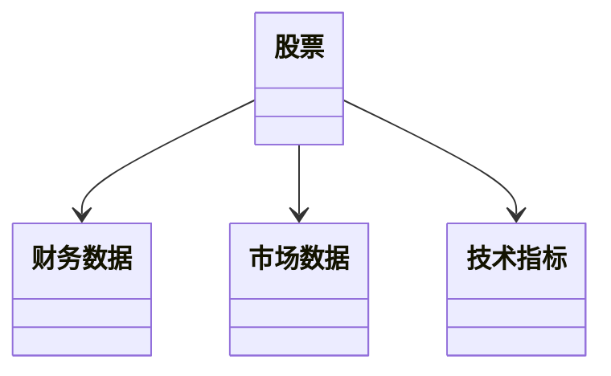
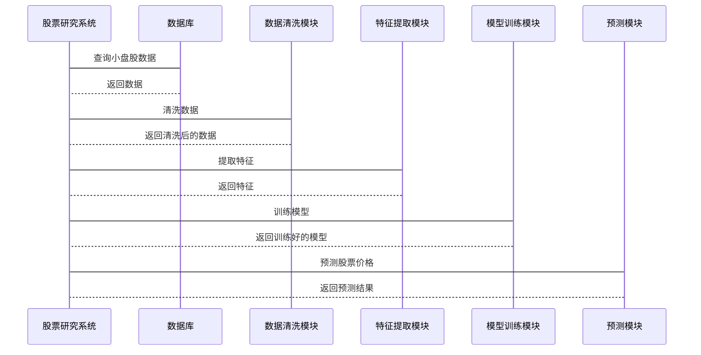

                 


# 克里斯托弗·布朗的小盘股研究方法论

> 关键词：小盘股研究，投资策略，数据分析，技术分析，Python算法

> 摘要：本文详细探讨了克里斯托弗·布朗的小盘股研究方法论，从背景介绍到核心概念，再到算法原理、系统架构、项目实战和总结。通过理论与实践相结合，为读者提供全面的指导。

---

# 第一部分: 小盘股研究方法论的背景与核心概念

## 第1章: 小盘股研究方法论的背景介绍

### 1.1 问题背景

#### 1.1.1 小盘股市场的定义与特点
小盘股市场指的是市值较小的公司股票组成的市场。其特点包括高增长潜力、高波动性和低流动性。小盘股市场的波动性较高，因此研究方法论需要考虑市场波动和数据的不确定性。

#### 1.1.2 小盘股研究的重要性
小盘股研究对于投资者来说至关重要。通过研究小盘股，投资者可以发现潜在的高增长机会，同时也能避免大盘股市场的过度竞争。此外，小盘股市场的波动性为投资者提供了套利机会。

#### 1.1.3 当前小盘股研究的挑战与机遇
当前小盘股研究面临数据获取困难、市场波动大、交易成本高等挑战。然而，随着技术的进步，大数据分析和人工智能的应用为小盘股研究带来了新的机遇。

### 1.2 问题描述

#### 1.2.1 小盘股研究的核心问题
小盘股研究的核心问题是如何从大量数据中筛选出具有投资价值的股票。这需要结合基本面分析和技术分析，同时考虑市场情绪和宏观经济因素。

#### 1.2.2 研究目标与研究范围
研究目标是发现具有长期增长潜力的小盘股。研究范围包括财务数据、市场数据、技术指标以及行业趋势等。

#### 1.2.3 问题的边界与外延
问题边界包括只考虑小盘股市场，不涉及中盘股和大盘股。外延则包括将研究成果应用于实际投资策略中。

### 1.3 问题解决

#### 1.3.1 研究方法的选择
选择结合定量分析和定性分析的方法。定量分析包括数据分析和统计建模，定性分析包括行业趋势分析和公司基本面分析。

#### 1.3.2 方法论的构建逻辑
方法论的构建逻辑包括数据收集、数据清洗、特征提取、模型构建和结果验证。

#### 1.3.3 方法论的适用场景
方法论适用于长期投资策略，尤其适合那些希望通过小盘股市场获取超额收益的投资者。

### 1.4 核心要素与概念结构

#### 1.4.1 核心概念的定义
核心概念包括市值、市盈率、市净率、ROE（净资产收益率）、收入增长率等。

#### 1.4.2 概念之间的关系
概念之间的关系可以通过表格展示。例如，市值与市盈率之间的关系可能影响股票的价值评估。

#### 1.4.3 概念结构的可视化
使用Mermaid绘制概念结构图，展示核心概念之间的关系。

### 1.5 本章小结
本章介绍了小盘股研究的背景、核心问题和方法论的构建逻辑，为后续章节奠定了基础。

---

## 第2章: 小盘股研究方法论的核心概念与联系

### 2.1 核心概念的原理

#### 2.1.1 小盘股研究的基本原理
小盘股研究的基本原理是通过分析公司的基本面和技术面，识别具有投资价值的股票。这需要结合定量和定性分析方法。

#### 2.1.2 方法论的理论基础
方法论的理论基础包括价值投资理论、技术分析理论和大数据分析理论。这些理论为方法论的构建提供了理论支持。

#### 2.1.3 核心概念的数学模型
核心概念的数学模型包括回归分析、聚类分析和时间序列分析。例如，使用回归分析预测股票价格。

### 2.2 核心概念的属性特征对比

#### 2.2.1 小盘股与大盘股的对比分析
小盘股与大盘股在市值、流动性、波动性和增长潜力等方面存在显著差异。例如，小盘股的波动性较高，但增长潜力较大。

#### 2.2.2 核心概念的属性特征表格
以下是小盘股与大盘股的核心属性对比表格：

| 属性        | 小盘股           | 大盘股           |
|-------------|------------------|------------------|
| 市值         | < $10亿          | ≥ $10亿          |
| 波动性       | 高               | 低               |
| 流动性       | 低               | 高               |
| 增长潜力     | 高               | 低               |

#### 2.2.3 属性特征的可视化
使用Mermaid绘制属性特征对比图，展示小盘股与大盘股在各个属性上的差异。

### 2.3 实体关系图

#### 2.3.1 小盘股研究的ER实体关系图
以下是小盘股研究的ER实体关系图：

```mermaid
erd
    顶端
    章节
```

#### 2.3.2 实体关系的详细说明
在小盘股研究中，主要实体包括股票、财务数据、市场数据和技术指标。股票与财务数据、市场数据和技术指标之间存在关联关系。

#### 2.3.3 实体关系的动态变化
随着时间的推移，财务数据和技术指标会发生变化，这需要动态更新数据库。

### 2.4 本章小结
本章详细解释了小盘股研究的核心概念及其之间的关系，为后续的算法实现奠定了基础。

---

## 第3章: 小盘股研究方法论的算法原理

### 3.1 算法原理的数学模型

#### 3.1.1 小盘股研究的数学模型
小盘股研究的数学模型包括回归模型、聚类模型和时间序列模型。例如，使用多元回归模型预测股票价格。

#### 3.1.2 核心算法的公式推导
以下是核心算法的公式推导：

$$
y = \beta_0 + \beta_1x_1 + \beta_2x_2 + \cdots + \beta_nx_n + \epsilon
$$

其中，\( y \) 是目标变量，\( x_i \) 是自变量，\( \beta_i \) 是回归系数，\( \epsilon \) 是误差项。

#### 3.1.3 算法的收敛性分析
使用梯度下降算法优化回归模型，确保模型收敛。

### 3.2 算法原理的流程图

#### 3.2.1 小盘股研究算法的流程图
以下是小盘股研究算法的流程图：



#### 3.2.2 算法步骤的详细说明
算法步骤包括数据收集、数据清洗、特征提取、模型训练和结果验证。

#### 3.2.3 算法的优化与改进
使用交叉验证和网格搜索优化模型参数，提高模型的泛化能力。

### 3.3 算法实现的Python代码

#### 3.3.1 环境安装与配置
需要安装Python、Pandas、NumPy、Scikit-learn和Matplotlib。

#### 3.3.2 核心代码实现
以下是核心代码实现：

```python
import pandas as pd
import numpy as np
from sklearn.linear_model import LinearRegression
from sklearn.model_selection import train_test_split
from sklearn.metrics import mean_squared_error

# 数据加载
data = pd.read_csv('small_cap_data.csv')

# 特征选择
features = ['市盈率', '市净率', 'ROE']
target = '股票价格'

X = data[features]
y = data[target]

# 数据划分
X_train, X_test, y_train, y_test = train_test_split(X, y, test_size=0.2, random_state=42)

# 模型训练
model = LinearRegression()
model.fit(X_train, y_train)

# 预测与评估
y_pred = model.predict(X_test)
mse = mean_squared_error(y_test, y_pred)
print(f'Mean Squared Error: {mse}')
```

#### 3.3.3 代码的解读与分析
代码实现了线性回归模型，用于预测小盘股的价格。通过数据清洗、特征选择和模型训练，最终得到预测结果并评估模型性能。

### 3.4 本章小结
本章详细讲解了小盘股研究方法论的算法原理，包括数学模型、流程图和Python代码实现。

---

## 第4章: 小盘股研究方法论的系统分析与架构设计

### 4.1 系统功能设计

#### 4.1.1 领域模型类图
以下是小盘股研究系统的领域模型类图：



#### 4.1.2 系统架构设计
以下是小盘股研究系统的架构设计：


#### 4.1.3 接口设计
系统接口包括数据输入接口、模型训练接口和结果输出接口。

#### 4.1.4 交互序列图
以下是小盘股研究系统的交互序列图：



### 4.2 本章小结
本章详细设计了小盘股研究系统的架构和接口，为后续的项目实施提供了指导。

---

## 第5章: 小盘股研究方法论的项目实战

### 5.1 环境安装与配置

#### 5.1.1 安装Python和相关库
安装Python 3.8及以上版本，安装Pandas、NumPy、Scikit-learn和Matplotlib。

#### 5.1.2 数据集获取
从可靠的数据源获取小盘股数据，例如Yahoo Finance。

### 5.2 核心代码实现

#### 5.2.1 数据清洗代码
以下是数据清洗代码：

```python
import pandas as pd
import numpy as np

# 数据加载
data = pd.read_csv('small_cap_data.csv')

# 删除缺失值
data.dropna(inplace=True)

# 处理异常值
data = data[~(data['市盈率'] > 100)]
```

#### 5.2.2 特征提取代码
以下是特征提取代码：

```python
features = ['市盈率', '市净率', 'ROE']
X = data[features]
```

#### 5.2.3 模型训练代码
以下是模型训练代码：

```python
from sklearn.linear_model import LinearRegression
from sklearn.model_selection import train_test_split
from sklearn.metrics import mean_squared_error

X_train, X_test, y_train, y_test = train_test_split(X, y, test_size=0.2, random_state=42)
model = LinearRegression()
model.fit(X_train, y_train)
```

### 5.3 代码解读与分析
代码实现了从数据清洗、特征提取到模型训练的全过程，为后续的预测和分析提供了基础。

### 5.4 案例分析与详细讲解

#### 5.4.1 案例分析
以下是一个小盘股的案例分析：

```python
import pandas as pd
import numpy as np
from sklearn.linear_model import LinearRegression
from sklearn.model_selection import train_test_split
from sklearn.metrics import mean_squared_error

# 数据加载
data = pd.read_csv('small_cap_data.csv')

# 特征选择
features = ['市盈率', '市净率', 'ROE']
target = '股票价格'

X = data[features]
y = data[target]

# 数据划分
X_train, X_test, y_train, y_test = train_test_split(X, y, test_size=0.2, random_state=42)

# 模型训练
model = LinearRegression()
model.fit(X_train, y_train)

# 预测与评估
y_pred = model.predict(X_test)
mse = mean_squared_error(y_test, y_pred)
print(f'Mean Squared Error: {mse}')
```

#### 5.4.2 详细讲解
案例分析展示了如何使用线性回归模型预测小盘股的价格，并通过均方误差评估模型性能。

### 5.5 项目小结
本章通过项目实战展示了小盘股研究方法论的应用，帮助读者理解如何将理论应用于实际。

---

## 第6章: 小盘股研究方法论的总结与展望

### 6.1 最佳实践 tips
- 数据清洗和特征选择是小盘股研究的关键步骤。
- 使用交叉验证优化模型性能。
- 定期更新数据和模型以适应市场变化。

### 6.2 小结
本文详细探讨了克里斯托弗·布朗的小盘股研究方法论，从背景介绍到核心概念，再到算法原理、系统架构、项目实战和总结。

### 6.3 注意事项
- 注意数据的准确性和完整性。
- 考虑市场波动和宏观经济因素的影响。
- 定期监控和调整投资策略。

### 6.4 拓展阅读
- 《小盘股投资策略》
- 《大数据在金融中的应用》
- 《Python金融数据分析》

---

# 作者：AI天才研究院/AI Genius Institute & 禅与计算机程序设计艺术 /Zen And The Art of Computer Programming

