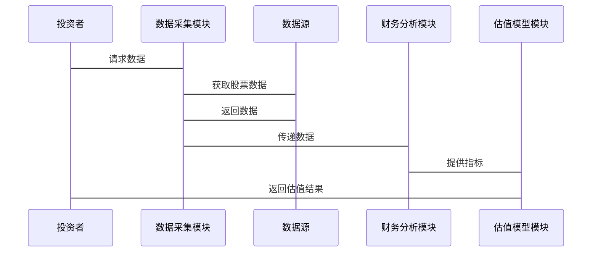

                 


# 克里斯托弗·布朗的深度价值投资方法

> 关键词：深度价值投资，投资算法，价值评估模型，投资系统架构，投资决策框架，安全边际

> 摘要：本文深入分析克里斯托弗·布朗的深度价值投资方法，从背景、核心概念、算法原理到系统架构、项目实战，全面解读其投资理念和方法。通过数学模型、系统设计和实际案例，揭示深度价值投资的奥秘。

---

## 第1章: 深度价值投资的核心理念

### 1.1 价值投资的基本概念

#### 1.1.1 投资的定义与核心问题
投资是通过将资金投入特定资产或项目，以期获得未来收益的行为。核心问题包括：
- 如何选择具有长期价值的资产？
- 如何评估资产的内在价值？
- 如何在市场波动中保持理性？

#### 1.1.2 价值投资的起源与发展
价值投资由本杰明·格雷厄姆提出，强调以低于内在价值的价格购买资产。克里斯托弗·布朗继承并发展了这一理念，结合现代数学模型，形成了深度价值投资方法。

#### 1.1.3 深度价值投资的定义与特点
深度价值投资是通过详细分析企业基本面，寻找市场价格低于内在价值的投资机会。其特点是：
- 以基本面分析为基础
- 重视安全边际
- 长期持有优质资产

### 1.2 投资者心态与决策框架

#### 1.2.1 投资者的心理特征
投资者常受情绪影响，容易陷入贪婪和恐惧。深度价值投资要求投资者具备理性思维和耐心。

#### 1.2.2 理性与非理性的投资决策
非理性决策包括追涨杀跌、过度交易等。理性决策基于对企业内在价值的深入分析。

#### 1.2.3 投资决策框架的构建
构建决策框架包括：
1. 明确投资目标
2. 制定估值方法
3. 设定买入和卖出标准
4. 坚持长期投资

### 1.3 价值投资的核心要素

#### 1.3.1 财务报表分析基础
分析资产负债表、利润表和现金流量表，重点关注ROE、净利润、现金流等指标。

#### 1.3.2 企业估值的核心指标
包括市盈率（P/E）、市净率（P/B）、股息率等。

#### 1.3.3 安全边际的定义与作用
安全边际是市场价格与内在价值的差距，确保在市场波动中不会损失本金。

---

## 第2章: 价值投资的数学模型与算法原理

### 2.1 企业内在价值的计算方法

#### 2.1.1 现金流折现模型（DCF）

现金流折现模型是估算企业内在价值的核心方法，公式如下：

$$
\text{企业价值} = \sum_{t=1}^{n} \frac{\text{自由现金流}_t}{(1 + r)^t} + \frac{\text{终值}}{(1 + r)^n}
$$

其中，$r$是折现率，$n$是预测期数。

#### 2.1.2 市盈率与市净率分析
市盈率（P/E）= 股价 / 每股净利润  
市净率（P/B）= 股价 / 每股净资产

#### 2.1.3 股东权益收益率（ROE）
$$
ROE = \frac{\text{净利润}}{\text{股东权益}}
$$

### 2.2 投资组合优化的数学模型

#### 2.2.1 马科维茨投资组合理论
马科维茨理论通过优化投资组合的收益与风险，提出有效前沿的概念。

#### 2.2.2 现代投资组合理论（MPT）
MPT通过分散投资降低风险，公式如下：

$$
\sigma_p^2 = \sigma_1^2 w_1^2 + \sigma_2^2 w_2^2 + 2w_1 w_2 \sigma_1 \sigma_2 \rho_{12}
$$

其中，$\sigma_p$是组合风险，$w$是权重，$\rho$是相关系数。

#### 2.2.3 风险与收益的平衡
通过夏普比率衡量投资组合的超额收益与承担风险的关系：

$$
\text{夏普比率} = \frac{\text{超额收益}}{\text{标准差}}
$$`

### 2.3 价值投资算法的实现

#### 2.3.1 数据获取与预处理
使用Yahoo Finance获取股票数据，清洗缺失值。

#### 2.3.2 财务指标计算与估值模型
计算ROE、P/E、P/B等指标，构建DCF模型。

#### 2.3.3 投资决策的逻辑实现
编写Python代码，实现数据获取、估值计算和决策判断。

---

## 第3章: 深度价值投资的系统架构设计

### 3.1 投资决策系统的模块划分

- 数据采集模块：获取市场数据
- 财务分析模块：计算财务指标
- 估值模型模块：估算内在价值
- 投资决策模块：制定买卖策略

### 3.2 系统架构的类图设计

```mermaid
classDiagram
    class 数据采集模块 {
        +数据源: 接口
        +获取市场数据(): 方法
    }
    class 财务分析模块 {
        +财务指标: 列表
        +计算指标(): 方法
    }
    class 估值模型模块 {
        +估值结果: 数值
        +运行模型(): 方法
    }
    数据采集模块 -> 财务分析模块: 传递数据
    财务分析模块 -> 估值模型模块: 提供指标
```

### 3.3 系统交互的序列图



---

## 第4章: 项目实战与案例分析

### 4.1 案例公司选择

#### 4.1.1 公司基本面分析
以苹果公司为例，分析其财务报表。

#### 4.1.2 财务数据获取与清洗
使用Python代码获取苹果的历史股价和财务数据。

#### 4.1.3 估值模型的实现
编写代码计算苹果的DCF估值。

### 4.2 投资决策系统的实现

#### 4.2.1 环境安装与配置
安装Python、Pandas、Matplotlib等库。

#### 4.2.2 核心代码实现
```python
import pandas as pd
import yfinance as yf

# 获取数据
apple = yf.download('AAPL', start='2020-01-01', end='2023-12-31')

# 计算财务指标
def calculate_roe(df):
    roe = df['Net Income'] / df['Total Equity']
    return roe

# 运行DCF模型
def dcf_valuation(df, discount_rate=0.08):
    # 假设自由现金流为净利润 + 非经营性现金流
    fcf = df['Net Income'] + df['Operating Cash Flow']
    # 折现计算
    present_value = sum(fcf / (1 + discount_rate)**i for i in range(len(fcf)))
    return present_value
```

#### 4.2.3 代码应用解读与分析
通过代码计算苹果的ROE和DCF估值，与市场价格进行对比。

---

## 第5章: 总结与展望

### 5.1 总结
深度价值投资通过基本面分析和数学模型，帮助投资者找到低估资产，实现长期收益。

### 5.2 展望
未来，结合AI技术，深度价值投资将更加精准和高效。

---

## 作者

作者：AI天才研究院/AI Genius Institute & 禅与计算机程序设计艺术 /Zen And The Art of Computer Programming

---

通过以上内容，我们系统地解读了克里斯托弗·布朗的深度价值投资方法，从理论到实践，帮助读者全面掌握这一投资策略。

