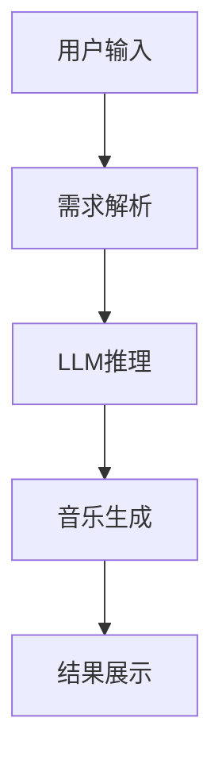

                 


# 创新音乐创作AI Agent：LLM在艺术创作中的应用

## 关键词：LLM, 音乐创作, 人工智能, 艺术创作, 生成模型

## 摘要：  
随着人工智能技术的飞速发展，大语言模型（LLM）在艺术创作领域的应用逐渐崭露头角。本文将深入探讨LLM在音乐创作中的潜力与挑战，分析其核心原理，并通过实际案例展示如何利用LLM构建创新的音乐创作AI代理。文章从背景介绍、算法原理、系统设计到项目实战，全面解析LLM在音乐创作中的应用，为读者提供理论与实践相结合的深度洞察。

---

## 第一部分: 创新音乐创作的背景与挑战

### 第1章: 音乐创作的现状与痛点

#### 1.1 音乐创作的传统模式
- 传统音乐创作的流程与工具
- 创作者面临的挑战：灵感枯竭、技术门槛高、创作效率低
- 数字化创作工具的演变：从MIDI到现代DAW（数字音频工作站）

#### 1.2 AI技术在艺术创作中的潜力
- AI在绘画、写作、音乐等领域的应用现状
- LLM在艺术创作中的独特优势：生成多样化、高效性、可定制性
- 创新音乐创作AI Agent的目标：辅助创作者，激发灵感，提升效率

#### 1.3 LLM在音乐创作中的应用边界
- LLM的强项：文本生成、模式识别、风格模仿
- LLM的局限性：缺乏情感理解、创作多样性受限
- 音乐创作中的人机协作模式

---

## 第二部分: LLM的核心概念与算法原理

### 第2章: LLM的基本原理

#### 2.1 大语言模型的定义与特点
- 什么是大语言模型（LLM）？
- LLM的核心特点：大规模数据训练、深度学习、生成能力
- LLM的数学基础：概率论、统计学、神经网络

#### 2.2 LLM的训练与推理机制
- 基于Transformer的架构：编码器-解码器结构
- 注意力机制：序列建模的核心
- 损失函数：交叉熵损失
- 生成过程：解码器的采样方法（贪婪采样、温度采样、Top-k采样）

#### 2.3 LLM在音乐创作中的应用方式
- 文本到音乐的映射：通过文本描述生成音乐片段
- 音乐风格模仿：基于特定风格生成音乐
- 用户参与的共创模式：结合用户的实时反馈生成音乐

---

## 第三部分: 创新音乐创作AI Agent的系统设计

### 第3章: 系统架构设计

#### 3.1 系统功能模块
- 用户需求输入模块：接收用户提供的文本描述或音乐风格
- 模型推理与生成模块：基于LLM生成音乐片段
- 创意输出展示模块：将生成的音乐片段以可视化或可听化形式呈现

#### 3.2 系统架构图


#### 3.3 系统接口设计
- 输入接口：文本输入、音乐风格选择
- 输出接口：MIDI文件、音频流、可视化展示

---

## 第四部分: 项目实战与案例分析

### 第4章: 环境搭建与工具安装

#### 4.1 开发环境选择
- Python 3.8+
- 安装必要的库：transformers、torch、librosa、numpy

#### 4.2 模型训练环境搭建
- 使用Hugging Face的预训练模型（如GPT-2、GPT-3）
- 安装训练所需的框架（如TensorFlow或PyTorch）

#### 4.3 音乐生成工具
- MIDI生成工具：MuseScore、Python MIDI库
- 音频生成工具：Librosa、Soundfile

### 第5章: 核心功能实现

#### 5.1 用户需求输入模块
- 文本输入接口：用户输入创作描述
- 音乐风格选择：用户选择风格（如古典、流行、电子）

#### 5.2 模型推理与生成模块
```python
from transformers import AutoModelForCausalLM, AutoTokenizer

tokenizer = AutoTokenizer.from_pretrained('gpt2')
model = AutoModelForCausalLM.from_pretrained('gpt2')

def generate_music_description(prompt):
    inputs = tokenizer.encode(prompt, return_tensors='pt')
    outputs = model.generate(inputs, max_length=50, temperature=0.7)
    return tokenizer.decode(outputs[0], skip_special_tokens=True)
```

#### 5.3 创意输出展示模块
- MIDI文件生成：将生成的音乐片段导出为MIDI格式
- 音频流生成：将MIDI文件转换为音频流
- 可视化展示：生成音乐的波形图或乐谱可视化

### 第6章: 案例分析与实际应用

#### 6.1 实际案例分析
- 案例1：基于文本描述生成流行音乐
- 案例2：模仿古典音乐家的风格创作新曲

#### 6.2 项目总结
- 项目实现的关键点总结
- 系统的优缺点分析
- 未来改进方向

---

## 第五部分: 总结与展望

### 第7章: 总结

#### 7.1 创新音乐创作AI Agent的核心价值
- 提升创作效率
- 激发创作灵感
- 扩展创作可能性

#### 7.2 技术总结
- LLM在音乐创作中的优势
- 系统设计的关键点
- 项目实现的难点与解决方案

### 第8章: 未来展望

#### 8.1 技术发展
- 更先进的模型（如GPT-4、PaLM）
- 多模态AI的发展
- 音乐生成的实时性与互动性

#### 8.2 应用场景扩展
- 音乐教育
- 音乐治疗
- 个性化音乐推荐

---

## 致谢

感谢读者的耐心阅读，感谢技术社区的开源贡献者，感谢所有支持人工智能发展的研究者和实践者。

---

## 作者信息

作者：AI天才研究院/AI Genius Institute  
& 禅与计算机程序设计艺术/Zen And The Art of Computer Programming

