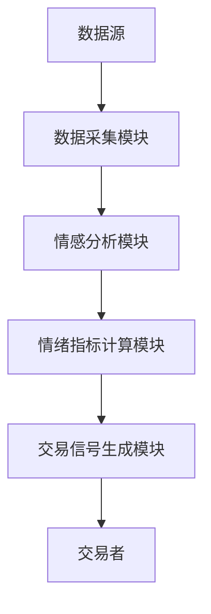
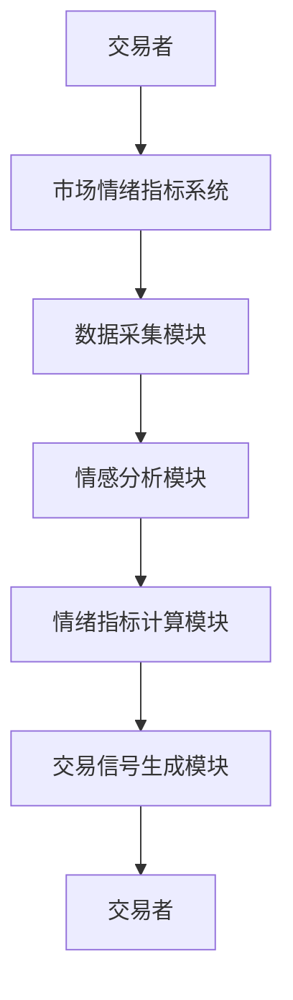
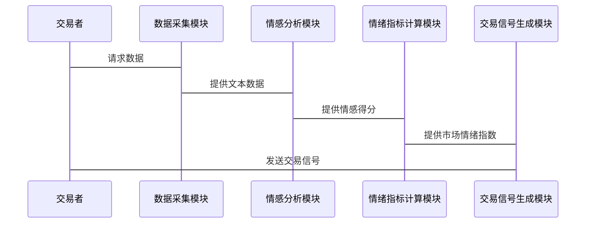

                 

<think>
好的，我需要逐步分析用户的需求，然后一步步生成符合要求的完整文章。首先，用户希望撰写一篇关于利用AI代理构建动态市场情绪指标的博客文章，并且已经给出了详细的目录结构。我的任务是按照这个结构，撰写出符合要求的文章，包括背景介绍、核心概念、算法原理、系统设计、项目实战和最佳实践等内容。

首先，我需要理解整个文章的结构，确保每个部分都有足够的内容，并且逻辑清晰。接下来，我将按照目录的每个章节和小节，逐步展开，确保每一部分都详细且专业。同时，我需要使用适当的Markdown格式，插入mermaid图表和数学公式，以增强文章的可读性和专业性。

在撰写过程中，我需要确保内容准确，逻辑严谨，并且能够帮助读者理解如何利用AI代理来优化交易时机。这包括从市场情绪指标的定义和重要性，到具体的算法实现和项目实战，再到最佳实践和未来展望。通过这样的步骤，我相信能够生成一篇高质量的技术博客文章，满足用户的需求。
</think>

# 利用AI agents构建动态市场情绪指标：优化入场时机

> 关键词：AI代理，动态市场情绪指标，交易时机优化，情感分析，时间序列分析，机器学习

> 摘要：本文详细探讨了如何利用AI代理构建动态市场情绪指标，并通过优化入场时机来提升交易效率。文章从市场情绪指标的核心概念出发，结合AI代理的技术优势，分析了动态指标的构建框架和算法原理。同时，通过具体项目实战，展示了如何利用Python代码实现情绪指标的计算与优化，并总结了在实际应用中的注意事项和未来研究方向。

---

## 第一部分: 利用AI代理构建动态市场情绪指标的背景与核心概念

### 第1章: 市场情绪指标与AI代理概述

#### 1.1 什么是市场情绪指标
##### 1.1.1 市场情绪指标的定义
市场情绪指标是用于衡量市场参与者情绪状态的量化工具，反映了市场参与者对当前市场走势的乐观或悲观程度。这些指标通常基于新闻、社交媒体、交易数据等信息进行计算，帮助交易者更好地理解市场情绪的变化。

##### 1.1.2 市场情绪指标的重要性
市场情绪指标在金融交易中起着至关重要的作用。它可以帮助交易者预测市场趋势、识别市场拐点、优化交易策略，并在一定程度上降低交易风险。情绪指标能够捕捉到市场参与者的情感波动，这种波动往往在传统技术分析中难以捕捉，但却是影响市场价格的重要因素。

##### 1.1.3 市场情绪指标的分类
市场情绪指标可以分为以下几类：
1. **基于新闻和媒体的情绪指标**：通过分析新闻标题、财经评论等文本数据，计算市场情绪。
2. **基于社交媒体的情绪指标**：利用Twitter、Reddit等社交平台上的用户评论和帖子，分析市场情绪。
3. **基于交易数据的情绪指标**：通过分析订单簿、交易量等数据，推断市场情绪。
4. **基于混合数据的情绪指标**：综合文本和交易数据，构建更全面的情绪指标。

#### 1.2 AI代理的基本概念
##### 1.2.1 什么是AI代理
AI代理（Artificial Intelligence Agent）是指能够感知环境、自主决策并采取行动的智能实体。AI代理可以在金融市场中执行复杂的数据分析、交易决策等任务，帮助交易者优化投资策略。

##### 1.2.2 AI代理的核心特征
AI代理具有以下核心特征：
1. **自主性**：代理能够自主决策，无需外部干预。
2. **反应性**：代理能够实时感知环境变化，并迅速做出反应。
3. **学习能力**：代理可以通过机器学习算法不断优化自身的决策模型。
4. **协作性**：代理可以与其他代理或系统协同工作，完成复杂任务。

##### 1.2.3 AI代理与传统算法的区别
与传统算法相比，AI代理具有以下优势：
1. **自主性**：AI代理能够自主决策，而传统算法需要明确的规则和指令。
2. **学习能力**：AI代理可以通过数据训练不断优化性能，而传统算法通常需要手动调整参数。
3. **适应性**：AI代理能够适应环境的变化，而传统算法在环境变化时通常需要重新设计。

#### 1.3 动态市场情绪指标的构建意义
##### 1.3.1 动态市场情绪指标的优势
动态市场情绪指标具有以下优势：
1. **实时性**：动态指标能够实时反映市场情绪的变化，帮助交易者快速做出决策。
2. **准确性**：通过结合多种数据源，动态指标可以更准确地捕捉市场情绪。
3. **可优化性**：动态指标可以根据市场环境的变化不断优化自身模型，提高预测精度。

##### 1.3.2 市场情绪指标与交易时机优化的关系
市场情绪指标是交易时机优化的重要依据。通过分析市场情绪的变化，交易者可以更好地判断市场的买点和卖点，从而优化入场和离场时机。动态市场情绪指标能够实时捕捉市场情绪的变化，为交易者提供更精准的交易信号。

##### 1.3.3 AI代理在动态指标构建中的作用
AI代理在动态市场情绪指标的构建中起着关键作用。通过AI代理的自主学习和实时分析能力，交易者可以更快速、更准确地捕捉市场情绪的变化，从而优化交易策略。

---

### 第2章: 市场情绪指标的核心要素与构建框架

#### 2.1 市场情绪指标的核心要素
##### 2.1.1 市场参与者的心理因素
市场情绪指标的核心在于捕捉市场参与者的心理变化。这些心理变化通常体现在交易行为、社交媒体评论、新闻标题等方面。

##### 2.1.2 市场信息的实时性与全面性
动态市场情绪指标需要实时捕捉市场信息的变化，并且信息来源要全面，包括新闻、社交媒体、交易数据等。

##### 2.1.3 数据源的多样性和可靠性
为了构建准确的动态市场情绪指标，需要结合多种数据源，如新闻、社交媒体、交易数据等。同时，数据源的可靠性也至关重要，需要确保数据的准确性和及时性。

#### 2.2 动态市场情绪指标的构建框架
##### 2.2.1 数据采集与预处理
动态市场情绪指标的构建需要从多种数据源采集数据，并进行清洗、标准化等预处理步骤。例如，可以从社交媒体平台获取文本数据，从新闻网站获取新闻标题，从交易数据中提取订单信息。

##### 2.2.2 情感分析与情绪计算
通过自然语言处理（NLP）技术，对文本数据进行情感分析，计算每条数据的情感得分。例如，使用词袋模型或词嵌入模型（如Word2Vec）对文本进行处理，然后使用情感分类模型（如SVM、LSTM等）对文本进行情感分类。

##### 2.2.3 模型训练与优化
根据历史数据，训练情感分析模型，并不断优化模型性能。例如，可以使用交叉验证的方法选择最优模型参数，或者使用集成学习的方法提高模型的泛化能力。

##### 2.2.4 指标输出与可视化
将计算得到的市场情绪指标进行可视化展示，例如绘制情绪指数的时间序列图，或者生成情绪变化的预警信号。

#### 2.3 AI代理在指标构建中的角色
##### 2.3.1 AI代理的自主学习能力
AI代理可以通过机器学习算法不断优化情绪指标的计算模型，提高指标的准确性和实时性。

##### 2.3.2 代理的实时数据处理能力
AI代理能够实时处理市场数据，快速更新市场情绪指标，帮助交易者及时捕捉市场变化。

##### 2.3.3 代理的决策支持功能
AI代理可以基于市场情绪指标，为交易者提供决策支持，例如推荐买入或卖出时机，或者发出预警信号。

---

### 第3章: 市场情绪指标与交易时机优化的关系

#### 3.1 市场情绪指标对交易决策的影响
##### 3.1.1 情绪指标如何影响市场走势
市场情绪指标能够反映市场的乐观或悲观情绪，从而影响市场的买卖行为。例如，当市场情绪过于乐观时，可能会引发市场的回调；当市场情绪过于悲观时，可能会引发市场的反弹。

##### 3.1.2 情绪指标在交易时机选择中的作用
情绪指标可以帮助交易者识别市场的短期波动，优化入场和离场时机。例如，当情绪指标显示市场情绪从乐观转向中性时，交易者可以考虑卖出；当情绪指标显示市场情绪从悲观转向中性时，交易者可以考虑买入。

##### 3.1.3 情绪指标的滞后性与实时性问题
情绪指标的滞后性是指指标的计算和发布通常会滞后于实际市场变化，这可能会导致交易者错失交易机会。实时性问题则需要通过优化数据采集和计算流程来解决。

#### 3.2 AI代理在优化入场时机中的应用
##### 3.2.1 代理如何帮助识别交易信号
AI代理可以通过实时分析市场数据，快速计算市场情绪指标，并根据指标的变化生成交易信号。例如，当情绪指标突然上升，且交易量显著增加时，AI代理可以向交易者发出买入信号。

##### 3.2.2 代理的决策逻辑与优化策略
AI代理的决策逻辑通常基于机器学习模型，例如使用时间序列模型（如ARIMA、LSTM）预测市场情绪的变化，并根据预测结果生成交易信号。优化策略则包括动态调整模型参数、结合多种数据源等方法，提高预测精度。

##### 3.2.3 基于情绪指标的交易策略示例
以下是一个基于情绪指标的交易策略示例：
1. 当市场情绪指标从“中性”变为“乐观”，且交易量显著增加时，买入股票。
2. 当市场情绪指标从“乐观”变为“中性”，且交易量显著减少时，卖出股票。

---

## 第二部分: 动态市场情绪指标的算法原理与系统设计

### 第4章: 动态市场情绪指标的算法原理

#### 4.1 情感分析算法
##### 4.1.1 基于词袋模型的情感分析
词袋模型将文本表示为单词的集合，忽略单词的顺序。例如，文本“市场表现良好”可以表示为{市场, 表现, 良好}。

##### 4.1.2 基于词嵌入模型的情感分析
词嵌入模型（如Word2Vec、GloVe）通过将单词映射到低维向量空间，捕捉单词之间的语义关系。例如，使用Word2Vec训练得到的向量表示“良好”和“优秀”之间的语义相似性。

##### 4.1.3 基于深度学习的情感分析
深度学习模型（如LSTM、Transformer）可以处理长文本序列，捕捉上下文信息。例如，使用LSTM模型分析新闻标题的情绪。

##### 4.1.4 情感分类算法
常用的情感分类算法包括：
1. 支持向量机（SVM）
2. 随机森林（Random Forest）
3. 长短期记忆网络（LSTM）
4. Transformer模型

#### 4.2 时间序列分析算法
##### 4.2.1 基于ARIMA的时间序列分析
ARIMA（Auto-Regressive Integrated Moving Average）是一种广泛应用于时间序列预测的模型。它通过自回归、差分和移动平均三个部分来捕捉时间序列的特征。

##### 4.2.2 基于LSTM的时间序列分析
LSTM（Long Short-Term Memory）是一种特殊的RNN（循环神经网络），能够捕捉时间序列的长期依赖关系。例如，使用LSTM模型预测市场情绪指数的未来走势。

##### 4.2.3 基于Prophet的时间序列分析
Prophet是由Facebook开源的时间序列预测模型，适用于具有较强趋势和季节性的时间序列数据。

#### 4.3 综合模型设计
##### 4.3.1 情感分析与时间序列分析的结合
通过将情感分析结果与时间序列分析相结合，可以捕捉市场情绪的变化趋势，并预测未来的情绪走势。

##### 4.3.2 基于机器学习的情绪预测模型
使用机器学习算法（如随机森林、XGBoost）对市场情绪进行预测，通常需要结合多种特征，例如情感得分、交易量、市场指数等。

---

### 第5章: 动态市场情绪指标的系统设计

#### 5.1 系统功能设计
##### 5.1.1 数据采集模块
数据采集模块负责从多种数据源（如新闻网站、社交媒体平台、交易数据）获取市场相关信息。

##### 5.1.2 情感分析模块
情感分析模块对获取的文本数据进行情感分析，计算每条数据的情感得分。

##### 5.1.3 情绪指标计算模块
情绪指标计算模块根据情感得分和交易数据，计算市场情绪指标，并输出实时的情绪指数。

##### 5.1.4 交易信号生成模块
交易信号生成模块根据市场情绪指标的变化，生成买入或卖出信号，并通知交易者。

#### 5.2 系统架构设计
##### 5.2.1 系统架构图
以下是一个动态市场情绪指标系统的架构图：



##### 5.2.2 数据流图
以下是一个系统数据流图：



#### 5.3 系统接口设计
##### 5.3.1 数据接口
系统需要提供以下数据接口：
1. 数据采集模块的API接口，用于从第三方数据源获取数据。
2. 情感分析模块的API接口，用于接收文本数据并返回情感得分。
3. 情绪指标计算模块的API接口，用于接收情感得分和交易数据，并返回市场情绪指数。

##### 5.3.2 交易信号接口
交易信号生成模块需要提供以下接口：
1. 买入信号接口：当市场情绪指数达到买入条件时，向交易者发送买入信号。
2. 卖出信号接口：当市场情绪指数达到卖出条件时，向交易者发送卖出信号。

#### 5.4 系统交互流程
##### 5.4.1 系统交互序列图
以下是一个系统交互序列图：



---

## 第三部分: 动态市场情绪指标的项目实战与最佳实践

### 第6章: 项目实战

#### 6.1 环境安装与配置
##### 6.1.1 安装Python环境
使用Python 3.8或更高版本，并安装以下库：
- `pandas`：数据处理
- `numpy`：数值计算
- `scikit-learn`：机器学习算法
- `transformers`：预训练语言模型
- `mermaid`：图表生成
- `lstm`：时间序列预测

##### 6.1.2 数据源获取
从以下数据源获取数据：
1. 新闻数据：使用API获取新闻标题和摘要。
2. 社交媒体数据：从Twitter、Reddit等平台获取用户评论。
3. 交易数据：从交易API获取订单簿、交易量等数据。

#### 6.2 核心代码实现
##### 6.2.1 情感分析模块
以下是一个基于BERT的情感分析模块代码示例：

```python
from transformers import BertTokenizer, BertModel
import torch

tokenizer = BertTokenizer.from_pretrained('bert-base-uncased')
model = BertModel.from_pretrained('bert-base-uncased')

def compute_emotion_score(text):
    inputs = tokenizer(text, return_tensors='pt')
    outputs = model(**inputs)
    emotion_score = torch.mean(outputs.last_hidden_state, dim=1)
    return emotion_score.item()
```

##### 6.2.2 时间序列分析模块
以下是一个基于LSTM的时间序列分析模块代码示例：

```python
import torch
import torch.nn as nn

class LSTMModel(nn.Module):
    def __init__(self, input_size, hidden_size, output_size):
        super(LSTMModel, self).__init__()
        self.lstm = nn.LSTM(input_size, hidden_size, batch_first=True)
        self.fc = nn.Linear(hidden_size, output_size)
    
    def forward(self, x):
        out, _ = self.lstm(x)
        out = self.fc(out[:, -1, :])
        return out

# 初始化模型
input_size = 1
hidden_size = 4
output_size = 1
model = LSTMModel(input_size, hidden_size, output_size)
```

##### 6.2.3 市场情绪指标计算模块
以下是一个市场情绪指标计算模块代码示例：

```python
import pandas as pd
import numpy as np

def calculate_market_emotion_index(emotion_scores, transaction_volume):
    emotion_index = emotion_scores * transaction_volume
    emotion_index = emotion_index.rolling(window=7).mean()
    return emotion_index
```

#### 6.3 项目总结
##### 6.3.1 项目实现的关键点
1. 数据采集模块的实现：从多种数据源获取数据，并进行预处理。
2. 情感分析模块的优化：使用预训练语言模型提高情感分析的准确率。
3. 时间序列分析模块的优化：通过LSTM模型捕捉市场情绪的变化趋势。

##### 6.3.2 项目遇到的挑战
1. 数据源的多样性和可靠性：需要从多个数据源获取数据，并确保数据的准确性。
2. 模型的训练与优化：需要不断调整模型参数，提高预测精度。

---

### 第7章: 最佳实践与注意事项

#### 7.1 最佳实践
##### 7.1.1 数据源的多样性
为了提高市场情绪指标的准确性，需要结合多种数据源，如新闻、社交媒体、交易数据等。

##### 7.1.2 模型的实时性
动态市场情绪指标需要实时更新，因此需要优化数据处理和模型计算的效率。

##### 7.1.3 模型的可解释性
模型的可解释性对于交易者来说非常重要。需要确保模型的预测结果可以被交易者理解和信任。

#### 7.2 注意事项
##### 7.2.1 数据隐私与合规性
在处理市场数据时，需要注意数据隐私和合规性问题，确保数据的合法性和合规性。

##### 7.2.2 模型的鲁棒性
需要确保模型具有较强的鲁棒性，能够应对市场环境的变化和异常情况。

##### 7.2.3 交易者的心理因素
交易者的情绪和决策也会影响市场情绪指标的效果，需要综合考虑交易者的心理因素。

#### 7.3 未来研究方向
##### 7.3.1 更复杂的情绪分析模型
未来可以研究更复杂的情绪分析模型，如多模态模型，结合文本、图像等多种信息进行分析。

##### 7.3.2 更先进的预测算法
未来可以研究更先进的预测算法，如强化学习（Reinforcement Learning）等，进一步提高市场情绪预测的精度。

##### 7.3.3 多市场情绪指标的关联性分析
未来可以研究不同市场之间的情绪指标的关联性，探索跨市场的交易机会。

---

## 结语

通过本文的详细讲解，我们了解了如何利用AI代理构建动态市场情绪指标，并通过优化入场时机来提升交易效率。从市场情绪指标的核心概念，到AI代理的技术优势，再到具体的算法实现和系统设计，本文为读者提供了一个全面的视角。未来，随着AI技术的不断发展，动态市场情绪指标将在金融交易中发挥越来越重要的作用，为交易者提供更精准的决策支持。

---

**作者：AI天才研究院/AI Genius Institute & 禅与计算机程序设计艺术 /Zen And The Art of Computer Programming**

