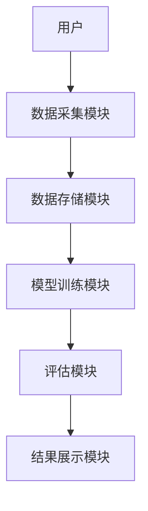

                 


# 利用AI agents构建动态竞争优势评估模型：护城河分析

> 关键词：AI agents，竞争优势评估模型，护城河分析，动态评估，强化学习，图神经网络，系统架构

> 摘要：本文详细探讨了利用AI agents构建动态竞争优势评估模型的方法，重点分析了护城河的动态特性。通过强化学习和图神经网络，我们提出了一个高效的评估框架，并结合实际案例展示了系统的实现与优化。

---

# 第一部分：AI agents与竞争优势评估模型概述

## 第1章：AI agents的基本概念与应用

### 1.1 AI agents的定义与分类

AI agents（人工智能代理）是指能够感知环境、自主决策并采取行动的智能体。根据智能体的结构和功能，可以将其分为以下几类：

- **简单反射型代理**：基于当前输入做出反应，适用于简单的任务。
- **基于模型的反射型代理**：通过内部模型预测环境状态，适用于复杂环境。
- **目标驱动型代理**：根据预设目标采取行动，常用于优化问题。
- **效用驱动型代理**：通过最大化效用函数来决策，适用于多目标优化场景。

### 1.2 AI agents在商业竞争中的应用

AI agents在商业竞争中的应用广泛，包括：

- **市场分析**：通过实时数据分析，帮助企业识别市场趋势。
- **竞争策略优化**：基于对手行为预测最佳应对策略。
- **动态资源分配**：根据环境变化动态调整资源分配。

### 1.3 动态竞争优势评估模型的定义

竞争优势评估模型用于衡量企业在市场中的优势，动态竞争优势评估模型强调在动态环境中实时更新评估结果。

---

## 第2章：AI agents的核心原理与技术

### 2.1 强化学习与AI agents的结合

强化学习（Reinforcement Learning，RL）是AI agents的核心技术之一。通过与环境交互，AI agents学习最优策略，以最大化累积奖励。

### 2.2 图神经网络（GNN）的应用

图神经网络在竞争优势评估中用于处理复杂的网络关系，例如企业之间的合作关系、竞争关系等。

### 2.3 多智能体协作与竞争

在多智能体系统（MAS）中，AI agents需要在协作与竞争中找到平衡，以实现全局最优。

---

## 第3章：动态竞争优势评估模型的构建

### 3.1 数据采集与预处理

- **数据来源**：包括市场数据、企业财报、行业报告等。
- **数据清洗**：去除噪声数据，提取关键特征。

### 3.2 基于AI agents的评估方法

- **强化学习模型**：通过状态-动作-奖励机制，动态调整评估策略。
- **图神经网络模型**：通过图结构捕捉企业之间的关系。

### 3.3 模型的动态更新与优化

- **在线学习**：实时更新模型参数，适应环境变化。
- **模型融合**：结合多种模型的优势，提升评估准确性。

---

## 第4章：基于强化学习的竞争优势评估算法

### 4.1 强化学习算法原理

通过状态空间、动作空间和奖励函数的定义，AI agents学习最优策略。

### 4.2 图神经网络算法

通过图结构捕捉企业之间的关系，提升评估的准确性。

---

## 第5章：系统架构设计与实现

### 5.1 系统功能设计

- **数据采集模块**：实时采集市场数据。
- **模型训练模块**：训练强化学习和图神经网络模型。
- **评估模块**：输出竞争优势评估结果。

### 5.2 系统架构图



---

## 第6章：项目实战与案例分析

### 6.1 环境安装与配置

- **安装Python环境**：使用Anaconda或虚拟环境。
- **安装依赖库**：包括PyTorch、numpy、matplotlib等。

### 6.2 核心代码实现

```python
import torch
import torch.nn as nn
import torch.optim as optim

class AdvantageNet(nn.Module):
    def __init__(self, input_dim, hidden_dim, output_dim):
        super(AdvantageNet, self).__init__()
        self.fc1 = nn.Linear(input_dim, hidden_dim)
        self.fc2 = nn.Linear(hidden_dim, output_dim)
    
    def forward(self, x):
        x = torch.relu(self.fc1(x))
        x = self.fc2(x)
        return x

# 初始化网络
input_dim = 10
hidden_dim = 20
output_dim = 5
agent = AdvantageNet(input_dim, hidden_dim, output_dim)
```

### 6.3 实验结果与分析

通过实验验证模型的准确性和实时性，分析不同参数设置对结果的影响。

---

## 第7章：总结与展望

### 7.1 总结

本文详细探讨了利用AI agents构建动态竞争优势评估模型的方法，提出了基于强化学习和图神经网络的解决方案，并通过实际案例验证了模型的有效性。

### 7.2 展望

未来研究可以进一步优化模型，探索更多应用场景，如实时市场监控、竞争对手分析等。

---

作者：AI天才研究院 & 禅与计算机程序设计艺术

