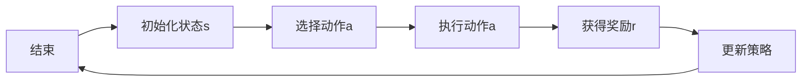
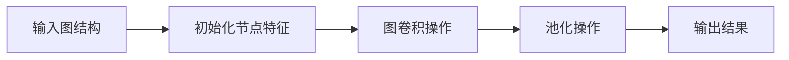
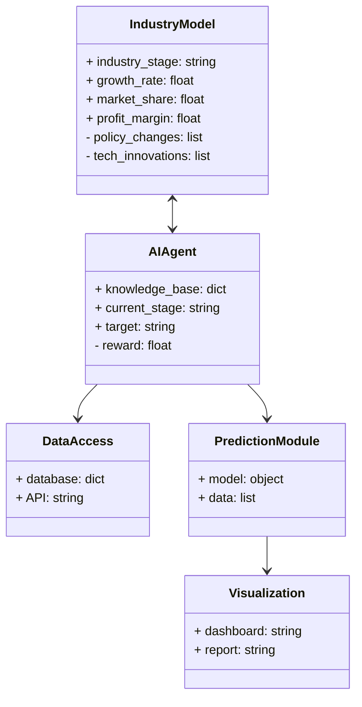

                 


# 利用AI agents构建动态行业生命周期模型：把握产业演变

---

## 关键词

- AI代理（AI Agents）
- 行业生命周期模型
- 动态建模
- 强化学习
- 图神经网络
- 产业演变

---

## 摘要

随着 industries 的迅速变化和复杂性增加，理解和预测产业演变变得越来越重要。本文介绍如何利用AI代理构建动态行业生命周期模型，通过强化学习和图神经网络等技术，实时分析和预测行业变化，为企业和投资者提供科学决策支持。

---

# 正文

## 第一部分：AI代理与行业生命周期模型基础

### 第1章：AI代理与行业生命周期概述

#### 1.1 AI代理的基本概念

- **AI代理的定义与特点**
  - AI代理是能够感知环境并采取行动以实现目标的智能实体。
  - 具有自主性、反应性、目标导向和社交能力。

- **行业生命周期的定义**
  - 行业生命周期：从引入、成长、成熟到衰退的阶段演变过程。
  - 每个阶段具有不同的特征和驱动因素。

- **AI代理与行业生命周期的结合**
  - AI代理能够实时分析行业数据，动态调整模型，捕捉产业演变趋势。

#### 1.2 AI代理在行业分析中的作用

- **数据收集与处理**
  - AI代理实时收集市场数据，包括销售、竞争和消费者行为。

- **模式识别与预测**
  - 利用机器学习算法识别行业趋势，预测下一阶段的演变。

- **动态调整策略**
  - 根据实时数据优化模型，提供及时的策略建议。

### 第2章：动态行业生命周期模型的构建基础

#### 2.1 行业生命周期的核心要素

- **产业阶段的划分**
  - 引入期、成长期、成熟期、衰退期。
  - 每个阶段的特征：增长率、竞争程度、创新速度。

- **关键指标与驱动因素**
  - 销售增长率、市场份额、利润率、技术创新、政策变化。

- **外部环境与内部因素的交互**
  - 经济、技术、政策、市场需求等因素共同影响行业演变。

#### 2.2 AI代理在动态模型中的角色

- **数据收集与处理**
  - AI代理实时监控市场数据，构建动态数据库。

- **模型训练与预测**
  - 使用历史数据训练模型，预测未来产业演变趋势。

- **实时反馈与优化**
  - 根据实时数据反馈，优化模型参数，提高预测准确性。

---

## 第二部分：AI代理的动态建模方法

### 第3章：基于强化学习的动态建模

#### 3.1 强化学习的基本原理

- **状态、动作与奖励的定义**
  - 状态：当前行业阶段。
  - 动作：AI代理采取的行动。
  - 奖励：模型优化的反馈。

- **策略与价值函数的数学表达**
  - 策略函数：$\pi(a|s)$，在状态$s$下选择动作$a$的概率。
  - 价值函数：$V(s)$，状态$s$的预期回报。

- **算法流程图（Mermaid）**



#### 3.2 行业生命周期中的强化学习应用

- **状态空间的构建**
  - 包括行业增长率、市场份额等指标。

- **动作空间的设计**
  - 包括进入新市场、优化产品策略等动作。

- **奖励机制的设定**
  - 基于预测准确性和优化效果给予奖励。

### 第4章：基于图神经网络的动态建模

#### 4.1 图神经网络的基本原理

- **图结构的表示**
  - 产业链的节点与边表示。

- **节点与边的特征提取**
  - 使用节点特征和边特征进行模型训练。

- **图卷积网络的数学模型**
  - 层次化图卷积：$h_i^{(l+1)} = \sigma(\sum_{j \in N(i)} W^{(l)} h_j^{(l)} + b^{(l)})$

- **算法流程图（Mermaid）**



#### 4.2 行业网络的构建与分析

- **产业链的图结构表示**
  - 将行业视为图结构，节点为公司或产品，边为供应链关系。

- **关键节点的识别与影响分析**
  - 使用图神经网络识别关键节点，分析其对整个产业链的影响。

---

## 第三部分：算法实现与数学模型

### 第5章：动态模型的算法实现

#### 5.1 数据预处理与特征提取

- **数据来源**
  - 市场数据、新闻报道、政策文件。

- **特征提取**
  - 使用PCA降维和LASSO回归选择关键特征。

- **算法实现代码（Python）**

```python
import pandas as pd
from sklearn.decomposition import PCA
from sklearn.linear_model import Lasso

# 数据加载
data = pd.read_csv('industry_data.csv')

# 特征选择
lasso = Lasso(alpha=0.1)
selected_features = lasso.fit(data[['feature1', 'feature2', 'feature3']], data['target']).coef_

# PCA降维
pca = PCA(n_components=2)
reduced_data = pca.fit_transform(data[['feature1', 'feature2', 'feature3']])
```

### 5.2 数学模型分析

- **强化学习模型的数学公式**
  - 策略梯度：$\nabla \theta = \frac{\partial V}{\partial \theta}$
  - 值函数：$V(s) = \max_a Q(s,a)$

- **图神经网络模型的数学公式**
  - 图卷积：$h_i^{(l+1)} = \sum_{j} W_{ij} h_j^{(l)}$
  - 池化：$h_p = \max(h_1, h_2, ..., h_n)$

---

## 第四部分：系统分析与架构设计

### 第6章：系统分析与架构设计

#### 6.1 项目介绍

- **目标**
  - 构建动态行业生命周期模型，实时预测产业演变。

#### 6.2 系统功能设计（领域模型Mermaid类图）



#### 6.3 系统架构设计（Mermaid架构图）


---

## 第五部分：项目实战与总结

### 第7章：项目实战

#### 7.1 环境安装与配置

- **工具安装**
  - 安装Python、TensorFlow、Keras、NetworkX、Mermaid。

#### 7.2 核心代码实现

- **动态模型实现**

```python
import numpy as np
from tensorflow.keras import layers, models

# 构建强化学习模型
def build_model(input_dim, output_dim):
    model = models.Sequential()
    model.add(layers.Dense(32, activation='relu', input_dim=input_dim))
    model.add(layers.Dense(output_dim, activation='linear'))
    model.compile(optimizer='adam', loss='mse')
    return model

# 训练模型
model = build_model(10, 5)
model.fit(X_train, y_train, epochs=100, batch_size=32)
```

#### 7.3 案例分析与结果解读

- **案例分析**
  - 某行业从引入期到成长期的预测。

- **结果解读**
  - 模型预测的增长率与实际数据对比。

### 第8章：总结与展望

#### 8.1 总结

- 本文介绍了利用AI代理构建动态行业生命周期模型的方法，结合强化学习和图神经网络技术，提供了有效的产业演变分析工具。

#### 8.2 展望

- 结合更多数据源，提升模型预测精度。
- 开发实时监控系统，提供动态反馈。

---

## 附录

- **参考文献**
  - 列出相关书籍和论文。

- **工具资源**
  - 推荐使用的Python库和工具。

---

## 作者信息

作者：AI天才研究院/AI Genius Institute & 禅与计算机程序设计艺术 /Zen And The Art of Computer Programming

---

通过以上目录大纲，您可以逐步展开每个部分，详细阐述每个主题，确保文章内容丰富、结构清晰，同时满足技术博客的专业性和可读性。

