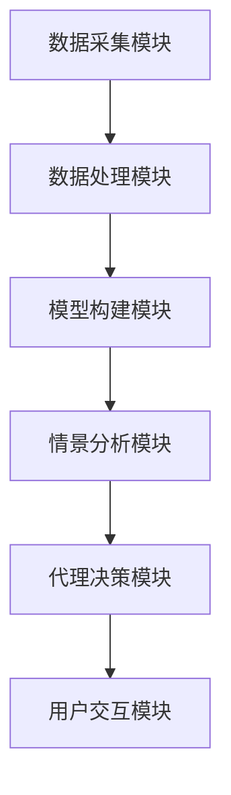
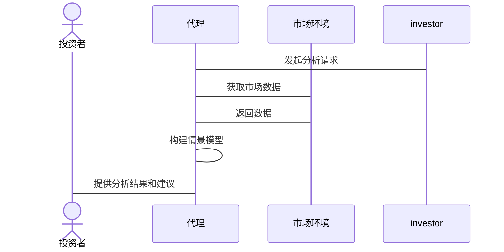

                 


# 利用AI agents进行情景分析：增强价值投资的适应性

> 关键词：AI agents，情景分析，价值投资，适应性，金融建模，动态调整

> 摘要：本文探讨了利用AI agents进行情景分析的方法，以增强价值投资的适应性。通过分析AI agents在情景分析中的应用，我们展示了如何利用这些智能代理来提高投资决策的质量和效率。文章从核心概念、算法原理、系统架构到项目实战，全面解析了AI agents在金融领域的潜力和实际应用。

---

# 第一部分: AI agents与情景分析的核心概念

## 第1章: AI agents的基本原理

### 1.1 核心概念与术语

- **AI agents（人工智能代理）**：能够感知环境并采取行动以实现目标的智能实体。
- **情景分析**：通过构建不同假设场景来评估投资组合在各种条件下的表现。
- **价值投资**：基于内在价值进行投资，寻找市场价格低于内在价值的证券。

### 1.2 问题背景

#### 1.2.1 传统价值投资的局限性
- 市场波动和不确定性使得传统分析方法难以捕捉动态变化。
- 数据量爆炸式增长，人工分析效率低下。
- 投资者需要快速响应市场变化，传统方法难以满足实时性要求。

#### 1.2.2 AI技术在金融领域的潜力
- 自然语言处理（NLP）分析新闻和财报。
- 强化学习优化投资组合。
- 机器学习预测市场趋势。

#### 1.2.3 情景分析在投资决策中的重要性
- 帮助投资者理解不同市场条件下的投资组合表现。
- 识别潜在风险和机会。
- 为投资决策提供数据支持。

### 1.3 问题描述

#### 1.3.1 情景分析的核心目标
- 评估投资组合在不同市场条件下的表现。
- 识别潜在风险和机会。
- 支持投资决策的动态调整。

#### 1.3.2 传统情景分析的挑战
- 数据量大，分析耗时。
- 情景假设过于简化，难以捕捉复杂市场动态。
- 缺乏实时反馈机制。

#### 1.3.3 AI agents在情景分析中的角色
- 代理实时监控市场数据，动态调整情景分析。
- 利用机器学习模型预测市场趋势，丰富情景假设。
- 自动优化投资组合，提高决策效率。

### 1.4 边界与外延

#### 1.4.1 AI agents在情景分析中的应用边界
- 代理无法完全替代人类判断，需结合专家意见。
- 代理适用于数据驱动的分析，依赖高质量数据输入。
- 代理不适用于完全非结构化的市场环境。

#### 1.4.2 与其他投资工具的结合
- 与传统财务模型结合，提升分析精度。
- 与实时数据分析工具结合，提供动态反馈。
- 与风险管理工具结合，降低投资风险。

#### 1.4.3 情景分析的未来发展趋势
- 更加智能化和自动化。
- 更加个性化和定制化。
- 更加全球化和实时化。

### 1.5 核心概念与联系

#### 1.5.1 AI agents的核心原理
- **感知**：通过传感器或数据源获取环境信息。
- **推理**：利用算法分析信息，生成决策。
- **行动**：根据决策采取行动，影响环境。

#### 1.5.2 情景分析的关键要素
- **情景构建**：定义不同市场条件下的假设。
- **数据收集**：获取相关市场数据和信息。
- **模型构建**：建立情景分析的数学模型。
- **结果评估**：评估不同情景下的投资表现。

#### 1.5.3 AI agents与情景分析的关系
- AI agents为情景分析提供实时数据和动态反馈。
- 情景分析为AI agents提供决策支持和优化方向。
- 两者结合实现投资决策的动态优化。

---

## 第2章: AI agents与情景分析的结合

### 2.1 AI agents的核心算法

#### 2.1.1 强化学习（Reinforcement Learning）
- **定义**：通过试错机制，学习最优策略。
- **算法流程**：
  1. 代理采取行动。
  2. 环境返回奖励和状态。
  3. 代理根据奖励调整策略。
- **应用场景**：动态调整投资组合，优化收益与风险比。

#### 2.1.2 自然语言处理（NLP）
- **定义**：处理和理解自然语言文本。
- **算法流程**：
  1. 分析新闻、财报等文本数据。
  2. 提取关键词和情感倾向。
  3. 生成市场情绪指标。
- **应用场景**：实时分析市场情绪，辅助情景分析。

#### 2.1.3 时间序列预测（Time Series Forecasting）
- **定义**：基于历史数据预测未来趋势。
- **算法流程**：
  1. 收集历史市场数据。
  2. 建立预测模型。
  3. 预测未来市场走势。
- **应用场景**：预测市场趋势，丰富情景假设。

### 2.2 情景分析的实现步骤

#### 2.2.1 数据收集与处理
- **数据来源**：市场数据、新闻、社交媒体等。
- **数据清洗**：去除噪声，标准化数据。
- **数据特征提取**：提取关键特征，如波动率、收益率等。

#### 2.2.2 模型构建与训练
- **模型选择**：根据问题类型选择合适模型。
- **参数调优**：通过交叉验证优化模型性能。
- **模型评估**：通过回测评估模型效果。

#### 2.2.3 情景生成与分析
- **情景构建**：基于模型预测生成不同情景。
- **情景评估**：评估每种情景下的投资表现。
- **情景优化**：调整情景参数，寻找最优解。

---

## 第3章: 系统架构与设计

### 3.1 系统架构设计

#### 3.1.1 系统组成
- **数据采集模块**：收集市场数据和相关信息。
- **模型构建模块**：建立情景分析模型。
- **代理决策模块**：基于模型输出决策。
- **用户交互模块**：提供用户界面和反馈。

#### 3.1.2 系统功能设计
- **数据处理功能**：清洗和特征提取。
- **模型构建功能**：训练和优化模型。
- **情景分析功能**：生成和评估情景。
- **决策支持功能**：提供投资建议。

#### 3.1.3 系统架构图


### 3.2 接口设计

#### 3.2.1 数据接口
- **输入接口**：接收市场数据和相关信息。
- **输出接口**：提供处理后的数据和模型预测结果。

#### 3.2.2 用户接口
- **输入接口**：接收用户指令和参数。
- **输出接口**：显示分析结果和决策建议。

### 3.3 交互流程

#### 3.3.1 代理与环境的交互


---

## 第4章: 项目实战

### 4.1 环境安装与配置

#### 4.1.1 系统要求
- 操作系统：Linux/Windows/MacOS
- 内存：8GB以上
- 处理器：支持多线程的CPU
- 硬盘空间：至少20GB

#### 4.1.2 工具安装
- Python 3.8+
- Jupyter Notebook
- Pandas, NumPy, Scikit-learn, TensorFlow

### 4.2 核心代码实现

#### 4.2.1 数据采集模块
```python
import pandas as pd
import requests

def get_market_data(ticker):
    url = f'https://api.example.com/stock/{ticker}'
    response = requests.get(url)
    data = response.json()
    return pd.DataFrame(data)
```

#### 4.2.2 模型构建模块
```python
from sklearn.ensemble import RandomForestRegressor

def build_model(X_train, y_train):
    model = RandomForestRegressor()
    model.fit(X_train, y_train)
    return model
```

#### 4.2.3 代理决策模块
```python
import numpy as np

def make_decision(model, X_test):
    predictions = model.predict(X_test)
    return np.where(predictions > 0.5, 'Buy', 'Sell')
```

### 4.3 案例分析与解读

#### 4.3.1 案例背景
- 投资组合：股票组合，包含科技、金融、消费等行业。
- 数据来源：历史市场数据和新闻 sentiment。

#### 4.3.2 分析过程
1. 数据采集：获取过去5年的市场数据和新闻 sentiment。
2. 数据处理：清洗和特征提取。
3. 模型构建：训练随机森林模型预测市场趋势。
4. 情景分析：生成牛市、熊市、震荡市三种情景。
5. 代理决策：根据模型预测生成投资建议。

#### 4.3.3 实际应用
- 在牛市情景下，建议增加科技股持仓。
- 在熊市情景下，建议减少高风险资产。
- 在震荡市情景下，建议均衡配置资产。

---

## 第5章: 最佳实践与总结

### 5.1 最佳实践 tips

- **数据质量**：确保数据来源可靠，清洗充分。
- **模型选择**：根据问题类型选择合适算法。
- **实时监控**：持续监控市场变化，及时调整模型。
- **风险管理**：设置止损点，控制投资风险。

### 5.2 小结

通过本文的分析，我们展示了如何利用AI agents进行情景分析，以增强价值投资的适应性。AI agents的强大能力和情景分析的深度结合，为投资者提供了更高效、更精准的决策支持。

### 5.3 注意事项

- AI agents不能完全替代人类判断，需结合专家意见。
- 模型的准确性依赖于数据质量和算法选择。
- 投资有风险，需谨慎操作。

### 5.4 拓展阅读

- 建议阅读《机器学习实战》和《Python金融大数据分析》。
- 关注学术论文，了解最新研究成果。
- 参加技术交流会，分享实践经验。

---

作者：AI天才研究院/AI Genius Institute & 禅与计算机程序设计艺术 /Zen And The Art of Computer Programming

