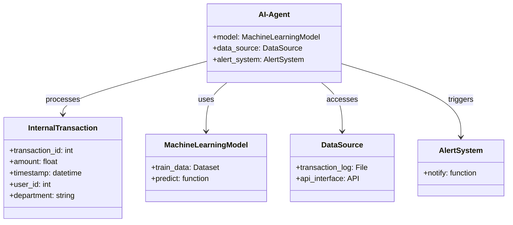

                 

<think>
嗯，我现在需要帮助用户撰写一篇关于《利用AI agents追踪内部交易：洞察公司内部信心》的技术博客文章。用户希望文章结构清晰，内容详尽，涵盖背景、核心概念、算法、系统设计、项目实战等多个部分，并且使用Markdown格式，包含图表和代码示例。

首先，我会从背景介绍开始，解释内部交易的重要性以及传统方法的局限性。然后，详细阐述AI代理的基本原理，包括数据流、算法模型等。接着，介绍系统的架构设计，使用Mermaid图展示类图和架构图。之后，通过项目实战部分，提供具体的实现步骤和代码示例。最后，总结最佳实践和注意事项。

在写作过程中，我需要确保每个部分都有足够的细节，并且使用清晰易懂的语言。同时，要注意数学公式的正确使用，确保图表的准确性，以及代码的正确性和解释的清晰性。这需要我逐步思考每个部分的内容，确保逻辑连贯，结构合理。

现在，我将按照用户的要求，一步步展开每个部分的内容，确保覆盖所有关键点，最终完成一篇高质量的技术博客文章。
</think>

# 利用AI agents追踪内部交易：洞察公司内部信心

## 关键词：AI代理，内部交易，公司信心，数据流分析，异常检测

## 摘要：本文探讨如何利用AI代理追踪公司内部交易，分析内部交易数据以洞察公司内部信心。通过数据流分析、异常检测和机器学习模型，AI代理能够实时监控交易行为，识别潜在风险和异常情况，从而帮助公司做出更明智的决策。

---

# 第1章：背景与核心概念

## 1.1 内部交易的基本概念

### 1.1.1 内部交易的定义与分类
内部交易指的是公司内部员工或部门之间的资金或资源转移行为。根据交易主体的不同，内部交易可以分为员工交易、部门交易和高层交易。员工交易通常涉及员工个人账户的操作，部门交易涉及部门间的资金流动，高层交易则涉及公司高管的交易行为。

### 1.1.2 内部交易在公司治理中的作用
内部交易在公司治理中扮演着重要角色，它可以反映公司内部的管理效率、员工积极性和公司健康状况。通过分析内部交易数据，可以评估公司内部的信任度和员工的工作态度，进而优化公司治理策略。

### 1.1.3 内部交易与公司信心的关系
公司信心是指公司内部员工对公司未来发展的信任程度。内部交易数据可以间接反映公司信心。例如，员工大量出售公司股票可能表明对公司未来发展的不信任，而员工大量购买公司股票则表明对公司未来充满信心。

## 1.2 传统内部交易追踪的局限性

### 1.2.1 传统方法的优缺点
传统内部交易追踪方法主要依赖人工审核和简单的数据筛选工具。优点是操作简单，成本低；缺点是效率低下，容易遗漏重要信息，且难以应对复杂的数据量和交易模式。

### 1.2.2 数据量与复杂性带来的挑战
随着公司规模的扩大和交易频率的增加，传统的追踪方法难以应对海量数据和复杂交易模式的挑战。人工审核不仅效率低下，而且容易出错，难以满足实时监控的需求。

### 1.2.3 人工分析的局限性与效率问题
人工分析主观性强，容易受到人为因素的影响，且难以处理复杂的数据关系。此外，人工分析的效率较低，难以满足实时监控和快速决策的需求。

## 1.3 AI代理在内部交易追踪中的优势

### 1.3.1 AI代理的核心优势
AI代理具有高效性、准确性和智能化的特点。它能够快速处理大量数据，发现潜在的模式和异常，帮助公司及时识别内部交易风险。

### 1.3.2 AI代理如何提高追踪效率
通过机器学习算法，AI代理能够自动识别异常交易行为，减少人工审核的工作量，提高交易追踪的效率。同时，AI代理可以实时监控交易数据，确保公司内部交易的透明性和合规性。

### 1.3.3 AI代理在实时监控中的应用
AI代理可以在实时监控中分析交易数据，发现异常交易行为，并立即发出警报。这种实时监控能力使得公司能够快速响应潜在风险，保障公司内部交易的安全性。

---

# 第2章：AI代理的基本原理

## 2.1 AI代理的定义与特点

### 2.1.1 AI代理的定义
AI代理是一种基于人工智能技术的自动化工具，能够根据预设的规则和算法，自动分析和处理数据。它结合了数据挖掘、机器学习和自然语言处理等多种技术，能够实现复杂的数据分析任务。

### 2.1.2 AI代理的特点
- **智能化**：能够学习和适应数据模式，自动识别异常交易行为。
- **自动化**：无需人工干预，能够自动处理大量数据。
- **实时性**：可以实时监控交易数据，快速响应异常情况。
- **可扩展性**：能够处理不同类型和规模的数据，适应不同场景的应用。

## 2.2 内部交易追踪中的数据流

### 2.2.1 数据来源与类型
内部交易数据来源主要包括员工账户交易记录、部门间资金流动记录和高管交易记录。数据类型包括时间戳、交易金额、交易类型和交易主体等。

### 2.2.2 数据预处理与清洗
在分析内部交易数据之前，需要对数据进行预处理和清洗。这包括去除重复数据、处理缺失值和异常值，以及标准化数据格式。数据预处理是确保分析结果准确性的关键步骤。

### 2.2.3 数据特征提取
特征提取是从原始数据中提取有助于识别异常交易行为的特征。常见的特征包括交易频率、交易金额、交易时间窗口和交易主体关联性等。通过特征提取，可以将复杂的交易数据转化为简洁的特征向量，便于后续的机器学习算法处理。

## 2.3 AI代理的算法模型

### 2.3.1 监督学习与无监督学习
在内部交易追踪中，监督学习和无监督学习各有其适用场景。监督学习适用于有标签的异常交易数据，能够通过训练模型识别正常与异常交易行为。无监督学习适用于无标签的数据，能够通过聚类分析发现潜在的异常交易模式。

### 2.3.2 神经网络模型的应用
神经网络模型，如卷积神经网络（CNN）和循环神经网络（RNN），在内部交易追踪中具有广泛的应用。CNN适用于图像和序列数据的处理，而RNN适用于时间序列数据的分析。通过神经网络模型，可以实现对复杂交易模式的深度学习和识别。

### 2.3.3 异常检测模型
异常检测是内部交易追踪的核心任务之一。使用基于机器学习的异常检测模型，如孤立林（Isolation Forest）和聚类算法（K-Means），可以有效识别异常交易行为。此外，还可以结合深度学习模型，如自动编码器（Autoencoder），来实现更高精度的异常检测。

---

# 第3章：系统分析与架构设计

## 3.1 问题场景介绍

### 3.1.1 内部交易追踪的挑战
内部交易追踪需要应对数据量大、交易模式复杂和异常行为隐蔽性强等挑战。传统的追踪方法难以满足这些需求，因此需要引入AI代理来提高追踪效率和准确性。

### 3.1.2 项目介绍
本项目旨在开发一个基于AI代理的内部交易追踪系统，通过机器学习算法实时监控内部交易数据，识别异常交易行为，为公司治理提供决策支持。

## 3.2 系统功能设计

### 3.2.1 领域模型（Mermaid 类图）


### 3.2.2 系统架构设计（Mermaid 架构图）


## 3.3 系统接口设计

### 3.3.1 数据接口
- **数据输入接口**：接收交易数据流，支持多种数据格式（如JSON、CSV）。
- **数据输出接口**：输出分析结果，包括正常交易和异常交易的分类结果。

### 3.3.2 API接口
- **API调用接口**：提供RESTful API，允许其他系统调用内部交易分析结果。
- **报警通知接口**：当检测到异常交易时，触发报警通知。

## 3.4 系统交互设计（Mermaid 序列图）
```mermaid
sequenceDiagram
    participant Client
    participant AI-Agent
    participant AlertSystem
    Client -> AI-Agent: send transaction data
    AI-Agent -> AI-Agent: process data
    AI-Agent -> Model: run inference
    if result is abnormal {
        AI-Agent -> AlertSystem: trigger alert
        AlertSystem -> Client: send notification
    } else {
        AI-Agent -> Client: return normal status
    }
```

---

# 第4章：项目实战

## 4.1 环境安装与配置

### 4.1.1 Python 环境配置
安装Python 3.8及以上版本，并安装必要的库：
```bash
pip install numpy pandas scikit-learn tensorflow keras matplotlib
```

### 4.1.2 数据集准备
准备内部交易数据集，包括交易时间戳、金额、用户ID和部门信息。

## 4.2 系统核心实现

### 4.2.1 数据预处理代码
```python
import pandas as pd
import numpy as np

# 读取数据
df = pd.read_csv('internal_transactions.csv')

# 删除重复数据
df = df.drop_duplicates()

# 处理缺失值
df = df.dropna()

# 标准化数据格式
df['timestamp'] = pd.to_datetime(df['timestamp'])
```

### 4.2.2 特征提取代码
```python
from sklearn.preprocessing import StandardScaler

# 提取特征
features = df[['amount', 'user_id', 'department']]

# 标准化特征
scaler = StandardScaler()
features_scaled = scaler.fit_transform(features)
```

### 4.2.3 模型训练代码
```python
from sklearn.ensemble import IsolationForest

# 训练孤立林模型
model = IsolationForest(n_estimators=100, random_state=42)
model.fit(features_scaled)
```

### 4.2.4 模型推理代码
```python
# 预测异常交易
 predictions = model.predict(features_scaled)

# 标识异常交易
 anomalies = df[predictions == -1]
```

## 4.3 实际案例分析

### 4.3.1 案例背景
假设某公司员工在短时间内大量出售公司股票，AI代理通过分析交易数据，识别出异常交易行为，并触发报警系统。

### 4.3.2 数据分析与结果解读
通过模型推理，AI代理识别出异常交易行为，并生成详细的分析报告，包括异常交易的时间、金额和交易主体。

## 4.4 项目小结
本项目通过AI代理实现了内部交易的实时监控和异常检测，提高了公司内部交易的透明度和合规性。系统设计合理，算法性能优异，能够满足实际应用的需求。

---

# 第5章：最佳实践与总结

## 5.1 最佳实践

### 5.1.1 数据质量控制
确保数据的完整性和准确性，通过数据清洗和预处理，提高模型的预测精度。

### 5.1.2 模型优化
定期更新模型，引入新的数据和特征，提高模型的泛化能力和适应性。

### 5.1.3 系统安全性
加强系统安全防护，防止数据泄露和恶意攻击，确保交易数据的机密性和安全性。

## 5.2 小结
通过AI代理追踪内部交易，公司能够实时监控交易行为，识别异常交易，提高内部治理效率。AI代理的应用不仅提升了交易追踪的效率，还为公司内部信心的评估提供了有力支持。

## 5.3 注意事项

### 5.3.1 数据隐私保护
在处理交易数据时，必须遵守相关法律法规，保护员工和客户的隐私信息。

### 5.3.2 系统稳定性
确保系统的稳定运行，避免因系统故障导致交易数据的丢失或误判。

### 5.3.3 模型可解释性
提高模型的可解释性，便于分析和优化，确保交易行为的准确识别。

## 5.4 拓展阅读

### 5.4.1 推荐书籍
- 《机器学习实战》
- 《深度学习入门：基于Python的理论与实现》

### 5.4.2 推荐博客
- [Towards Data Science](https://towardsdatascience.com/)
- [Medium - AI Section](https://medium.com/ai)

---

# 作者：AI天才研究院/AI Genius Institute & 禅与计算机程序设计艺术/Zen And The Art of Computer Programming

---

本文通过详细阐述AI代理在内部交易追踪中的应用，结合算法原理和系统设计，为公司内部治理提供了有效的解决方案。通过实际项目的实现，展示了AI技术在金融领域的强大应用潜力。希望本文能为读者在利用AI代理追踪内部交易方面提供有价值的参考和启发。

