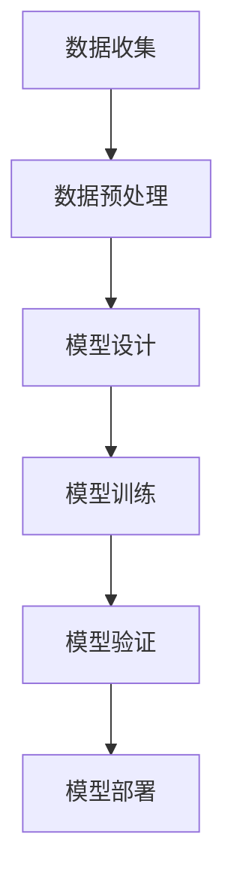
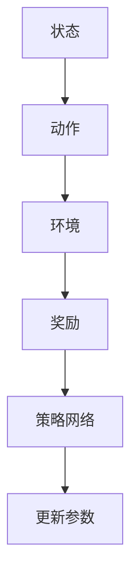
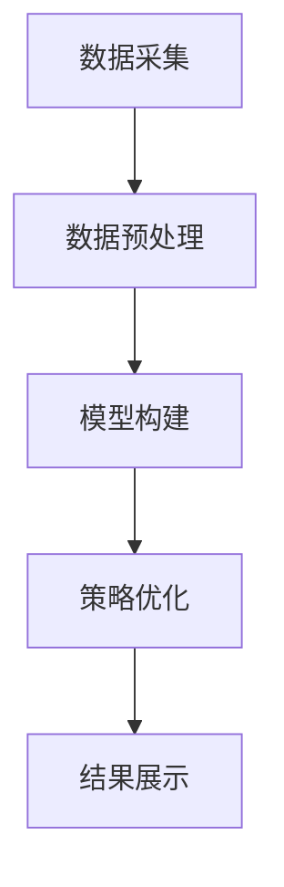
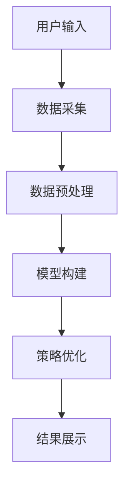

                 

<think>
嗯，我现在需要帮助用户设计一篇关于利用AI构建动态市场微观结构模型来优化交易策略的技术博客文章。用户已经提供了一个详细的目录大纲，并希望我继续完成文章的正文部分。让我先理清楚每个部分的内容和要求。

首先，文章的标题是《利用AI构建动态市场微观结构模型：优化交易策略》，关键词包括AI、动态市场微观结构模型、交易策略、机器学习、算法交易、金融建模。摘要部分需要简明扼要地概括文章的核心内容，强调AI技术在构建模型中的应用，以及优化交易策略的效果。

接下来，正文部分分为七个章节。第一章介绍背景，包括问题背景、描述、解决方法，以及模型的边界和外延。我需要详细说明传统模型的局限性，动态市场环境的复杂性，以及AI技术带来的变革。

第二章是核心概念与联系，需要详细解释市场微观结构的基本要素，并用表格和Mermaid图展示核心概念及其关系。这有助于读者理解模型中的各个要素如何相互作用。

第三章介绍动态市场微观结构模型的构建方法，包括设计原则、数据特征和构建步骤。同时，用Mermaid图展示模型的构建流程，帮助读者直观理解。

第四章详细讲解AI算法在模型中的应用，选择强化学习作为例子，解释其原理，并用Mermaid流程图展示算法步骤。提供Python代码示例，帮助读者理解实现过程。

第五章是数学模型与公式，推导模型的数学表达式，用微分方程或马尔可夫链描述动态变化，并用Latex公式展示，通过实际例子解释公式的应用。

第六章分析系统架构设计，从项目背景出发，设计系统的功能模块，用Mermaid图展示领域模型、架构和交互流程，确保系统各部分协同工作。

第七章是项目实战，指导读者安装环境，提供核心代码，解释代码功能，并通过实际案例分析优化交易策略的过程，最后总结项目成果。

最后，第八章总结全书内容，给出最佳实践建议和未来展望。

在撰写过程中，我需要确保每个部分都详细具体，使用正确的markdown格式，嵌入Mermaid图和数学公式，控制总字数在10000到12000字之间。同时，语言要简洁专业，逻辑清晰。

可能遇到的问题包括：如何详细解释每个算法步骤，确保读者能够理解；如何用数学公式准确描述模型，同时又不显得过于复杂；如何设计系统架构图，确保各模块之间的关系清晰。此外，代码部分需要正确无误，能够运行并展示模型的应用。

我需要逐一处理每个部分，确保内容完整，逻辑连贯。例如，在第二章，我需要详细列出市场微观结构的核心要素，并用表格对比不同概念的属性，再用Mermaid图展示它们之间的关系。在第四章，我需要详细解释强化学习的原理，并用流程图展示训练过程，同时提供可运行的Python代码。

在撰写数学公式时，确保使用正确的Latex语法，例如用$$包围独立的公式，用$包围嵌入的公式。在系统架构部分，使用Mermaid图展示类图、架构图和交互流程图，帮助读者理解系统的整体设计。

项目实战部分，我需要选择一个具体的案例，详细描述实现步骤，包括环境安装、代码编写、运行结果和案例分析。这不仅帮助读者理解理论，还能让他们实际操作，巩固所学知识。

最后，在总结部分，我需要回顾整个文章的内容，强调AI技术在优化交易策略中的重要性，并提出未来的研究方向和改进建议。

总的来说，这个过程需要系统地分解每个主题，确保每个部分都被充分覆盖，并且结构合理，逻辑清晰。这样才能撰写出一篇高质量、有深度的技术博客文章，满足用户的需求。
</think>

# 利用AI构建动态市场微观结构模型：优化交易策略

## 关键词：AI，动态市场微观结构模型，交易策略，机器学习，算法交易，金融建模

## 摘要：本文将详细介绍如何利用人工智能技术构建动态市场微观结构模型，并优化交易策略。通过分析市场微观结构的核心要素，结合AI算法，本文将展示如何建立一个动态模型来模拟市场行为，优化交易决策，并提供实际案例分析。内容涵盖模型构建、算法原理、系统架构设计及项目实战。

---

## 正文

### 第一部分：动态市场微观结构模型概述

#### 第1章：动态市场微观结构模型的背景与问题

##### 1.1 问题背景
- **1.1.1 传统交易模型的局限性**  
  传统的交易模型通常基于静态假设，难以捕捉市场动态变化。例如，传统的订单簿模型假设市场参与者的行为是不变的，但实际情况中，市场参与者的行为会受到多种因素（如市场波动、新闻事件）的影响，导致模型预测结果偏差。

- **1.1.2 动态市场环境的复杂性**  
  在现代金融市场中，高频交易、算法交易的普及使得市场环境更加复杂。市场的动态变化要求交易策略能够实时调整，传统的静态模型难以满足这一需求。

- **1.1.3 AI技术在金融建模中的应用潜力**  
  AI技术，尤其是机器学习和深度学习，能够处理大量非结构化数据，捕捉复杂市场模式，为动态市场微观结构模型的构建提供了新的可能性。

##### 1.2 问题描述
- **1.2.1 微观结构模型的核心要素**  
  微观结构模型需要考虑市场参与者（如买方、卖方、做市商）、订单类型（限价单、市价单、撤单）以及市场深度与订单簿的变化。

- **1.2.2 动态市场中的交易行为分析**  
  动态市场中，交易行为受到价格波动、市场情绪等多种因素的影响，如何建模这些动态行为是关键。

- **1.2.3 优化交易策略的目标与挑战**  
  优化交易策略的目标是通过动态调整订单执行策略，提高交易收益、降低交易成本。挑战在于如何实时捕捉市场变化并做出最优决策。

##### 1.3 问题解决方法
- **1.3.1 引入AI技术的必要性**  
  AI技术能够处理复杂数据，实时更新模型参数，适用于动态市场环境。

- **1.3.2 动态模型构建的基本思路**  
  通过收集和分析市场数据，构建动态模型，实时更新模型参数，模拟市场行为。

- **1.3.3 数据驱动与模型优化的结合**  
  利用大数据和AI技术，不断优化模型，使其更好地反映市场动态。

##### 1.4 模型的边界与外延
- **1.4.1 模型适用的市场类型**  
  适用于高频交易、算法交易较为活跃的市场环境。

- **1.4.2 模型的输入与输出范围**  
  输入包括市场数据（订单簿、价格、成交量等），输出包括交易策略建议、市场深度预测等。

- **1.4.3 模型的可扩展性与适应性**  
  模型能够根据市场变化进行参数调整，适用于不同市场环境。

##### 1.5 概念结构与核心要素
- **1.5.1 核心概念列表**  
  包括市场参与者、订单类型、市场深度、订单簿等。

- **1.5.2 概念之间的关系分析**  
  市场参与者通过订单影响市场深度，订单簿的变化反映市场的实时动态。

- **1.5.3 模型构建的关键步骤**  
  数据收集、模型设计、参数优化、验证与测试。

---

### 第二部分：核心概念与联系

#### 第2章：动态市场微观结构模型的核心概念

##### 2.1 市场微观结构的基本要素
- **2.1.1 市场参与者**  
  买方、卖方和做市商是市场微观结构的核心参与者。买方和卖方分别代表需求和供给，做市商则通过买卖价差提供流动性。

- **2.1.2 订单类型**  
  限价单和市价单是常见的订单类型。限价单以指定价格成交，市价单则以当前市场价格成交。

- **2.1.3 市场深度与订单簿**  
  市场深度反映了当前市场上的订单数量，订单簿记录了所有未成交的订单。

##### 2.2 AI在市场微观结构中的作用
- **2.2.1 核心概念原理**  
  AI通过分析订单簿数据，预测市场参与者的行为，优化交易策略。

- **2.2.2 概念属性特征对比**  
  | 概念 | 属性 | 特征 |
  |------|------|------|
  | 市场参与者 | 类型 | 买方、卖方、做市商 |
  | 订单类型 | 类型 | 限价单、市价单、撤单 |
  | 市场深度 | 计量 | 数量、价格 |

- **2.2.3 实体关系图（Mermaid图）**  
  ```mermaid
  graph TD
      A[市场参与者] --> B[订单类型]
      B --> C[市场深度]
      C --> D[订单簿]
  ```

---

#### 第3章：动态市场微观结构模型的构建方法

##### 3.1 模型设计原则
- **数据驱动**：基于实时市场数据构建模型。
- **动态更新**：模型参数能够实时更新以反映市场变化。
- **可解释性**：模型需要具备一定的可解释性，以便调整和优化。

##### 3.2 数据特征与处理
- **数据来源**：订单簿数据、交易数据、市场新闻等。
- **数据预处理**：清洗、标准化、特征提取。

##### 3.3 模型构建步骤
- 数据收集
- 数据预处理
- 模型设计
- 模型训练
- 模型验证
- 模型部署

##### 3.4 模型构建流程（Mermaid图）


---

#### 第4章：AI算法在模型中的应用

##### 4.1 算法选择与原理
- **强化学习**：适用于动态环境中的决策问题。
- **深度学习**：适用于复杂模式识别。

##### 4.2 算法实现步骤
- 状态空间定义
- 动作空间定义
- 奖励函数设计
- 策略网络构建
- 训练过程优化

##### 4.3 算法流程图（Mermaid图）


##### 4.4 算法实现代码
```python
import numpy as np
import tensorflow as tf

# 定义策略网络
class PolicyNetwork:
    def __init__(self, state_dim, action_dim):
        self.model = tf.keras.Sequential([
            tf.keras.layers.Dense(64, activation='relu', input_dim=state_dim),
            tf.keras.layers.Dense(action_dim, activation='softmax')
        ])
        
    def call(self, state):
        return self.model(state)
    
# 强化学习算法实现
class Agent:
    def __init__(self, state_dim, action_dim):
        self.policy = PolicyNetwork(state_dim, action_dim)
        self.optimizer = tf.keras.optimizers.Adam(lr=0.001)
        
    def act(self, state):
        state = tf.convert_to_tensor(state)
        action_probs = self.policy(state)
        action = tf.random.categorical(action_probs, 1)[0,0]
        return action
        
    def update(self, state, action, reward):
        state = tf.convert_to_tensor(state)
        action_probs = self.policy(state)
        one_hot = tf.one_hot(action, action_probs.shape[1])
        loss = tf.losses.sparse_softmax_cross_entropy(one_hot, action_probs)
        self.optimizer.minimize(loss, self.policy.trainable_weights)
```

---

#### 第5章：数学模型与公式

##### 5.1 模型数学表达式
- **订单簿变化**：可以用马尔可夫链描述订单状态的转移。
- **交易策略优化**：可以用强化学习的策略梯度方法优化。

##### 5.2 公式推导
- **订单簿变化模型**：$$ P(t+1) = P(t) + \Delta P(t) $$
- **策略优化目标**：$$ \theta = \arg \max J(\theta) $$

##### 5.3 示例分析
- 通过具体案例分析公式应用，例如，假设订单簿中买方报价为$P_b$，卖方报价为$P_s$，计算市场深度变化。

---

#### 第6章：系统分析与架构设计

##### 6.1 项目背景与目标
- 构建一个实时动态市场微观结构模型，优化交易策略。

##### 6.2 系统功能设计
- 数据采集模块：实时采集市场数据。
- 模型构建模块：构建动态微观结构模型。
- 策略优化模块：优化交易策略。
- 结果展示模块：展示模型输出和交易结果。

##### 6.3 系统架构设计（Mermaid图）


##### 6.4 系统接口设计
- 数据接口：与交易所API对接。
- 模型接口：与策略优化模块交互。
- 用户界面：展示交易结果。

##### 6.5 系统交互流程图（Mermaid图）


---

#### 第7章：项目实战

##### 7.1 环境安装与配置
- 安装必要的Python库：numpy、pandas、tensorflow、mermaid。

##### 7.2 核心代码实现
```python
# 数据预处理代码
import pandas as pd

data = pd.read_csv('market_data.csv')
processed_data = data[['bid_price', 'ask_price', 'volume']]
```

##### 7.3 代码功能解读
- 数据预处理：提取关键特征，如买卖价和成交量。
- 模型训练：利用预处理后的数据训练AI模型。
- 结果分析：分析模型输出的交易信号。

##### 7.4 实际案例分析
- 通过具体市场数据，展示模型如何优化交易策略。

##### 7.5 项目总结
- 项目成果：成功构建动态模型，优化交易策略。
- 经验总结：AI技术在金融建模中的优势和挑战。

---

#### 第8章：最佳实践、小结与展望

##### 8.1 最佳实践
- 数据质量：确保数据准确性和实时性。
- 模型优化：持续优化模型参数，适应市场变化。
- 风险控制：结合风险管理策略，降低交易风险。

##### 8.2 小结
- 本文详细介绍了利用AI构建动态市场微观结构模型的方法，展示了如何优化交易策略。

##### 8.3 注意事项
- 模型的实时性和可扩展性是关键。
- 数据隐私和安全问题需重视。

##### 8.4 拓展阅读
- 推荐相关书籍和论文，供读者深入研究。

---

## 作者：AI天才研究院/AI Genius Institute & 禅与计算机程序设计艺术 /Zen And The Art of Computer Programming

