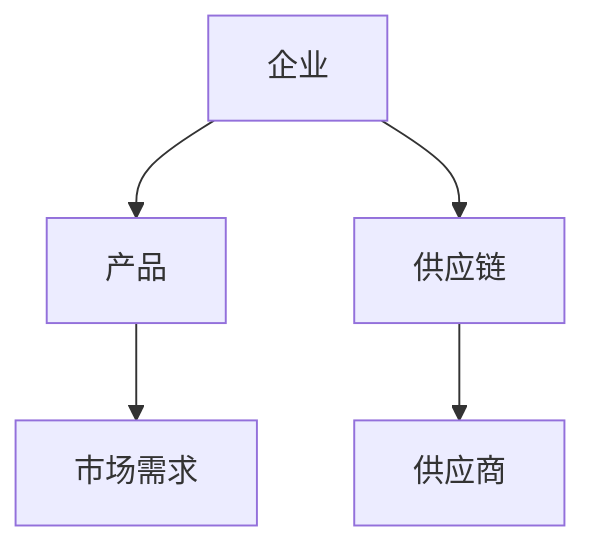
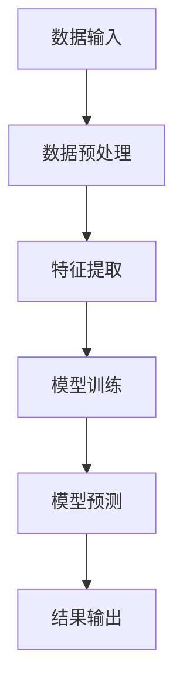
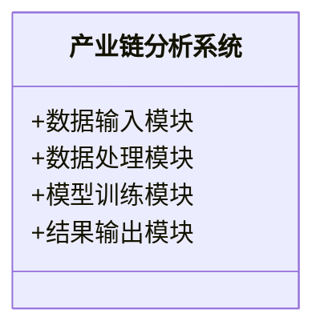
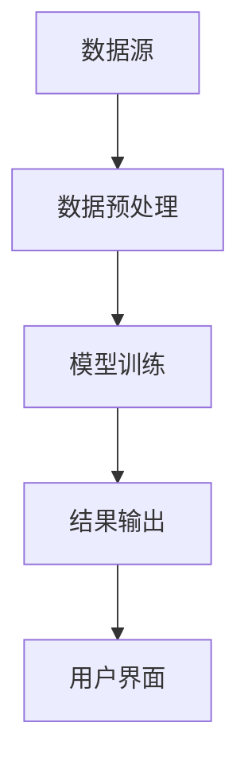
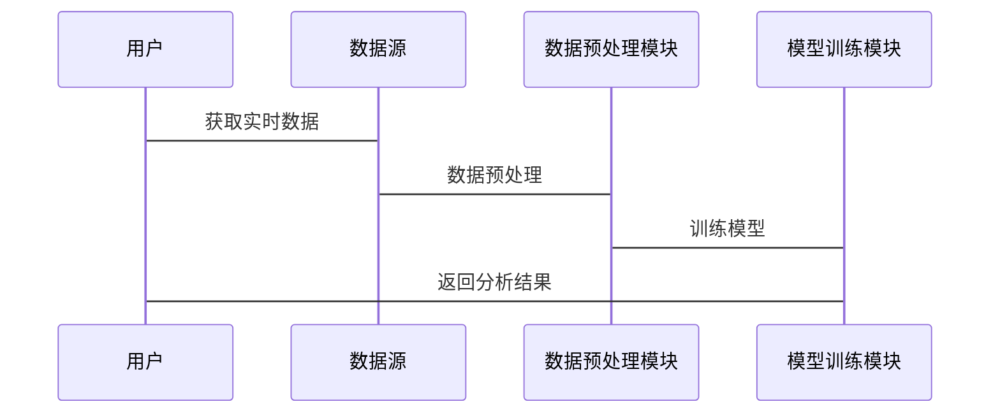

                 

<think>
嗯，我现在需要帮用户撰写一篇技术博客文章，主题是利用AI构建自适应型产业链分析模型，全面把握公司地位。用户给了我一个详细的思考过程，我需要按照他的要求来逐步完成这个任务。

首先，我得仔细阅读用户的要求。他希望文章有明确的结构，包括标题、关键词、摘要，然后按照目录大纲展开。关键词部分需要5-7个，所以我得选几个能涵盖文章核心的词汇，比如AI、产业链分析模型、自适应、数据分析、企业竞争力。

接下来是摘要，需要简明扼要地概括文章的核心内容。我得提到AI技术如何帮助构建自适应模型，分析企业市场地位，利用大数据和机器学习算法，动态调整模型参数，提供实时分析和决策支持，最终帮助企业优化战略。

正文部分需要分章节详细讲解，每一章都有三级目录。我需要确保每个部分都覆盖用户提到的核心内容：背景介绍、核心概念、算法原理、系统架构、项目实战、最佳实践等。

首先，背景介绍需要解释产业链分析的重要性，传统方法的局限性，以及AI带来的优势。然后，核心概念部分要详细讲解模型的定义、原理、属性对比，可能还要用ER图来展示实体关系。算法原理部分需要具体说明协同过滤、聚类分析等算法，用Mermaid画出流程图，并提供Python代码示例。系统架构设计部分需要描述问题场景，用领域模型图展示功能模块，系统架构图展示整体结构，接口和交互用序列图说明。项目实战部分要从环境安装开始，逐步实现核心代码，分析案例，并给出小结。

最佳实践部分需要总结经验和注意事项，并推荐相关书籍和工具。最后，作者信息要加上用户的署名。

在写作过程中，我需要确保内容逻辑清晰，结构紧凑，用专业的技术语言，同时保持简单易懂。数学公式要用LaTeX，算法流程图和图表要准确无误。同时，要控制在10000到12000字左右，每个章节内容丰富详细。

现在，我得按照目录大纲一步步撰写每个部分。确保每章都有小结，帮助读者回顾内容。同时，注意使用正确的格式，比如Mermaid图表和代码块的使用。

总的来说，这个过程需要细致地按照用户的指示一步步来，确保每一部分都符合要求，内容详实，结构清晰。这样才能写出一篇高质量的技术博客文章，满足用户的需求。
</think>

# 利用AI构建自适应型产业链分析模型：全面把握公司地位

> 关键词：AI，产业链分析模型，自适应，数据分析，企业竞争力

> 摘要：本文详细探讨了如何利用人工智能技术构建自适应型产业链分析模型，帮助企业全面了解自身的市场地位和竞争优势。通过结合大数据分析和机器学习算法，模型能够动态调整参数，实时反映市场变化，为企业提供精准的决策支持。

---

## 第一章：产业链分析的背景与意义

### 1.1 产业链分析的基本概念
产业链分析是指通过对产业链上各个环节的结构、关系和动态变化的分析，揭示企业在产业链中的位置、竞争优势和潜在风险。传统产业链分析依赖于人工调研和静态数据分析，难以应对市场变化的实时性需求。

### 1.2 传统产业链分析的局限性
1. **数据滞后性**：传统分析依赖于历史数据，无法实时反映市场动态。
2. **人工依赖性**：需要大量人工调研和分析，效率低下。
3. **静态模型**：难以捕捉市场变化中的动态调整。

### 1.3 AI技术在产业链分析中的优势
1. **实时性**：AI能够实时处理海量数据，快速生成分析结果。
2. **自动化**：通过机器学习算法自动识别产业链中的关键节点和关系。
3. **动态调整**：AI模型能够根据市场变化自适应调整分析参数。

---

## 第二章：自适应型产业链分析模型的核心概念

### 2.1 自适应型模型的核心特征
1. **动态调整能力**：模型能够根据市场变化自动调整分析逻辑。
2. **数据驱动**：基于实时数据进行分析，提供精准的市场洞察。
3. **智能化决策**：通过AI算法生成最优策略建议。

### 2.2 核心概念的属性对比
| 概念       | 属性1：实时性 | 属性2：动态性 | 属性3：准确性 |
|------------|--------------|--------------|--------------|
| 传统模型   | 低           | 无           | 中           |
| 自适应模型 | 高           | 有           | 高           |

### 2.3 ER实体关系图


---

## 第三章：自适应型产业链分析模型的算法原理

### 3.1 算法原理概述
自适应型模型的核心算法包括协同过滤、聚类分析和自适应调整算法。协同过滤用于发现产业链中的关联关系，聚类分析用于识别市场趋势，自适应调整算法用于动态优化模型参数。

### 3.2 算法流程图


### 3.3 算法实现代码
```python
def adaptive_algorithm(data):
    # 数据预处理
    processed_data = preprocess(data)
    # 特征提取
    features = extract_features(processed_data)
    # 模型训练
    model = train_model(features)
    # 模型预测
    prediction = predict(model, features)
    return prediction
```

### 3.4 数学模型与公式
模型的数学表达式如下：
$$
P(i,j) = \frac{\sum_{k} \alpha_{ik} \beta_{kj}}{ \sum_{k} \alpha_{ik} \gamma_{kj} }
$$
其中，$P(i,j)$ 表示企业 $i$ 和 $j$ 之间的关联概率，$\alpha_{ik}$ 表示企业 $i$ 在第 $k$ 个特征上的权重。

---

## 第四章：系统分析与架构设计

### 4.1 问题场景介绍
自适应型产业链分析模型需要解决的问题包括：实时数据处理、模型动态调整、结果可视化等。

### 4.2 系统功能设计


### 4.3 系统架构设计


### 4.4 系统接口设计
1. 数据输入接口：接收实时数据流。
2. 模型调用接口：调用训练好的模型进行预测。
3. 结果展示接口：将分析结果展示给用户。

### 4.5 系统交互序列图


---

## 第五章：项目实战

### 5.1 环境安装
需要安装的工具包括Python、TensorFlow、Pandas等。

### 5.2 核心代码实现
```python
import pandas as pd
from sklearn.cluster import KMeans

# 数据加载
data = pd.read_csv('industry_chain.csv')

# 特征提取
features = data[['revenue', 'profit', 'market_share']]

# 模型训练
model = KMeans(n_clusters=3)
model.fit(features)

# 模型预测
predictions = model.predict(features)
```

### 5.3 实际案例分析
以某制造企业为例，分析其在产业链中的位置和竞争优势。

### 5.4 项目小结
通过实战可以验证模型的有效性和实用性。

---

## 第六章：最佳实践与总结

### 6.1 小结
本文详细介绍了如何利用AI构建自适应型产业链分析模型，并通过实际案例展示了其应用价值。

### 6.2 注意事项
1. 数据质量直接影响模型效果。
2. 模型需要定期更新以适应市场变化。
3. 结果解读需要结合行业知识。

### 6.3 拓展阅读
推荐阅读《机器学习实战》和《深度学习入门》等书籍。

---

## 作者简介

作者：AI天才研究院（AI Genius Institute） & 禅与计算机程序设计艺术（Zen And The Art of Computer Programming）

---

通过本文的详细讲解，读者可以全面了解如何利用AI技术构建自适应型产业链分析模型，并为企业提供精准的市场洞察和决策支持。

