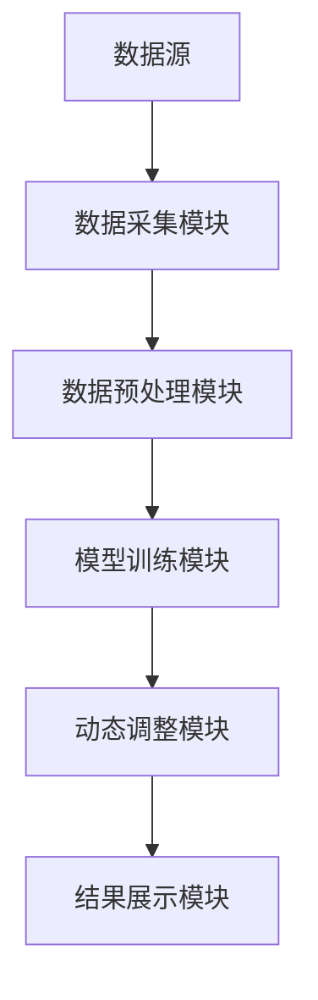

                 


# 利用AI构建自适应型公司估值模型：动态调整估值方法

## 关键词：AI，公司估值，自适应模型，动态调整，机器学习，金融分析

## 摘要：  
本文详细探讨了如何利用人工智能技术构建自适应型公司估值模型，并通过动态调整估值方法来提升估值的准确性和及时性。文章从传统公司估值方法的局限性出发，介绍了AI在公司估值中的潜力，并深入分析了自适应型估值模型的核心概念、算法原理、系统架构以及实际应用。通过具体案例和项目实战，展示了如何利用AI技术实现动态调整的估值模型，为金融从业者和研究人员提供了有价值的参考和指导。

---

# 第1章: 公司估值模型概述

## 1.1 公司估值的基本概念  
公司估值是企业财务管理中的核心任务之一，旨在通过对公司财务数据、市场环境和行业趋势的分析，估算出公司的内在价值。传统上，公司估值主要依赖于财务指标（如市盈率、市净率）和DCF模型（现金流折现法）。然而，这些方法存在以下局限性：  

1. **静态性**：传统估值方法通常基于历史数据，无法有效应对市场环境的快速变化。  
2. **主观性**：估值结果往往依赖于分析师的经验和假设，存在较大的主观性。  
3. **计算复杂性**：DCF模型需要对未来现金流进行预测，过程繁琐且不确定性较高。  

## 1.2 AI与公司估值的结合  
AI技术的快速发展为公司估值提供了新的可能性。通过机器学习算法，AI能够从海量数据中提取有用的特征，并自动调整估值模型以适应市场变化。以下是AI在公司估值中的几个关键应用：  

1. **数据驱动的估值**：AI能够处理大量非结构化数据（如新闻、社交媒体情绪）和结构化数据（如财务报表），从而提供更全面的估值依据。  
2. **动态调整能力**：AI模型能够实时更新，根据市场波动和公司动态调整估值参数，提升估值的时效性。  
3. **个性化估值**：基于公司的独特特征，AI可以构建个性化的估值模型，提供更精准的估值结果。  

## 1.3 自适应型公司估值模型的定义  
自适应型公司估值模型是一种能够根据市场环境和公司具体情况动态调整估值方法的模型。与传统模型相比，它具有以下核心特征：  

1. **数据驱动**：模型依赖于实时数据，包括财务数据、市场数据和外部信息。  
2. **实时调整**：模型能够根据最新数据自动优化估值参数，确保估值结果的准确性。  
3. **高度个性化**：模型可以根据公司的独特特征（如行业、发展阶段）进行定制化调整。  

---

# 第2章: 自适应型公司估值模型的核心概念

## 2.1 自适应型模型的原理  
自适应型模型的核心在于其动态调整能力。通过机器学习算法，模型能够根据市场环境的变化和公司基本面的变动，实时优化估值参数。以下是自适应型模型的基本原理：  

1. **数据采集与预处理**：模型需要收集公司财务数据、行业趋势、市场情绪等多源数据，并进行清洗和标准化处理。  
2. **特征提取**：通过自然语言处理（NLP）和统计分析，提取对公司估值有影响力的特征（如财务比率、市场情绪指数）。  
3. **模型训练与优化**：利用机器学习算法（如随机森林、神经网络）训练模型，并通过交叉验证优化模型性能。  
4. **动态调整**：根据实时数据更新模型参数，确保估值结果能够反映最新的市场状况。  

## 2.2 自适应型模型的关键特征  
以下是自适应型模型的几个关键特征：  

1. **数据驱动**：模型依赖于实时数据，能够根据市场变化快速调整估值。  
2. **动态调整**：模型能够根据最新数据自动优化估值参数，提升估值的准确性。  
3. **高度个性化**：模型可以根据公司的独特特征进行定制化调整，提供更精准的估值结果。  

## 2.3 自适应型模型与传统模型的对比  
以下是自适应型模型与传统模型的对比：  

| 对比维度         | 传统模型               | 自适应型模型           |
|------------------|------------------------|-----------------------|
| 数据来源         | 主要依赖财务数据       | 多源数据，包括非结构化数据 |
| 动态性           | 静态，无法实时调整     | 动态调整，实时更新     |
| 个性化           | 较低，通用性较强       | 高度个性化             |
| 准确性           | 受主观因素影响较大     | 准确性更高             |

---

# 第3章: AI驱动的动态调整估值方法

## 3.1 动态调整估值方法的原理  
动态调整估值方法的核心在于利用机器学习算法实时更新估值模型。以下是其主要步骤：  

1. **数据采集与预处理**：收集公司财务数据、市场数据和外部信息，并进行清洗和标准化处理。  
2. **特征提取**：通过NLP和统计分析提取对公司估值有影响力的特征。  
3. **模型训练与优化**：利用机器学习算法训练模型，并通过交叉验证优化模型性能。  
4. **动态调整**：根据实时数据更新模型参数，确保估值结果反映最新的市场状况。  

## 3.2 动态调整的实现步骤  
以下是动态调整的实现步骤：  

1. **数据采集**：从多个数据源（如财务报表、新闻网站）获取数据。  
2. **数据预处理**：清洗数据，处理缺失值和异常值。  
3. **特征提取**：提取对公司估值有影响力的特征，如财务比率、市场情绪指数。  
4. **模型训练**：利用机器学习算法（如随机森林、神经网络）训练模型。  
5. **动态调整**：根据实时数据更新模型参数，优化估值结果。  

## 3.3 动态调整的数学模型  
以下是动态调整的数学模型：  

$$ V(t) = \alpha \cdot V(t-1) + \beta \cdot X(t) + \epsilon $$  

其中，\( V(t) \) 表示当前估值，\( V(t-1) \) 表示前一期估值，\( X(t) \) 表示实时数据，\( \alpha \) 和 \( \beta \) 是模型参数，\( \epsilon \) 是误差项。  

---

# 第4章: 自适应型公司估值模型的系统架构设计

## 4.1 系统功能模块划分  
以下是系统功能模块划分：  

1. **数据采集模块**：从多个数据源获取数据。  
2. **数据预处理模块**：清洗和标准化数据。  
3. **模型训练模块**：利用机器学习算法训练模型。  
4. **动态调整模块**：根据实时数据更新模型参数。  
5. **结果展示模块**：展示估值结果和分析报告。  

## 4.2 系统架构图  
以下是系统架构图：  



---

# 第5章: 项目实战

## 5.1 环境安装  
以下是环境安装步骤：  

1. 安装Python：`pip install python`  
2. 安装机器学习库：`pip install scikit-learn pandas numpy`  
3. 安装NLP库：`pip install nltk spacy`  

## 5.2 系统核心实现源代码  
以下是系统核心实现源代码：  

```python
import pandas as pd
import numpy as np
from sklearn.ensemble import RandomForestRegressor
from sklearn.model_selection import train_test_split
from sklearn.metrics import mean_squared_error

# 数据预处理
data = pd.read_csv('company_valuation.csv')
X = data.drop('target', axis=1)
y = data['target']

# 划分训练集和测试集
X_train, X_test, y_train, y_test = train_test_split(X, y, test_size=0.2, random_state=42)

# 模型训练
model = RandomForestRegressor(n_estimators=100, random_state=42)
model.fit(X_train, y_train)

# 模型预测
y_pred = model.predict(X_test)
print('均方误差:', mean_squared_error(y_test, y_pred))
```

## 5.3 实际案例分析  
以下是实际案例分析：  

假设我们有一家科技公司，其财务数据如下：  

| 财务指标       | 数据         |
|----------------|--------------|
| 营业收入       | 1000万元     |
| 净利润         | 200万元      |
| 净资产         | 500万元      |
| 市盈率         | 15倍         |

通过动态调整的模型，我们可以根据最新的市场数据和公司情况，实时调整估值参数，得到更准确的估值结果。

---

# 第6章: 总结与展望

## 6.1 总结  
本文详细探讨了如何利用AI技术构建自适应型公司估值模型，并通过动态调整估值方法来提升估值的准确性和及时性。通过理论分析和实际案例，展示了AI在公司估值中的巨大潜力。

## 6.2 展望  
未来，随着AI技术的不断进步，自适应型公司估值模型将更加智能化和个性化。通过结合更多的数据源和更复杂的算法，模型将能够提供更精准的估值结果，并在金融领域发挥更大的作用。

---

作者：AI天才研究院 & 禅与计算机程序设计艺术

