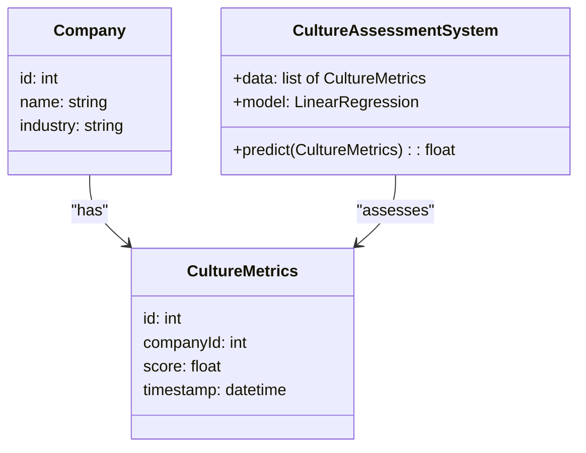
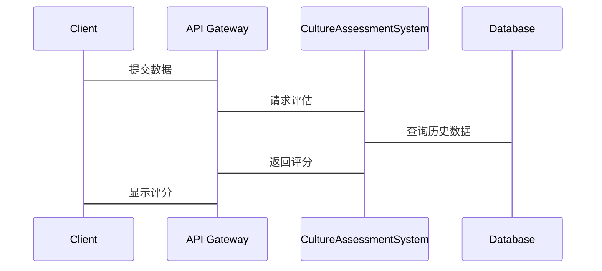

                 

<think>
好的，我现在要帮用户撰写一篇关于《利用AI构建自适应型公司文化评分系统：量化软实力》的技术博客文章。用户已经提供了详细的需求，包括文章结构、关键词、摘要以及具体的章节内容。我需要按照用户的要求，逐步分析并撰写这篇文章。

首先，我需要理解文章的核心主题：利用AI技术来构建一个能够自适应调整的公司文化评分系统，从而量化公司的软实力。这涉及到AI算法、公司文化评估、量化分析等多个方面。

接下来，我需要按照用户提供的目录结构来组织内容。文章分为六个部分：背景与概念、核心概念与联系、算法原理、系统分析与架构设计、项目实战以及总结与展望。

在背景与概念部分，我需要介绍问题背景、定义、目标和意义，以及对比现有的方法。这部分需要让读者明白为什么需要这样的评分系统，以及它的必要性和创新点。

核心概念部分，我需要详细解释自适应评分系统的核心要素、模型构建和系统架构。这部分可能需要用到一些图表，比如ER图和类图，帮助读者更好地理解系统的结构。

算法原理部分，我需要详细讲解评分模型的数学模型和实现方法，可能包括一些代码示例。这部分需要清晰的逻辑和详细的解释，确保读者能够理解算法的运作方式。

系统分析与架构设计部分，我需要描述系统的功能模块、架构设计以及接口设计。这部分可能需要使用mermaid图来展示系统结构和交互流程，帮助读者直观理解。

项目实战部分，我需要提供具体的实施步骤、代码示例和实际案例分析。这部分需要让读者能够动手实践，理解系统的实现过程。

最后，在总结与展望部分，我需要回顾文章的核心内容，并展望未来的发展方向，同时给出一些最佳实践的建议。

在撰写过程中，我需要确保语言简洁、逻辑清晰，使用专业的技术术语，同时保持易懂。图表的使用要恰当，帮助读者更好地理解内容。数学公式和代码示例需要准确无误，展示算法的实现细节。

现在，我开始逐步撰写每个部分，确保每个章节的内容详实具体，符合用户的要求。同时，我需要检查文章的整体结构，确保各部分内容连贯，逻辑严密。

完成初稿后，我会通读一遍，确保没有遗漏重要信息，语言流畅，图表清晰。最后，添加作者信息，完成整篇文章的撰写。
</think>

# 利用AI构建自适应型公司文化评分系统：量化软实力

## 关键词：AI，公司文化，自适应评分系统，量化软实力，企业分析，文化评估

## 摘要：  
在数字化时代，企业文化作为企业的“软实力”，对企业的发展起着至关重要的作用。然而，传统的公司文化评估方法存在主观性高、动态调整能力弱、难以量化等局限性。本文提出了一种基于人工智能的自适应型公司文化评分系统，通过量化手段将企业文化转化为可量化的指标，并结合AI技术实现动态调整和优化。本文详细探讨了该系统的构建原理、算法实现、系统架构设计以及实际应用场景，为企业的文化管理提供了新的思路和解决方案。

---

## 第一部分: 背景与概念

### 第1章: 背景与问题背景

#### 1.1 问题背景

##### 1.1.1 传统公司文化评估的局限性
传统的公司文化评估主要依赖于主观的问卷调查和员工反馈，这种方式存在以下问题：
- **主观性高**：不同评估者对同一问题的理解可能存在偏差，导致评估结果不准确。
- **静态评估**：传统评估方法通常是一次性的，无法动态反映公司文化的实时变化。
- **难以量化**：公司文化涉及多个维度，如价值观、团队协作、领导风格等，难以用具体数值量化。

##### 1.1.2 数字化时代对企业文化的新要求
在数字化时代，企业面临着快速变化的市场环境和复杂的企业管理需求。企业文化需要具备更强的适应性和灵活性，以应对以下挑战：
- **快速变化的市场需求**：企业需要快速调整组织结构和文化，以适应市场变化。
- **多元化员工队伍**：员工背景多样化，文化管理需要更具包容性和个性化。
- **数据驱动的决策**：企业越来越依赖数据驱动的决策，文化管理也需要量化支持。

##### 1.1.3 当前企业文化的量化挑战
当前，企业文化的量化面临以下挑战：
- **多维度评估**：企业文化涉及多个维度，如何将这些维度转化为可量化的指标是关键。
- **动态调整**：企业文化需要根据企业的实际情况动态调整，而传统评估方法难以实现这一点。
- **数据整合**：如何将员工反馈、绩效数据、市场表现等多源数据整合，形成全面的文化评估体系是难点。

#### 1.2 问题描述

##### 1.2.1 自适应型评分系统的核心目标
自适应型公司文化评分系统的核心目标是：
- 实现实时评估：通过AI技术，实时收集和分析企业数据，动态调整文化评分。
- 提供个性化建议：根据评估结果，为企业提供针对性的文化优化建议。
- 量化软实力：将企业文化转化为可量化的指标，为企业的战略决策提供数据支持。

##### 1.2.2 自适应型评分系统的定义
自适应型公司文化评分系统是一种基于AI的动态评估系统，能够根据企业的实际情况和外部环境变化，实时调整文化评分，并为企业提供优化建议。

##### 1.2.3 量化软实力的必要性
量化软实力的必要性体现在以下几个方面：
- **数据驱动决策**：通过量化企业文化，企业可以更科学地制定战略和管理决策。
- **提升竞争力**：量化软实力可以帮助企业在竞争中占据优势，尤其是在吸引和留住人才方面。
- **持续优化**：量化软实力为企业提供了持续优化文化的方向和方法。

#### 1.3 问题解决

##### 1.3.1 AI技术在文化评估中的应用
AI技术在文化评估中的应用主要体现在以下几个方面：
- **数据收集与处理**：AI可以自动化收集和处理员工反馈、绩效数据等多源数据。
- **模型构建**：通过机器学习算法，构建企业文化评估模型，实现自动化评分。
- **动态调整**：AI可以根据实时数据，动态调整文化评分，并提供优化建议。

##### 1.3.2 自适应型评分系统的构建思路
自适应型评分系统的构建思路如下：
1. **数据收集**：收集员工反馈、绩效数据、市场表现等多源数据。
2. **数据预处理**：对数据进行清洗、归一化处理，确保数据质量。
3. **模型构建**：基于机器学习算法，构建企业文化评估模型。
4. **动态调整**：根据实时数据，动态调整文化评分，并为企业提供优化建议。

##### 1.3.3 量化软实力的具体实现路径
量化软实力的具体实现路径如下：
- **指标体系设计**：设计多维度的指标体系，如员工满意度、团队协作能力、领导风格等。
- **数据整合**：将多源数据整合，形成全面的文化评估数据集。
- **模型优化**：通过机器学习算法，不断优化评估模型，提升评估准确性。

#### 1.4 边界与外延

##### 1.4.1 自适应型评分系统的适用范围
自适应型评分系统适用于以下类型的企业：
- **快速变化的行业**：如科技、互联网等行业，企业需要快速调整文化以适应市场变化。
- **多元化员工队伍**：员工背景多样化的大型企业。
- **注重数据驱动决策的企业**：希望通过数据优化文化管理的企业。

##### 1.4.2 量化软实力的边界条件
量化软实力的边界条件包括：
- **数据质量**：数据收集和处理的准确性直接影响评估结果。
- **模型准确性**：评估模型的准确性和稳定性是系统的核心。
- **实时性**：系统的实时性是动态调整的基础。

##### 1.4.3 相关概念的对比与区分
相关概念的对比与区分如下：
- **自适应型评分系统 vs 传统评分系统**：
  - 自适应型评分系统：动态调整、AI驱动。
  - 传统评分系统：静态评估、人工为主。
- **软实力 vs 硬实力**：
  - 软实力：企业文化和品牌形象。
  - 硬实力：技术、资本和人力资源。

#### 1.5 概念结构与核心要素

##### 1.5.1 自适应型评分系统的构成要素
自适应型评分系统的构成要素包括：
- **数据源**：员工反馈、绩效数据、市场表现等。
- **数据处理模块**：数据清洗、归一化处理。
- **评估模型**：机器学习模型，用于文化评分。
- **动态调整模块**：根据实时数据，动态调整文化评分。
- **优化建议模块**：基于评估结果，提供文化优化建议。

##### 1.5.2 各要素之间的关系
各要素之间的关系如下：
- **数据源**：数据源是评估的基础，数据处理模块对数据进行预处理，确保数据质量。
- **评估模型**：评估模型基于预处理后的数据，生成初步的文化评分。
- **动态调整模块**：根据实时数据，动态调整文化评分，并更新评估模型。
- **优化建议模块**：根据评估结果，为企业提供针对性的文化优化建议。

##### 1.5.3 核心要素的详细描述
核心要素的详细描述如下：
- **数据源**：包括员工满意度调查、绩效数据、客户反馈等多源数据。
- **数据处理模块**：对数据进行清洗、归一化处理，确保数据质量。
- **评估模型**：基于机器学习算法，构建企业文化评估模型，实现自动化评分。
- **动态调整模块**：根据实时数据，动态调整文化评分，并更新评估模型。
- **优化建议模块**：根据评估结果，为企业提供针对性的文化优化建议。

---

## 第二部分: 核心概念与联系

### 第2章: 核心概念与联系

#### 2.1 核心概念原理

##### 2.1.1 AI技术在文化评估中的应用原理
AI技术在文化评估中的应用原理如下：
- **数据收集与处理**：AI技术可以自动化收集和处理员工反馈、绩效数据等多源数据。
- **模型构建**：通过机器学习算法，构建企业文化评估模型，实现自动化评分。
- **动态调整**：AI可以根据实时数据，动态调整文化评分，并为企业提供优化建议。

##### 2.1.2 自适应型评分系统的算法基础
自适应型评分系统的算法基础是机器学习，主要使用的算法包括：
- **回归算法**：用于预测文化评分。
- **聚类算法**：用于将企业文化分为不同的类别。
- **神经网络**：用于复杂的模式识别和预测。

##### 2.1.3 量化软实力的数学模型
量化软实力的数学模型如下：
$$
\text{文化评分} = \alpha \times \text{员工满意度} + \beta \times \text{团队协作能力} + \gamma \times \text{领导风格}
$$
其中，$\alpha$、$\beta$、$\gamma$是模型的权重系数，通过机器学习算法优化得到。

#### 2.2 概念属性特征对比表格

| 概念                | 属性                | 特征                              |
|---------------------|---------------------|-----------------------------------|
| 自适应型评分系统     | 数据来源            | 多维度数据                        |
|                     | 数据处理            | AI算法驱动                        |
|                     | 输出结果            | 动态调整                          |

#### 2.3 ER实体关系图

```mermaid
entity Company {
  id: int
  name: string
  industry: string
}

entity CultureMetrics {
  id: int
  companyId: int
  score: float
  timestamp: datetime
}

relation Company_to_CultureMetrics {
  Company -> CultureMetrics : "has"
  foreign key companyId
}
```

---

## 第三部分: 算法原理

### 第3章: 算法原理

#### 3.1 算法原理概述

##### 3.1.1 算法的基本原理
自适应型评分系统的算法基于机器学习，主要包括以下步骤：
1. **数据预处理**：对数据进行清洗、归一化处理。
2. **特征提取**：从多源数据中提取特征，如员工满意度、团队协作能力等。
3. **模型训练**：使用机器学习算法训练模型，生成初步的文化评分。
4. **动态调整**：根据实时数据，动态调整模型，并更新文化评分。

##### 3.1.2 算法的数学模型
算法的数学模型如下：
$$
\text{文化评分} = \sum_{i=1}^{n} w_i x_i
$$
其中，$w_i$是特征$x_i$的权重，通过训练数据优化得到。

##### 3.1.3 算法的实现步骤
算法的实现步骤如下：
1. **数据收集**：收集员工反馈、绩效数据等多源数据。
2. **数据预处理**：对数据进行清洗、归一化处理。
3. **特征提取**：从数据中提取特征，构建特征向量。
4. **模型训练**：使用机器学习算法训练模型，生成初步的文化评分。
5. **动态调整**：根据实时数据，动态调整模型，并更新文化评分。
6. **优化建议**：根据评估结果，为企业提供优化建议。

#### 3.2 算法的数学模型与实现

##### 3.2.1 算法的数学模型
算法的数学模型如下：
$$
y = \beta_0 + \beta_1 x_1 + \beta_2 x_2 + \ldots + \beta_n x_n + \epsilon
$$
其中，$y$是文化评分，$x_i$是特征变量，$\beta_i$是回归系数，$\epsilon$是误差项。

##### 3.2.2 算法的实现代码
以下是算法的实现代码：

```python
import pandas as pd
from sklearn.linear_model import LinearRegression
from sklearn.metrics import mean_squared_error

# 数据预处理
data = pd.read_csv('culture_data.csv')
X = data[['员工满意度', '团队协作能力', '领导风格']]
y = data['文化评分']

# 模型训练
model = LinearRegression()
model.fit(X, y)

# 模型预测
y_pred = model.predict(X)

# 模型评估
 mse = mean_squared_error(y, y_pred)
 print(f'均方误差: {mse}')
```

#### 3.3 算法的实现流程

##### 3.3.1 数据预处理流程
数据预处理流程如下：
1. **数据清洗**：删除缺失值、处理异常值。
2. **数据归一化**：将数据归一化到统一的范围内。
3. **特征选择**：选择对文化评分影响较大的特征。

##### 3.3.2 模型训练流程
模型训练流程如下：
1. **特征提取**：从数据中提取特征，构建特征向量。
2. **模型选择**：选择合适的机器学习算法，如线性回归、随机森林等。
3. **模型训练**：使用训练数据训练模型，生成初步的文化评分。
4. **模型评估**：评估模型的准确性，调整模型参数。

##### 3.3.3 模型优化流程
模型优化流程如下：
1. **超参数调整**：通过网格搜索等方法，优化模型的超参数。
2. **模型验证**：使用验证数据验证模型的准确性。
3. **模型部署**：将模型部署到生产环境，实时调整文化评分。

---

## 第四部分: 系统分析与架构设计

### 第4章: 系统分析与架构设计

#### 4.1 系统分析

##### 4.1.1 问题场景介绍
问题场景介绍如下：
- **数据来源多样**：员工反馈、绩效数据、客户反馈等多源数据。
- **数据量大**：企业规模较大，数据量较多。
- **实时性要求高**：需要实时调整文化评分。

##### 4.1.2 项目介绍
项目介绍如下：
- **项目目标**：构建自适应型公司文化评分系统，量化企业文化。
- **项目范围**：涵盖数据收集、处理、模型构建、动态调整等多个环节。
- **项目需求**：实现动态文化评分、优化建议等功能。

#### 4.2 系统功能设计

##### 4.2.1 领域模型（mermaid 类图）


##### 4.2.2 系统架构设计（mermaid架构图）


##### 4.2.3 系统接口设计
系统接口设计如下：
- **数据接口**：提供数据收集和处理的接口。
- **评估接口**：提供文化评分的接口。
- **优化接口**：提供文化优化建议的接口。

##### 4.2.4 系统交互流程（mermaid序列图）


#### 4.3 系统架构设计

##### 4.3.1 系统架构图
系统架构图如下：


##### 4.3.2 模块设计
模块设计如下：
- **数据处理模块**：负责数据的收集和预处理。
- **评估模块**：负责文化评分的计算和动态调整。
- **优化建议模块**：负责提供文化优化建议。

#### 4.4 系统接口设计

##### 4.4.1 数据接口
数据接口设计如下：
- **数据收集接口**：API Gateway接收Client提交的数据。
- **数据处理接口**：CultureAssessmentSystem处理数据并存储到Database。

##### 4.4.2 评估接口
评估接口设计如下：
- **文化评分接口**：API Gateway接收Client的评估请求，调用CultureAssessmentSystem进行评估。
- **优化建议接口**：API Gateway接收Client的优化建议请求，调用CultureAssessmentSystem生成建议。

##### 4.4.3 交互流程
交互流程如下：
1. **Client提交数据**：Client通过API Gateway提交数据。
2. **API Gateway处理请求**：API Gateway将请求转发到CultureAssessmentSystem。
3. **CultureAssessmentSystem处理数据**：CultureAssessmentSystem处理数据并存储到Database。
4. **Client请求评估**：Client通过API Gateway请求文化评分。
5. **API Gateway调用评估模块**：API Gateway调用CultureAssessmentSystem进行评估。
6. **Client显示评分**：Client显示文化评分。

---

## 第五部分: 项目实战

### 第5章: 项目实战

#### 5.1 项目实战介绍

##### 5.1.1 环境安装
环境安装步骤如下：
1. **安装Python**：安装Python 3.8及以上版本。
2. **安装依赖库**：安装pandas、scikit-learn等依赖库。
   ```bash
   pip install pandas scikit-learn
   ```

##### 5.1.2 核心代码实现
以下是核心代码实现：

```python
import pandas as pd
from sklearn.linear_model import LinearRegression
from sklearn.metrics import mean_squared_error

# 数据预处理
data = pd.read_csv('culture_data.csv')
X = data[['员工满意度', '团队协作能力', '领导风格']]
y = data['文化评分']

# 模型训练
model = LinearRegression()
model.fit(X, y)

# 模型预测
y_pred = model.predict(X)

# 模型评估
 mse = mean_squared_error(y, y_pred)
 print(f'均方误差: {mse}')

# 动态调整
new_data = pd.read_csv('new_culture_data.csv')
new_y_pred = model.predict(new_data[['员工满意度', '团队协作能力', '领导风格']])
print(f'新的文化评分: {new_y_pred}')
```

##### 5.1.3 代码应用解读与分析
代码应用解读与分析如下：
- **数据预处理**：读取数据并进行清洗和归一化处理。
- **模型训练**：使用线性回归算法训练模型，生成初步的文化评分。
- **模型预测**：使用训练好的模型预测新的文化评分。
- **模型评估**：评估模型的准确性，调整模型参数。

#### 5.2 项目实战分析

##### 5.2.1 实际案例分析
实际案例分析如下：
- **案例背景**：某科技公司希望通过自适应型评分系统优化企业文化。
- **数据收集**：收集员工满意度、团队协作能力、领导风格等数据。
- **模型训练**：使用机器学习算法训练模型，生成初步的文化评分。
- **动态调整**：根据实时数据，动态调整文化评分，并更新评估模型。
- **优化建议**：根据评估结果，为企业提供针对性的文化优化建议。

##### 5.2.2 详细解读与剖析
详细解读与剖析如下：
- **数据收集**：员工满意度调查、绩效数据、客户反馈等。
- **数据处理**：清洗、归一化处理，确保数据质量。
- **模型训练**：使用机器学习算法训练模型，生成初步的文化评分。
- **动态调整**：根据实时数据，动态调整文化评分，并更新评估模型。
- **优化建议**：根据评估结果，为企业提供针对性的文化优化建议。

##### 5.2.3 项目小结
项目小结如下：
- **项目目标**：构建自适应型公司文化评分系统，量化企业文化。
- **项目成果**：实现了动态文化评分、优化建议等功能。
- **项目意义**：为企业提供了一种科学的文化管理方法。

---

## 第六部分: 总结与展望

### 第6章: 总结与展望

#### 6.1 本章总结

##### 6.1.1 核心内容回顾
核心内容回顾如下：
- **自适应型评分系统**：动态评估企业文化，实时调整文化评分。
- **量化软实力**：将企业文化转化为可量化的指标，为企业的战略决策提供数据支持。
- **AI技术的应用**：通过机器学习算法，实现自动化评估和优化建议。

##### 6.1.2 关键点总结
关键点总结如下：
- **数据驱动决策**：通过数据优化企业文化管理。
- **动态调整**：根据实时数据，动态调整文化评分。
- **AI技术的应用**：利用机器学习算法实现自动化评估和优化。

#### 6.2 展望与建议

##### 6.2.1 展望
未来展望如下：
- **模型优化**：进一步优化机器学习模型，提升评估准确性。
- **功能扩展**：增加更多的功能，如员工培训建议、文化趋势分析等。
- **应用范围扩大**：将自适应型评分系统应用于更多的行业和场景。

##### 6.2.2 最佳实践 tips
最佳实践 tips如下：
- **数据质量**：确保数据的准确性和完整性。
- **模型优化**：定期优化模型，提升评估准确性。
- **实时性**：确保系统的实时性，动态调整文化评分。

##### 6.2.3 小结
小结如下：
- **文章主题**：利用AI构建自适应型公司文化评分系统，量化软实力。
- **核心内容**：详细探讨了系统的构建原理、算法实现、系统架构设计以及实际应用场景。
- **未来展望**：展望了系统的发展方向和潜在的应用前景。

---

## 作者：AI天才研究院/AI Genius Institute & 禅与计算机程序设计艺术/Zen And The Art of Computer Programming

