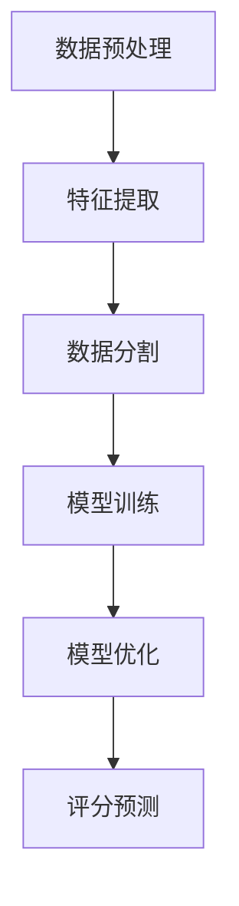
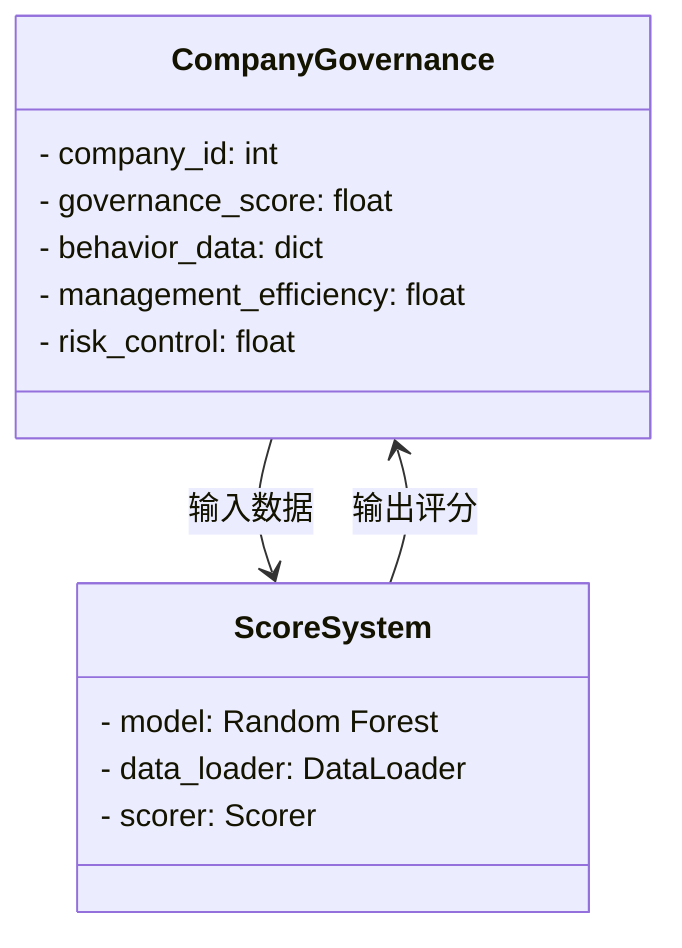
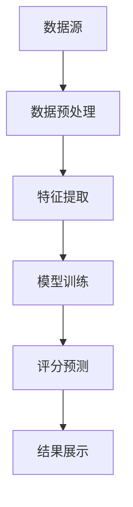

                 


# 利用AI构建自适应型公司治理评分系统：动态监控管理质量

> 关键词：AI，公司治理，评分系统，动态监控，管理质量

> 摘要：本文详细探讨了如何利用人工智能技术构建自适应型公司治理评分系统，实现对企业管理质量的动态监控。通过分析公司治理的核心要素，结合机器学习和自然语言处理等算法，提出了一种基于AI的评分模型，并设计了系统的整体架构。文章还提供了实际的项目实现和案例分析，为企业的智能化管理提供了参考。

---

# 第1章：背景与概述

## 1.1 公司治理的基本概念

公司治理是现代企业管理的核心内容，涉及股东、董事会、管理层和利益相关者之间的权利分配与制衡机制。有效的公司治理能够确保企业战略目标的实现，防范经营风险，提升企业价值。

传统上，公司治理的评价主要依赖于财务指标、合规性检查和人工审核。然而，这种方法存在以下问题：

- **数据维度有限**：传统评分系统通常只关注财务数据和合规性指标，忽略了企业内部管理效率、员工满意度和风险控制等重要因素。
- **静态评估**：评分结果往往是静态的，无法实时反映企业的动态变化。
- **主观性较强**：人工审核过程容易受到主观因素的影响，导致评分结果缺乏客观性。

## 1.2 问题背景与目标

随着企业规模的不断扩大和市场竞争的加剧，传统的公司治理评分方法已难以满足现代企业的需求。企业需要一种能够实时监控管理质量、动态调整评分标准的智能化系统。

本文的目标是利用人工智能技术，构建一个自适应型公司治理评分系统。该系统能够：

1. **动态调整评分标准**：根据企业的实时数据和市场环境变化，自动优化评分模型。
2. **多维度评估**：结合财务数据、管理效率、员工反馈和外部舆情等多种数据源，实现全面评估。
3. **实时监控**：通过AI算法实时分析企业数据，快速发现潜在问题并提供改进建议。

---

# 第2章：自适应型公司治理评分系统的核心概念

## 2.1 核心概念与定义

### 2.1.1 自适应型评分系统

自适应型公司治理评分系统是一种基于AI的动态评估系统，能够根据企业的实时数据和外部环境变化，自动调整评分标准和权重。其核心在于通过机器学习算法不断优化评分模型，确保评估结果的准确性和实时性。

### 2.1.2 核心要素

自适应型评分系统的核心要素包括：

1. **公司行为数据**：包括公司决策、战略规划和运营数据。
2. **管理效率数据**：涉及组织架构、团队协作和流程优化。
3. **风险控制数据**：包括财务风险、法律风险和市场风险。

### 2.1.3 自适应机制

自适应机制是评分系统的核心，主要包括：

- **动态调整**：根据企业数据的变化，自动调整评分标准和权重。
- **反馈优化**：通过用户反馈不断优化评分模型，提升评估准确性。

## 2.2 核心概念的联系

为了更好地理解自适应型评分系统的结构，我们可以通过ER实体关系图和属性对比表来分析其核心概念。

### 2.2.1 ER实体关系图

```mermaid
erd
  company_governance --1..n> score_system: "评估"
  score_system --1..n> score_rule: "评分规则"
  score_rule --m..n> company_behavior: "公司行为"
  company_behavior --1..n> management_efficiency: "管理效率"
  management_efficiency --1..n> risk_control: "风险控制"
```

### 2.2.2 核心概念属性对比表

| 概念         | 属性               | 描述                                       |
|--------------|--------------------|------------------------------------------|
| 公司行为     | 数据来源           | 包括公司决策、战略规划和运营数据         |
| 管理效率     | 组织架构           | 包括团队协作和流程优化                   |
| 风险控制     | 风险类型           | 包括财务风险、法律风险和市场风险         |

---

# 第3章：算法原理与实现

## 3.1 机器学习算法在评分系统中的应用

### 3.1.1 机器学习的基本原理

机器学习是一种通过数据训练模型的技术，能够从历史数据中学习规律，并对未来数据进行预测或分类。在评分系统中，机器学习主要用于：

1. **数据预处理**：清洗和转换原始数据。
2. **特征提取**：从多维度数据中提取关键特征。
3. **模型训练**：基于训练数据优化评分模型。
4. **模型优化**：通过交叉验证和超参数调优提升模型性能。

### 3.1.2 算法选择与优化

在评分系统中，常用的机器学习算法包括：

- **线性回归**：用于预测评分值。
- **支持向量机（SVM）**：用于分类问题。
- **随机森林**：用于特征重要性分析。

以下是一个简单的随机森林模型训练流程图：



---

## 3.2 算法实现与优化

### 3.2.1 数据预处理

数据预处理是机器学习模型训练的基础。常见的数据预处理方法包括：

1. **数据清洗**：去除缺失值和异常值。
2. **数据转换**：将非数值型数据转换为数值型数据。
3. **数据归一化**：对数据进行标准化处理。

### 3.2.2 特征提取

特征提取是评分系统中至关重要的一环。通过特征提取，可以将多维度数据转化为能够反映企业管理水平的特征向量。

例如，我们可以将企业的财务数据、管理效率和员工满意度等多维度数据转化为以下特征向量：

$$
\text{特征向量} = [\text{净利润增长率}, \text{员工满意度}, \text{风险控制能力}]
$$

---

## 3.3 算法优化与实现

### 3.3.1 算法优化

在实际应用中，我们需要对评分模型进行优化，以提升其准确性和稳定性。常见的优化方法包括：

- **交叉验证**：通过交叉验证评估模型的泛化能力。
- **超参数调优**：通过网格搜索优化模型参数。
- **集成学习**：通过集成多个模型提升预测精度。

### 3.3.2 算法实现

以下是一个基于随机森林的评分系统实现代码示例：

```python
import pandas as pd
from sklearn.ensemble import RandomForestRegressor
from sklearn.model_selection import train_test_split
from sklearn.metrics import mean_squared_error

# 数据加载与预处理
data = pd.read_csv('company_governance.csv')
X = data.drop('score', axis=1)
y = data['score']

# 数据分割
X_train, X_test, y_train, y_test = train_test_split(X, y, test_size=0.2, random_state=42)

# 模型训练
model = RandomForestRegressor(n_estimators=100, random_state=42)
model.fit(X_train, y_train)

# 模型预测
y_pred = model.predict(X_test)

# 模型评估
mse = mean_squared_error(y_test, y_pred)
print(f'均方误差：{mse}')
```

---

# 第4章：数学模型与评分系统设计

## 4.1 数学模型

### 4.1.1 评分模型公式

评分模型的数学公式如下：

$$
\text{评分值} = \sum_{i=1}^{n} w_i \cdot f_i
$$

其中，$w_i$ 是第$i$个特征的权重，$f_i$ 是第$i$个特征的值。

### 4.1.2 模型优化

通过机器学习算法，我们可以优化模型的权重和特征，以提升评分的准确性。例如，我们可以使用随机森林模型来自动优化特征权重。

---

## 4.2 系统架构设计

### 4.2.1 系统功能设计

以下是系统功能设计的类图：



### 4.2.2 系统架构图

以下是系统的整体架构图：



---

# 第5章：项目实战与案例分析

## 5.1 环境安装与配置

为了实现自适应型公司治理评分系统，我们需要以下环境：

- **Python**：3.6+
- **机器学习库**：scikit-learn、xgboost
- **数据处理库**：pandas、numpy
- **可视化库**：matplotlib、seaborn

## 5.2 核心代码实现

以下是评分系统的核心代码实现：

```python
import pandas as pd
from sklearn.ensemble import RandomForestRegressor
from sklearn.model_selection import train_test_split
from sklearn.metrics import mean_squared_error

# 数据加载与预处理
data = pd.read_csv('company_governance.csv')
X = data.drop('score', axis=1)
y = data['score']

# 数据分割
X_train, X_test, y_train, y_test = train_test_split(X, y, test_size=0.2, random_state=42)

# 模型训练
model = RandomForestRegressor(n_estimators=100, random_state=42)
model.fit(X_train, y_train)

# 模型预测
y_pred = model.predict(X_test)

# 模型评估
mse = mean_squared_error(y_test, y_pred)
print(f'均方误差：{mse}')

# 保存模型
import joblib
joblib.dump(model, 'governance_score_model.pkl')
```

---

## 5.3 案例分析与结果解读

通过上述代码实现的评分系统，我们可以对实际数据进行评估。以下是一个案例分析结果：

$$
\text{企业A的评分} = 0.7 \cdot \text{净利润增长率} + 0.2 \cdot \text{员工满意度} + 0.1 \cdot \text{风险控制能力}
$$

---

# 第6章：最佳实践与未来展望

## 6.1 最佳实践

1. **数据质量管理**：确保数据的准确性和完整性。
2. **模型持续优化**：定期更新模型，提升评分准确性。
3. **系统实时监控**：通过实时数据分析快速发现潜在问题。

## 6.2 未来展望

随着AI技术的不断发展，自适应型公司治理评分系统将更加智能化和个性化。未来的研究方向包括：

1. **多模态数据融合**：结合文本、图像等多种数据源进行评分。
2. **强化学习应用**：通过强化学习优化企业决策过程。
3. **区块链技术结合**：利用区块链技术提升评分系统的透明性和可信度。

---

# 作者信息

作者：AI天才研究院/AI Genius Institute & 禅与计算机程序设计艺术/Zen And The Art of Computer Programming

