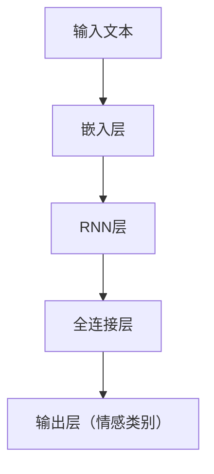
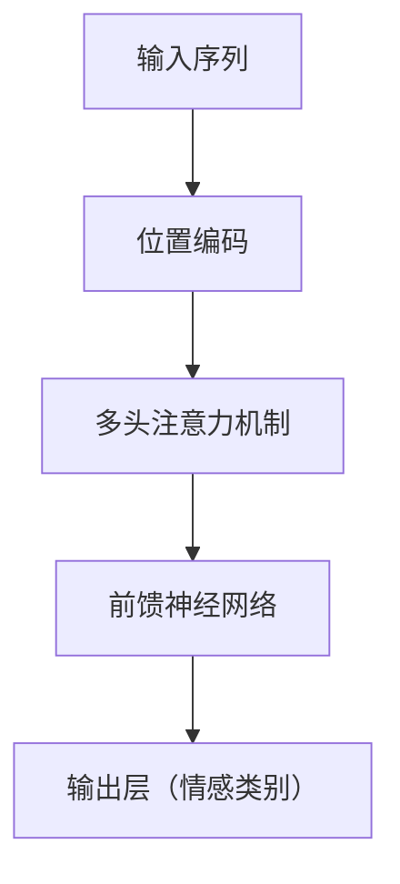
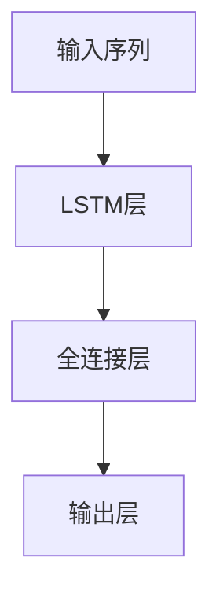
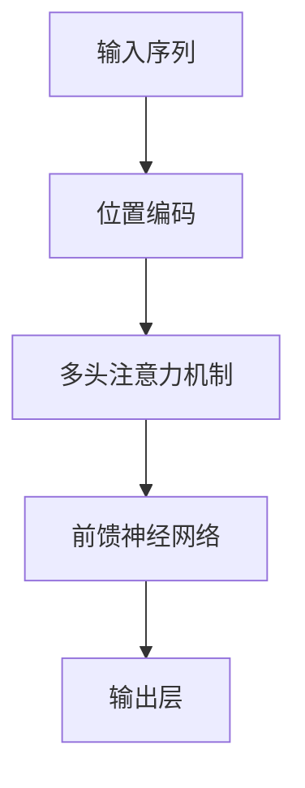
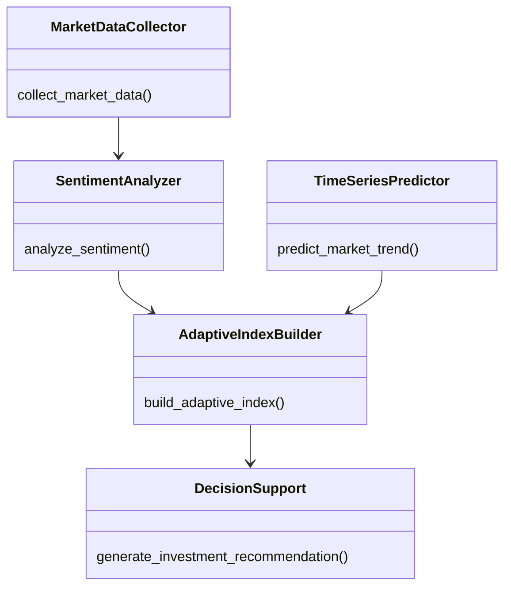
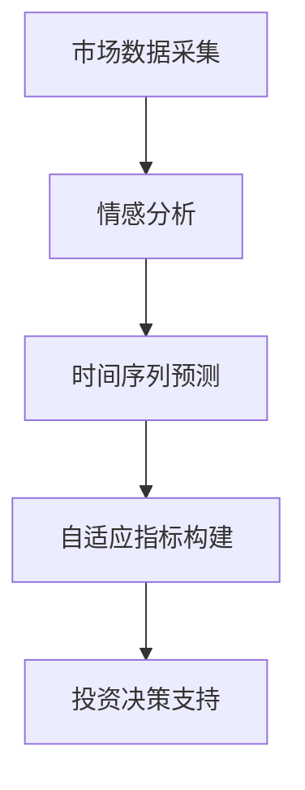
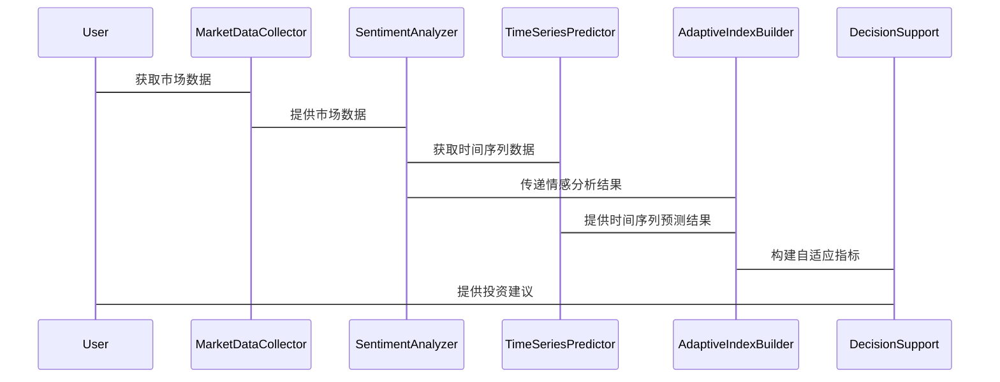

                 


# 4.2 数据预处理

### 4.2.1 数据清洗
#### 4.2.1.1 去除噪声数据
#### 4.2.1.2 处理缺失值
#### 4.2.1.3 标准化和归一化

### 4.2.2 数据增强
#### 4.2.2.1 文本数据增强方法
#### 4.2.2.2 时间序列数据增强策略
#### 4.2.2.3 数据增强对模型泛化的提升

### 4.2.3 数据分段与窗口化
#### 4.2.3.1 时间序列的分段方法
#### 4.2.3.2 窗口化处理技术
#### 4.2.3.3 数据窗口对模型预测的影响

## 第4章: 自适应型指标的构建方法

### 4.3 特征提取与选择

#### 4.3.1 文本特征提取
- 使用TF-IDF提取关键词
- 利用Word2Vec生成词向量
- 通过BERT模型获取上下文表示

#### 4.3.2 市场数据特征选择
- 市场指数的移动平均线（MA）
- 市场波动率的计算方法
- 市场交易量的分析指标

#### 4.3.3 综合特征构建
- 文本情感得分与市场数据的结合
- 多源特征的融合方法
- 特征重要性评估

### 4.4 情感分析模型构建

#### 4.4.1 基于RNN的情感分析模型
- 循环神经网络的基本结构
- LSTM单元的遗忘门、输入门和输出门
- 使用Keras构建LSTM情感分类器

#### 4.4.2 基于Transformer的情感分析模型
- Transformer的注意力机制原理
- 多头注意力的实现方式
- 使用BERT进行情感分析的优势

### 4.5 时间序列预测模型

#### 4.5.1 ARIMA模型
- 理解ARIMA的三个参数（p, d, q）
- 通过ADF检验确定d值
- 使用statsmodels库实现ARIMA模型

#### 4.5.2 LSTM时间序列预测
- LSTM在时间序列预测中的优势
- 使用Keras构建LSTM时间序列模型
- 模型训练与超参数调优

## 第4章: 自适应型指标的构建方法

### 4.6 自适应型市场情绪指标的构建流程

#### 4.6.1 数据获取与预处理
- 数据源的选择与获取
- 数据清洗与标准化
- 数据窗口化处理

#### 4.6.2 特征提取与模型训练
- 文本数据的特征提取
- 市场数据的特征选择
- 情感分析模型与时间序列模型的结合

#### 4.6.3 模型融合与优化
- 多模型融合策略
- 模型调参与优化
- 模型性能评估指标

---

# 第5章: 基于AI的自适应市场情绪指标算法原理

## 5.1 情感分析算法原理

### 5.1.1 基于RNN的情感分析算法


代码示例：
```python
import keras
from keras.layers import LSTM, Dense, Embedding, Input
from keras.models import Model

input_text = Input(shape=(max_len,))
x = Embedding(vocab_size, embedding_dim)(input_text)
x = LSTM(units=64, return_sequences=False)(x)
x = Dense(1, activation='sigmoid')(x)
model = Model(inputs=input_text, outputs=x)
model.compile(loss='binary_crossentropy', optimizer='adam', metrics=['accuracy'])
```

### 5.1.2 基于Transformer的情感分析算法


代码示例：
```python
import tensorflow as tf
from tensorflow import keras
from tensorflow.keras.layers import Input, Dense, Dropout, Layer, MultiHeadAttention, LayerNormalization

class MultiHeadAttentionLayer(Layer):
    def __init__(self, d_model, num_heads):
        super(MultiHeadAttentionLayer, self).__init__()
        self.num_heads = num_heads
        self.d_model = d_model
        self.q_dense = Dense(d_model)
        self.k_dense = Dense(d_model)
        self.v_dense = Dense(d_model)
    
    def call(self, inputs):
        q = self.q_dense(inputs)
        k = self.k_dense(inputs)
        v = self.v_dense(inputs)
        # 计算注意力权重
        attention_output = self.attention(q, k, v)
        return attention_output

    def attention(self, q, k, v):
        # 简化版的注意力机制实现
        dk = tf.cast(tf.shape(k)[-1], tf.float32)
        attention_scores = tf.matmul(q, k, transpose_b=True)
        attention_weights = tf.nn.softmax(attention_scores / tf.sqrt(dk))
        output = tf.matmul(attention_weights, v)
        return output

# 使用自定义多头注意力层构建模型
input_seq = Input(shape=(max_len,))
x = MultiHeadAttentionLayer(d_model=512, num_heads=8)(input_seq)
x = Dropout(0.1)(x)
x = LayerNormalization(epsilon=1e-6)(x)
x = Dense(2, activation='softmax')(x)
model = Model(inputs=input_seq, outputs=x)
model.compile(loss='sparse_categorical_crossentropy', optimizer='adam', metrics=['accuracy'])
```

## 5.2 时间序列预测算法原理

### 5.2.1 基于LSTM的时间序列预测


代码示例：
```python
import numpy as np
import pandas as pd
from sklearn.preprocessing import MinMaxScaler
from keras.models import Sequential
from keras.layers import LSTM, Dense, Dropout

# 数据准备
data = pd.read_csv('market_data.csv')
data = data.values
data = data.astype('float32')

# 归一化处理
scaler = MinMaxScaler()
data_scaled = scaler.fit_transform(data)

# 划分训练集和测试集
train_size = int(len(data_scaled) * 0.7)
train_data = data_scaled[:train_size]
test_data = data_scaled[train_size:]

# 数据预处理
x_train = []
y_train = []
for i in range(len(train_data) - 1):
    x_train.append(train_data[i])
    y_train.append(train_data[i+1])

x_train = np.array(x_train)
y_train = np.array(y_train)
x_train = np.reshape(x_train, (x_train.shape[0], x_train.shape[1], 1))

# 模型构建
model = Sequential()
model.add(LSTM(50, return_sequences=False, input_shape=(1, 1)))
model.add(Dropout(0.2))
model.add(Dense(1))
model.compile(loss='mean_squared_error', optimizer='adam', metrics=['accuracy'])

# 训练模型
model.fit(x_train, y_train, epochs=50, batch_size=32, verbose=1)
```

### 5.2.2 基于Transformer的时间序列预测


代码示例：
```python
import tensorflow as tf
from tensorflow.keras.layers import Input, Dense, Dropout, Layer, MultiHeadAttention, LayerNormalization

def transformer_encoder(inputs, num_heads, d_model, dropout_rate):
    attention_output = MultiHeadAttention(num_heads=num_heads, key_dim=d_model//num_heads, value_dim=d_model//num_heads)(inputs, inputs)
    attention_output = Dropout(dropout_rate)(attention_output)
    output = LayerNormalization(epsilon=1e-6)(attention_output)
    return output

input_seq = Input(shape=(max_len,))
x = transformer_encoder(input_seq, num_heads=8, d_model=512, dropout_rate=0.1)
x = Dense(1, activation='linear')(x)
model = Model(inputs=input_seq, outputs=x)
model.compile(loss='mean_squared_error', optimizer='adam', metrics=['accuracy'])
```

## 5.3 自适应型市场情绪指标的算法融合

### 5.3.1 情感分析与时间序列预测的结合
- 使用情感分析模型预测市场情绪
- 使用时间序列模型预测市场走势
- 结合情绪与走势预测最终指标

### 5.3.2 动态调整模型权重
- 根据市场环境动态调整模型权重
- 使用元学习方法优化模型参数
- 实现模型的在线更新与自适应

### 5.3.3 模型融合策略
- 线性融合：将多个模型的输出按权重相加
- 爱奥尼亚融合：基于模型性能进行加权
- 基于时间窗口的动态融合

---

# 第6章: 系统架构设计

## 6.1 系统功能设计

### 6.1.1 需求分析
- 实时数据采集与处理
- 自适应型市场情绪指标计算
- 投资决策支持

### 6.1.2 系统功能模块划分


### 6.1.3 系统功能流程


## 6.2 系统架构设计

### 6.2.1 总体架构


### 6.2.2 模块间接口设计
- 数据接口：MarketDataCollector与SentimentAnalyzer之间的数据传递
- 模型接口：SentimentAnalyzer与TimeSeriesPredictor之间的模型调用
- 结果接口：AdaptiveIndexBuilder与DecisionSupport之间的指标传递

### 6.2.3 系统交互设计


## 6.3 系统实现细节

### 6.3.1 数据流设计
- 数据输入：市场数据、文本数据、社交媒体数据
- 数据处理：数据清洗、特征提取、模型训练
- 数据输出：自适应指标、投资建议

### 6.3.2 系统模块实现
- MarketDataCollector：数据采集与预处理
- SentimentAnalyzer：情感分析模型实现
- TimeSeriesPredictor：时间序列预测模型实现
- AdaptiveIndexBuilder：自适应指标构建
- DecisionSupport：投资决策支持

### 6.3.3 系统接口设计
- API接口：RESTful API
- 数据格式：JSON格式
- 接口文档：详细描述每个接口的功能、输入输出参数

## 6.4 系统性能优化

### 6.4.1 并行计算优化
- 使用GPU加速模型训练
- 并行处理数据预处理任务
- 分布式训练提升效率

### 6.4.2 模型优化
- 模型压缩与剪枝
- 模型量化
- 模型蒸馏

### 6.4.3 系统优化
- 优化数据读取速度
- 减少I/O瓶颈
- 提升内存利用效率

---

# 第7章: 项目实战

## 7.1 环境配置与数据准备

### 7.1.1 环境配置
- 安装Python 3.8+
- 安装TensorFlow/PyTorch框架
- 安装相关依赖库：Keras, scikit-learn, pandas, numpy, etc.

### 7.1.2 数据准备
- 获取市场数据：股票价格、指数数据
- 获取文本数据：新闻、社交媒体评论
- 数据预处理：清洗、归一化、分段

### 7.1.3 数据集划分
- 训练集、验证集、测试集划分
- 时间序列数据的窗口划分
- 文本数据的标签划分

## 7.2 系统核心实现

### 7.2.1 情感分析模型实现
```python
# 情感分析模型实现
def build_sentiment_model(max_len, vocab_size):
    model = Sequential()
    model.add(Embedding(vocab_size, 128, input_length=max_len))
    model.add(LSTM(64, return_sequences=False))
    model.add(Dense(1, activation='sigmoid'))
    model.compile(loss='binary_crossentropy', optimizer='adam', metrics=['accuracy'])
    return model
```

### 7.2.2 时间序列预测模型实现
```python
# 时间序列预测模型实现
def build_time_series_model(input_shape):
    model = Sequential()
    model.add(LSTM(50, return_sequences=False, input_shape=input_shape))
    model.add(Dropout(0.2))
    model.add(Dense(1))
    model.compile(loss='mean_squared_error', optimizer='adam', metrics=['accuracy'])
    return model
```

### 7.2.3 自适应指标构建
```python
# 自适应指标构建
def build_adaptive_index(sentiment_model, time_series_model):
    # 获取情感得分
    sentiment_score = sentiment_model.predict(sentiment_input)
    # 获取时间序列预测结果
    time_series_prediction = time_series_model.predict(time_series_input)
    # 综合计算自适应指标
    adaptive_index = sentiment_score * 0.5 + time_series_prediction * 0.5
    return adaptive_index
```

## 7.3 代码实现与解读

### 7.3.1 数据采集与预处理
```python
import pandas as pd
from sklearn.preprocessing import MinMaxScaler

# 读取数据
data = pd.read_csv('market_data.csv')
# 数据归一化
scaler = MinMaxScaler()
data_scaled = scaler.fit_transform(data)
# 数据分段
train_size = int(len(data_scaled) * 0.7)
train_data = data_scaled[:train_size]
test_data = data_scaled[train_size:]
```

### 7.3.2 情感分析模型训练
```python
# 情感分析模型训练
sentiment_model = build_sentiment_model(max_len=100, vocab_size=10000)
sentiment_model.fit(x_train, y_train, epochs=10, batch_size=32, validation_split=0.2)
```

### 7.3.3 时间序列预测模型训练
```python
# 时间序列预测模型训练
input_shape = (1, 1)
time_series_model = build_time_series_model(input_shape)
time_series_model.fit(x_train, y_train, epochs=10, batch_size=32, validation_split=0.2)
```

### 7.3.4 自适应指标计算与投资建议
```python
# 自适应指标计算
adaptive_index = build_adaptive_index(sentiment_model, time_series_model)
# 投资建议生成
investment_recommendation = get_investment_recommendation(adaptive_index)
print(investment_recommendation)
```

## 7.4 实际案例分析

### 7.4.1 案例背景
- 选择一个具体的市场环境
- 确定数据的时间范围
- 设定具体的市场事件

### 7.4.2 案例分析
- 数据采集与预处理过程
- 情感分析与时间序列预测结果
- 自适应指标计算与投资建议

### 7.4.3 结果解读
- 自适应指标的有效性分析
- 投资建议的可行性评估
- 模型的优缺点分析

## 7.5 项目小结

### 7.5.1 项目总结
- 项目目标的实现情况
- 关键技术的应用效果
- 系统性能的评估结果

### 7.5.2 项目成果
- 自适应型市场情绪指标的构建
- 投资决策支持系统的实现
- 相关算法与系统的文档

### 7.5.3 项目经验
- 开发过程中的经验总结
- 遇到的问题及解决方案
- 改进建议与未来展望

---

# 第8章: 总结与展望

## 8.1 总结

### 8.1.1 核心技术总结
- AI技术在市场情绪分析中的应用
- 自适应型市场情绪指标的构建方法
- 投资决策支持系统的实现

### 8.1.2 实践意义
- 为投资者提供科学的决策支持
- 提高投资决策的效率与准确性
- 推动AI技术在金融领域的应用

## 8.2 展望

### 8.2.1 技术优化方向
- 更先进的模型结构
- 更高效的数据处理方法
- 更智能的自适应机制

### 8.2.2 应用拓展
- 多市场、多资产的自适应指标构建
- 个性化投资决策支持
- 自动化投资策略生成

### 8.2.3 未来挑战
- 数据隐私与安全问题
- 模型的泛化能力
- 实时性与响应速度

---

# 作者

作者：AI天才研究院/AI Genius Institute & 禅与计算机程序设计艺术 /Zen And The Art of Computer Programming

