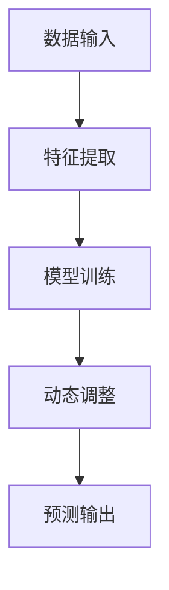
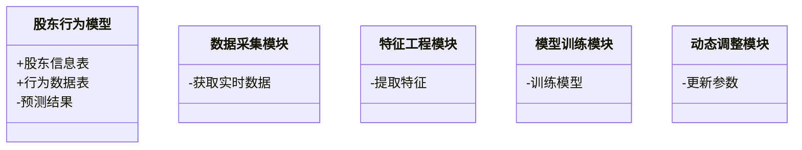
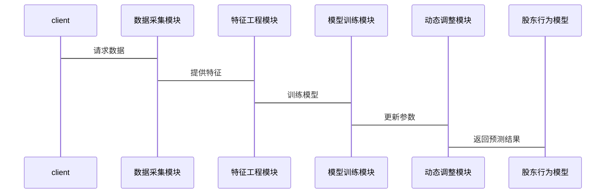

                 


# 利用AI构建自适应型股东行为模型：预测公司治理变化

> 关键词：自适应型股东行为模型，公司治理，人工智能，预测分析，动态调整机制

> 摘要：本文将深入探讨如何利用人工智能技术构建自适应型股东行为模型，以预测和分析公司治理中的变化。通过结合股东行为的核心概念、自适应算法的原理、系统架构设计以及实际案例分析，本文旨在为读者提供一个全面的理解和实践指南。

---

## 第1章 股东行为模型的背景与意义

### 1.1 股东行为模型的定义与核心概念

#### 1.1.1 股东行为的定义
股东行为是指股东在公司治理中的决策和行动，包括投票、并购、分红等，这些行为对公司的发展和价值有着重要影响。

#### 1.1.2 股东行为模型的分类
股东行为模型可以分为静态模型和动态模型。静态模型基于固定假设，而动态模型则能够根据市场环境和公司变化进行调整。

#### 1.1.3 股东行为模型在公司治理中的作用
通过分析股东行为，企业可以预测潜在的治理风险，优化股权结构，提升治理效率。

### 1.2 自适应型股东行为模型的提出

#### 1.2.1 传统股东行为模型的局限性
传统模型通常假设股东行为不变，难以应对市场环境的快速变化。

#### 1.2.2 自适应型模型的核心思想
自适应型模型通过动态调整参数，实时反映股东行为的变化，提高预测的准确性。

#### 1.2.3 自适应型模型的创新点
引入机器学习算法，结合实时数据，构建动态预测模型。

### 1.3 问题背景与研究意义

#### 1.3.1 公司治理中的股东行为问题
股东行为复杂多样，且受外部环境影响，传统模型难以准确预测。

#### 1.3.2 自适应型模型的必要性
企业需要实时监控和预测股东行为，以应对潜在风险和机会。

#### 1.3.3 研究的意义与应用前景
自适应型模型能够提升公司治理的智能化水平，为企业提供数据支持。

---

## 第2章 自适应型股东行为模型的核心概念与联系

### 2.1 股东行为模型的核心要素

#### 2.1.1 股东特征
包括股东类型、持股比例、历史行为等。

#### 2.1.2 股东行为模式
描述股东在不同情境下的决策模式。

#### 2.1.3 公司治理环境
包括法律法规、市场状况、公司战略等。

### 2.2 自适应型模型的原理

#### 2.2.1 自适应机制的定义
通过实时数据更新模型参数，动态调整预测结果。

#### 2.2.2 自适应算法的核心流程
数据采集 → 特征提取 → 模型训练 → 动态调整 → 预测输出。

#### 2.2.3 自适应模型的动态调整机制
基于反馈机制，不断优化模型参数，提升预测精度。

### 2.3 核心概念对比与ER实体关系图

#### 2.3.1 不同股东行为模型的对比分析
| 模型类型 | 输入数据 | 输出结果 | 适用场景 |
|----------|-----------|-----------|-----------|
| 静态模型 | 固定数据 | 固定预测 | 稳定环境 |
| 动态模型 | 实时数据 | 动态预测 | 变化环境 |

#### 2.3.2 ER实体关系图展示（Mermaid）

```mermaid
er
actor: 股东行为模型
table 股东信息 {
  股东ID, 股东类型, 持股比例
}
table 行为数据 {
  行为ID, 行为类型, 时间戳
}
```

---

## 第3章 数据预处理与特征提取

### 3.1 数据来源与清洗

#### 3.1.1 数据来源渠道
包括公司财报、股东公告、市场数据等。

#### 3.1.2 数据清洗方法
去除重复数据、处理缺失值、标准化格式。

#### 3.1.3 数据标准化与归一化
使用标准化方法（如Z-score）或归一化方法（如Min-Max）处理数据。

### 3.2 特征工程

#### 3.2.1 特征选择策略
基于相关性分析和重要性排序选择关键特征。

#### 3.2.2 特征提取方法
使用主成分分析（PCA）或因子分析提取特征。

#### 3.2.3 特征评估与优化
通过交叉验证评估特征重要性，优化特征组合。

---

## 第4章 模型训练与算法实现

### 4.1 自适应型模型的算法框架

#### 4.1.1 算法流程图展示（Mermaid）



#### 4.1.2 核心算法代码实现

```python
import numpy as np
from sklearn.linear_model import LinearRegression

# 示例数据
X = np.array([[1, 2], [3, 4], [5, 6]])
y = np.array([7, 8, 9])

# 模型训练
model = LinearRegression()
model.fit(X, y)

# 预测
print(model.predict([[7, 8]]))
```

#### 4.1.3 算法实现步骤解析
1. 数据预处理：清洗和标准化数据。
2. 特征工程：提取关键特征。
3. 模型训练：使用机器学习算法训练模型。
4. 动态调整：根据反馈更新模型参数。
5. 预测输出：生成股东行为预测结果。

### 4.2 数学模型与公式推导

#### 4.2.1 模型假设与目标函数
假设模型为线性回归，目标函数为最小化均方误差：

$$
\text{目标函数} = \frac{1}{2m} \sum_{i=1}^{m} (y_i - \hat{y}_i)^2
$$

#### 4.2.2 损失函数与优化方法
使用梯度下降优化目标函数：

$$
\theta := \theta - \alpha \frac{\partial}{\partial \theta} \text{损失函数}
$$

#### 4.2.3 具体数学公式的详细推导
以线性回归为例，损失函数为：

$$
L = \frac{1}{2m} \sum_{i=1}^{m} (y_i - \theta^T x_i)^2
$$

对$\theta$求导并更新：

$$
\theta := \theta - \alpha \frac{1}{m} \sum_{i=1}^{m} (y_i - \theta^T x_i) x_i
$$

---

## 第5章 模型评估与优化

### 5.1 模型评估指标

#### 5.1.1 评估指标的定义与计算
包括准确率、召回率、F1分数等。

#### 5.1.2 指标的对比与选择
根据具体场景选择合适的评估指标。

#### 5.1.3 模型性能的可视化展示
使用混淆矩阵、ROC曲线等工具进行评估。

### 5.2 模型优化策略

#### 5.2.1 超参数调优
通过网格搜索或随机搜索优化模型参数。

#### 5.2.2 模型集成
结合多种模型（如投票法、加权法）提升预测精度。

#### 5.2.3 模型部署与监控
将模型部署到生产环境，并实时监控性能。

---

## 第6章 系统分析与架构设计方案

### 6.1 问题场景介绍
构建一个实时监控股东行为的系统，帮助公司及时调整治理策略。

### 6.2 系统功能设计（领域模型Mermaid类图）



### 6.3 系统架构设计（Mermaid架构图）

```mermaid
client --> 数据采集模块
数据采集模块 --> 特征工程模块
特征工程模块 --> 模型训练模块
模型训练模块 --> 动态调整模块
动态调整模块 --> 股东行为模型
```

### 6.4 系统接口设计
定义REST接口，提供数据输入和模型预测服务。

### 6.5 系统交互（Mermaid序列图）



---

## 第7章 项目实战

### 7.1 环境安装
安装Python、NumPy、Scikit-learn等库。

### 7.2 核心代码实现

```python
import pandas as pd
from sklearn import preprocessing

# 数据加载
data = pd.read_csv(' shareholder.csv ')

# 数据清洗
data.dropna()

# 特征工程
features = data[['持股比例', '股东类型']]
label = data['行为类型']

# 标准化处理
scaler = preprocessing.StandardScaler()
features_scaled = scaler.fit_transform(features)

# 模型训练
from sklearn.neighbors import KNeighborsClassifier
model = KNeighborsClassifier()
model.fit(features_scaled, label)

# 动态调整
# 示例：更新模型参数
```

### 7.3 案例分析与结果解读
使用真实数据训练模型，并展示预测结果和实际结果对比。

### 7.4 项目小结
总结项目实现的关键步骤和经验教训。

---

## 第8章 最佳实践与小结

### 8.1 小结
自适应型股东行为模型能够有效预测公司治理变化，帮助企业优化决策。

### 8.2 注意事项
- 数据质量和实时性是模型性能的关键。
- 模型需要定期更新，以适应市场变化。

### 8.3 拓展阅读
推荐相关书籍和论文，供读者深入学习。

---

## 作者

作者：AI天才研究院/AI Genius Institute & 禅与计算机程序设计艺术 /Zen And The Art of Computer Programming

