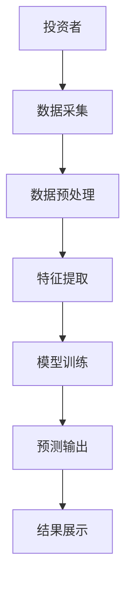
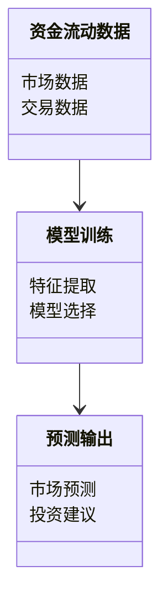

                 

<think>
嗯，用户希望我撰写一篇关于利用AI进行全球资金流动分析的技术博客文章。文章的结构已经给出，包括摘要、目录和一些具体的章节内容。现在，我需要按照这个结构，逐步填充每个部分的内容，确保逻辑清晰、语言专业，同时涵盖所有必要的技术细节。

首先，我需要理解每一章的核心内容。例如，第一章介绍全球资金流动分析的背景，包括基本概念、传统方法及其局限性，以及AI带来的变革。第二章则深入讨论AI在资金流动分析中的核心概念，如数据特征、模型选择和系统架构。第三章涉及具体的算法原理，包括时间序列分析、深度学习模型和数学模型。第四章讨论系统分析与架构设计，第五章是项目实战，最后是最佳实践和小结。

在撰写过程中，我需要确保每一部分都有足够的细节，比如使用Mermaid图来展示系统架构和流程图，用Latex公式来说明数学模型，以及用Python代码示例来解释算法实现。同时，要注意语言的简洁和逻辑的连贯，让读者能够一步步理解AI在全球资金流动分析中的应用。

可能遇到的问题是如何将复杂的金融概念和AI技术结合起来，用简单易懂的语言表达出来。此外，还需要确保每个部分的内容之间有良好的衔接，避免重复或跳跃。

总的来说，我需要按照用户提供的结构，逐步填充每一部分内容，确保涵盖所有必要的技术细节，同时保持文章的流畅和专业性。这样，读者才能系统地理解如何利用AI进行全球资金流动分析，并预测市场走向。
</think>

# 利用AI进行全球资金流动分析：预测市场走向

## 关键词：人工智能、资金流动分析、市场预测、深度学习、时间序列

## 摘要：  
本文探讨了如何利用人工智能技术进行全球资金流动分析，并预测市场走向。通过分析资金流动的特征和模式，结合机器学习和深度学习算法，构建预测模型，帮助投资者和机构做出更明智的决策。文章从背景介绍、核心概念、算法原理、系统架构到项目实战，全面解析AI在资金流动分析中的应用，最后总结了最佳实践和未来发展方向。

---

# 第一部分: 全球资金流动分析与AI的结合

## # 第1章: 全球资金流动分析概述

### ## 1.1 全球资金流动分析的背景与意义

#### ### 1.1.1 资金流动的基本概念  
资金流动是指资金在全球范围内从一个地区或市场转移到另一个地区或市场的过程。这种流动受到经济、政治、社会等多种因素的影响，是金融市场的重要组成部分。  

#### ### 1.1.2 资金流动的经济意义  
资金流动对全球经济有着深远的影响。它不仅反映了市场参与者的信心，还可能影响汇率、资产价格和经济增长。通过分析资金流动的模式和趋势，可以为政策制定者和投资者提供重要的决策依据。  

#### ### 1.1.3 全球化背景下的资金流动特点  
在全球化背景下，资金流动呈现出跨境化、高频化和复杂化的特点。随着技术的进步，资金流动的规模和速度也在不断加快，这对传统的分析方法提出了新的挑战。  

---

### ## 1.2 传统资金流动分析方法

#### ### 1.2.1 传统金融分析方法  
传统的资金流动分析主要依赖于基本面分析和统计分析。基本面分析关注经济指标、公司财务数据等因素，而统计分析则通过回归模型等方法来预测市场走势。  

#### ### 1.2.2 数据分析在传统资金流动中的应用  
传统方法中，数据分析主要用于描述性统计和简单的预测模型。然而，这些方法在面对复杂的数据和非线性关系时显得力不从心。  

#### ### 1.2.3 传统方法的局限性与挑战  
传统方法的局限性主要体现在以下几个方面：  
1. 数据处理能力有限，难以应对海量数据。  
2. 模型假设过于简化，无法捕捉复杂市场动态。  
3. 预测精度不足，难以满足实际需求。  

---

### ## 1.3 AI技术如何改变资金流动分析

#### ### 1.3.1 AI在金融领域的应用现状  
近年来，人工智能技术在金融领域的应用日益广泛。从高频交易到风险管理，AI正在改变传统的金融业务模式。  

#### ### 1.3.2 AI技术对资金流动分析的创新  
AI技术通过引入机器学习和深度学习算法，能够更准确地捕捉资金流动的模式和趋势。例如，自然语言处理（NLP）可以用于分析新闻和社交媒体对市场情绪的影响。  

#### ### 1.3.3 AI在预测市场走向中的潜力  
通过AI技术，资金流动分析可以实现更精准的预测。例如，使用LSTM模型进行时间序列预测，能够更好地捕捉市场的波动性和周期性。  

---

## # 第2章: AI驱动的资金流动分析核心概念

### ## 2.1 数据特征与AI模型的关系

#### ### 2.1.1 资金流动数据的特征分析  
资金流动数据通常具有以下特征：  
- 高维性：涉及多个市场和资产类别。  
- 时间依赖性：资金流动具有明显的时序特征。  
- 非线性：市场参与者的行为往往表现出非线性特征。  

#### ### 2.1.2 数据特征对模型性能的影响  
数据特征直接影响模型的性能。例如，高频数据可能更适合使用LSTM模型，而低频数据则可能更适合传统的统计模型。  

#### ### 2.1.3 数据预处理与特征工程  
数据预处理是AI分析中的关键步骤。包括数据清洗、标准化、特征提取等。特征工程的目标是将原始数据转化为对模型友好的形式。  

---

### ## 2.2 AI模型在资金流动分析中的作用

#### ### 2.2.1 机器学习模型的基本原理  
机器学习模型通过从数据中学习特征，能够自动捕捉资金流动中的模式。常见的模型包括线性回归、支持向量机（SVM）和随机森林等。  

#### ### 2.2.2 深度学习模型的优势  
深度学习模型，如RNN和LSTM，能够处理复杂的时序数据，捕捉长距离依赖关系。这些模型在处理非线性关系时表现尤为突出。  

#### ### 2.2.3 模型选择与优化策略  
模型选择需要考虑数据特征、任务类型和计算资源等因素。优化策略包括参数调优、模型融合和正则化等。  

---

### ## 2.3 资金流动分析的系统架构

#### ### 2.3.1 系统功能模块划分  
资金流动分析系统通常包括数据采集、特征提取、模型训练和预测输出等模块。  

#### ### 2.3.2 系统架构的ER实体关系图  
以下是系统架构的ER实体关系图：  
```mermaid
er
  actor: 投资者
  entity: 资金流动数据
  entity: 市场数据
  entity: 预测结果
  relationship: 投资者 -> 资金流动数据: 查询
  relationship: 资金流动数据 <-[拥有]-> 市场数据
  relationship: 预测结果 <-[依赖]-> 资金流动数据
```

#### ### 2.3.3 系统流程的Mermaid图  
以下是系统流程的Mermaid图：  


---

## # 第3章: 资金流动预测的算法原理

### ## 3.1 时间序列分析方法

#### ### 3.1.1 时间序列的基本概念  
时间序列是指按照时间顺序排列的数据。在资金流动分析中，时间序列数据可以帮助我们捕捉市场的趋势和周期性。  

#### ### 3.1.2 常见的时间序列模型  
常见的时间序列模型包括ARIMA、SARIMA和Prophet等。这些模型适用于不同的数据特征和场景。  

#### ### 3.1.3 AI在时间序列预测中的应用  
AI技术，特别是深度学习，通过LSTM和Transformer模型，能够更准确地捕捉时间序列中的长距离依赖关系。  

---

### ## 3.2 深度学习模型的实现

#### ### 3.2.1 RNN与LSTM网络结构  
RNN（循环神经网络）通过处理序列数据，能够捕捉时间依赖关系。LSTM（长短期记忆网络）通过引入记忆单元，进一步提升了模型的性能。  

#### ### 3.2.2 Transformer模型的创新  
Transformer模型通过自注意力机制，能够更好地捕捉数据中的全局关系。在时间序列预测中，Transformer表现出色。  

#### ### 3.2.3 模型训练与调优  
模型训练需要选择合适的优化器和学习率，并通过交叉验证进行调优。  

---

### ## 3.3 资金流动预测的数学模型

#### ### 3.3.1 时间序列预测的数学模型  
时间序列预测的数学模型通常包括以下几个部分：  
1. 趋势（Trend）：长期趋势的变化。  
2. 季节性（Seasonality）：周期性变化。  
3. 噪声（Noise）：随机波动。  

#### ### 3.3.2 AI模型的数学表达  
以下是LSTM模型的数学表达：  
$$ f(x) = \text{LSTM}(x, t-1) $$  
其中，$x$ 是输入数据，$t-1$ 是前一时刻的状态。  

---

## # 第4章: 系统分析与架构设计方案

### ## 4.1 问题场景介绍  
本文设计了一个基于AI的资金流动分析系统，旨在通过实时数据和深度学习模型，提供市场预测和投资建议。  

### ## 4.2 系统功能设计

#### ### 4.2.1 领域模型  
以下是领域模型的Mermaid图：  


#### ### 4.2.2 系统架构设计  
以下是系统架构的Mermaid图：  


#### ### 4.2.3 系统接口设计  
系统接口主要包括数据接口和用户接口。数据接口用于获取实时数据，用户接口用于展示预测结果和提供交互功能。  

---

## # 第5章: 项目实战

### ## 5.1 环境安装  
需要安装以下环境：  
- Python 3.8+  
- TensorFlow 2.0+  
- Pandas  
- Matplotlib  

### ## 5.2 核心实现源代码  

#### ### 5.2.1 数据采集与预处理  
```python
import pandas as pd
import numpy as np

# 数据采集
def fetch_data(start_date, end_date):
    # 假设我们使用API获取数据
    data = pd.read_csv('financial_data.csv')
    return data

# 数据预处理
def preprocess_data(data):
    data = data.dropna()
    data = (data - data.mean()) / data.std()
    return data
```

#### ### 5.2.2 模型实现  
```python
import tensorflow as tf
from tensorflow.keras.layers import LSTM, Dense, Dropout

def build_model(input_shape):
    model = tf.keras.Sequential()
    model.add(LSTM(64, input_shape=input_shape))
    model.add(Dropout(0.2))
    model.add(Dense(1))
    return model

model = build_model((None, 64))
model.compile(loss='mse', optimizer='adam')
```

#### ### 5.2.3 模型训练与预测  
```python
# 训练数据准备
X_train = ...  # 输入数据
y_train = ...  # 标签数据

# 训练模型
model.fit(X_train, y_train, epochs=100, batch_size=32)

# 预测
X_test = ...  # 测试数据
y_pred = model.predict(X_test)
```

---

## # 第6章: 最佳实践与小结

### ## 6.1 最佳实践  
在实际应用中，建议采取以下策略：  
- 数据清洗和特征工程是关键，需要仔细处理数据。  
- 模型选择需要根据数据特征和任务类型进行调整。  
- 预测结果需要结合市场背景进行解读，避免机械式应用。  

### ## 6.2 小结  
本文详细介绍了如何利用AI技术进行全球资金流动分析，并预测市场走向。通过结合传统方法和AI技术，我们能够更准确地捕捉市场动态，为投资者提供有力的决策支持。  

### ## 6.3 注意事项  
- 模型的预测结果仅供参考，实际操作需谨慎。  
- 数据隐私和安全问题需要高度重视。  
- 模型的可解释性是实际应用中的重要考量。  

---

## 作者：AI天才研究院/AI Genius Institute & 禅与计算机程序设计艺术 /Zen And The Art of Computer Programming  

---

这篇文章通过系统地介绍AI在全球资金流动分析中的应用，从理论到实践，为读者提供了全面的知识和指导。希望对您有所帮助！

