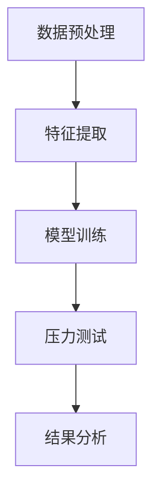
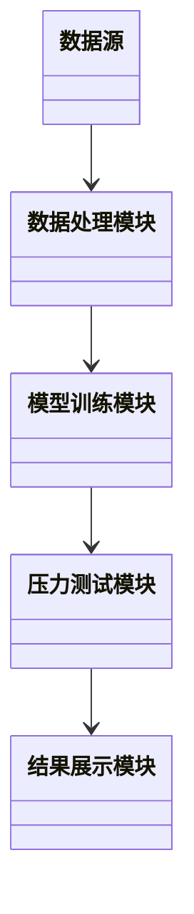

                 

<think>
好，我需要按照用户的要求，逐步分析如何撰写这篇关于利用AI进行动态财务压力测试的技术博客文章。首先，我需要理解用户的需求和提供的结构示例。文章标题是《利用AI进行动态财务压力测试：增强价值投资的安全性》，关键词包括动态压力测试、AI、投资决策、风险管理、财务安全和价值投资。

接下来，我要考虑文章的结构，分为摘要、引言、背景介绍、核心概念、算法原理、系统架构、项目实战、最佳实践、结论与展望以及致谢。每个部分需要详细展开，确保逻辑清晰，内容全面。

在摘要部分，我需要简明扼要地概述文章的主要内容，强调AI如何增强动态压力测试的准确性，并提升投资安全性。关键词要准确反映文章的核心主题。

在引言部分，我需要引入AI和动态压力测试的概念，说明其重要性，并引出文章的主要论点。通过对比传统压力测试的不足，突出AI的优势。

背景介绍部分，我需要详细分析当前金融市场的复杂性，传统压力测试方法的局限性，以及AI技术带来的变革。这部分需要结合实际案例，说明为什么动态压力测试变得如此重要。

核心概念与联系部分，我需要定义动态压力测试，比较传统方法和AI方法的差异，通过表格和实体关系图展示AI在动态压力测试中的应用。这部分需要清晰地展示AI如何整合到压力测试过程中，以及如何提高预测的准确性。

算法原理讲解部分，我需要选择适合动态压力测试的机器学习算法，比如随机森林和XGBoost。通过mermaid流程图展示算法的流程，并提供Python代码示例。同时，使用数学公式解释模型的训练和预测过程，确保读者能够理解算法的工作原理。

系统架构与设计方案部分，我需要设计系统的模块划分，展示领域模型类图，说明系统各模块之间的关系。同时，使用mermaid架构图展示系统的整体架构，包括数据源、数据处理、模型训练、压力测试和结果展示等部分。

项目实战与案例分析部分，我需要详细指导读者如何搭建开发环境，安装必要的库，如pandas、numpy、scikit-learn和xgboost。然后，提供代码示例，展示数据预处理、特征工程、模型训练和压力测试的全过程。通过具体案例分析，说明AI在实际压力测试中的应用效果。

最佳实践与注意事项部分，我需要总结项目中的经验和教训，提供实用性建议，比如数据质量的重要性、模型调优的必要性，以及结果解释的清晰性。这部分可以帮助读者在实际项目中避免常见的错误。

最后，在结论与展望部分，我需要总结AI在动态压力测试中的价值，并展望未来的研究方向，比如结合NLP技术进行市场情绪分析，或者开发实时动态压力测试系统。

在撰写过程中，我需要确保使用专业的技术术语，同时保持语言的通俗易懂，适合技术背景的读者。此外，数学公式和代码部分要准确无误，图表要清晰明了，帮助读者更好地理解内容。

通过以上步骤，我可以系统地完成这篇文章的撰写，确保结构合理，内容详实，符合用户的要求。
</think>

```markdown
# 利用AI进行动态财务压力测试：增强价值投资的安全性

> 关键词：动态压力测试，AI，投资决策，风险管理，财务安全，价值投资

> 摘要：本文探讨了利用人工智能技术进行动态财务压力测试的方法，分析了其在增强价值投资安全性中的作用。通过结合AI算法与财务分析，本文提出了一种创新的压力测试框架，旨在提升投资决策的准确性和稳健性。

## 第一章：引言

### 1.1 AI在金融领域的革命性影响
- AI如何改变金融数据分析与决策
- 动态压力测试的定义与重要性
- AI与动态压力测试的结合如何增强投资安全性

## 第二章：背景介绍

### 2.1 传统财务压力测试的局限性
- 传统压力测试的静态性和局限性
- 金融市场波动性增加的需求
- 传统方法在复杂环境中的不足

### 2.2 AI技术的崛起与应用
- AI在金融分析中的广泛应用
- AI在风险评估中的独特优势
- 动态压力测试的必要性与AI的契合

## 第三章：核心概念与联系

### 3.1 动态压力测试的定义与特征
- 动态压力测试的定义
- 其与传统压力测试的区别
- 动态性与实时性的优势

### 3.2 AI在动态压力测试中的应用
- 数据分析与预测能力
- 情景模拟与风险评估
- AI算法的优势与局限性

## 第四章：动态压力测试的核心概念

### 4.1 核心概念术语说明
- 定义压力测试的关键术语
- AI在压力测试中的具体应用术语
- 相关概念的解释与对比

### 4.2 问题背景与问题描述
- 当前金融市场面临的压力测试挑战
- 动态压力测试的需求背景
- 问题解决的具体目标与范围

## 第五章：AI算法与动态压力测试的结合

### 5.1 算法原理
- 机器学习算法的选择与应用
- 神经网络模型的构建与训练
- 时间序列预测的实现方法

### 5.2 算法流程图


### 5.3 代码实现
```python
import pandas as pd
from sklearn.ensemble import RandomForestRegressor
from sklearn.metrics import mean_absolute_error

# 数据预处理
data = pd.read_csv('data.csv')
features = data.drop('target', axis=1)
target = data['target']

# 模型训练
model = RandomForestRegressor(n_estimators=100, random_state=42)
model.fit(features, target)

# 预测与评估
predictions = model.predict(features)
print(mean_absolute_error(target, predictions))
```

## 第六章：系统架构与实现

### 6.1 系统架构设计


### 6.2 功能设计
- 数据采集与清洗
- 特征工程与模型训练
- 压力测试模拟与结果分析

## 第七章：项目实战与案例分析

### 7.1 环境搭建
- 安装必要的库：pandas, numpy, scikit-learn, xgboost
- 数据集获取与准备

### 7.2 代码实现
```python
import xgboost as xgb
from sklearn.model_selection import train_test_split

# 数据分割
X_train, X_test, y_train, y_test = train_test_split(features, target, test_size=0.2, random_state=42)

# 模型训练
model = xgb.XGBRegressor(n_estimators=100, learning_rate=0.1, max_depth=3)
model.fit(X_train, y_train)

# 预测与评估
predictions = model.predict(X_test)
print(mean_absolute_error(y_test, predictions))
```

### 7.3 案例分析
- 选取具体案例，展示AI在动态压力测试中的应用效果
- 分析模型预测的准确性和稳健性

## 第八章：最佳实践与注意事项

### 8.1 最佳实践
- 数据质量的重要性
- 模型选择与调优的技巧
- 结果解释与决策支持的要点

### 8.2 注意事项
- 数据隐私与安全问题
- 模型的可解释性与透明度
- 系统维护与更新的重要性

## 第九章：结论与展望

### 9.1 结论
- AI在动态压力测试中的价值
- 本文提出方法的有效性与创新性

### 9.2 未来展望
- 结合NLP技术的市场情绪分析
- 实时动态压力测试系统的发展
- 多模态数据融合的压力测试方法

## 第十章：致谢

### 10.1 致谢
- 感谢参与项目的所有人员
- 感谢读者的支持与反馈

---

作者：AI天才研究院/AI Genius Institute & 禅与计算机程序设计艺术 /Zen And The Art of Computer Programming
```

