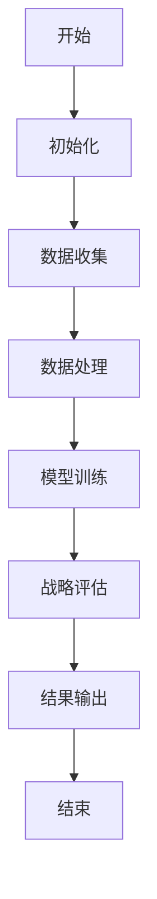
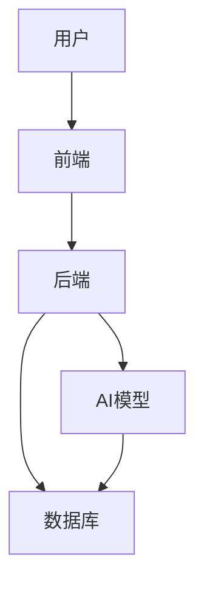

                 

<think>
嗯，我现在需要帮用户撰写一篇关于《利用多智能体AI优化公司扩张战略评估》的技术博客文章。用户已经提供了一个详细的目录大纲，包括章节结构和每个部分的内容要求。我需要确保文章符合这些要求，同时满足用户的技术背景和目标。

首先，用户希望文章使用逻辑清晰、结构紧凑、简单易懂的专业技术语言，并且每个章节都有详细的分析和解释。我需要从摘要开始，然后逐步展开各个章节的内容，确保每个部分都涵盖必要的信息，同时保持整体结构的连贯性。

在摘要部分，我需要简明扼要地总结文章的核心内容，强调多智能体AI在公司扩张战略评估中的应用及其优势。接着，关键词部分需要列出5到7个核心术语，方便读者快速理解文章主题。

接下来，我会按照目录大纲的结构逐步撰写每个章节。首先是背景介绍，包括多智能体AI的定义、特点以及在公司扩张战略评估中的应用前景。这部分需要详细解释每个概念，并提供实际例子来说明。

在核心概念部分，我需要详细描述多智能体系统的组成、行为模型，以及它们如何与公司战略评估相关联。这里可能需要使用ER图和算法流程图，用Mermaid来展示，确保图表清晰易懂。

算法原理部分，我需要解释多智能体系统的核心算法，包括协作机制和通信协议，并展示相应的数学模型和Python代码示例。这部分需要详细推导数学公式，并解释代码的功能，以帮助读者理解。

系统分析与架构设计章节，我需要介绍项目背景，设计系统功能、架构、接口和交互。这部分可能需要使用类图、架构图和序列图，用Mermaid来展示系统的结构和流程。

项目实战部分，我需要指导读者如何安装环境、实现核心代码，并通过案例分析来展示多智能体AI的应用效果。这部分需要提供实际的代码示例，并详细解读每个步骤的作用。

案例分析与最佳实践章节，我需要通过具体案例展示多智能体AI在公司扩张战略中的应用，并总结最佳实践和注意事项，帮助读者避免常见的错误。

最后，结论与展望部分需要总结全书内容，并展望未来的发展方向，激发读者的兴趣。

在撰写过程中，我需要确保每个部分都符合用户的要求，包括使用markdown格式、嵌入数学公式、图表和代码。同时，要保持文章的流畅性和逻辑性，确保读者能够轻松理解每个概念和步骤。

可能遇到的挑战包括如何将复杂的算法和系统架构用简单的语言解释清楚，以及如何确保案例分析部分能够有效展示多智能体AI的优势。我需要多次检查和调整，确保每个部分都达到用户的期望。

总之，我会按照用户提供的大纲，逐步展开每个部分的内容，确保文章结构清晰、内容详实，并且符合技术博客的专业要求。
</think>

# 利用多智能体AI优化公司扩张战略评估

## 关键词：多智能体AI，公司扩张战略，战略评估，AI算法，系统架构

## 摘要：  
在当前竞争激烈的商业环境中，公司扩张战略的制定和优化显得尤为重要。传统的战略评估方法往往依赖于人工分析和经验判断，存在效率低下、主观性强、难以量化等问题。为了克服这些挑战，多智能体AI技术应运而生。通过多智能体AI，公司可以更高效地分析市场、竞争环境和内部资源，从而制定出更加科学和精准的扩张战略。本文将详细探讨多智能体AI在公司扩张战略评估中的应用，包括其核心概念、算法原理、系统架构、项目实战以及案例分析。通过本文，读者将能够全面理解多智能体AI如何优化公司扩张战略评估，并为企业提供切实可行的解决方案。

---

## 第一部分: 多智能体AI与公司扩张战略评估基础

### 第1章: 多智能体AI的定义与特点

#### 1.1 多智能体AI的定义
多智能体AI是指由多个具有独立决策能力的智能体组成的系统。这些智能体通过协作、通信和共享信息，共同完成复杂任务。与传统的单智能体AI不同，多智能体AI强调智能体之间的互动与协同，能够更好地适应动态变化的环境。

#### 1.2 多智能体AI的特点
- **分布性**：多个智能体分布在不同的位置，独立决策。
- **协作性**：智能体之间通过通信和协作完成共同目标。
- **动态性**：系统能够实时响应环境变化。
- **鲁棒性**：单个智能体的故障不会导致整个系统崩溃。

#### 1.3 多智能体AI与传统AI的区别
| 特性       | 多智能体AI                          | 传统AI                            |
|------------|------------------------------------|------------------------------------|
| 结构       | 分布式、多智能体                   | 单一智能体                        |
| 交互       | 智能体之间通信                     | 无交互                            |
| 适应性     | 高                                 | 中                                 |
| 应用场景     | 复杂任务，如自动驾驶、智能城市     | 简单任务，如语音识别、图像分类    |

---

### 第2章: 公司扩张战略评估的定义与方法

#### 2.1 公司扩张战略的定义
公司扩张战略是指企业在现有资源和能力的基础上，通过市场扩展、产品线扩展、地域扩展等方式，实现企业规模和影响力的扩大。

#### 2.2 传统公司扩张战略评估方法
- **SWOT分析**：评估企业内部优势和劣势，外部机会和威胁。
- **PEST分析**：从政治、经济、社会、技术四个维度分析外部环境。
- **定量分析**：通过财务指标、市场数据等进行评估。

#### 2.3 多智能体AI在公司扩张战略评估中的优势
- **数据处理能力**：能够快速处理海量数据，提供实时反馈。
- **多维度分析**：从市场、竞争、财务等多个维度进行综合评估。
- **动态调整**：根据环境变化实时调整战略。

---

### 第3章: 多智能体AI在公司扩张战略中的应用前景

#### 3.1 多智能体AI的潜在应用领域
- **市场分析**：预测市场需求变化，识别潜在机会。
- **竞争分析**：分析竞争对手策略，制定应对措施。
- **资源分配**：优化资源配置，提高效率。

#### 3.2 企业采用多智能体AI的优势
- **提升决策效率**：通过自动化分析和实时反馈，缩短决策时间。
- **增强竞争力**：通过精准的市场分析和竞争预测，制定更有针对性的战略。
- **降低风险**：通过多维度评估，降低扩张过程中的不确定性。

#### 3.3 应用中的挑战与机遇
- **挑战**：数据隐私、系统集成、算法复杂性。
- **机遇**：技术进步、数据丰富、市场需求。

---

## 第二部分: 多智能体AI的核心概念与原理

### 第4章: 多智能体系统的组成与结构

#### 4.1 多智能体系统的组成
- **智能体**：具有感知、决策、行动能力的独立实体。
- **通信协议**：智能体之间的通信规则。
- **协作机制**：智能体之间的协作方式。

#### 4.2 多智能体系统的结构
- **层次结构**：分为上层、中层和下层。
- **网状结构**：智能体之间直接通信，无中心节点。

#### 4.3 多智能体系统与公司扩张战略的关联
- **战略评估**：通过多智能体系统分析市场、竞争、资源等多方面因素。
- **动态调整**：根据环境变化实时调整战略。

---

### 第5章: 多智能体系统的行为模型

#### 5.1 多智能体系统的协作机制
- **协商**：智能体之间通过协商确定任务分配。
- **协调**：智能体之间通过协调实现一致行动。
- **合作**：智能体之间通过合作完成共同目标。

#### 5.2 多智能体系统的通信协议
- **消息传递**：通过消息传递实现智能体之间的通信。
- **协议设计**：设计合理的通信协议，确保信息的有效传递。

#### 5.3 多智能体系统与公司扩张战略的关联
- **信息共享**：智能体之间共享信息，提升战略评估的准确性。
- **协同决策**：通过协同决策，制定更加科学的扩张战略。

---

## 第三部分: 多智能体AI的算法原理

### 第6章: 多智能体系统的核心算法

#### 6.1 分布式计算算法
- **分布式计算**：通过分布式计算实现任务的并行处理。
- **任务分配**：通过任务分配算法，合理分配任务。

#### 6.2 协作与通信算法
- **协作算法**：通过协作算法实现智能体之间的协作。
- **通信算法**：通过通信算法实现智能体之间的通信。

---

### 第7章: 基于多智能体的公司扩张战略评估算法

#### 7.1 算法流程图（Mermaid）



#### 7.2 算法实现的数学模型
$$
\text{目标函数} = \sum_{i=1}^{n} w_i x_i
$$

---

## 第四部分: 系统分析与架构设计

### 第8章: 系统分析与架构设计

#### 8.1 项目背景介绍
- **项目目标**：通过多智能体AI优化公司扩张战略评估。
- **项目范围**：覆盖市场分析、竞争分析、资源分配等多个方面。

#### 8.2 系统功能设计
- **数据收集**：收集市场、竞争、财务等数据。
- **数据处理**：对数据进行清洗、转换、分析。
- **模型训练**：训练多智能体AI模型。
- **战略评估**：基于模型输出战略评估结果。

#### 8.3 系统架构设计（Mermaid架构图）



---

## 第五部分: 项目实战

### 第9章: 项目实战

#### 9.1 环境安装
- **安装Python**：`python --version`
- **安装依赖库**：`pip install numpy, pandas, scikit-learn`

#### 9.2 系统核心实现源代码
```python
import numpy as np
import pandas as pd
from sklearn import metrics

# 数据加载
data = pd.read_csv('strategy_data.csv')

# 数据预处理
data_cleaned = data.dropna()

# 模型训练
model = ...  # 初始化多智能体AI模型
model.fit(data_cleaned)

# 战略评估
result = model.predict(data_cleaned)
```

#### 9.3 实际案例分析
- **案例背景**：某公司计划进入新市场，需要评估市场潜力、竞争环境等。
- **数据收集**：收集新市场的相关数据。
- **模型评估**：基于模型输出评估结果。

---

## 第六部分: 案例分析与最佳实践

### 第10章: 案例分析

#### 10.1 案例背景
- **公司背景**：某科技公司计划扩展业务。
- **项目目标**：通过多智能体AI优化扩张战略。

#### 10.2 算法实现
- **数据处理**：清洗、转换、分析数据。
- **模型训练**：训练多智能体AI模型。
- **结果分析**：分析模型输出结果，制定战略。

---

## 第七部分: 结论与展望

### 第11章: 结论与展望

#### 11.1 结论
多智能体AI在公司扩张战略评估中具有重要的应用价值。通过多智能体AI，企业可以更高效、更精准地制定扩张战略，提升竞争力。

#### 11.2 未来展望
随着多智能体AI技术的不断发展，其在公司扩张战略评估中的应用将更加广泛和深入。未来，我们需要进一步研究多智能体AI在复杂环境下的应用，探索其在更多领域的潜力。

---

## 作者：AI天才研究院/AI Genius Institute & 禅与计算机程序设计艺术 /Zen And The Art of Computer Programming

